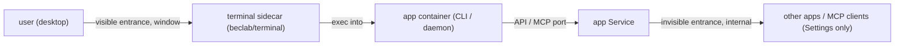

# App archetypes: recipes for thin upstream context

> **Prerequisite:** read the parent [`../SKILL.md`](../SKILL.md) first.
> The rest of the skill assumes the upstream maps onto a web app with an HTTP entrance. Many don't. When the upstream ships no compose/chart and the deployment shape is unclear, **match it to an archetype below, apply the recipe, then continue with Refine -> lint** ([olares-chart-manifest.md](olares-chart-manifest.md)).

## Archetype: Headless CLI / service (no web UI)

A tool you operate from a command line, or a daemon exposing an API, that ships **no GUI**. The Olares challenge: an app must have at least one entrance, but there is no web page to point at.

**Signals**
- Distributed as a CLI (PyPI/npm/Go binary), `Environment :: Console`, `[project.scripts]`.
- An MCP server, or a daemon with an API but no HTML/web framework.
- Languages dominated by a backend language; `website/` or `landing/` dirs are only docs, not the app UI.

**Olares mapping (two entrances)**



Add a **web terminal** sidecar so the user can drive the CLI from the desktop (a **visible** entrance, `openMethod: window`), and expose the service/API (e.g. MCP over HTTP/SSE) as an **invisible** entrance (`invisible: true`, `authLevel: internal`): hidden from the desktop, listed under Settings, reachable by other apps / MCP clients.

> **stdio caveat:** an invisible MCP entrance needs a **network** port. If the upstream MCP server speaks only stdio (the common case for CLI-installed MCP tools), bake a stdio->SSE/HTTP bridge (e.g. `mcp-proxy` / `supergateway`) into the image so there is a port to expose. With no network port, you can still ship the terminal entrance alone.

**Templates (copy-pasteable)**

On the **app** Deployment pod template, set two labels — `io.kompose.service: <app>` and `bytetrade.io/terminal: <app>` (the terminal's `--pod` selector) — and give the app container the stable name `<app>` (must match the terminal's `--container`).

`templates/terminal.yaml` — RBAC so the terminal may `exec`, the terminal Deployment (a web front + an `apiserver` that execs into the app), and its Service:

```yaml
apiVersion: v1
kind: ServiceAccount
metadata:
  name: terminal-account
  namespace: '{{ .Release.Namespace }}'
---
apiVersion: rbac.authorization.k8s.io/v1
kind: Role
metadata:
  name: pod-exec-manager
  namespace: '{{ .Release.Namespace }}'
rules:
- { apiGroups: [""], resources: ["pods"], verbs: ["get", "list", "create", "delete"] }
- { apiGroups: [""], resources: ["pods/exec"], verbs: ["create"] }
---
apiVersion: rbac.authorization.k8s.io/v1
kind: RoleBinding
metadata:
  name: pod-exec-binding
  namespace: '{{ .Release.Namespace }}'
subjects:
- kind: ServiceAccount
  name: terminal-account
  namespace: '{{ .Release.Namespace }}'
roleRef:
  kind: Role
  name: pod-exec-manager
  apiGroup: rbac.authorization.k8s.io
---
apiVersion: apps/v1
kind: Deployment
metadata:
  name: terminal
  namespace: '{{ .Release.Namespace }}'
  labels:
    io.kompose.service: terminal
spec:
  replicas: 1
  selector:
    matchLabels:
      io.kompose.service: terminal
  template:
    metadata:
      labels:
        io.kompose.service: terminal
    spec:
      serviceAccountName: terminal-account
      containers:
      - name: nginx
        image: beclab/terminal:v0.0.8
        command: ["nginx", "-g", "daemon off;"]
        ports:
        - { name: http, containerPort: 80 }
        resources:
          requests: { cpu: 5m, memory: 100Mi }
          limits: { cpu: 50m, memory: 100Mi }
      - name: terminal
        image: beclab/terminal:v0.0.8
        command: ["apiserver"]
        args:                                   # --pod selects the app pod by label; --container is the app container
        - --namespace={{ .Release.Namespace }}
        - --pod=bytetrade.io/terminal=<app>
        - --container=<app>
        env:
        - name: POD_NAME
          valueFrom: { fieldRef: { fieldPath: metadata.name } }
        resources:
          requests: { cpu: 5m, memory: 100Mi }
          limits: { cpu: 50m, memory: 100Mi }
---
apiVersion: v1
kind: Service
metadata:
  name: terminal
  namespace: '{{ .Release.Namespace }}'
spec:
  type: ClusterIP
  selector: { io.kompose.service: terminal }
  ports:
  - { name: terminal, port: 80, targetPort: 80 }
```

`OlaresManifest.yaml` entrances — one visible (terminal), one invisible (the service):

```yaml
entrances:
- name: terminal          # visible on the desktop
  host: terminal          # the terminal Service
  port: 80
  title: <App> Terminal
  openMethod: window
- name: <app>api          # the service / MCP endpoint
  host: <app>             # the app Service
  port: <api-or-mcp-port>
  title: <App> API
  authLevel: internal
  invisible: true         # hidden from desktop, listed in Settings
```

**Canonical example**

[ollamav2/ollamaserver/templates](https://github.com/beclab/apps/tree/main/ollamav2/ollamaserver/templates) — a visible `terminal` entrance plus an invisible `ollamaclient` API entrance (see its [OlaresManifest.yaml](https://github.com/beclab/apps/blob/main/ollamav2/OlaresManifest.yaml)). Ollama wraps the terminal in an extra `clientproxy` and gates everything behind an admin `{{- if }}` because it is a **shared, cluster-scoped** app; a normal single-user app omits both and points the entrance straight at the `terminal` Service as shown above.

**Hard rules**
- The terminal image (`beclab/terminal:v0.0.8`) is publicly pullable — keep it as-is.
- The `bytetrade.io/terminal: <app>` pod label and the app **container name** must match the `apiserver` `--pod` / `--container` args, or the terminal opens onto nothing.
- Keep the API entrance `invisible: true` + `authLevel: internal` unless it is genuinely meant for direct browser/user access.

### Optional: Docker-in-Docker sidecar

When the terminal app is a coding agent or dev sandbox that needs to run `docker` / `docker compose`, add a privileged Docker-in-Docker daemon sidecar (gated by `ENABLE_DIND`) alongside the workspace container. It is an add-on to this archetype, not a separate one. Full template and Olares constraints (trusted `beclab/docker` daemon image, single privileged container, `strategy: Recreate`, same-path workspace mount): [olares-chart-dind.md](olares-chart-dind.md).

## Adding an archetype

Append a new `## Archetype: ...` section using the same shape — **Signals -> Olares mapping -> Templates -> Canonical example (link a real chart in [beclab/apps](https://github.com/beclab/apps)) -> Hard rules** — and add a row to the archetype table in [`../SKILL.md`](../SKILL.md).
