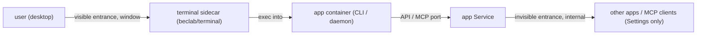

# App archetypes: recipes for thin upstream context

> **Prerequisite:** read the parent [`../SKILL.md`](../SKILL.md) first.
> The rest of the skill assumes the upstream maps onto a web app with an HTTP entrance. Many don't. When the upstream ships no compose/chart and the deployment shape is unclear, **match it to an archetype below, apply the recipe, then continue with Refine -> lint** ([olares-chart-manifest.md](olares-chart-manifest.md)).

## Archetype: Headless CLI / service (no web UI)

A tool you operate from a command line, or a daemon exposing an API, that ships **no GUI**. The Olares challenge: an app must have at least one entrance, but there is no web page to point at.

**Signals**
- Distributed as a CLI (PyPI/npm/Go binary), `Environment :: Console`, `[project.scripts]`.
- An MCP server, or a daemon with an API but no HTML/web framework.
- Languages dominated by a backend language; `website/` or `landing/` dirs are only docs, not the app UI.

**Olares mapping (two entrances)**



Add a **web terminal** sidecar so the user can drive the CLI from the desktop (a **visible** entrance, `openMethod: window`), and expose the service/API (e.g. MCP over HTTP/SSE) as an **invisible** entrance (`invisible: true`, `authLevel: internal`): hidden from the desktop, listed under Settings, reachable by other apps / MCP clients.

> **stdio caveat:** an invisible MCP entrance needs a **network** port. If the upstream MCP server speaks only stdio (the common case for CLI-installed MCP tools), bake a stdio->SSE/HTTP bridge (e.g. `mcp-proxy` / `supergateway`) into the image so there is a port to expose. With no network port, you can still ship the terminal entrance alone.

**Templates (copy-pasteable)**

On the **app** Deployment pod template, set two labels — `io.kompose.service: <app>` and `bytetrade.io/terminal: <app>` (the terminal's `--pod` selector) — and give the app container the stable name `<app>` (must match the terminal's `--container`).

`templates/terminal.yaml` — RBAC so the terminal may `exec`, the terminal Deployment (a web front + an `apiserver` that execs into the app), and its Service:

```yaml
apiVersion: v1
kind: ServiceAccount
metadata:
  name: terminal-account
  namespace: '{{ .Release.Namespace }}'
---
apiVersion: rbac.authorization.k8s.io/v1
kind: Role
metadata:
  name: pod-exec-manager
  namespace: '{{ .Release.Namespace }}'
rules:
- { apiGroups: [""], resources: ["pods"], verbs: ["get", "list", "create", "delete"] }
- { apiGroups: [""], resources: ["pods/exec"], verbs: ["create"] }
---
apiVersion: rbac.authorization.k8s.io/v1
kind: RoleBinding
metadata:
  name: pod-exec-binding
  namespace: '{{ .Release.Namespace }}'
subjects:
- kind: ServiceAccount
  name: terminal-account
  namespace: '{{ .Release.Namespace }}'
roleRef:
  kind: Role
  name: pod-exec-manager
  apiGroup: rbac.authorization.k8s.io
---
apiVersion: apps/v1
kind: Deployment
metadata:
  name: terminal
  namespace: '{{ .Release.Namespace }}'
  labels:
    io.kompose.service: terminal
spec:
  replicas: 1
  selector:
    matchLabels:
      io.kompose.service: terminal
  template:
    metadata:
      labels:
        io.kompose.service: terminal
    spec:
      serviceAccountName: terminal-account
      containers:
      - name: nginx
        image: beclab/terminal:v0.0.8
        command: ["nginx", "-g", "daemon off;"]
        ports:
        - { name: http, containerPort: 80 }
        resources:
          requests: { cpu: 5m, memory: 100Mi }
          limits: { cpu: 50m, memory: 100Mi }
      - name: terminal
        image: beclab/terminal:v0.0.8
        command: ["apiserver"]
        args:                                   # --pod selects the app pod by label; --container is the app container
        - --namespace={{ .Release.Namespace }}
        - --pod=bytetrade.io/terminal=<app>
        - --container=<app>
        env:
        - name: POD_NAME
          valueFrom: { fieldRef: { fieldPath: metadata.name } }
        resources:
          requests: { cpu: 5m, memory: 100Mi }
          limits: { cpu: 50m, memory: 100Mi }
---
apiVersion: v1
kind: Service
metadata:
  name: terminal
  namespace: '{{ .Release.Namespace }}'
spec:
  type: ClusterIP
  selector: { io.kompose.service: terminal }
  ports:
  - { name: terminal, port: 80, targetPort: 80 }
```

`OlaresManifest.yaml` entrances — one visible (terminal), one invisible (the service):

```yaml
entrances:
- name: terminal          # visible on the desktop
  host: terminal          # the terminal Service
  port: 80
  title: <App> Terminal
  openMethod: window
- name: <app>api          # the service / MCP endpoint
  host: <app>             # the app Service
  port: <api-or-mcp-port>
  title: <App> API
  authLevel: internal
  invisible: true         # hidden from desktop, listed in Settings
```

**Canonical example**

[ollamav2/ollamaserver/templates](https://github.com/beclab/apps/tree/main/ollamav2/ollamaserver/templates) — a visible `terminal` entrance plus an invisible `ollamaclient` API entrance (see its [OlaresManifest.yaml](https://github.com/beclab/apps/blob/main/ollamav2/OlaresManifest.yaml)). Ollama wraps the terminal in an extra `clientproxy` and gates everything behind an admin `{{- if }}` because it is a **shared, cluster-scoped** app; a normal single-user app omits both and points the entrance straight at the `terminal` Service as shown above.

**Hard rules**
- The terminal image (`beclab/terminal:v0.0.8`) is publicly pullable — keep it as-is.
- The `bytetrade.io/terminal: <app>` pod label and the app **container name** must match the `apiserver` `--pod` / `--container` args, or the terminal opens onto nothing.
- Keep the API entrance `invisible: true` + `authLevel: internal` unless it is genuinely meant for direct browser/user access.

### Optional: Docker-in-Docker sidecar

When the terminal app is a coding agent or dev sandbox that needs to run `docker` / `docker compose`, add a privileged Docker-in-Docker daemon sidecar (gated by `ENABLE_DIND`) alongside the workspace container. It is an add-on to this archetype, not a separate one. Full template and Olares constraints (trusted `beclab/docker` daemon image, single privileged container, `strategy: Recreate`, same-path workspace mount): [olares-chart-dind.md](olares-chart-dind.md).

## Archetype: GUI desktop application (browser-streamed)

A native Linux GUI app (X11/Wayland) with **no web UI** — a browser, office suite, IDE, CAD tool. The Olares challenge: there is no HTTP page to point an entrance at, only a desktop window. The recipe: wrap the app in a **web-desktop base image** that streams the GUI to the browser, then point one visible entrance at that web server.

**Signals**
- Distributed as `.deb`/AppImage/native binary that opens a desktop window; needs an X11/Wayland display (see Xvfb-style headless display).
- LinuxServer.io already ships a container for it (browsers, office, IDEs, media tools), or the upstream is a plain desktop binary.
- No web framework, no HTTP port — `docker run` alone would fail with no display.

**Olares mapping — pick the streaming base (this is the core decision)**

Flow: the user's browser hits a visible entrance on HTTP `:3000` → the **web-desktop base image** serves the web client and streams the GUI of the desktop app running inside the same container. The base image is the only thing you choose; the app itself is unchanged. Two base routes:

| Base | Lineage | Strengths | Costs | Pick when |
|---|---|---|---|---|
| **Selkies** (default, `latest`) | WebRTC / video stream (PixelFlux) | H.264/H.265/AV1, Wayland, iGPU/NVENC zero-copy, ~60fps | `x86_64` needs AVX2 (else auto-falls back to X11); HTTPS required; best with a GPU | video / animation / 3D / high-interaction apps, modern hardware |
| **KasmVNC** (`kasm` tag) | VNC/RFB (a fork of noVNC + TigerVNC, RFB-incompatible) | damage-based pixel transfer, lightweight, no-AVX2 ok | weaker at high-fps video | static / office / form-style UIs, older hardware |

**One line:** Selkies is the default; KasmVNC is the fallback for old hardware / static UIs. `noVNC` and `Xvfb` are lower-level building blocks these bases already absorb — you don't select them directly.

**Templates (copy-pasteable minimum)**

A single Deployment (`strategy: Recreate` — the `/config` mount can't roll), uid-1000 via `PUID/PGID`, `/config` persisted into userspace, a memory `emptyDir` for `/dev/shm` (the image's `shm_size` requirement), and an HTTP entrance on **3000** (Olares' entrance terminates TLS, so point at 3000, not the self-signed 3001):

```yaml
# templates/<app>.yaml — Deployment (CPU-only baseline)
apiVersion: apps/v1
kind: Deployment
metadata:
  name: <app>
  namespace: {{ .Release.Namespace }}
  labels: { io.kompose.service: <app> }
spec:
  replicas: 1
  strategy: { type: Recreate }
  selector:
    matchLabels: { io.kompose.service: <app> }
  template:
    metadata:
      labels: { io.kompose.service: <app> }
    spec:
      enableServiceLinks: false   # avoid k8s injecting <SVC>_PORT=tcp://... that can clobber app config env; see olares-chart-env.md
      containers:
        - name: <app>
          image: "docker.io/<your-namespace>/<app>:<pinned-tag>"   # never :latest
          env:
            - { name: PUID, value: "1000" }
            - { name: PGID, value: "1000" }
            - { name: TZ, value: Etc/UTC }
          ports:
            - { name: http, containerPort: 3000, protocol: TCP }
            - { containerPort: 3001 }
          volumeMounts:
            - { mountPath: /config, name: config }
            - { mountPath: /dev/shm, name: dshm }
      volumes:
        - name: config
          hostPath:
            type: DirectoryOrCreate
            path: {{ .Values.userspace.appCache }}/config
        - name: dshm
          emptyDir: { medium: Memory, sizeLimit: 1Gi }
```

```yaml
# OlaresManifest.yaml — one visible window entrance
permission:
  appCache: true    # matches the /config mount below
entrances:
- name: <app>
  host: <app>
  port: 3000        # HTTP — Olares' entrance does TLS; do not use 3001
  title: <App>
  openMethod: window
```

> **Where `/config` lives.** The example follows official chromium and maps `/config` into `appCache` (node-local `/Cache/<app>`, fast but evictable). If the app's profile/settings must survive node migration, mount `appData` (`/Data/<app>`) instead and declare `permission.appData: true` — `appCache`/`appData` already include the `/<app>` suffix, so `{{ .Values.userspace.appCache }}/config` just organizes within it.

#### Integrated GPU acceleration (iGPU / VAAPI, self-contained)

Integrated graphics ride along with the CPU/SoC (e.g. the Intel iGPU on Olares One). This is plain **`/dev/dri` device passthrough + VAAPI video encoding**, a capability of the streaming base itself — it is **not** the NVIDIA CUDA / `spec.accelerator` path in [olares-chart-gpu.md](olares-chart-gpu.md), and this section does not depend on it.

Gate the acceleration on the device using the injected `.Values.deviceName` (documented in [olares-chart-system-values.md](olares-chart-system-values.md) §A); other devices fall through to the CPU-only baseline above so the chart stays portable:

- **Rendering vs encoding:** `DRINODE` = render node for EGL/3D, `DRI_NODE` = encode node for VAAPI. Pointing both at the same `/dev/dri/renderD128` lets Selkies enable **zero-copy** encoding (large CPU/latency drop).
- **Intel iGPU:** set `LIBVA_DRIVER_NAME=iHD` (intel-media-driver) and pass the base's zero-copy launch flags (`--use-gl=egl --enable-zero-copy --enable-features=VaapiVideoDecoder,VaapiVideoEncoder,...`); the accelerated branch also opens the Selkies websocket port `8082`. The flag-passing env var is **app-specific** — chromium uses `CHROME_CLI`, other apps expose their own (or none).
- **Node access:** only the accelerated branch sets `securityContext.privileged: true` and `hostPath`-mounts `/dev/dri`.
- **Fallback:** Selkies on `x86_64` needs AVX2 or it auto-falls back to X11; a device with no iGPU keeps CPU encoding and still works, just at higher CPU usage.

```yaml
# inside spec.template.spec — branch the four diverging spots on the device
containers:
  - name: <app>
    image: "docker.io/<your-namespace>/<app>:<pinned-tag>"
    {{- if eq .Values.deviceName "Olares One" }}
    securityContext:
      privileged: true
    {{- end }}
    env:
      - { name: PUID, value: "1000" }
      - { name: PGID, value: "1000" }
      - { name: TZ, value: Etc/UTC }
      {{- if eq .Values.deviceName "Olares One" }}
      - { name: DRINODE, value: /dev/dri/renderD128 }
      - { name: DRI_NODE, value: /dev/dri/renderD128 }
      - { name: LIBVA_DRIVER_NAME, value: iHD }
      - name: CHROME_CLI
        value: "--ignore-gpu-blocklist --enable-gpu-rasterization --enable-zero-copy --use-gl=egl --enable-features=UseOzonePlatform,VaapiVideoDecoder,VaapiVideoEncoder,CanvasOopRasterization"
      {{- end }}
    ports:
      - { name: http, containerPort: 3000, protocol: TCP }
      - { containerPort: 3001 }
      {{- if eq .Values.deviceName "Olares One" }}
      - { containerPort: 8082 }
      {{- end }}
    volumeMounts:
      - { mountPath: /config, name: config }
      - { mountPath: /dev/shm, name: dshm }
      {{- if eq .Values.deviceName "Olares One" }}
      - { mountPath: /dev/dri, name: dev-dri }
      {{- end }}
volumes:
  - name: config
    hostPath: { type: DirectoryOrCreate, path: {{ .Values.userspace.appCache }}/config }
  - name: dshm
    emptyDir: { medium: Memory, sizeLimit: 1Gi }
  {{- if eq .Values.deviceName "Olares One" }}
  - name: dev-dri
    hostPath: { path: /dev/dri }
  {{- end }}
```

**Canonical example**

[chromium](https://github.com/beclab/apps/tree/main/chromium) (`appVersion: …-selkies`) — the exact `{{- if eq .Values.deviceName "Olares One" }}` iGPU branch above is lifted from its [template](https://github.com/beclab/apps/blob/main/chromium/templates/chromium.yaml) and [OlaresManifest.yaml](https://github.com/beclab/apps/blob/main/chromium/OlaresManifest.yaml); [firefox](https://github.com/beclab/apps/tree/main/firefox) is the same shape for the KasmVNC-era base.

**Hard rules**
- Entrance points at **HTTP 3000**, not the self-signed `3001` — Olares' entrance handles TLS.
- The base image's built-in `CUSTOM_USER`/`PASSWORD` is "keep the kids out" only; real exposure relies on Olares' entrance auth.
- Only `/config` persists — anything written elsewhere is lost on recreate. Map app data/settings under `/config`.
- Pin the image tag (never `:latest`) and keep `supportArch` consistent with the base (NVIDIA is not available on the Alpine-based bases).
- The iGPU branch (`privileged` + `/dev/dri`) is **device-gated** — never make it unconditional, or the chart won't run on devices without that GPU.

## Adding an archetype

Append a new `## Archetype: ...` section using the same shape — **Signals -> Olares mapping -> Templates -> Canonical example (link a real chart in [beclab/apps](https://github.com/beclab/apps)) -> Hard rules** — and add a row to the archetype table in [`../SKILL.md`](../SKILL.md).
