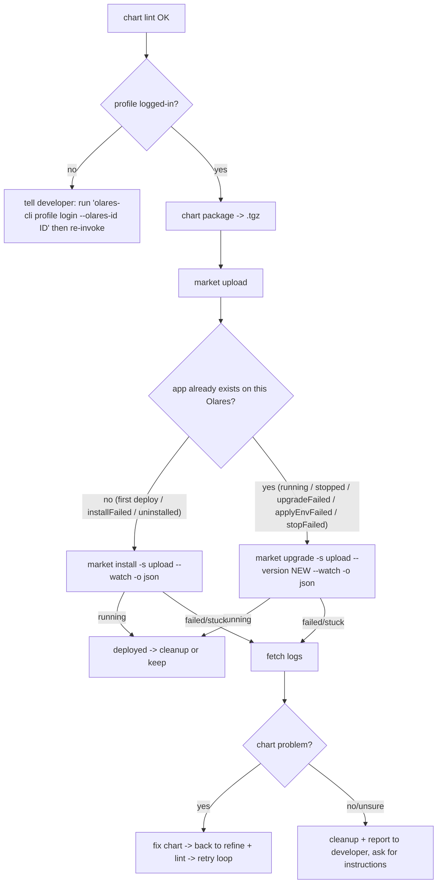

# Deploy to your Olares: upload, run, and diagnose

> **Prerequisite:** read the parent [`../SKILL.md`](../SKILL.md) first; pass `chart lint` before starting any of this.
> This is the **deploy** capability — the done step of the two axes. Unlike `from-compose` / `lint`, **everything here talks to a running Olares and REQUIRES login** — first read [`../../olares-shared/SKILL.md`](../../olares-shared/SKILL.md) for the profile model, login flow, and auth-error recovery.

> **Automation model: automatic after `lint` passes.** Once `lint` is green and the profile is logged in, drive the whole loop without asking: package → upload → install → watch → diagnose → fix → retry. Only stop to ask when the profile is not logged in, or when a failure is clearly **not** a chart problem. During the install wait, if you can multitask, proactively tail the app's own pod status + logs in parallel rather than only watching the coarse market row (see [§3 Don't just wait](#dont-just-wait--diagnose-the-apps-own-pods-in-parallel)).

`lint` proves the chart is structurally valid. It does **not** prove the app actually pulls its images, wires its middleware, and reaches `running`. This loop does — by pushing the chart to the developer's Olares and watching it install.



> **Want it in the public Olares Market afterwards?** Listing publicly (market-ready metadata, multi-arch, the `beclab/apps` PR, paid apps) is the [`../../olares-publish/SKILL.md`](../../olares-publish/SKILL.md) skill — start there once the app runs here.

## 1. Is the CLI logged in?

```bash
olares-cli profile list
```

The `*` marks the active profile; `STATUS` is `logged-in` when usable (see the olares-shared status table). If the active profile is `expired` / `invalidated` / `never`:

- **Do NOT log in on the developer's behalf unilaterally.** Tell them local `lint` passed and that deploy needs `olares-cli profile login --olares-id <id>` first. Stop here unless they ask you to drive the login (then follow olares-shared's agent-driven login flow).

## 2. Package + upload (automatic — no confirmation needed)

`lint` passed and the profile is logged in — proceed immediately.

**Bump the version on every (re)upload.** Before packaging, bump `Chart.yaml` `version` and `OlaresManifest.yaml` `metadata.version` together (keep them equal — `lint` enforces it); a patch bump (e.g. `0.0.1 → 0.0.2`) is the default. Market's upload gate only requires `>=` the stored version, but always presenting a strictly-newer version keeps each upload distinct and makes the `upgrade --version` unambiguous. (Same-version overwrite still works as a fallback when the chart didn't change — see §3.)

`market upload` takes a `.tgz` / `.tar.gz`, not a raw chart directory, so package first with the built-in verb (no `helm` binary needed):

```bash
olares-cli chart package ./<app>           # -> <app>-<version>.tgz  (name/version from Chart.yaml — reflects the bump)
olares-cli chart package ./<app> -o ./dist # or write the .tgz into a chosen dir
olares-cli market upload ./<app>-<version>.tgz   # use the new <version> in the filename
```

`chart package` mirrors `helm package` and preserves `OlaresManifest.yaml`, so the archive is accepted as-is by both `chart lint` and `market upload`. Because the filename is `<app>-<version>.tgz`, a bumped version produces a new `.tgz` name — pass that name to `upload` and the new number to `install` / `upgrade --version`.

- `upload` always lands the chart in the `upload` source (see [`../../olares-market/references/olares-market-charts.md`](../../olares-market/references/olares-market-charts.md)). `-s` is intentionally not exposed.
- Upload runs the server-side ingest, so a chart that passed local `lint` can still be rejected here (e.g. cluster-specific checks). Surface that message as a chart problem and go back to refine.

## 3. Actually run it

Upload only stores the chart; installing it is what proves it runs:

```bash
olares-cli market install <app> -s upload --version <version> --watch -o json
```

- **`install` is for an app that does NOT yet exist on this Olares** (first deploy, or after `uninstall`, or retrying an `installFailed`). If the app already exists in a settled state (`running` / `stopped` / `upgradeFailed` / `applyEnvFailed` / `stopFailed`), `install` is rejected by app-service — **re-apply with `upgrade` instead** (next bullet). When in doubt, `olares-cli market get <app> -s upload -o json` and read `.state`.
- **Re-apply an edited chart to an already-deployed app → bump the version, then `upgrade` to it:**
  ```bash
  olares-cli market upgrade <app> -s upload --version <NEW version> --watch -o json
  ```
  Bump `metadata.version` (= `Chart.yaml` `version`), re-package, and re-upload, then upgrade to the new number. This is the canonical loop for iterating on an installed app and for recovering one stuck in `upgradeFailed`. **Fallback:** the upload source also permits a **same-version** upgrade (the CLI's strict-newer gate is waived there; app-service gates on `>= deployed`), so re-uploading the same version overwrites the stored chart — use this only when the chart didn't change (a *lower* version is always rejected).
- Parse `.finalState`: `running` = deployed. `*Failed` / a watcher stuck near `*Failed` = go diagnose. See [`../../olares-market/references/olares-market-lifecycle.md`](../../olares-market/references/olares-market-lifecycle.md) for the state machine and `missing required env var(s)` (re-run with `--env KEY=VALUE`).
- **Hydration race — `HTTP 404: App not found` right after upload is transient, NOT a chart problem.** `upload` lands the package in the chart repo immediately, but the app only becomes installable after the market backend indexes ("hydrates") it a few seconds later. Installing in that window 404s. This is the one install failure you *should* retry: wait for hydration, then re-run the same `install`. The chart didn't change here, so there's nothing to re-`upload` or bump — the chart is already stored and re-uploading the same bytes wouldn't speed up hydration. Confirm hydration finished via the `appstore-backend` log (`isAppHydrationComplete RETURNING TRUE ... appID=<app>` → `Added new app to latest: <app>` → `new_app_ready`), or poll `olares-cli market get <app> -s upload` until it resolves:
  ```bash
  until olares-cli market get <app> -s upload -o json 2>/dev/null | grep -q '"name"'; do sleep 2; done
  olares-cli market install <app> -s upload --version <version> --watch -o json
  ```

### Watch a slow image pull (progress + speed)

A `--watch` that sits in `downloading` for minutes is usually a **healthy but large image pull** (multi-GB AI / engine images — e.g. `ollama/ollama` is ~3.4GB), not a hang. `market list --mine` only shows the coarse state; byte-level progress + speed come from the per-node `image-service` DaemonSet (it pulls via containerd and logs each layer):

```bash
olares-cli cluster pod list -n os-framework | grep image-service        # one pod per node
olares-cli cluster pod logs os-framework/<image-service-pod> -f | grep -E "progress=|downloading,ref:"
```

- `download image <ref> progress=<pct>, imageSize=<bytes>, offset=<bytes>` is the whole-image percent; `status: downloading,ref: layer-... offset:/Total:` is the active layer. Sample `offset` across two ticks ÷ the time gap = bytes/s. A **flat `offset` over many ticks = a stalled pull** (registry / mirror / network), not a slow one — go check the mirror / connectivity.
- The same offset/total is mirrored into the `imagemanagers` CRD that drives the install %: on the host, `kubectl -n os-framework get imagemanagers -o yaml` (match the entry to your app instance) shows `.status.conditions[node][image]{offset,total}` without scraping logs.
- The **model weights** download (engine pulling the model *after* its image is up) is a separate phase, NOT in image-service — watch it on the app's own llm-init container: `cluster pod logs <ns>/<app-pod> -c llm-init` or its `/api/progress` entrance.

### Don't just wait — diagnose the app's own pods in parallel

The `--watch` market row (`downloading` / `initializing`) is a **coarse** signal. If you can multitask, kick off `market install ... --watch` AND, in parallel, watch the app's own workload directly — don't wait for app-service to flip the row.

A crashlooping **main** container is NOT fast-failed while the row reads `initializing`. After the install scale-up, app-service moves the app to `Initializing` and polls **entrance TCP reachability** every 1s in `WaitForLaunch` (`framework/app-service/pkg/appstate/initializing_app.go:82` → `framework/app-service/pkg/appinstaller/helm_ops_install.go:1008`). It only gives up on a crashloop once `hasUnrecoverablePod` sees `CrashLoopBackOff` with `RestartCount >= 5` (`helm_ops_install.go:1118`, threshold `crashLoopRestartThreshold`) AND that condition persists past a **5-minute** grace (`unrecoverableGrace`, `helm_ops_install.go:1067`). So `initializing` legitimately persists for several minutes while the container is already CrashLoopBackOff. The fast signal is the pod's own container status + logs, not the market row.

The app namespace is `<app>-<owner>` (e.g. `pdfextractkit-pptest03`). Catch the crash early:

```bash
# Container status of the app's pod — watch the MAIN container.
olares-cli cluster pod list -n <app>-<owner> -o json   # status.containerStatuses[].{ready,restartCount,state}
```

- `restartCount` climbing or `state.waiting.reason == CrashLoopBackOff` on the main container = **start diagnosing now**, don't wait out the grace window.

```bash
# Crash traceback — current and (after a restart) the last failed start.
olares-cli cluster pod logs <app>-<owner>/<pod> -c <main-container>
olares-cli cluster pod logs <app>-<owner>/<pod> -c <main-container> --previous   # last crashed instance
```

`--previous` grabs the buffer from the instance that just died — usually where the real traceback is. Then jump to [§4 Diagnose by fetching logs](#4-diagnose-by-fetching-logs) and [`../../olares-cluster/SKILL.md`](../../olares-cluster/SKILL.md) (`--previous` is mutually exclusive with `-f`).

## 4. Diagnose by fetching logs

Use [`../../olares-cluster/SKILL.md`](../../olares-cluster/SKILL.md) (`cluster pod logs` / `cluster container logs`). The platform backends all live in namespace `os-framework`:

| What you suspect | Where to look (`os-framework`) | Command |
|---|---|---|
| Image can't be pulled / wrong CPU arch (`ImagePullBackOff`, `no match for platform`, `exec format error`) | the app's own pods | `olares-cli cluster application status <ns>` then `olares-cli cluster pod logs <ns>/<pod>` — rebuild a pullable, node-arch image per [olares-chart-image.md](olares-chart-image.md) |
| Upload / ingest rejected the chart | Deployment `market-deployment`, container `appstore-backend` | `olares-cli cluster container logs os-framework/<market-deployment-pod>/appstore-backend` |
| Install can't fetch the chart | Deployment `chartrepo-deployment`, container `chartrepo` | `olares-cli cluster container logs os-framework/<chartrepo-deployment-pod>/chartrepo` |
| Install failed (orchestration error, or the chart/manifest was rejected at install) | StatefulSet pod `app-service-0`, container `app-service` (cross-check the market backend `appstore-backend` row above) | `olares-cli cluster container logs os-framework/app-service-0/app-service` — read the error and fix the chart per [olares-chart-manifest.md](olares-chart-manifest.md) |
| The app's own container crash-loops | the app's pods (usually `user-space-<id>` or the app namespace) | `olares-cli cluster application status <ns>` then `olares-cli cluster pod logs <ns>/<pod>` |
| Main container `Completed` (exit 0) with **empty logs**, or app reads a bogus port/host | k8s service-link env collision — the Service name injects `<SVC>_PORT=tcp://...` that clobbers the app's own config env | set `spec.template.spec.enableServiceLinks: false` (see [olares-chart-env.md](olares-chart-env.md)) — then back to refine + lint |
| Frontend request times out / 504 / connection closed at ~15s on a long request (LLM generation, big upload, slow report) — app pod healthy | entrance proxy route timeout `options.apiTimeout` defaults to 15s | set `options.apiTimeout: 0` (disable) or a large value in the manifest (see [olares-chart-manifest.md](olares-chart-manifest.md)) — then re-package + re-deploy |
| `Permission denied` / EACCES writing data, or data not persisting | uid ≠ 1000, root-owned dirs on userspace mount, missing `spec.runAsUser` | [olares-chart-run-as-user.md](olares-chart-run-as-user.md) — then back to refine + lint |
| Admission denied: untrusted image + root | third-party main container runs as root | [olares-chart-run-as-user.md](olares-chart-run-as-user.md) — force uid 1000 or initContainer chown |

- Pod names for the Deployments are dynamic (`market-deployment-*`, `chartrepo-deployment-*`); resolve the exact name first with `olares-cli cluster pod list -n os-framework` (filter the output for `market` / `chartrepo`).
- **Admin caveat:** `os-framework` system pods are typically visible only to an **admin** profile. If you get `HTTP 403` / `HTTP 404`, the active developer profile isn't admin — don't fight it; report that the platform logs need an admin and fall back to the app's own pod logs.

## 4b. Upgrade recovery: `stopped` after upgrade

An upgrade can leave the **market row** in `state=stopped` while the **workload** is actually `Running`. Two paths land in `stopped`: upgrading an **already-stopped** app re-renders the chart at `replicas=0` and intentionally returns to `stopped` (by design); and **canceling an in-flight** op (`initializing` / `upgrading` / `applyingEnv` / `resuming`) only *stops* the app — so if a crashing initContainer was fixed and the workload later came up on its own, the row can read `stopped` while the pod is `1/1 Running`:

```bash
olares-cli market status <app> -s upload   # state=stopped
olares-cli cluster application status <ns> # Deployment 1/1 Running
```

This is **not** a failure — the market row just needs to be resumed. Recovery:

```bash
olares-cli market resume <app> --watch
```

`resume` scales the workloads back up and waits for startup (`stopped → resuming → running`). If the pod is already running it completes quickly and flips the market row to `running`.

If an upgrade instead left the app in **`upgradeFailed`** (the upgrade itself errored, not a `stopped` row), recover by fixing the chart, **bumping the version**, re-packaging + re-uploading, and re-running `market upgrade <app> -s upload --version <NEW> --watch` — `upgradeFailed` is an upgradable state (the upload source also permits a same-version upgrade as a fallback if nothing changed — see §3). Do **not** fall back to `install`: app-service rejects `install` from `upgradeFailed`, which only re-wedges the row.

## 5. Decide: fix the chart, or report back

- **Problem is in the chart** (wrong image ref, missing/incorrect env, bad volume mount, entrance host/port, undeclared `permission` for a userspace mount, **uid/permission mismatch on userspace volumes**, ...): edit the manifest/templates per [`olares-chart-manifest.md`](olares-chart-manifest.md) and [`olares-chart-run-as-user.md`](olares-chart-run-as-user.md), re-run `chart lint`, and re-upload (the auto-loop continues). **Bump the version on each redeploy** — bump `Chart.yaml` `version` == `metadata.version` together (lint enforces equality), re-package (the new `<app>-<version>.tgz` reflects it), and upload that file. Market's gate only requires `>= the stored` version, but presenting a strictly-newer version keeps each redeploy distinct; a *lower* version is always rejected, and same-version overwrite is a fallback for when the chart didn't change. **After re-upload, re-apply with the right verb:** if the app no longer exists / is `installFailed` → `market install -s upload --version <NEW>`; if it already exists in a settled state (`running` / `stopped` / `upgradeFailed` / `applyEnvFailed` / `stopFailed`) → `market upgrade -s upload --version <NEW>`. Re-running `install` against an already-existing app is rejected by app-service and leaves the row in `upgradeFailed`/`installFailed`; `upgrade` is the recovery path.
- **Problem is not in the chart, or unclear:** break out of the auto-loop — summarize the failing state and the relevant log excerpts in plain language, suggest likely causes, and **ask the developer how to proceed.** Do not silently retry install in a loop — install/auth failures are deterministic (see olares-market / olares-shared error tables). The lone exception is the post-upload hydration `404` in section 3, which is transient and meant to be retried once hydration completes.

## 6. Clean up the test install

Whether it passed or failed, don't leave a half-installed test app behind (unless the developer wants to keep using it — ask first):

```bash
olares-cli market uninstall <app> --watch              # tear down the deployment
olares-cli market delete <app> --version <ver>         # remove chart from upload bucket
```

`delete` requires `--version` — omitting it fails with "cannot determine version in source 'upload': app not found". `uninstall` and `delete` are separate steps: uninstall stops the running app, delete removes the stored chart.

## Next step

- **Done** after a successful install reaches `running` (+ cleanup, or leave it installed if the developer wants to keep using it).
- **Want a public listing?** Proceed to the [`../../olares-publish/SKILL.md`](../../olares-publish/SKILL.md) skill — market-ready polish, multi-arch, then the PR to `beclab/apps`.
