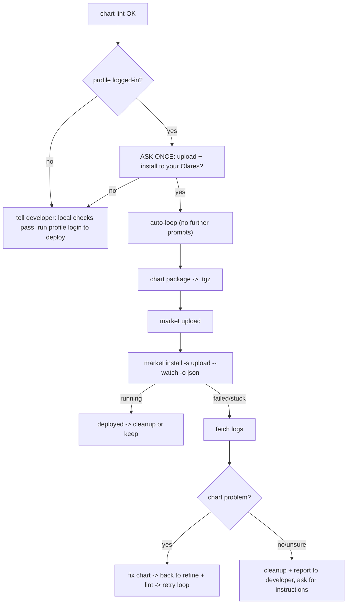

# Deploy to your Olares: upload, run, and diagnose

> **Prerequisite:** read the parent [`../SKILL.md`](../SKILL.md) first; pass `chart lint` before starting any of this.
> This is the **deploy** capability — the done step of the two axes. Unlike `from-compose` / `lint`, **everything here talks to a running Olares and REQUIRES login** — first read [`../../olares-shared/SKILL.md`](../../olares-shared/SKILL.md) for the profile model, login flow, and auth-error recovery.

> **Automation model: confirm once, then auto-loop.** Ask the developer **once** before the first upload. After they say yes (and the profile is logged in), drive package → upload → install → watch → diagnose → fix → retry **automatically**, without stopping to ask per step. Only break out to ask when login / credentials are missing, or when a failure is clearly **not** a chart problem.

`lint` proves the chart is structurally valid. It does **not** prove the app actually pulls its images, wires its middleware, and reaches `running`. This loop does — by pushing the chart to the developer's Olares and watching it install.



> **Want it in the public Olares Market afterwards?** Listing publicly (market-ready metadata, multi-arch, the `beclab/apps` PR, paid apps) is the [`../../olares-publish/SKILL.md`](../../olares-publish/SKILL.md) skill — start there once the app runs here.

## 1. Is the CLI logged in?

```bash
olares-cli profile list
```

The `*` marks the active profile; `STATUS` is `logged-in` when usable (see the olares-shared status table). If the active profile is `expired` / `invalidated` / `never`:

- **Do NOT log in on the developer's behalf unilaterally.** Tell them local `lint` passed and that deploy needs `olares-cli profile login --olares-id <id>` first. Stop here unless they ask you to drive the login (then follow olares-shared's agent-driven login flow).

## 2. Confirm once, then package + upload

Deploy is a write action on a real system — **ask the developer once before the first upload** (olares-shared "confirm intent before write actions"). After the yes, the remaining steps run automatically.

`market upload` takes a `.tgz` / `.tar.gz`, not a raw chart directory, so package first with the built-in verb (no `helm` binary needed):

```bash
olares-cli chart package ./<app>           # -> <app>-<version>.tgz  (name/version from Chart.yaml)
olares-cli chart package ./<app> -o ./dist # or write the .tgz into a chosen dir
olares-cli market upload ./<app>-<version>.tgz
```

`chart package` mirrors `helm package` and preserves `OlaresManifest.yaml`, so the archive is accepted as-is by both `chart lint` and `market upload`.

- `upload` always lands the chart in the `upload` source (see [`../../olares-market/references/olares-market-charts.md`](../../olares-market/references/olares-market-charts.md)). `-s` is intentionally not exposed.
- Upload runs the server-side ingest, so a chart that passed local `lint` can still be rejected here (e.g. cluster-specific checks). Surface that message as a chart problem and go back to refine.

## 3. Actually run it

Upload only stores the chart; installing it is what proves it runs:

```bash
olares-cli market install <app> -s upload --version <version> --watch -o json
```

- Parse `.finalState`: `running` = deployed. `*Failed` / a watcher stuck near `*Failed` = go diagnose. See [`../../olares-market/references/olares-market-lifecycle.md`](../../olares-market/references/olares-market-lifecycle.md) for the state machine and `missing required env var(s)` (re-run with `--env KEY=VALUE`).
- **Hydration race — `HTTP 404: App not found` right after upload is transient, NOT a chart problem.** `upload` lands the package in the chart repo immediately, but the app only becomes installable after the market backend indexes ("hydrates") it a few seconds later. Installing in that window 404s. This is the one install failure you *should* retry: wait for hydration, then re-run the same `install`. Don't re-`upload` (same-version re-upload is rejected: `new version X is not higher than current version X`) and don't bump the version — the chart is already stored. Confirm hydration finished via the `appstore-backend` log (`isAppHydrationComplete RETURNING TRUE ... appID=<app>` → `Added new app to latest: <app>` → `new_app_ready`), or just poll `olares-cli market get <app> -s upload` until it resolves.

## 4. Diagnose by fetching logs

Use [`../../olares-cluster/SKILL.md`](../../olares-cluster/SKILL.md) (`cluster pod logs` / `cluster container logs`). The platform backends all live in namespace `os-framework`:

| What you suspect | Where to look (`os-framework`) | Command |
|---|---|---|
| Image can't be pulled / wrong CPU arch (`ImagePullBackOff`, `no match for platform`, `exec format error`) | the app's own pods | `olares-cli cluster application status <ns>` then `olares-cli cluster pod logs <ns>/<pod>` — rebuild a pullable, node-arch image per [olares-chart-image.md](olares-chart-image.md) |
| Upload / ingest rejected the chart | Deployment `market-deployment`, container `appstore-backend` | `olares-cli cluster container logs os-framework/<market-deployment-pod>/appstore-backend` |
| Install can't fetch the chart | Deployment `chartrepo-deployment`, container `chartrepo` | `olares-cli cluster container logs os-framework/<chartrepo-deployment-pod>/chartrepo` |
| Install / orchestration failed | StatefulSet pod `app-service-0`, container `app-service` | `olares-cli cluster container logs os-framework/app-service-0/app-service` |
| The app's own container crash-loops | the app's pods (usually `user-space-<id>` or the app namespace) | `olares-cli cluster application status <ns>` then `olares-cli cluster pod logs <ns>/<pod>` |
| `Permission denied` / EACCES writing data, or data not persisting | uid ≠ 1000, root-owned dirs on userspace mount, missing `spec.runAsUser` | [olares-chart-run-as-user.md](olares-chart-run-as-user.md) — then back to refine + lint |
| Admission denied: untrusted image + root | third-party main container runs as root | [olares-chart-run-as-user.md](olares-chart-run-as-user.md) — force uid 1000 or initContainer chown |

- Pod names for the Deployments are dynamic (`market-deployment-*`, `chartrepo-deployment-*`); resolve the exact name first with `olares-cli cluster pod list -n os-framework` (filter the output for `market` / `chartrepo`).
- **Admin caveat:** `os-framework` system pods are typically visible only to an **admin** profile. If you get `HTTP 403` / `HTTP 404`, the active developer profile isn't admin — don't fight it; report that the platform logs need an admin and fall back to the app's own pod logs.

## 5. Decide: fix the chart, or report back

- **Problem is in the chart** (wrong image ref, missing/incorrect env, bad volume mount, entrance host/port, undeclared `permission` for a userspace mount, **uid/permission mismatch on userspace volumes**, ...): edit the manifest/templates per [`olares-chart-manifest.md`](olares-chart-manifest.md) and [`olares-chart-run-as-user.md`](olares-chart-run-as-user.md), re-run `chart lint`, and re-upload (the auto-loop continues). Bump `metadata.version` + `Chart.yaml` `version` together so the new bytes install cleanly.
- **Problem is not in the chart, or unclear:** break out of the auto-loop — summarize the failing state and the relevant log excerpts in plain language, suggest likely causes, and **ask the developer how to proceed.** Do not silently retry install in a loop — install/auth failures are deterministic (see olares-market / olares-shared error tables). The lone exception is the post-upload hydration `404` in section 3, which is transient and meant to be retried once hydration completes.

## 6. Clean up the test install

Whether it passed or failed, don't leave a half-installed test app behind (unless the developer wants to keep using it — ask first):

```bash
olares-cli market uninstall <app> --watch       # tear down the deployment
olares-cli market delete <app>                   # remove the chart from the upload bucket
```

(See the market charts reference: `uninstall` and `delete` are separate — uninstall stops the app, delete removes the uploaded chart.)

## Next step

- **Done** after a successful install reaches `running` (+ cleanup, or leave it installed if the developer wants to keep using it).
- **Want a public listing?** Proceed to the [`../../olares-publish/SKILL.md`](../../olares-publish/SKILL.md) skill — market-ready polish, multi-arch, then the PR to `beclab/apps`.
