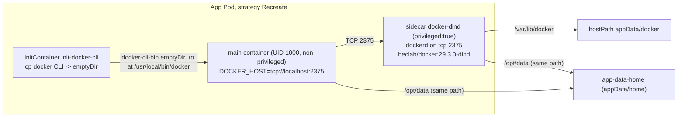

# Docker-in-Docker sidecar (terminal/agent apps)

> **Prerequisite:** read the parent [`../SKILL.md`](../SKILL.md) first, and the [Headless CLI / service archetype](olares-chart-archetypes.md) — DinD is an **optional add-on** to a terminal-based app, not a standalone archetype.

Some terminal/agent apps (coding agents, dev sandboxes) need to run `docker` / `docker compose` from inside the workspace. Olares pods cannot reach the host Docker daemon, so the chart ships its **own** daemon as a privileged sidecar and exposes the `docker` CLI to the main (non-privileged) container over TCP.

Canonical example: [pool](https://github.com/beclab/apps/tree/main/pool) (gated by `ENABLE_DIND`). The same pattern is used by [clawdbot](https://github.com/beclab/apps/tree/main/clawdbot) and [nemoclaw](https://github.com/beclab/apps/tree/main/nemoclaw) for sandbox isolation. Note: the `claudecode` app does **not** use DinD — it is a plain terminal workspace.

## Topology



Four moving parts, all gated behind one `ENABLE_DIND` env so users on hosts that forbid privileged containers can turn it off:

1. **CLI injection** — an initContainer copies the `docker` client out of the dind image into an `emptyDir`; the main container mounts just that binary read-only. The main container stays UID 1000 / non-privileged / `drop ALL`.
2. **Daemon sidecar** — the **only** privileged container; runs `dockerd` on `tcp://0.0.0.0:2375`.
3. **Wiring** — the main container talks to it via `DOCKER_HOST=tcp://localhost:2375` (same pod = `localhost`).
4. **Same-path workspace** — the workspace volume is mounted at the **same path** in both containers so bind-mounts resolve inside the daemon.

## Templates (copy-pasteable)

All DinD blocks are wrapped in `{{- if eq (toString .Values.olaresEnv.ENABLE_DIND) "true" }}` so the toggle removes them cleanly.

**initContainer — extract the `docker` CLI:**

```yaml
initContainers:
  {{- if eq (toString .Values.olaresEnv.ENABLE_DIND) "true" }}
  - name: init-docker-cli
    image: "docker.io/beclab/docker:29.3.0-dind"   # trusted beclab/* image (see Hard rules)
    command: ["cp", "/usr/local/bin/docker", "/docker-cli/docker"]
    volumeMounts:
      - mountPath: /docker-cli
        name: docker-cli-bin
  {{- end }}
```

**Main container — non-privileged, points at the sidecar daemon:**

```yaml
containers:
  - name: <app>
    image: "<your-registry>/<app>:<tag>"
    securityContext:
      runAsUser: 1000
      runAsGroup: 1000
      allowPrivilegeEscalation: false
      capabilities: { drop: ["ALL"] }
    env:
      - name: HOME
        value: /opt/data
      {{- if eq (toString .Values.olaresEnv.ENABLE_DIND) "true" }}
      - name: DOCKER_HOST
        value: "tcp://localhost:2375"
      {{- end }}
    command: ["sleep", "infinity"]
    volumeMounts:
      - mountPath: /opt/data
        name: app-data-home
      {{- if eq (toString .Values.olaresEnv.ENABLE_DIND) "true" }}
      - mountPath: /usr/local/bin/docker
        name: docker-cli-bin
        subPath: docker
        readOnly: true
      {{- end }}
```

**Daemon sidecar — the one privileged container:**

```yaml
  {{- if eq (toString .Values.olaresEnv.ENABLE_DIND) "true" }}
  - name: docker-dind
    image: "docker.io/beclab/docker:29.3.0-dind"
    securityContext:
      privileged: true
    env:
      - { name: DOCKER_TLS_CERTDIR, value: "" }    # disable TLS -> plain TCP on 2375
    command: ["dockerd", "--host", "tcp://0.0.0.0:2375", "--host", "unix:///var/run/docker.sock", "--mtu=1450"]
    ports:
      - containerPort: 2375
    startupProbe:                    # readinessProbe is analogous (periodSeconds 20, failureThreshold 5)
      exec: { command: ["docker", "info"] }
      periodSeconds: 5
      failureThreshold: 60
    resources:
      requests: { cpu: 200m, memory: 256Mi }
      limits: { cpu: "4", memory: 8Gi }
    volumeMounts:
      - mountPath: /var/lib/docker
        name: dind-storage
      - mountPath: /opt/data          # SAME path as the main container
        name: app-data-home
  {{- end }}
```

**Volumes:**

```yaml
volumes:
  - name: app-data-home
    hostPath:
      path: "{{ .Values.userspace.appData }}/home"
      type: DirectoryOrCreate
  {{- if eq (toString .Values.olaresEnv.ENABLE_DIND) "true" }}
  - name: docker-cli-bin
    emptyDir: {}
  - name: dind-storage              # images/layers persist across restarts
    hostPath:
      path: "{{ .Values.userspace.appData }}/docker"
      type: DirectoryOrCreate
  {{- end }}
```

**`OlaresManifest.yaml` — the toggle env (see [env.md](olares-chart-env.md)):**

```yaml
envs:
  - envName: ENABLE_DIND
    type: bool
    required: false
    applyOnChange: true
    editable: true
    default: "true"
    description: "Run a privileged Docker-in-Docker sidecar in the pod. Exposes the docker CLI in the terminal via DOCKER_HOST=tcp://localhost:2375 (uses extra CPU/RAM/disk under app data). Disable if your environment forbids privileged containers"
```

## Hard rules

- **The daemon image must be a trusted `beclab/*` image** (e.g. `docker.io/beclab/docker:29.3.0-dind`). A privileged container with a non-trusted image is **denied by OPA** (`privileged` → admission denied, see [run-as-user.md](olares-chart-run-as-user.md)). Do **not** use Docker Hub's library `docker:dind`. Pin the tag — never `:latest`.
- **Only the daemon sidecar is `privileged: true`.** Keep the main container UID 1000, `allowPrivilegeEscalation: false`, `drop: ["ALL"]` — it never needs privilege; it just talks TCP to the daemon.
- **Use `strategy: type: Recreate`.** The pattern relies on `hostPath` volumes (`appData/home`, `appData/docker`); `lint` rejects `hostPath` + rolling update, and the docker storage dir must not be opened by two pods at once.
- **Mount the workspace at the same path** in main + daemon (e.g. `/opt/data`). `docker run -v /opt/data/work:/work` is resolved by `dockerd`, so the path must mean the same thing in the daemon's mount namespace.
- **Declare headroom.** Image layers under `appData/docker` grow fast — set a generous `spec.limitedDisk`, and size the sidecar's `requests`/`limits` for real builds. The sidecar's resources are **in addition** to the main container's (the lint resource check sums all containers — see [olares-chart-accelerator.md](olares-chart-accelerator.md) §C).
- **Security:** a privileged DinD sidecar has effectively host-level kernel access. Only ship it on single-user dev/agent apps where the user already drives arbitrary shell commands, and keep it behind `ENABLE_DIND` so it can be turned off.

## Variants

**pool** is exactly the template above (CLI-injection + TCP daemon, toggled by `ENABLE_DIND`). **clawdbot / nemoclaw** use the same privileged daemon but add a startup script that launches `dockerd` and **pre-pulls a sandbox image** before the agent starts, so the first sandboxed task does not wait on a pull.
