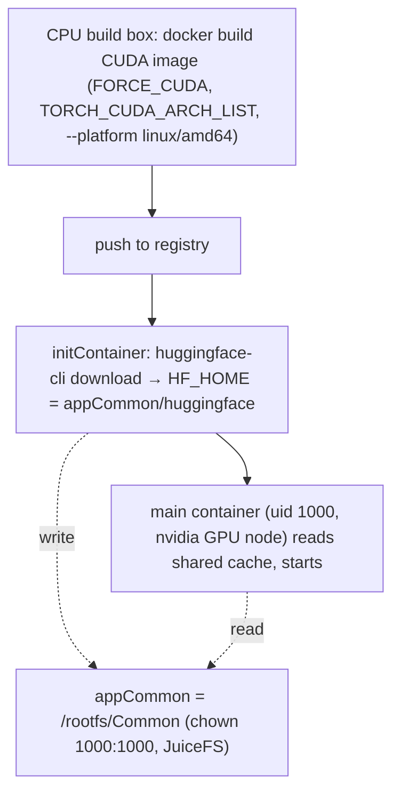

# GPU / CUDA apps: building the image + provisioning models

> **Prerequisite:** read the parent [`../SKILL.md`](../SKILL.md) first; this builds on the Image capability.
> Two concerns that GPU/AI apps add on top of a normal chart: (A) building a CUDA image, and (B) getting model weights onto the node. Build and runtime are separate machines — keep that in mind throughout.



## A. Building a CUDA image

Many AI apps depend on NVIDIA CUDA. **You do NOT need a GPU on the build machine** — build and runtime are separate:

- The CUDA toolkit is baked into the image (a `nvidia/cuda:*-devel` base, or pip CUDA wheels). The compile links against those libs in the image, not a physical device.
- A real GPU + driver is only needed at **runtime**, on the Olares GPU node (NVIDIA Container Toolkit + device plugin). A CPU-only laptop builds a CUDA image fine.

Watch out for:

1. **Compiling custom CUDA kernels** (PyTorch C++ extensions, flash-attn, deformable-attn, ...) — these probe the local GPU during build and will skip CUDA or fail when none is present. Force the arch list explicitly in the Dockerfile:
   ```dockerfile
   ENV FORCE_CUDA=1
   ENV TORCH_CUDA_ARCH_LIST="7.5;8.0;8.6;8.9;9.0"
   ```
2. **Arch is amd64.** Olares' `nvidia` GPU mode requires `amd64`, so GPU apps are single-arch: build `--platform linux/amd64` and declare `supportArch: [amd64]` — do NOT multi-arch. (arm64 NVIDIA is the niche `nvidia-gb10` mode.)
3. **No local smoke test** — a CPU build box can't run the container. Validate by deploying to a GPU Olares node (the olares-chart deploy loop, run on a GPU host).

> CUDA driver/toolkit version compatibility is not a concern here — Olares GPU nodes keep the driver current, so the image's CUDA version generally does not need to be pinned down to match the host.

Declaring the accelerator modes and sizing the resource envelope are covered in the Accelerator sizing.

## B. Model download: initContainer → shared HF cache (appCommon)

AI apps often need multi-GB model weights. **Do not bake weights into the image** (bloats the image, can't be updated, re-downloaded per app). Instead download at startup into Olares' cross-app shared cache so every AI app reuses one copy.

Olares already reserves a shared Hugging Face cache: `appCommon/huggingface` (alongside `ollama`, `llama.cpp`, `comfyui`). The pattern:

- Mount `.Values.userspace.appCommon` (requires `permission.appCommon: true`) and point `HF_HOME` / `HF_HUB_CACHE` at `{{ .Values.userspace.appCommon }}/huggingface`.
- An **initContainer** runs `huggingface-cli download` and blocks until the weights are present, then the main container starts. (Use an initContainer, not a long-lived sidecar — the main process must not start before the model exists.)
- Reuse Olares' Hugging Face values instead of hardcoding, via app-level envs that map the user vars: declare them in `envs[]` with `valueFrom` (`OLARES_USER_HUGGINGFACE_SERVICE` → `HF_ENDPOINT`, `OLARES_USER_HUGGINGFACE_TOKEN` → `HF_TOKEN`) and template `.Values.olaresEnv.<name>` into the container. Do **not** inline `$(OLARES_USER_...)` — v3 `lint` rejects raw `OLARES_USER...` references in templates (see the Env area).
- `appCommon` is created `chown 1000:1000`, so a process running as uid 1000 writes it directly — no chown initContainer needed.

```yaml
# OlaresManifest.yaml
permission:
  appCommon: true
envs:
  - envName: HF_ENDPOINT          # surfaced as .Values.olaresEnv.HF_ENDPOINT
    valueFrom:
      envName: OLARES_USER_HUGGINGFACE_SERVICE
  - envName: HF_TOKEN             # surfaced as .Values.olaresEnv.HF_TOKEN
    valueFrom:
      envName: OLARES_USER_HUGGINGFACE_TOKEN
```

```yaml
# deployment template
spec:
  template:
    spec:
      initContainers:
      - name: fetch-model
        image: <your image with huggingface_hub installed>
        command:
        - huggingface-cli
        - download
        - <org>/<model>
        env:
        - name: HF_HOME
          value: {{ .Values.userspace.appCommon }}/huggingface
        - name: HF_ENDPOINT
          value: "{{ .Values.olaresEnv.HF_ENDPOINT }}"
        - name: HF_TOKEN
          value: "{{ .Values.olaresEnv.HF_TOKEN }}"
        volumeMounts:
        - name: hf-cache
          mountPath: {{ .Values.userspace.appCommon }}/huggingface
      containers:
      - name: app
        image: <your CUDA image>
        env:
        - name: HF_HOME
          value: {{ .Values.userspace.appCommon }}/huggingface
        volumeMounts:
        - name: hf-cache
          mountPath: {{ .Values.userspace.appCommon }}/huggingface
      volumes:
      - name: hf-cache
        hostPath:
          path: {{ .Values.userspace.appCommon }}/huggingface
          type: DirectoryOrCreate
```

Caveats:

- **Olares ≥ 1.12.6** — `appCommon` (the `drive/Common` area) only exists on 1.12.6+. On older targets fall back to per-app `appData`/`appCache` (no cross-app sharing).
- **Concurrent downloads** — multiple AI apps writing the same shared cache is safe: the HF cache is content-addressed (blobs + atomic snapshot renames), so concurrent reads and same-model writes don't corrupt each other.
- **Non-HF-cache-aware apps** — if the app expects weights at a fixed path rather than the HF cache layout, download/symlink into that path instead; the shared-cache benefit only applies to HF-cache-aware loaders.
- **Permission cross-check** — any template that references `.Values.userspace.appCommon` MUST declare `permission.appCommon: true`, or `lint`'s app-data cross-check fails. See the userspace directory comparison in the Manifest refinement areas.

## C. Declaring accelerator modes & sizing

Once the image and model provisioning are sorted, declare which accelerator modes the app supports (`spec.accelerator`, nvidia/amd-gpu/apple-m/cpu/...) and size the CPU/memory/GPU-memory envelope. That is its own area: the Accelerator sizing.
