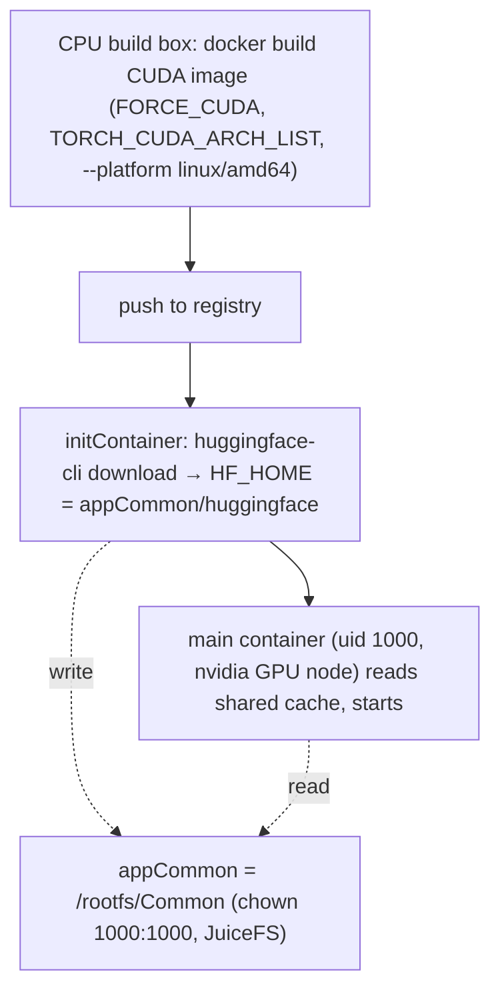

# GPU / CUDA apps: building the image + provisioning models

> **Prerequisite:** read the parent [`../SKILL.md`](../SKILL.md) and [olares-chart-image.md](olares-chart-image.md) first.
> Two concerns that GPU/AI apps add on top of a normal chart: (A) building a CUDA image, and (B) getting model weights onto the node. Build and runtime are separate machines — keep that in mind throughout.



## A. Building a CUDA image

Many AI apps depend on NVIDIA CUDA. **You do NOT need a GPU on the build machine** — build and runtime are separate:

- The CUDA toolkit is baked into the image (a `nvidia/cuda:*-devel` base, or pip CUDA wheels). The compile links against those libs in the image, not a physical device.
- A real GPU + driver is only needed at **runtime**, on the Olares GPU node (NVIDIA Container Toolkit + device plugin). A CPU-only laptop builds a CUDA image fine.

Watch out for:

1. **Compiling custom CUDA kernels** (PyTorch C++ extensions, flash-attn, deformable-attn, ...) — these probe the local GPU during build and will skip CUDA or fail when none is present. Force the arch list explicitly in the Dockerfile:
   ```dockerfile
   ENV FORCE_CUDA=1
   ENV TORCH_CUDA_ARCH_LIST="7.5;8.0;8.6;8.9;9.0"
   ```
2. **Arch is amd64.** Olares' `nvidia` GPU mode requires `amd64`, so GPU apps are single-arch: build `--platform linux/amd64` and declare `supportArch: [amd64]` — do NOT multi-arch. (arm64 NVIDIA is the niche `nvidia-gb10` mode.)
3. **No local smoke test** — a CPU build box can't run the container. Validate on a GPU Olares node (Publish-local on a GPU host).

> CUDA driver/toolkit version compatibility is not a concern here — Olares GPU nodes keep the driver current, so the image's CUDA version generally does not need to be pinned down to match the host.

Declaring the accelerator modes and sizing the resource envelope is covered in sections C and D below.

## B. Model download: initContainer → shared HF cache (appCommon)

AI apps often need multi-GB model weights. **Do not bake weights into the image** (bloats the image, can't be updated, re-downloaded per app). Instead download at startup into Olares' cross-app shared cache so every AI app reuses one copy.

Olares already reserves a shared Hugging Face cache: `appCommon/huggingface` (alongside `ollama`, `llama.cpp`, `comfyui`). The pattern:

- Mount `.Values.userspace.appCommon` (requires `permission.appCommon: true`) and point `HF_HOME` / `HF_HUB_CACHE` at `{{ .Values.userspace.appCommon }}/huggingface`.
- An **initContainer** runs `huggingface-cli download` and blocks until the weights are present, then the main container starts. (Use an initContainer, not a long-lived sidecar — the main process must not start before the model exists.)
- Read the injected Hugging Face env instead of hardcoding: `OLARES_USER_HUGGINGFACE_SERVICE` → `HF_ENDPOINT`, `OLARES_USER_HUGGINGFACE_TOKEN` → `HF_TOKEN`.
- `appCommon` is created `chown 1000:1000`, so a process running as uid 1000 writes it directly — no chown initContainer needed.

```yaml
# OlaresManifest.yaml
permission:
  appCommon: true
```

```yaml
# deployment template
spec:
  template:
    spec:
      initContainers:
      - name: fetch-model
        image: <your image with huggingface_hub installed>
        command:
        - huggingface-cli
        - download
        - <org>/<model>
        env:
        - name: HF_HOME
          value: {{ .Values.userspace.appCommon }}/huggingface
        - name: HF_ENDPOINT
          value: $(OLARES_USER_HUGGINGFACE_SERVICE)
        - name: HF_TOKEN
          value: $(OLARES_USER_HUGGINGFACE_TOKEN)
        volumeMounts:
        - name: hf-cache
          mountPath: {{ .Values.userspace.appCommon }}/huggingface
      containers:
      - name: app
        image: <your CUDA image>
        env:
        - name: HF_HOME
          value: {{ .Values.userspace.appCommon }}/huggingface
        volumeMounts:
        - name: hf-cache
          mountPath: {{ .Values.userspace.appCommon }}/huggingface
      volumes:
      - name: hf-cache
        hostPath:
          path: {{ .Values.userspace.appCommon }}/huggingface
          type: DirectoryOrCreate
```

Caveats:

- **Olares ≥ 1.12.6** — `appCommon` (the `drive/Common` area) only exists on 1.12.6+. On older targets fall back to per-app `appData`/`appCache` (no cross-app sharing).
- **Concurrent downloads** — multiple AI apps writing the same shared cache is safe: the HF cache is content-addressed (blobs + atomic snapshot renames), so concurrent reads and same-model writes don't corrupt each other.
- **Non-HF-cache-aware apps** — if the app expects weights at a fixed path rather than the HF cache layout, download/symlink into that path instead; the shared-cache benefit only applies to HF-cache-aware loaders.
- **Permission cross-check** — any template that references `.Values.userspace.appCommon` MUST declare `permission.appCommon: true`, or `lint`'s app-data cross-check fails. See the userspace directory comparison in [olares-chart-manifest.md](olares-chart-manifest.md).

## C. Declaring accelerator modes (`spec.accelerator`)

On the modern schema (`olaresManifest.version >= 0.12.0`) an app that needs an accelerator declares one `spec.accelerator[]` entry **per compute mode** it supports. Without it the app is scheduled as plain `cpu` and never gets an accelerator device or GPU memory.

> **Naming gotchas (these bite):**
> - The YAML key is `spec.accelerator`, but `lint` error messages call it **`spec.resources`** — same thing.
> - The GPU-memory key inside an entry is **`requiredGPUMemory` / `limitedGPUMemory`** (the legacy flat field at `< 0.12.0` is `spec.requiredGpu` / `limitedGpu` — also a memory quantity, not a card count).

### Accelerator modes (not just NVIDIA)

| `mode` | Target device | Arch required (`spec.supportArch`) |
|---|---|---|
| `cpu` | no accelerator, CPU only | none |
| `nvidia` | NVIDIA discrete GPU (via HAMi) | `amd64` |
| `amd-gpu` | AMD discrete GPU (ROCm) | `amd64` |
| `amd-apu` | AMD APU integrated GPU (AI Max 395+) | (amd64 in practice) |
| `strix-halo` | AMD Strix Halo + unified memory | `amd64` |
| `nvidia-gb10` | NVIDIA GB10 superchip + unified memory | `arm64` |
| `apple-m` | Apple M-series SoC (Mac, Metal/MPS) | (arm64 in practice) |
| `mthreads-m1000` | Moore Threads M1000 | `arm64` |

`lint` cross-checks the mode against `spec.supportArch` for the rows that declare an arch (`nvidia`/`amd-gpu`/`strix-halo` → `amd64`; `nvidia-gb10`/`mthreads-m1000` → `arm64`). Only `nvidia` and `amd-gpu` may declare GPU-memory fields. (The legacy `spec.supportedGpu` list is superseded — on `0.12.0` use `spec.accelerator`.)

### Shape and semantics

```yaml
# OlaresManifest.yaml  (olaresManifest.version: '0.12.0', apiVersion: v3)
spec:
  supportArch:
  - amd64
  accelerator:
  - mode: cpu                  # optional CPU fallback — only if upstream runs on CPU
    requiredCpu: "1"
    limitedCpu: "4"
    requiredMemory: 4Gi
    limitedMemory: 16Gi
    requiredDisk: 2Gi
    limitedDisk: 10Gi
  - mode: nvidia
    supportMultiCard: false    # true if the app can shard across cards
    supportMultiNodes: false
    requiredCpu: "1"
    limitedCpu: "4"
    requiredMemory: 8Gi
    limitedMemory: 24Gi
    requiredDisk: 2Gi
    limitedDisk: 10Gi
    requiredGPUMemory: 16Gi    # GPU memory floor (NOT a card count) → nvidia.com/gpumem
    limitedGPUMemory: 24Gi
```

- `required*` is the **scheduling floor** (reserved); `limited*` is the **cap**. They map to Kubernetes container `requests` / `limits`.
- **GPU is allocated by memory, not whole cards.** `requiredGPUMemory` is the vGPU memory the scheduler reserves (matched against device memory); a card count is not what you request here.
- Each declared mode entry must be **complete** (all CPU/memory/disk pairs present); `lint` reports every missing field.
- `spec.accelerator` is **mutually exclusive** with the legacy flat `spec.requiredCpu/...` fields, is **rejected on `apiVersion: v2`**, and only applies at `olaresManifest.version >= 0.12.0`.

## C2. Which modes to declare — follow what the repo actually supports

Do **not** invent modes. Declare only the backends the upstream project genuinely supports:

1. **Inspect the repo for its accelerator backends.** Check the Dockerfile / dependencies and build flags: CUDA / cuDNN (→ `nvidia`), ROCm / HIP (→ `amd-gpu`), Apple Metal / MPS (→ `apple-m`), Vulkan / oneAPI, or pure CPU. Read the README hardware requirements, the model card's recommended VRAM, and any device-selection logic in compose / entrypoints (e.g. `llama.cpp`'s `GGML_CUDA` / `GGML_HIP` / `GGML_METAL` / `GGML_VULKAN`, or a PyTorch backend switch).
2. **Repo supports multiple backends → ask the user** which to target, then declare one `accelerator` mode per chosen backend. Remember the arch split (`nvidia`/`amd*`/`strix-halo` are `amd64`; `nvidia-gb10`/`mthreads` are `arm64`), so multiple modes usually mean multiple images / build variants — extra cost.
3. **Repo supports only one backend → declare only that one** (CUDA-only → just `nvidia`; CPU-only → just `cpu`).
4. **CPU fallback only when real.** Add a `cpu` mode only if the upstream actually runs on CPU; many CUDA-only projects do not — don't add it for them.

> Decide the feasible set from the repo first, then let the user choose within that set. Never declare a device the project can't use.

## D. How much to request (sizing a ported project)

Sizing is per declared mode. Start from upstream facts, then map to `required` (floor) vs `limited` (cap):

- **Where to get the numbers:** the upstream README "requirements", a compose `deploy.resources` block, the model card's recommended VRAM/RAM, and the project's own defaults.

**GPU memory (`requiredGPUMemory`)** — rule of thumb for model-serving apps:

```
GPU memory ≈ weights + KV-cache/activations + ~1–2Gi CUDA/runtime overhead
weights ≈ params × bytes-per-param   (fp16 ≈ 2 B, int8 ≈ 1 B, 4-bit ≈ 0.5 B)
```

- e.g. a **7B** model in **fp16** ≈ 14 GB weights → `requiredGPUMemory` ≈ `16Gi` (with overhead/KV cache); 4-bit quantized ≈ `6Gi`.
- Set `requiredGPUMemory` to a realistic floor and `limitedGPUMemory` to the working peak. These are heuristics — **verify on a real GPU Olares node** and adjust.

**CPU / RAM / disk:**

- **RAM** (`requiredMemory`/`limitedMemory`): enough to load and run the model server; for AI apps RAM is often comparable to or above GPU memory; leave headroom for model load/convert.
- **CPU** (`requiredCpu`/`limitedCpu`): inference servers are usually modest (request ~1–2, limit ~4); raise it if the app does heavy CPU pre/post-processing.
- **Disk** (`requiredDisk`/`limitedDisk`): only large if weights live in per-app `appData`. With the shared `appCommon` Hugging Face cache (section B) the app's own disk stays small.

**Align with what `lint` enforces** (`CheckResourceLimits`, CPU + memory only):

- `requiredCpu <= limitedCpu` and `requiredMemory <= limitedMemory` within the manifest.
- Each container needs `requests <= limits`, and **every container must set a memory request**.
- The **sum of all container `requests` must be `<=` the manifest `required*`**, and the **sum of `limits` `<=` the manifest `limited*`**. So size the manifest envelope to **cover** what the templates actually set.

```yaml
# manifest declared (nvidia mode)         # must be >= the rendered container totals below
requiredCpu: "1"   limitedCpu: "4"
requiredMemory: 8Gi limitedMemory: 24Gi
```
```yaml
# templates/deployment.yaml container
resources:
  requests: { cpu: "1", memory: 8Gi }     # Σ requests <= manifest required*
  limits:   { cpu: "4", memory: 24Gi }    # Σ limits   <= manifest limited*
```

> Don't over-request: an oversized `required*` reserves the user's node and can make the app unschedulable. Request the realistic floor, cap at the realistic peak. (GPU memory and disk are not part of this CPU/memory cross-check — they only drive scheduling.)
