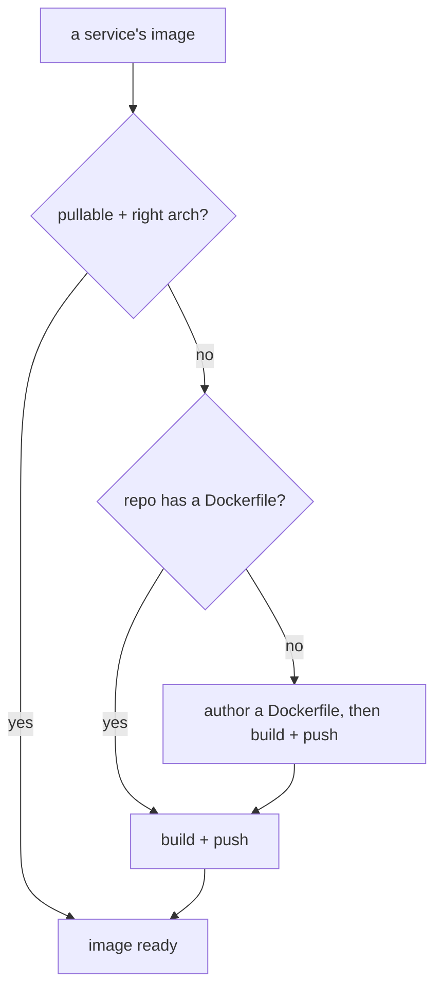

# Image: a pullable, arch-correct image (packaging axis)

> **Prerequisite:** read the parent [`../SKILL.md`](../SKILL.md) first.
> This is the **packaging** capability. It is orthogonal to having a compose — a compose says nothing about whether an image needs building — and can be entered up front or looped back to later (an install that hits `ImagePullBackOff` sends you here).

## Arch strategy by release target

| Target | Build strategy | Manifest follow-up |
|---|---|---|
| **local-run** | Single-arch for **this node** — query with `olares-cli cluster node list` (needs login) | `spec.supportArch` optional |
| **market-distribute** | Multi-arch (`linux/amd64,linux/arm64`) | Declare matching `spec.supportArch: [amd64, arm64]` in `OlaresManifest.yaml` |

See [olares-chart-publish-targets.md](olares-chart-publish-targets.md) for the full matrix.

## When you need it

Olares installs apps by **pulling images from a registry; it never builds from source.** So every workload must reference an image that is publicly pullable **for the target node's architecture**. Skip this capability only when every service already does.



- **Already pullable + arch-correct:** nothing to do for that service.
- **Repo has no Dockerfile:** read the code to infer the runtime (language, start command, listening port, required env, data directories), **author a Dockerfile**, then build+push.
- **Repo has a Dockerfile but no official (or no target-arch) image:** build+push from the Dockerfile.

## Image architecture must match the target

A wrong-architecture image installs but never runs (`ImagePullBackOff` with `no match for platform`, or the container `exec format error`-crashes):

1. **Find the target node arch** (local-run):
   ```bash
   olares-cli cluster node list          # the node row shows amd64 / arm64 (needs login)
   ```
2. **Inspect a candidate image's platforms** before trusting it:
   ```bash
   docker manifest inspect <image-ref>   # look for the platform.architecture entries
   ```
   (No docker daemon? Query the registry manifest list over HTTP and read each `platform.architecture`.)
3. **Build for the release target:**
   - **local-run:** single platform matching the node — `--platform linux/amd64` or `linux/arm64`
   - **market-distribute:** multi-arch — `--platform linux/amd64,linux/arm64`
   If you build single-arch, it **must** equal the node arch.

## GPU / CUDA images

Building a CUDA image (no GPU needed on the build box, custom-kernel arch flags, the amd64 / `nvidia`-mode constraint) and provisioning model weights (initContainer + shared Hugging Face cache) are covered in their own reference: [olares-chart-gpu.md](olares-chart-gpu.md).

## Registry + build/push (agent-driven)

You drive this end to end — ask the registry, check login, build, push, verify. The **only** manual step is the developer typing a registry token into `docker login`, and only when they are not already authenticated. **Never invent/hardcode tokens or push under an account the developer didn't choose.**

1. **Ask which registry the developer uses + the target `<user>/<repo>`** before anything else (don't assume one):
   - **Docker Hub** — image ref `<dockerhub-user>/<repo>`
   - **GitHub Container Registry (ghcr)** — image ref `ghcr.io/<owner>/<repo>`
   > Olares-local private registry is not supported here yet (planned). Until then the image must live on a registry the Olares node can pull from publicly.

2. **Check docker is usable:**
   ```bash
   docker version          # must show a Server section; if it errors, the daemon isn't running
   docker buildx version   # buildx is needed for --platform multi-arch
   ```
   If docker is missing or the daemon is down, point the developer to install / start it: Docker Desktop on macOS/Windows, or the engine on Linux — https://docs.docker.com/get-docker/ . Stop and wait until `docker version` shows a Server.

3. **Check whether they're already logged in to that registry** — don't ask for a login they already have:
   ```bash
   docker login <registry>   # already authed? prints "Authenticating with existing credentials" / "Login Succeeded"
   ```
   Or read `~/.docker/config.json` `auths` for the registry key (Docker Hub → `https://index.docker.io/v1/`, ghcr → `ghcr.io`; a `credsStore`/`credHelpers` entry can be empty but present). A push that later fails with `unauthorized` / `denied` is the authoritative "not logged in / wrong account" signal.
   - **Already logged in** → go straight to build + push (step 4).
   - **Not logged in** → ask the developer to run the right `docker login` (this is the one step you can't do — it needs their secret token), then continue:
     - Docker Hub: `docker login` with a Docker Hub **access token** (Account Settings → Security → New Access Token).
     - ghcr: `docker login ghcr.io -u <github-user>` with a **GitHub PAT** that has `write:packages`. After the first push, set the package **visibility to public** so Olares can pull it without auth.

4. **Build for the target arch and push** — you run this, after confirming `<registry-ref>:<tag>` with the developer:
   ```bash
   # local-run (example: amd64 node):
   docker buildx build --platform linux/amd64 -t <registry-ref>:<tag> --push <build-context>

   # market-distribute:
   docker buildx build --platform linux/amd64,linux/arm64 -t <registry-ref>:<tag> --push <build-context>
   ```
   `<build-context>` can be a local path (`.`) or a git URL (e.g. `https://github.com/org/repo.git#main`). Use the upstream Dockerfile or one you authored.

5. **Verify the pushed image** before wiring it in:
   ```bash
   docker manifest inspect <registry-ref>:<tag>   # confirm the expected platforms are present
   ```

## Handoff: wire the image into the compose

In the compose ([olares-chart-compose.md](olares-chart-compose.md)), replace every `build:` block (and any local-only `image:` tag like `image: app`) with the pushed `<registry-ref>:<tag>`. Now every service is pullable and arch-correct, so proceed to scaffold:

```bash
olares-cli chart from-compose --name <app> -f docker-compose.yml
```

Then continue with the four refinement areas ([olares-chart-manifest.md](olares-chart-manifest.md)) and `chart lint`.

## Run identity (UID/GID 1000)

Olares userspace volumes expect the app process as **uid/gid 1000**. When **authoring** a Dockerfile:

- Create a user with uid/gid 1000 and `USER 1000`
- `chown -R 1000:1000` every path the app writes before switching user

When using a **third-party** image, inspect `docker inspect <ref> --format '{{.Config.User}}'` before wiring it in. Root or non-1000 uids that create directories on userspace mounts need chart-side fixes (`spec.runAsUser`, `securityContext`, or an initContainer) — full decision tree in [olares-chart-run-as-user.md](olares-chart-run-as-user.md).

## Hard rules

- **Every service must reference a publicly pullable image** for the node arch — no `build:`, no local-only tags, no private registry (until Olares-local registry support lands).
- **local-run:** arch must match the node. **market-distribute:** prefer multi-arch; declare `spec.supportArch`. Verify with `docker manifest inspect`.
- **Never bake registry credentials into the chart** (no `imagePullSecrets` with inline tokens, no secrets in `values.yaml`). Public images only.
- **Pin every image to a specific version tag** — **never `:latest`** or an untagged image (implicit `latest`). `latest` drifts, so installs become non-reproducible and rollbacks/caching unreliable. Bump the tag when you rebuild. (`lint` does not enforce this — it's on you.)
