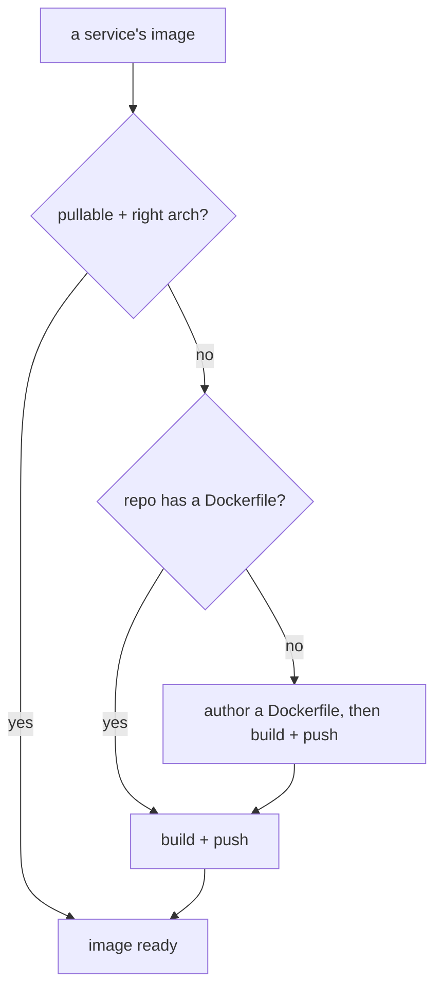

# Image: a pullable, arch-correct image (packaging axis)

> **Prerequisite:** read the parent [`../SKILL.md`](../SKILL.md) first.
> This is the **packaging** capability. It is orthogonal to having a compose — a compose says nothing about whether an image needs building — and can be entered up front or looped back to later (an install that hits `ImagePullBackOff` sends you here).

## When you need it

Olares installs apps by **pulling images from a registry; it never builds from source.** So every workload must reference an image that is publicly pullable **for the target node's architecture**. Skip this capability only when every service already does.



- **Already pullable + arch-correct:** nothing to do for that service.
- **Repo has no Dockerfile:** read the code to infer the runtime (language, start command, listening port, required env, data directories), **author a Dockerfile**, then build+push.
- **Repo has a Dockerfile but no official (or no target-arch) image:** build+push from the Dockerfile.

## Image architecture must match the node

A wrong-architecture image installs but never runs (`ImagePullBackOff` with `no match for platform`, or the container `exec format error`-crashes):

1. **Find the target node arch:**
   ```bash
   olares-cli cluster node list          # the node row shows amd64 / arm64 (needs login)
   ```
2. **Inspect a candidate image's platforms** before trusting it:
   ```bash
   docker manifest inspect <image-ref>   # look for the platform.architecture entries
   ```
   (No docker daemon? Query the registry manifest list over HTTP and read each `platform.architecture`.)
3. **Prefer multi-arch builds** so the result runs on any node and you don't depend on knowing the arch up front:
   ```bash
   --platform linux/amd64,linux/arm64
   ```
   If you build single-arch, it **must** equal the node arch.

## Guided environment + registry setup

These steps need the developer's machine and credentials. **Guide the developer through them; never run `docker login`, invent tokens, or push under an account on their behalf.** Confirm the `<user>/<repo>` and registry with them first.

1. **Check docker is usable:**
   ```bash
   docker version          # must show a Server section; if it errors, the daemon isn't running
   docker buildx version   # buildx is needed for --platform multi-arch
   ```
   If docker is missing or the daemon is down, point the developer to install / start it: Docker Desktop on macOS/Windows, or the engine on Linux — https://docs.docker.com/get-docker/ . Stop and wait until `docker version` shows a Server.

2. **Pick a registry** (the developer chooses one of the two public options):
   - **Docker Hub** — image ref `<dockerhub-user>/<repo>`
   - **GitHub Container Registry (ghcr)** — image ref `ghcr.io/<owner>/<repo>`
   > Olares-local private registry is not supported here yet (planned). Until then the image must live on a registry the Olares node can pull from publicly.

3. **Log in / set the secret** (developer-driven; the "secret" is a registry token, not something you hardcode):
   - Docker Hub: `docker login` with a Docker Hub **access token** (Account Settings → Security → New Access Token).
   - ghcr: `docker login ghcr.io -u <github-user>` with a **GitHub PAT** that has `write:packages`.
   - For a ghcr image to be pullable by Olares without auth, the developer must set the package **visibility to public** after the first push.

4. **Choose `<user>/<repo>` and a tag**, then build for the target arch and push in one step:
   ```bash
   docker buildx build --platform linux/amd64,linux/arm64 \
     -t <registry-ref>:<tag> --push <build-context>
   ```
   `<build-context>` can be a local path (`.`) or a git URL (e.g. `https://github.com/org/repo.git#main`). Use the upstream Dockerfile or one you authored.

5. **Verify the pushed image** before wiring it in:
   ```bash
   docker manifest inspect <registry-ref>:<tag>   # confirm the expected platforms are present
   ```

## Handoff: wire the image into the compose

In the compose ([olares-chart-compose.md](olares-chart-compose.md)), replace every `build:` block (and any local-only `image:` tag like `image: app`) with the pushed `<registry-ref>:<tag>`. Now every service is pullable and arch-correct, so proceed to scaffold:

```bash
olares-cli chart from-compose --name <app> -f docker-compose.yml
```

Then continue with the four judgment calls ([olares-chart-manifest.md](olares-chart-manifest.md)) and `chart lint`.

## Hard rules

- **Every service must reference a publicly pullable image** for the node arch — no `build:`, no local-only tags, no private registry (until Olares-local registry support lands).
- **Arch must match the node**, or prefer a multi-arch image. Verify with `docker manifest inspect`.
- **Never bake registry credentials into the chart** (no `imagePullSecrets` with inline tokens, no secrets in `values.yaml`). Public images only.
- **Pin a tag** (avoid bare `latest` for reproducible installs); bump it when you rebuild.
