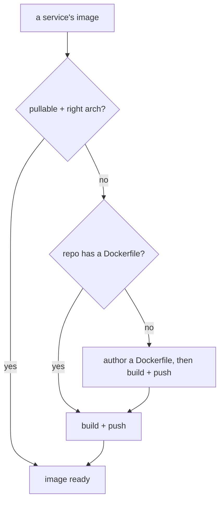
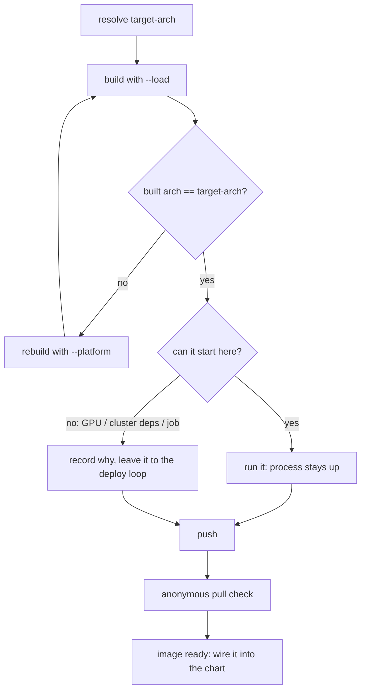

# Image: a pullable, arch-correct image (packaging axis)

> **Prerequisite:** read the parent [`../SKILL.md`](../SKILL.md) first.
> This is the **packaging** capability. It is orthogonal to having a compose — a compose says nothing about whether an image needs building — and can be entered up front or looped back to later (an install that hits `ImagePullBackOff` sends you here).

## Arch strategy

Deploying to your Olares only needs the **target Olares node's arch** (single-arch) — query it with `olares-cli cluster node list` (needs login). The development host may have a different architecture, so never derive the image platform from `uname`, `runtime.GOARCH`, or Docker's default platform. Multi-arch (`linux/amd64,linux/arm64` + a matching `spec.supportArch: [amd64, arm64]`) is only required when **publishing to the public Market** — see the [`../../olares-publish/SKILL.md`](../../olares-publish/SKILL.md) skill.

Declare that same architecture in `spec.supportArch`: it is **required and must be non-empty** (`lint` rejects a missing or empty list), and declaring exactly one arch additionally makes app-service pin the app's pods to matching nodes through a `kubernetes.io/arch` nodeSelector. Be clear about what that buys you, though. `spec.supportArch` is a **declaration about the chart**; no platform-side check opens the image to see which architecture was actually built. A chart that declares `amd64` around an arm64 image is consistent to every one of those checks, and still crashes.

## When you need it

Olares installs apps by **pulling images from a registry; it never builds from source.** So every workload must reference an image that is publicly pullable **for the target node's architecture**. Skip this capability only when every service already does.


```mermaid
flowchart TD
  start["a service's image"] --> ok{"pullable + right arch?"}
  ok -->|yes| ready["image ready"]
  ok -->|no| hasDockerfile{"repo has a Dockerfile?"}
  hasDockerfile -->|yes| build["build + push"]
  hasDockerfile -->|no| authorDf["author a Dockerfile, then build + push"]
  authorDf --> build
  build --> ready
```

- **Already pullable + arch-correct:** nothing to do for that service.
- **Repo has no Dockerfile:** read the code to infer the runtime (language, start command, listening port, required env, data directories), **author a Dockerfile**, then build+push.
- **Repo has a Dockerfile but no official (or no target-arch) image:** build+push from the Dockerfile.

## The image-readiness gate

Everything below applies to an image **you** build. Three of its properties stay invisible until the cluster rejects it: the architecture actually built, whether it can be pulled **without credentials**, and whether the process even starts. A fourth failure mode — a node continuing to serve cached layers under a reused tag — cannot be detected from the build host, so the hard rule is simpler: every rebuild gets a new tag. Reading these rules is not the same as applying them — run the gate and look at its output, because each step is an assertion that can fail here, in seconds, instead of a deploy cycle later.


```mermaid
flowchart TD
  target["resolve target-arch"] --> build["build with --load"]
  build --> archChk{"built arch == target-arch?"}
  archChk -->|no| rebuild["rebuild with --platform"]
  rebuild --> build
  archChk -->|yes| smoke{"can it start here?"}
  smoke -->|yes| run["run it: process stays up"]
  smoke -->|"no: GPU / cluster deps / job"| note["record why, leave it to the deploy loop"]
  run --> push["push"]
  note --> push
  push --> anon["anonymous pull check"]
  anon --> ready["image ready: wire it into the chart"]
```

| # | Step | The assertion |
|---|---|---|
| 1 | Resolve the target arch (`olares-cli cluster node list`) | a value exists, and it came from the target rather than from `uname` |
| 2 | `docker buildx build --platform linux/<target-arch> --load -t <ref>:<tag> <ctx>` | the build carries an explicit platform |
| 3 | `docker image inspect <ref>:<tag> --format '{{.Architecture}}'` | the output **equals** the target arch |
| 4 | Start the container (when that proves something — see below) | the process does not exit immediately; an HTTP service answers on its declared port |
| 5 | `docker buildx build ... --push` (or `docker push <ref>:<tag>`) | the push reports success for that exact tag |
| 6 | Inspect anonymously, with an empty `DOCKER_CONFIG` | the registry serves that tag to a caller holding no credentials |

Step 3 is what turns "remember to pass `--platform`" into something that can fail. Step 6 is what turns "the push printed no error" into evidence: Olares nodes pull anonymously, and a logged-in shell cannot tell a public repository from a private one. The remote manifest for a single-platform image does not always carry a `platform` field, so architecture is asserted locally in step 3; step 6 proves anonymous registry access.

Do not wire an image into the chart until step 6 passes.

### Steps 2-3: build locally first, then assert the architecture

`--push` on its own leaves nothing behind to inspect, so load the image and assert before publishing it:

```bash
docker buildx build --platform linux/<target-arch> --load -t <ref>:<tag> <build-context>
docker image inspect <ref>:<tag> --format '{{.Architecture}}'   # must print <target-arch>
```

A mismatch means `--platform` was wrong or missing: rebuild, and do not push. (Publishing to the public Market builds multi-arch and cannot use `--load` — that path is [`../../olares-publish/SKILL.md`](../../olares-publish/SKILL.md).)

### Step 4: start it, when starting it proves something

For an ordinary long-running service, a container that exits at once is a defect visible in seconds — a missing entrypoint dependency, an unwritable runtime path ([run-as-user.md](olares-chart-run-as-user.md)), a wrong `CMD`:

```bash
docker run -d --name <app>-smoke -p <host>:<container> <ref>:<tag>
sleep 5
running=$(docker inspect --format '{{.State.Running}}' <app>-smoke)
docker logs <app>-smoke                            # then curl the declared port for an HTTP service
docker rm -f <app>-smoke
test "$running" = true                             # assert only after preserving logs and cleanup
```

Do not add `--rm`: if startup fails, automatic removal deletes the container before `docker logs` can explain why. Remove it explicitly after inspecting the result.

Emulating a foreign architecture makes this slow and sometimes impossible. If the container cannot run on this host at all, say so and move on rather than skipping in silence.

**Skip the port probe — and say why — when the workload cannot answer one here:** GPU / accelerator images, images bound to host devices, anything that needs cluster middleware (Postgres, Redis, an `.Values.olaresEnv` value) to finish booting, and job or one-shot containers that are *supposed* to exit. A fabricated check on those fails for reasons that mean nothing; the deploy loop is their real test, and the run log should say that this was a choice.

### Step 6: verify the pull the node will actually make

```bash
(
  tmp=$(mktemp -d)
  trap 'rm -rf "$tmp"' EXIT
  DOCKER_CONFIG="$tmp" docker manifest inspect <ref>:<tag>
)
```

Run it against a throwaway config dir. **Never `docker logout`** to simulate an anonymous client — that destroys credentials the developer then has to retype. `denied` / `unauthorized` here means the repository is private (ghcr defaults to private on first push: set the package visibility to public) or that the tag was never pushed. A manifest list may show `platform.architecture`; a single-image manifest may not, so absence of that field is not a failure.

## Resolving the target architecture

A wrong-architecture image installs but never runs (`ImagePullBackOff` with `no match for platform`, or the container `exec format error`-crashes). Gate step 1 is where that value comes from:

```bash
olares-cli cluster node list          # ARCHITECTURE shows amd64 / arm64 (needs login)
```

If more than one architecture is listed, identify the node that will run the workload and confirm it with `olares-cli cluster node get <name>` — a single-arch app is pinned to matching nodes, so on a mixed cluster the choice also decides where it can run. Never fall back to the development host's architecture. If the target cannot be identified, stop and ask rather than building for a guessed platform.

**For an image you did not build** — an upstream or third-party ref — read its platforms before trusting it:

```bash
docker manifest inspect <image-ref>   # look for the platform.architecture entries
```

(No docker daemon? Query the registry manifest list over HTTP and read each `platform.architecture`.) An upstream image that already covers the target arch needs no gate run; one that doesn't sends you back to building your own.

## GPU / CUDA images

Building a CUDA image (no GPU needed on the build box, custom-kernel arch flags, the amd64 / `nvidia`-mode constraint) and provisioning model weights (initContainer + shared Hugging Face cache) are covered in the GPU / models capability.

## Registry + build/push (agent-driven)

You drive this end to end — ask the registry, check login, build, push, verify. The **only** manual step is the developer typing a registry token into `docker login`, and only when they are not already authenticated. **Never invent/hardcode tokens or push under an account the developer didn't choose.**

1. **Resolve `<target-arch>` before any build** using `olares-cli cluster node list`, following the multi-node rule above (gate step 1). Never substitute the development host architecture.

2. **Ask which registry the developer uses + the target `<user>/<repo>`** (don't assume one):
   - **Docker Hub** — image ref `<dockerhub-user>/<repo>`
   - **GitHub Container Registry (ghcr)** — image ref `ghcr.io/<owner>/<repo>`
   > An Olares-local private registry is not supported here — the image must live on a registry the Olares node can pull from publicly.

3. **Check docker is usable:**
   ```bash
   docker version          # must show a Server section; if it errors, the daemon isn't running
   docker buildx version   # buildx is needed for the explicit --platform build
   ```
   If docker is missing or the daemon is down, point the developer to install / start it: Docker Desktop on macOS/Windows, or the engine on Linux — https://docs.docker.com/get-docker/ . Stop and wait until `docker version` shows a Server.

4. **Check whether they're already logged in to that registry** — don't ask for a login they already have:
   ```bash
   docker login <registry>   # already authed? prints "Authenticating with existing credentials" / "Login Succeeded"
   ```
   Or read `~/.docker/config.json` `auths` for the registry key (Docker Hub → `https://index.docker.io/v1/`, ghcr → `ghcr.io`; a `credsStore`/`credHelpers` entry can be empty but present). A push that later fails with `unauthorized` / `denied` is the authoritative "not logged in / wrong account" signal.
   - **Already logged in** → go straight to build + push (step 5).
   - **Not logged in** → ask the developer to run the right `docker login` (this is the one step you can't do — it needs their secret token), then continue:
     - Docker Hub: `docker login` with a Docker Hub **access token** (Account Settings → Security → New Access Token).
     - ghcr: `docker login ghcr.io -u <github-user>` with a **GitHub PAT** that has `write:packages`. After the first push, set the package **visibility to public** so Olares can pull it without auth.

5. **Build, assert, start, push, verify** — gate steps 2-6, after confirming `<registry-ref>:<tag>` with the developer:
   ```bash
   docker buildx build --platform linux/<target-arch> --load -t <registry-ref>:<tag> <build-context>
   docker image inspect <registry-ref>:<tag> --format '{{.Architecture}}'      # == <target-arch>
   # start smoke where meaningful, then:
   docker push <registry-ref>:<tag>                                           # push the image just inspected
   # run the anonymous manifest check from step 6
   ```
   `<build-context>` can be a local path (`.`) or a git URL (e.g. `https://github.com/org/repo.git#main`); use the upstream Dockerfile or one you authored. (Publishing to the public Market? Build multi-arch instead — `--platform linux/amd64,linux/arm64` — per [`../../olares-publish/SKILL.md`](../../olares-publish/SKILL.md).)

## Handoff: wire the image into the compose

Once the gate has passed for every service, replace each `build:` block in the compose (and any local-only `image:` tag like `image: app`) with the pushed `<registry-ref>:<tag>`. Every service is now proven pullable and arch-correct, so proceed to scaffold:

```bash
olares-cli chart from-compose --name <app> -f docker-compose.yml
```

Then continue with the four refinement areas (the Manifest refinement areas) and `chart lint`.

## Run identity (UID/GID 1000)

Olares userspace volumes expect the app process as **uid/gid 1000**. When **authoring** a Dockerfile:

- Create a user with uid/gid 1000 and `USER 1000`
- `chown -R 1000:1000` every path the app writes before switching user

When using a **third-party** image, inspect `docker inspect <ref> --format '{{.Config.User}}'` before wiring it in. Root or non-1000 uids that create directories on userspace mounts need chart-side fixes (`spec.runAsUser`, `securityContext`, or an initContainer) — full decision tree in the run identity (uid 1000) guidance.

## Hard rules

- **Every service must reference a publicly pullable image** for the node arch — no `build:`, no local-only tags, no private registry (until Olares-local registry support lands).
- **Deploy to your Olares:** the image's built architecture must equal the node's. Assert it (gate step 3) rather than inferring it from the chart's `spec.supportArch`, which is a declaration and not a fact about the image. (Multi-arch is only for publishing — [`../../olares-publish/SKILL.md`](../../olares-publish/SKILL.md); `spec.supportArch` itself is required either way.)
- **Never bake registry credentials into the chart** (no `imagePullSecrets` with inline tokens, no secrets in `values.yaml`). Public images only.
- **Pin every image to a specific version tag** — **never `:latest`** or an untagged image (implicit `latest`). `latest` drifts, so installs become non-reproducible and rollbacks/caching unreliable. (`lint` does not enforce this — it's on you.)
- **Bump the tag on every rebuild, and know why:** a node that already pulled `<ref>:<tag>` keeps serving the cached layers, so pushing new bytes under a tag the node has seen changes nothing on that node. A fix that "did not take effect" after a rebuild is usually this, not the fix. A new tag is also the only way to tell a reused-tag cache hit apart from a chart that was never redeployed.
