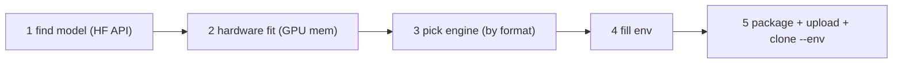

# Deploy an LLM model via the llm-init base apps (env-driven)

> **Prerequisite:** read the parent [`../SKILL.md`](../SKILL.md) first. This reference covers a *special porting pattern*: instead of authoring a chart, you serve any Hugging Face / Ollama model by **cloning one of four ready-made `llm-init` base charts and filling its env** — no image build, no template edits. GPU image + accelerator sizing concepts are in the GPU / models capability and the Accelerator sizing.

The four base apps wrap the `llm-init` sidecar (downloads the model, writes a readiness sentinel, serves an OpenAI/Anthropic-compatible `/v1/*` surface) in front of one inference engine. They are `templateOnly: true` + `allowMultipleInstall: true`, so the model identity, source and tuning are **100% install-time env** on `.Values.olaresEnv` (all four serve on client port 8090):

| base chart | engine | eats |
|---|---|---|
| `llamacppllmbasev3` | llama.cpp | one GGUF file |
| `ollamallmbasev3` | Ollama | Library tag or one GGUF |
| `vllmllmbasev3` | vLLM | full HF safetensors repo |
| `sglangllmbasev3` | SGLang | full HF safetensors repo |

## When to use

- "Run / serve / host `<some HF or Ollama model>` on my Olares", "give me an OpenAI endpoint for `<model>`", "deploy a local LLM / embedding model".
- You do NOT care which engine — let the format + hardware pick it.

> Anything about authoring your own chart -> parent [`../SKILL.md`](../SKILL.md). App lifecycle verbs (clone/install/upgrade) -> [`../../olares-market/SKILL.md`](../../olares-market/SKILL.md).

## 1. Five-step flow



## 2. Step 1 — find the model (Hugging Face)

No `olares-cli` HF command exists; query the Hub API directly (agent-driven):

- Search: `GET https://huggingface.co/api/models?search=<q>&filter=text-generation&sort=downloads`.
- Inspect one repo: `GET https://huggingface.co/api/models/<owner>/<repo>` (`siblings`, `tags`) and `?blobs=true` for file sizes. Read the model card README for params, recommended VRAM, modality.

Record four facts that drive everything below: **params** (e.g. 7B), **format** (GGUF single file vs safetensors repo), **quant** (Q4_K_M / AWQ / GPTQ / FP8 / fp16), **modality** (text / vision / embedding).

## 3. Step 2 — evaluate the hardware

Read the node's real GPU memory before promising a model fits:

```bash
olares-cli dashboard overview gpu -o json     # per-GPU graphics + tasks (memory)
olares-cli cluster node get <node> -o json    # K8s node detail (capacity/allocatable)
```

Estimate the floor and compare to free VRAM (see the Accelerator sizing §C):

```
GPU memory ≈ weights + KV-cache/activations + ~1–2Gi runtime overhead
weights ≈ params × bytes-per-param   (fp16 ≈ 2B, int8/Q8 ≈ 1B, 4-bit ≈ 0.5B)
```

e.g. 7B fp16 ≈ 14Gi weights → ~16Gi floor; 7B Q4 ≈ 3.5Gi → ~6Gi floor. If it won't fit: pick a smaller quant, offload to CPU (llama.cpp `-ngl` partial / omit), or choose a smaller model. The KV-cache term scales with the context window, so size that window against this same budget — see context length sizing.

## 4. Step 3 — pick the engine

GGUF world (Ollama + llama.cpp) and safetensors world (vLLM + SGLang) barely overlap — a model is rarely usable by all four:

| model situation | engine | MODEL_SOURCE shape |
|---|---|---|
| single GGUF (a `*-GGUF` quant repo), low VRAM / CPU ok | `llamacpp` | `hf://owner/repo-GGUF --include file.gguf` |
| want Ollama-native `/api/*`, Library tag or GGUF | `ollama` | `ollama://tag` or `hf://...-GGUF --include ...gguf` |
| full HF safetensors + enough GPU, high throughput / TP | `vllm` | `hf://owner/repo` |
| full HF safetensors + want SGLang runtime | `sglang` | `hf://owner/repo` |
| AWQ / GPTQ / FP8 quant repo (safetensors) | `vllm` or `sglang` | `hf://owner/repo` |

> SGLang does **not** eat GGUF; vLLM eats GGUF only experimentally — don't. safetensors → llama.cpp/Ollama needs offline conversion — don't; find a community `*-GGUF` instead.

## 5. Step 4 — fill the env (the core)

Required-per-model envs and how each engine differs:

| env | meaning | per-engine rule |
|---|---|---|
| `MODEL_SOURCE` | download channel | vLLM/SGLang: `hf://owner/repo` (whole repo, **no `--include`**). llama.cpp: `hf://owner/repo-GGUF --include <file>.gguf` (sharded GGUF: give the `*-00001-of-*` name). Ollama: `ollama://tag` / `hf://...-GGUF --include ...gguf`. Mirror via `HF_ENDPOINT` — `--endpoint` inside the value is blacklisted (fail-fast). |
| `MODEL_NAME` | client `model` alias; also fed to the engine | llama.cpp template runs `llama-server -hf "$MODEL_NAME"` → must be `owner/repo` or `owner/repo:quant` matching `MODEL_SOURCE`. vLLM `--model` / SGLang `--model-path` → `owner/repo` matching `MODEL_SOURCE`. Ollama: free alias (may differ from the upstream tag). |
| `MODEL_MODE` | `chat` \| `embedding` | embedding: llama.cpp auto-adds `--embedding`, SGLang auto-adds `--is-embedding`; **vLLM needs `--task embed` in `ENGINE_ARGS` yourself**. |
| `MODEL_SUPPORTS` | capability seed | Comma-joined coarse GROUP tokens (`vision` / `tools` / `thinking` / `embedding`) that the chart expands into the `supports_*` keys llm-init validates. Required field. **How to choose the tokens, the full expansion table, and the model-vs-deployment caveat are in capability mapping.** |
| `ENGINE_ARGS` | engine-native startup flags (string) | vLLM: `--max-model-len 8192 --gpu-memory-utilization 0.9 --tensor-parallel-size 1 [--quantization awq\|gptq\|fp8]`. SGLang: `--context-length 8192 --mem-fraction-static 0.8 --tp 1`. llama.cpp: `-c 8192 -ngl all -fa on` (drop `-ngl` for CPU). Ollama: `OLLAMA_NUM_CTX=8192 OLLAMA_KEEP_ALIVE=30m` (`KEY=VALUE` list). Unknown tokens pass through, never fail. **Size the context window (`-c` / `--max-model-len` / …) per context length sizing — default to the longest that fits stably.** |
| `<ENGINE>_REQUIRED_GPU_MEMORY` | per-instance GPU quota → `nvidia.com/gpumem` | `LLAMACPP_/OLLAMA_/VLLM_/SGLANG_REQUIRED_GPU_MEMORY`. Accepts `8Gi` / `8192` / `8192Mi` (bare MiB). Set it to the Step-2 floor. Non-editable after install. |
| `HF_ENDPOINT` / `HF_TOKEN` | mirror / private repo | auto-injected from `OLARES_USER_HUGGINGFACE_*`; set a token only for gated/private repos. Read only when an `hf://` source exists. |

`LOG_LEVEL` (debug/info/warn/error) and the `*_CPU_REQUEST` / `*_MEMORY_*` envs default sanely — leave them.

## 6. Step 5 — install it (base apps are not on the Market yet)

The four charts are not published, so deploy them as local uploaded charts. Get them from [terminus-apps](https://github.com/Above-Os/terminus-apps) (`git clone` or `gh`), then:

```bash
olares-cli chart package ./llamacppllmbasev3 -o ./dist     # -> dist/llamacppllmbasev3-<ver>.tgz
olares-cli market upload ./dist/llamacppllmbasev3-<ver>.tgz # lands in source 'upload'
olares-cli market clone llamacppllmbasev3 -s upload \
  --title "Qwen2.5 7B Q4" \
  --env MODEL_SOURCE='hf://bartowski/Qwen2.5-7B-Instruct-GGUF --include Qwen2.5-7B-Instruct-Q4_K_M.gguf' \
  --env MODEL_NAME='bartowski/Qwen2.5-7B-Instruct-GGUF:Q4_K_M' \
  --env MODEL_MODE=chat --env MODEL_SUPPORTS=tools \
  --env ENGINE_ARGS='-c 8192 -ngl all -fa on' \
  --env LLAMACPP_REQUIRED_GPU_MEMORY=6Gi --watch
```

A reasoning + tool-calling model just adds a comma-joined `MODEL_SUPPORTS` (the value carries the comma fine — see capability mapping):

```bash
olares-cli market clone llamacppllmbasev3 -s upload \
  --title "Qwen3.6 27B Q4" \
  --env MODEL_SOURCE='hf://unsloth/Qwen3.6-27B-GGUF --include Qwen3.6-27B-Q4_K_M.gguf' \
  --env MODEL_NAME='unsloth/Qwen3.6-27B-GGUF:Q4_K_M' \
  --env MODEL_MODE=chat --env MODEL_SUPPORTS=tools,thinking \
  --env ENGINE_ARGS='-c 32768 -ngl all -fa on -ctk q8_0 -ctv q8_0' \
  --env LLAMACPP_REQUIRED_GPU_MEMORY=22Gi --watch
```

`-fa on -ctk q8_0 -ctv q8_0` halves KV memory so a longer `-c` fits the 22Gi budget; per context length sizing push `-c` to the largest value that runs stably on the node, then set the card's `context_size` to the same value (manage / switch the model).

> **Entrance timeout for long generations.** The `/v1/*` entrance inherits the platform default **15s** request timeout, so a long completion/stream is cut at the entrance (504 / closed connection) even though the engine is still generating. This is `options.apiTimeout` in the base chart's `OlaresManifest.yaml` — a manifest field, **not** a clone-time env. Set `apiTimeout: 0` (disable) before `chart package`, then upload/clone. See the Manifest refinement areas.

- `templateOnly` apps are created via `clone` (the CLI sends `templateClone:true` on 1.12.6+); `clone` mints a per-instance name and `--watch` tracks it. Single local test instance can also use `market install <base> -s upload --env ...`.
- `lint` the chart first if you edited it: `olares-cli chart lint ./<base>`.
- A long `downloading` state is the multi-GB engine image pull (then the model), not a hang — use the **doctor: app stuck** download procedure to watch `image-service` byte progress and speed.
