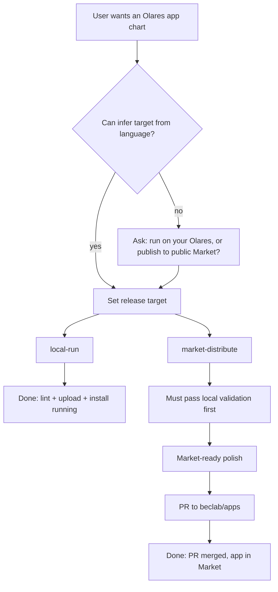

# Release targets: local-run vs market-distribute

> **Prerequisite:** read the parent [`../SKILL.md`](../SKILL.md) first.
> This file is the decision tree and requirements matrix for the **publishing axis**. It gates how strictly packaging (image arch) and refinement (metadata depth) are applied.

## Decision tree



### Infer from user language

| Signals | Target |
|---|---|
| "run on my Olares", "upload and install", "just for myself", "test locally", "custom chart upload" | **local-run** |
| "publish to Market", "submit to beclab/apps", "上架", "list in the app store", "distribute publicly" | **market-distribute** |
| Ambiguous ("make an Olares chart", "package my app") | **Ask** — default assumption is **local-run** unless they mention public Market |

When uncertain, ask one question: *"Do you want to run this only on your own Olares, or publish it to the public Olares Market?"*

## Done definitions

| Target | Done when |
|---|---|
| **local-run** | `chart lint` OK → `.tgz` packaged → `market upload` + `market install -s upload` reaches `running` on the developer's Olares |
| **market-distribute** | local validation (above) passes **plus** market-ready checklist complete **plus** PR merged into `beclab/apps:main` (app indexed in public Market) |

`lint OK` alone is **not** done for either target. For market-distribute, local validation is a **prerequisite**, not the final step.

## Requirements matrix

| Concern | local-run | market-distribute |
|---|---|---|
| **Image arch** | Single-arch matching the target node (`olares-cli cluster node list` → `amd64` or `arm64`) | Multi-arch build (`--platform linux/amd64,linux/arm64`); declare matching `spec.supportArch` |
| **Image registry** | Public Docker Hub or ghcr (same for both) | Same |
| **`metadata.name`** | Valid app id (`^[a-z][a-z0-9]{0,29}$`); matches folder + `Chart.yaml` | Same; folder name also used in PR title |
| **`metadata.title`** | Stub (`title=name`) OK | Human-readable, ≤30 chars |
| **`metadata.description`** | One-line stub OK if non-empty | Accurate summary for Market listing |
| **`metadata.icon`** | Default CDN icon OK | Custom PNG/WEBP 256×256, ≤512 KB |
| **`metadata.categories`** | `Utilities` stub OK (`lint` does not enum-check) | Valid categories for **both** OS 1.11 and 1.12 (GitBot `CheckWithTitle` enforces) |
| **`spec.versionName`** | Should track upstream app version | Same |
| **`spec.developer` / `website` / `sourceCode` / `submitter`** | Optional | Required for a credible Market listing |
| **`spec.fullDescription`** | Optional | Required — longer Market body text |
| **`spec.featuredImage` / `promoteImage`** | Skip | Strongly recommended — see [promote-apps.md](https://docs.olares.com/developer/develop/promote-apps.html) |
| **`spec.locale`** | Skip | Recommended (`en` at minimum) |
| **`spec.supportArch`** | Optional (omit unless using accelerator modes) | Required — must match image platforms (`amd64`, `arm64`, or both) |
| **`spec.accelerator` / GPU resources** | Only if the app needs GPU on **this** node | Fully declared when app uses GPU/NPU; mode → arch cross-check applies at `lint` for schema ≥ 0.12.0 |
| **`--new-schema`** | Optional; use when app needs modern resource envelope | Recommended for new Market apps |
| **Refine §2 Storage** | Required — functional | Same |
| **Refine §3 Middleware** | Required — functional | Same |
| **Refine §4 Entrances & ports** | Required — functional | Same |
| **`owners` file** | Not needed (upload source) | Required in OAC root for `beclab/apps` PR |
| **Validate** | `lint` + upload + install | Same, then PR — [olares-chart-market-submit.md](olares-chart-market-submit.md) |

### What `lint` does NOT check (market-only)

Local `chart lint` runs `CheckConsistency` — structural and cross-field validation. It does **not**:

- Validate `metadata.categories` against the Market enum (GitBot `CheckWithTitle` does this at PR time)
- Require `featuredImage`, `promoteImage`, `fullDescription`, or `developer`
- Require multi-arch images or non-empty `spec.supportArch`

So a chart can pass `lint` with stub metadata and still fail Market submission — or work fine for local-run.

## local-run: minimum viable refine

After `from-compose`, the scaffold **already passes `lint`**. For local-run, focus on **functional** refinement; skip cosmetic metadata unless the user cares.

**Can keep as stub:**

- `metadata.categories: [Utilities]`
- Default icon URL
- Empty / missing `spec.developer`, `spec.fullDescription`, `spec.website`, `spec.sourceCode`
- Single-arch image (matching the node)
- No `spec.supportArch`, no listing images

**Must still refine (same as market):**

1. **Storage** — replace kompose PVCs with userspace volumes; align `permission`
2. **Middleware** — drop bundled db/cache services; wire Olares system middleware
3. **Entrances & ports** — correct host/port/authLevel; headless archetype if no web UI
4. **Image** — every service must reference a pullable, **node-arch-correct** image (not `build:`)

**Optional polish (user preference):**

- Set `metadata.title` and `metadata.description` to something readable
- Set `spec.versionName` to upstream version

**Validate:**

```bash
olares-cli chart lint ./<app>
olares-cli chart package ./<app>
# then Publish-local — olares-chart-publish-verify.md
```

## market-distribute: market-ready checklist

Complete **after** local validation passes. Use this as a pre-PR gate.

- [ ] **Metadata:** `title`, `description`, custom `icon`, dual-version `categories`
- [ ] **Spec marketing:** `developer`, `website`, `sourceCode`, `submitter`, `fullDescription`
- [ ] **Listing assets:** `featuredImage`, `promoteImage[]` (URLs reachable by Market CDN)
- [ ] **Locale:** `spec.locale: [en]` (add more if translated)
- [ ] **Architecture:** multi-arch images pushed; `spec.supportArch` lists every supported arch
- [ ] **Resources:** if GPU/NPU needed, `spec.accelerator[]` complete with quantities; consider `--new-schema`
- [ ] **Versions:** `metadata.version` = `Chart.yaml` `version`; bump together for updates
- [ ] **`owners` file** in chart root with submitter's GitHub username
- [ ] **Folder name** valid for `beclab/apps` (lowercase alphanumeric, no hyphens, ≤30 chars)
- [ ] **Re-lint:** `olares-cli chart lint ./<app>` after all edits
- [ ] **Local validation passed** on a real Olares (upload + install → `running`)

Then proceed to [olares-chart-market-submit.md](olares-chart-market-submit.md).

## Upgrading local-run → market-distribute

Common path: get the app running locally first, then polish for public listing.

1. Confirm local validation (V steps) already passed
2. Work through the market-ready checklist above
3. Rebuild images multi-arch if currently single-arch
4. Add `spec.supportArch` matching image platforms
5. Re-run `lint` → `package`
6. Open PR to `beclab/apps` — do **not** skip re-validation; Market ingest may reject charts that passed local upload but lack valid categories

Functional refine (storage / middleware / entrances) should already be done from the local-run phase — usually no changes needed there.
