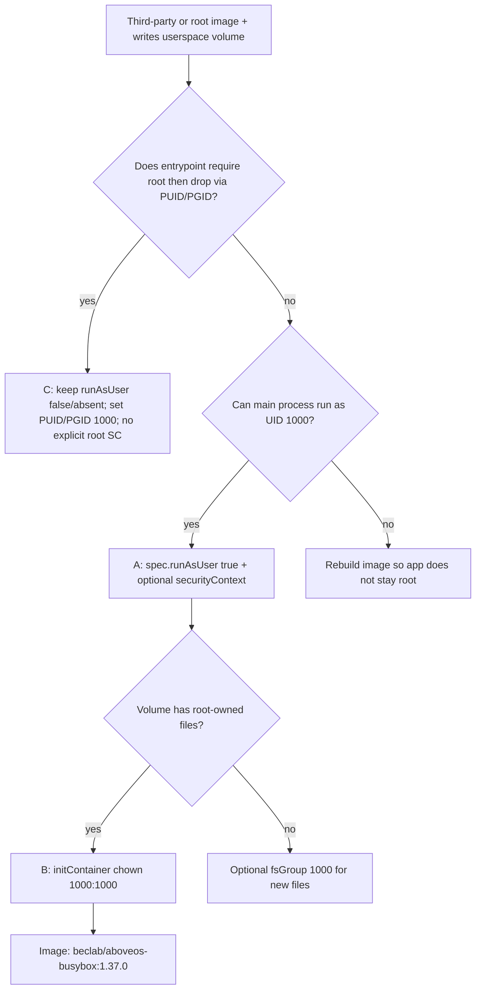

# Run identity: UID/GID 1000 (packaging + deployment)

> **Prerequisite:** read the parent [`../SKILL.md`](../SKILL.md) first (which loads the platform **Run identity** model — uid-1000 ownership of userspace volumes + the OPA root-deny rule).
> This doc covers the chart-side delta: how to align a self-built or third-party image with that convention — in the Dockerfile, in `OlaresManifest.yaml`, and in deployment templates.

## Why 1000 matters (chart-side)

- Userspace paths injected via `.Values.userspace.*` expect the app process to run as **1000**.
- Setting `spec.runAsUser: true` in `OlaresManifest.yaml` tells Olares to inject `pod.spec.securityContext.runAsUser: 1000` at Pod creation (app-service mutating webhook).
- If the image runs as root or another uid, or if it creates directories as root before dropping privileges, writes to userspace mounts fail with **Permission denied** or data never persists.

## Self-built images (packaging axis)

When authoring a Dockerfile (the Image capability), prefer uid/gid 1000 end-to-end:

```dockerfile
RUN addgroup -g 1000 app && adduser -u 1000 -G app -D app
RUN chown -R 1000:1000 /var/lib/myapp
USER 1000
```

Verify before pushing:

```bash
docker inspect <registry-ref>:<tag> --format '{{.Config.User}}'
docker run --rm --entrypoint id <registry-ref>:<tag>    # expect uid=1000
```

## Third-party images — inspect before editing the chart

```bash
docker inspect <third-party-image> --format '{{.Config.User}}'
docker run --rm --entrypoint id <third-party-image>
```

The inspect result is the image's declared `USER`; empty means the runtime starts as root. The second command bypasses the image entrypoint and asks the image directly for its effective identity. Do **not** use `docker run <image> id` for this check: Docker still runs the image's entrypoint first, so a root-init wrapper may consume or transform `id`, perform initialization, or fail before the probe runs. If the image does not contain `id`, inspect its Dockerfile/entrypoint instead.

| Image `USER` | Typical handling |
|---|---|
| `1000` (or numeric 1000) | Set `spec.runAsUser: true`; usually sufficient |
| Non-root but **not** 1000 (e.g. `nginx` / uid 101) | Try `securityContext.runAsUser: 1000`; if the app breaks, use initContainer `chown` (below) |
| Root, empty, or `0`; entrypoint supports `PUID`/`PGID` and drops privileges | Leave `spec.runAsUser` false/absent, omit an explicit root `securityContext`, set `PUID=1000` / `PGID=1000`, and verify the final app process runs as 1000 |
| Root, empty, or `0`; process stays root | Rebuild/fork the image to run non-root; current OPA does not detect an implicit image user, but a root application process violates the platform run-identity convention |

## Chart-side fixes (decision tree)



### A — `spec.runAsUser` + optional `securityContext` (preferred)

```yaml
# OlaresManifest.yaml
spec:
  runAsUser: true
```

Optionally reinforce in the deployment template (Kubernetes overrides the Dockerfile `USER`):

```yaml
spec:
  template:
    spec:
      securityContext:
        runAsUser: 1000
        runAsGroup: 1000
        fsGroup: 1000    # new files on mounted volumes get gid 1000
```

`fsGroup` helps for **new** mounts; it does not always fix directories already created as root — use B when that happens.

### B — initContainer `chown` (third-party root + wrong volume ownership)

Use Olares' trusted busybox image (same as platform init containers). **Do not** pair a root initContainer on a non-trusted image with a third-party main image — OPA denies that Pod.

```yaml
spec:
  template:
    spec:
      initContainers:
      - name: fix-permissions
        image: beclab/aboveos-busybox:1.37.0
        command: ["sh", "-c", "chown -R 1000:1000 /data"]
        securityContext:
          runAsUser: 0
        volumeMounts:
        - name: app-data
          mountPath: /data
      containers:
      - name: app
        image: third-party/app:1.2.3
        volumeMounts:
        - name: app-data
          mountPath: /data
```

Also set `spec.runAsUser: true` in `OlaresManifest.yaml`. Run `chown` for **each** userspace mount the app writes to (combine paths in one command if needed).

> **`chown` of pre-owned subdirs can fail on upgrade.** A root initContainer can `chown` a root-owned directory, but has been observed to fail with `Operation not permitted` when `chown`-ing subdirectories the main container previously created as uid 1000 — as if `CAP_CHOWN` is unavailable. This means:
>
> - **Fresh install:** the `hostPath` root dir is created empty by `DirectoryOrCreate` (owned by kubelet/root). The busybox initContainer runs as root and can `chown` it because root owns the directory. Works.
> - **Upgrade:** if the main container previously created subdirectories as uid 1000, the busybox initContainer **fails to** `chown` those uid-1000-owned subdirs — `Operation not permitted` — crash-loops, and the pod stays in `Initializing` indefinitely.
>
> A plain root container normally keeps `CAP_CHOWN`, so the cap-dropping layer is environment-specific (likely enforced below the cluster at the node / container-runtime level). It is **not** the Olares OPA policy, which only denies untrusted-image + root/`privileged` pods (see [OPA and lint boundaries](#opa-and-lint-boundaries) below) and mutates nothing about capabilities. Treat the rule below as the safe pattern regardless of the exact mechanism.
>
> **Practical rule:** For `appData` / `appCache` with `permission.appData: true`, Olares already creates the root dir with uid 1000 ownership. If the app creates its own subdirectories at runtime (e.g. `os.makedirs("/data/models")` in Python), the whole tree stays uid 1000 and **no initContainer is needed**. Only reach for initContainer `chown` when the upstream image's entrypoint writes root-owned files before the process drops to uid 1000.

### C — root-init entrypoint that drops to `PUID`/`PGID`

Some third-party images deliberately start as root, prepare files or networking, then use `PUID`/`PGID` to launch the application as a non-root user. For these images, forcing Pod-level uid 1000 prevents the entrypoint from completing its initialization.

Use this pattern:

```yaml
# OlaresManifest.yaml
spec:
  runAsUser: false
```

```yaml
# Deployment env; names vary by image
- name: PUID
  value: "1000"
- name: PGID
  value: "1000"
```

Omitting `spec.runAsUser` is equivalent for webhook injection. Do not set Pod/container `securityContext.runAsUser: 0`; leave the security context absent so the image entrypoint controls its startup identity. Verify from startup logs or a running container that the final application process drops to uid 1000. If it remains root, rebuild or fork the image instead of treating this exception as permission to run the app as root.

## OPA and lint boundaries

| Layer | Rule |
|---|---|
| **OPA** (runtime) | For a non-trusted image, deny an explicitly root-equivalent Pod/container `securityContext`: `runAsUser: 0`, `runAsNonRoot: false`, or `privileged: true`. It does not inspect the image's declared `USER` or runtime privilege drop |
| **initContainer fix** | Use `beclab/aboveos-busybox:1.37.0` — `beclab/` is trusted; init may run as root |
| **`chart lint` security-context check** | Mirrors the explicit-securityContext rule for non-`beclab/` images and is on by default in OAC; `--with-security-context` is retained as an explicit compatibility flag |

## Symptoms → fix

| Symptom | Likely cause | Fix |
|---|---|---|
| CrashLoop, `Permission denied` writing data dir | uid ≠ 1000 or dir owned by root | A or B above |
| Install OK but config/data not persisted | Writes go to container-local path, or EACCES silently ignored | Check mount paths + run identity |
| Admission denied: untrusted image + root | Chart explicitly sets a root-equivalent Pod/container securityContext | Remove the explicit root context; use A, B, or the verified PUID/PGID pattern C |
| OPA OK but app still can't write | Final process uid is not 1000, or volume pre-dates chown | Use A + B for ordinary images; for pattern C verify `PUID`/`PGID` and the post-init process identity |

After any template change, re-run `olares-cli chart lint ./<app>` (the Validate-local (lint) step).
