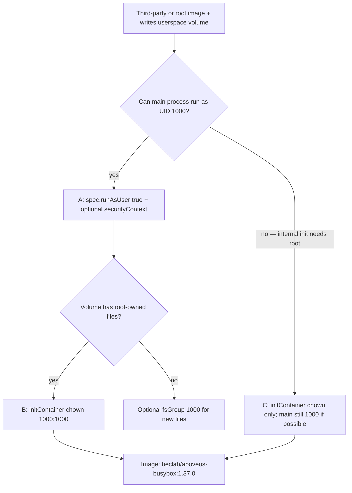

# Run identity: UID/GID 1000 (packaging + deployment)

> **Prerequisite:** read the parent [`../SKILL.md`](../SKILL.md) first (which loads the platform **Run identity** model — uid-1000 ownership of userspace volumes + the OPA root-deny rule).
> This doc covers the chart-side delta: how to align a self-built or third-party image with that convention — in the Dockerfile, in `OlaresManifest.yaml`, and in deployment templates.

## Why 1000 matters (chart-side)

- Userspace paths injected via `.Values.userspace.*` expect the app process to run as **1000**.
- Setting `spec.runAsUser: true` in `OlaresManifest.yaml` tells Olares to inject `pod.spec.securityContext.runAsUser: 1000` at Pod creation (app-service mutating webhook).
- If the image runs as root or another uid, or if it creates directories as root before dropping privileges, writes to userspace mounts fail with **Permission denied** or data never persists.

## Self-built images (packaging axis)

When authoring a Dockerfile ([olares-chart-image.md](olares-chart-image.md)), prefer uid/gid 1000 end-to-end:

```dockerfile
RUN addgroup -g 1000 app && adduser -u 1000 -G app -D app
RUN chown -R 1000:1000 /var/lib/myapp
USER 1000
```

Verify before pushing:

```bash
docker inspect <registry-ref>:<tag> --format '{{.Config.User}}'
docker run --rm <registry-ref>:<tag> id    # expect uid=1000
```

## Third-party images — inspect before editing the chart

```bash
docker inspect <third-party-image> --format '{{.Config.User}}'
```

| Image `USER` | Typical handling |
|---|---|
| `1000` (or numeric 1000) | Set `spec.runAsUser: true`; usually sufficient |
| Non-root but **not** 1000 (e.g. `nginx` / uid 101) | Try `securityContext.runAsUser: 1000`; if the app breaks, use initContainer `chown` (below) |
| Root, empty, or `0` | Main container **must not** stay root on non-trusted images — OPA rejects third-party + root. Use chart-side fixes below |

## Chart-side fixes (decision tree)



### A — `spec.runAsUser` + optional `securityContext` (preferred)

```yaml
# OlaresManifest.yaml
spec:
  runAsUser: true
```

Optionally reinforce in the deployment template (Kubernetes overrides the Dockerfile `USER`):

```yaml
spec:
  template:
    spec:
      securityContext:
        runAsUser: 1000
        runAsGroup: 1000
        fsGroup: 1000    # new files on mounted volumes get gid 1000
```

`fsGroup` helps for **new** mounts; it does not always fix directories already created as root — use B when that happens.

### B — initContainer `chown` (third-party root + wrong volume ownership)

Use Olares' trusted busybox image (same as platform init containers). **Do not** pair a root initContainer on a non-trusted image with a third-party main image — OPA denies that Pod.

```yaml
spec:
  template:
    spec:
      initContainers:
      - name: fix-permissions
        image: beclab/aboveos-busybox:1.37.0
        command: ["sh", "-c", "chown -R 1000:1000 /data"]
        securityContext:
          runAsUser: 0
        volumeMounts:
        - name: app-data
          mountPath: /data
      containers:
      - name: app
        image: third-party/app:1.2.3
        volumeMounts:
        - name: app-data
          mountPath: /data
```

Also set `spec.runAsUser: true` in `OlaresManifest.yaml`. Run `chown` for **each** userspace mount the app writes to (combine paths in one command if needed).

> **`chown` of pre-owned subdirs can fail on upgrade.** A root initContainer can `chown` a root-owned directory, but has been observed to fail with `Operation not permitted` when `chown`-ing subdirectories the main container previously created as uid 1000 — as if `CAP_CHOWN` is unavailable. This means:
>
> - **Fresh install:** the `hostPath` root dir is created empty by `DirectoryOrCreate` (owned by kubelet/root). The busybox initContainer runs as root and can `chown` it because root owns the directory. Works.
> - **Upgrade:** if the main container previously created subdirectories as uid 1000, the busybox initContainer **fails to** `chown` those uid-1000-owned subdirs — `Operation not permitted` — crash-loops, and the pod stays in `Initializing` indefinitely.
>
> A plain root container normally keeps `CAP_CHOWN`, so the cap-dropping layer is environment-specific (likely enforced below the cluster at the node / container-runtime level). It is **not** the Olares OPA policy, which only denies untrusted-image + root/`privileged` pods (see [OPA and lint boundaries](#opa-and-lint-boundaries) below) and mutates nothing about capabilities. Treat the rule below as the safe pattern regardless of the exact mechanism.
>
> **Practical rule:** For `appData` / `appCache` with `permission.appData: true`, Olares already creates the root dir with uid 1000 ownership. If the app creates its own subdirectories at runtime (e.g. `os.makedirs("/data/models")` in Python), the whole tree stays uid 1000 and **no initContainer is needed**. Only reach for initContainer `chown` when the upstream image's entrypoint writes root-owned files before the process drops to uid 1000.

### C — image must start as root internally

If the upstream entrypoint **requires** root for its own initialization, you cannot set `runAsUser: 1000` on the main container without breaking it.

- Use B's initContainer to fix volume ownership **before** the main container starts.
- If the main container still runs as root with a **non-trusted** image, OPA **will reject** the Pod — loop back to the Image capability ([olares-chart-image.md](olares-chart-image.md)) and rebuild or fork the image so the main process can run non-root.

## OPA and lint boundaries

| Layer | Rule |
|---|---|
| **OPA** (runtime) | Non-trusted image + root / `privileged` / `runAsNonRoot: false` → admission denied |
| **initContainer fix** | Use `beclab/aboveos-busybox:1.37.0` — `beclab/` is trusted; init may run as root |
| **`chart lint --with-security-context`** | Non-`beclab/` main image must not use root-equivalent securityContext (off by default) |

## Symptoms → fix

| Symptom | Likely cause | Fix |
|---|---|---|
| CrashLoop, `Permission denied` writing data dir | uid ≠ 1000 or dir owned by root | A or B above |
| CrashLoop / `Permission denied` on an **appended subdir or `subPath`** under a userspace mount | only the granted dir (`.../Data/<appName>`) is chowned to 1000; the nested subdir was created root-owned (`DirectoryOrCreate`/kubelet) | Mount the bare `.Values.userspace.*` value (it already ends in `/<appName>`), or `chown` the subdir via initContainer B; avoid `subPath` for userspace mounts (see [olares-chart-manifest.md](olares-chart-manifest.md) §2) |
| Install OK but config/data not persisted | Writes go to container-local path, or EACCES silently ignored | Check mount paths + run identity |
| Admission denied: untrusted image + root | Third-party main container runs as root | A (force 1000) or B; never root main on third-party |
| OPA OK but app still can't write | `spec.runAsUser` not set, or volume pre-dates chown | `spec.runAsUser: true` + B |

After any template change, re-run `olares-cli chart lint ./<app>` ([olares-chart-lint.md](olares-chart-lint.md)).
