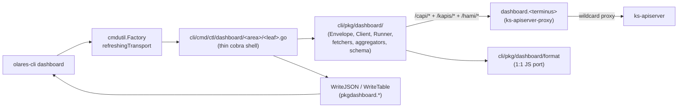

# dashboard (overview + applications, AI-agent first)

**CRITICAL — before doing ANYTHING in this subtree, MUST Read [`../olares-shared/SKILL.md`](../olares-shared/SKILL.md) for profile selection, login, factory-injected `*http.Client`, and HTTP 401/403 recovery rules. Every dashboard verb depends on that foundation.**

**This file is the source of truth for the dashboard subtree.** Any code generation, refactor or fix touching `cli/cmd/ctl/dashboard/**`, `cli/pkg/dashboard/**`, `cli/pkg/dashboard/format/**`, `cli/pkg/olares/id.go::DashboardURL`, or `cli/pkg/credential/{types,default_provider}.go::DashboardURL` MUST first Read this file end-to-end and respect the **Iteration red-lines** section. Do not "modernize", "simplify" or "consolidate" anything listed under [Frozen modules](#frozen-modules) without an explicit user-approved plan that supersedes this skill.

## Scope (frozen)

The dashboard CLI mirrors **only** the SPA routes that are still wired in [`packages/app/src/apps/dashboard/router/routes.ts`](dashboard/packages/app/src/apps/dashboard/router/routes.ts):

- `Overview2/IndexPage.vue` (overview tree) + the per-detail-page subtrees:
  `Overview2/CPU`, `Memory`, `Disk`, `Pods`, `Network`, `Fan`, `GPU`.
- `Applications2/IndexPage.vue` (applications tree).

Everything else in the SPA (legacy `Overview/`, audit, settings, …) is **out of scope**. Do not add commands for deprecated routes; reject any request that asks for them with a pointer to the route file.

## Architecture

The dashboard CLI is a **two-layer split**: a thin cobra shell under
`cli/cmd/ctl/dashboard/` (one directory per command-tree node) and the
heavy pkg core under `cli/pkg/dashboard/` (envelope shapes, fetchers,
aggregators, runner, schema, format pkg). The cmd subpackages are
mostly cobra wiring; every fetch / merge / aggregate / format call goes
through `pkgdashboard.X`.



cmd area ↔ pkg domain mapping — every cmd subpackage is a thin shell
calling into one or more pkg domain files:

| cmd area | pkg domain files (heavy logic) |
|---|---|
| `cmd/ctl/dashboard/root.go` | `pkg/dashboard/{flags,output,client,runner,emit}.go` |
| `cmd/ctl/dashboard/overview/{physical,user,ranking,cpu,memory,pods,network,nodes}.go` | `pkg/dashboard/{monitoring,workloads,ranking,system,gates,gpu,numbers,emit}.go` |
| `cmd/ctl/dashboard/overview/disk/{main,partitions}.go` | `pkg/dashboard/{monitoring,lsblk,format/...}.go` |
| `cmd/ctl/dashboard/overview/fan/{live,curve}.go` | `pkg/dashboard/{system,fan_curve}.go` |
| `cmd/ctl/dashboard/overview/gpu/{list,tasks,get,task,detail,task_detail,specs}.go` | `pkg/dashboard/{gpu,gpu_format,gpu_query,gates,client}.go` |
| `cmd/ctl/dashboard/applications/root.go` | `pkg/dashboard/{ranking,workloads,format/...}.go` |
| `cmd/ctl/dashboard/schema/root.go` | `pkg/dashboard/schema.go` (loader + go:embed bundle) |

- HTTP base = `ResolvedProfile.DashboardURL = https://dashboard.<localPrefix><terminusName>` (derived in [`cli/pkg/olares/id.go`](cli/pkg/olares/id.go) `DashboardURL`).
- All requests go through factory's `refreshingTransport` — header injection + 401 retry happen for free; **dashboard code MUST NOT touch `X-Authorization`** or instantiate its own `http.Client`.
- Per-command leaf / aggregate decision is hard-coded; do not flip them.
- The shared `*pkgdashboard.CommonFlags` is bound once in cmd-root (`bindPersistentFlags(&common, cmd)`), then passed by pointer to every area factory (`overview.NewOverviewCommand(f, &common)` etc.). Each area subpackage stores it in a package-level `var common *pkgdashboard.CommonFlags` so leaf RunE bodies keep `common.Output / common.Validate() / common.Timezone` selectors.

## File layout (frozen — directory tree mirrors command tree)

The cmd shell directory tree is **identical** to the command tree.
Every parent command has a directory (with `root.go` + `common.go`),
every leaf has its own `.go` file. No more monolithic files like the
old `overview.go` / `applications.go`.

```
cli/cmd/ctl/dashboard/                               # cmd shell — thin cobra wiring
├── root.go             # NewDashboardCommand(f) — top-level assembler; binds persistent flags into &common; AddCommand overview / applications / schema
├── options.go          # bindPersistentFlags(&common, cmd) — sole cobra↔CommonFlags meeting point
├── dashboard_test.go   # cmd-root tests only: TestUnknownSubcommandRunE_*, TestAllLeafCommandsSilenced
│                       # (factory→*pkgdashboard.Client adapter lives area-locally in each <area>/common.go,
│                       #  not at cmd-root — the cmd-root client.go was retired in P3b cleanup.)
│
├── overview/
│   ├── root.go         # NewOverviewCommand(f, cf) — default = sections envelope (physical+user+ranking) + AddCommand 7 leaves + 3 subgroups
│   ├── common.go       # var common *pkgdashboard.CommonFlags + area-local prepareClient + small trampolines aliasing pkg names
│   ├── physical.go     # newOverviewPhysicalCommand — `overview physical`
│   ├── user.go         # `overview user [<username>]` (admin gate via pkgdashboard.RequireAdmin)
│   ├── ranking.go      # `overview ranking` — calls pkgdashboard.BuildRankingEnvelope
│   ├── cpu.go          # `overview cpu` — per-node CPU table
│   ├── pods.go         # `overview pods` — per-node running-pod count
│   ├── memory.go       # `overview memory [--mode physical|swap]`
│   ├── network.go      # `overview network` (capi /system/ifs, NOT monitoring)
│   ├── nodes.go        # shared per-node metric scaffolding for cpu / memory / pods
│   ├── disk/
│   │   ├── root.go         # NewDiskCommand(f, cf) — default = sections (main + per-disk partitions)
│   │   ├── common.go       # area-local var common + trampolines
│   │   ├── main.go         # `overview disk main` — per-physical-disk table
│   │   └── partitions.go   # `overview disk partitions <device>`
│   ├── fan/
│   │   ├── root.go         # NewFanCommand(f, cf) — default = sections (live + curve)
│   │   ├── common.go
│   │   ├── live.go         # `overview fan live` — capi /system/fan + graphics list
│   │   └── curve.go        # `overview fan curve` — 10 hardcoded rows from pkgdashboard.FanCurveTable
│   └── gpu/
│       ├── root.go         # NewGPUCommand(f, cf) — default = list
│       ├── common.go       # area-local var common + HAMI fetch trampolines + advisory wrappers
│       ├── specs.go        # gpuDetailGaugeSpecs / gpuTaskDetailGaugeSpecs (shared by detail + task_detail)
│       ├── list.go         # `overview gpu list` — Graphics management tab; 3-state aware
│       ├── tasks.go        # `overview gpu tasks` — Task management tab; 3-state aware
│       ├── get.go          # `overview gpu get <uuid>`
│       ├── task.go         # `overview gpu task <name> <pod-uid>`
│       ├── detail.go       # `overview gpu detail <uuid>` — full detail panel (4 instant + 6 range queries)
│       ├── task_detail.go  # `overview gpu task-detail <name> <pod-uid> [--sharemode]`
│       └── detail_test.go  # TestBuildGPUDetailFullEnvelope_PartialFailure / TestBuildGPUTaskDetailFullEnvelope_TimeSlicingSkipsAllocation
│
├── applications/
│   ├── root.go         # NewApplicationsCommand(f, cf) — single leaf, default = workload-grain table; alias `apps`; calls pkgdashboard.BuildRankingEnvelope
│   └── common.go
│
└── schema/
    └── root.go         # NewSchemaCommand(cf) — schema introspection (loader is pkgdashboard.LoadSchemaIndex)

cli/pkg/dashboard/                                    # pkg core — heavy logic + types + fetchers
├── flags.go            # CommonFlags struct (raw fields exported so cobra binding works) + Validate + ResolveWindow
├── output.go           # Envelope / Item / Meta / TableColumn + ParseOutputFormat + DisplayString
├── emit.go             # WriteJSON (NDJSON-aware) + WriteTable + EmitDefault (cmd-side default table layout helper)
├── client.go           # Client wrapper, DoJSON/DoEmpty/DoRaw, EnsureUser sync.Once, HTTPError
├── http.go             # ClassifyTransportErr + IsHTTPError + low-level transport helpers
├── runner.go           # Runner{Iter, RunOnce} — `--watch` interval/iter/timeout/SIGINT/3-fail/NDJSON rules
├── system.go           # EnsureSystemStatus / IsOlaresOne + capi /system/* shapes
├── gates.go            # GateOlaresOne (hard) + GPUAdvisory (soft) + HasCUDANode + VgpuUnavailableFromError + ResetCUDANodeCache
├── monitoring.go       # FetchClusterMetrics / FetchNodeMetrics / FetchUserMetric + MonitoringQuery + MonitoringWindow defaults
├── workloads.go        # FetchWorkloadsMetrics dual-fetch + MergeWorkloadMetrics + WorkloadAggregate / WorkloadApp / WorkloadRequest
├── apps.go             # FetchAppsList + RawAppListItem (with empty-entrances filter mirroring SPA appsWithNamespace)
├── ranking.go          # BuildRankingEnvelope — the ONLY legitimate cross-area share (consumed by overview/ranking + applications/root)
├── lsblk.go            # HasPknameLabels / CollectSubtreeByPkname / ResolveParent / BuildLsblkTreePrefix / FlattenLsblkHierarchy / LsblkRow / LsblkFlatRow
├── gpu.go              # FetchGraphicsList / FetchTaskList / FetchGraphicsDetail / FetchTaskDetail + ExtractHAMIMessage + GraphicsListBody
├── gpu_format.go       # PercentString / PercentDirect / GPUModeLabel / GPUHealthLabel / GPUVRAMHuman / GPUTrendStep
├── gpu_query.go        # FetchInstantVector / FetchRangeVector + InstantVectorSample / RangeVectorSeries
├── numbers.go          # FormatFloat / SafeRatio / FormatRateAny / ParseRFCTimestamp / SampleFloat / LastSampleFromRow / FirstAnyInArray / ToFloat
├── fan_curve.go        # FanCurveTable + FanSpeedMaxCPU / FanSpeedMaxGPU constants (1:1 with SPA Fan/config.ts)
├── schema.go           # Kind* constants + AllKinds() + LoadSchemaIndex + go:embed schemas/*.json
├── dashboard_test.go   # CommonFlags / Client / Runner / Fetch* / Merge* / lsblk / gates / GPU helpers — pure data tests
├── helpers_test.go     # in-package test trampolines (var common *CommonFlags + lowercase shape aliases)
├── format/
│   ├── format.go       # 1:1 JS port; UnitTypes table; GetValueByUnit/Suitable*/WorthValue/...
│   ├── location.go     # *Location wrapper (timezone abstraction)
│   ├── format_test.go  # unit + TestFormat_GoldenOracle (skips if golden.json absent)
│   └── testdata/golden-gen.js   # node script that runs @bytetrade/core to emit golden.json
└── schemas/*.json      # JSON Schema draft-07, one per Kind, embedded via //go:embed
```

## JSON envelope (frozen shapes)

Every dashboard command emits exactly one of two shapes; the choice is fixed per command and MUST NOT be changed.

### Shape A — leaf

Used by every command except parent commands with a sections envelope (see Shape B).

```json
{
  "kind":  "dashboard.<area>.<verb>",
  "meta":  { "fetched_at": "...", "iteration": 0, "recommended_poll_seconds": 60, "empty": false, "empty_reason": "", "error": "", "http_status": 200 },
  "items": [ { "raw": { /* upstream-shape, units in source unit */ }, "display": { /* table-friendly strings */ } } ]
}
```

- `raw` is the canonical machine-friendly shape: numbers as numbers, timestamps as Unix seconds, temperatures as raw Celsius (NOT converted by `--temp-unit`). Agents pin on `raw`.
- `display` is human-presentation only; values are formatted via the `format` pkg with current `--temp-unit` / `--timezone`. **Agents MUST NOT pin on `display`** — it can change with locale / format-pkg fixes.
- `meta.recommended_poll_seconds` — the page-level polling cadence the SPA uses; agents driving `--watch` SHOULD respect it.
- `meta.iteration` — present in every `--watch` payload, 1-based.
- `meta.empty` / `meta.empty_reason` — three-state empty data; see [Three-state empty data](#three-state-empty-data).
- `meta.error` — only set on a failed `--watch` iteration or per-section failure inside Shape B.

### Shape B — sections envelope

Used by **parent commands that aggregate multiple sub-views**:

| Parent command           | Sections                            | Section kinds |
|---|---|---|
| `dashboard overview`     | `physical` / `user` / `ranking`     | `dashboard.overview.physical` / `.user` / `.ranking` |
| `dashboard overview disk`| `main` / `partitions`               | `dashboard.overview.disk.main` / `.partitions` (the latter is itself a sections envelope, keyed by device) |
| `dashboard overview fan` | `live` / `curve`                    | `dashboard.overview.fan.live` / `.curve` |
| `dashboard schema`       | n/a — emits Shape A index           | `dashboard.schema.index` |

```json
{
  "kind": "dashboard.overview",
  "meta": { ... },
  "sections": {
    "physical": { "kind": "dashboard.overview.physical", "meta": {...}, "items": [...] },
    "user":     { "kind": "dashboard.overview.user",     "meta": {...}, "items": [...] },
    "ranking":  { "kind": "dashboard.overview.ranking",  "meta": {...}, "items": [...] }
  }
}
```

- Sections are fetched concurrently; a single failed section degrades to `meta.error="..."` on that section, the others still return.
- The section names (the Section column above) are part of the contract — do not rename or drop.

### Kind constants

Declared in [`cli/pkg/dashboard/schema.go`](cli/pkg/dashboard/schema.go). **`AllKinds()` MUST stay 1:1 with the actual command surface.** Adding a command means:

1. Add a `KindXxx` constant in `pkg/dashboard/schema.go`.
2. Append it to `AllKinds()` (same file).
3. Add `cli/pkg/dashboard/schemas/<kind-without-namespace>.json`.
4. Register in `LoadSchemaIndex()` (same file).
5. Bump golden tests if the new shape appears in fixtures.
6. Add a leaf file in the matching `cmd/ctl/dashboard/<area>/` subdirectory and AddCommand it from the area's `root.go`.

Do NOT rename existing Kind values — agents rely on string equality.

## Command tree

```
dashboard
├── (default action)                     # Shape B: sections envelope (physical+user+ranking)
├── schema [<command-path>]              # introspection; no-arg = Shape A index, with arg = draft-07 doc
├── overview
│   ├── (default action)                 # Shape B: sections envelope (physical+user+ranking)
│   ├── physical                         # Shape A; 9 cluster metric rows
│   ├── user [<username>]                # Shape A; user CPU/memory quota; admin only for non-self
│   ├── ranking                          # Shape A; workload-grain ranking (fetchWorkloadsMetrics)
│   ├── cpu                              # Shape A; per-node table
│   ├── memory [--mode physical|swap]    # Shape A; per-node table
│   ├── disk                             # Shape B (default action): main + per-disk partitions
│   │   ├── main                         # Shape A; per-physical-disk table
│   │   └── partitions <device>          # Shape A; per-partition table for one device
│   ├── pods                             # Shape A; per-node running-pod count
│   ├── network                          # Shape A; per-iface table from capi /system/ifs (NOT monitoring)
│   ├── fan                              # Shape B (default action): live + curve
│   │   ├── live                         # Shape A; 1 row from capi /system/fan + graphics list
│   │   └── curve                        # Shape A; 10 hardcoded rows from fanCurveTable
│   └── gpu                              # default action = list (Shape A)
│       ├── list                         # Shape A; Graphics management tab; 3-state aware
│       ├── tasks                        # Shape A; Task management tab; 3-state aware
│       ├── get <uuid>                   # Shape A; per-GPU detail
│       └── task <name> <pod-uid>        # Shape A; per-task detail
└── applications                         # Shape A; workload-grain table (alias `apps`)
```

Notes on parent-command default actions:

- `dashboard overview` / `dashboard overview disk` / `dashboard overview fan` ALL emit Shape B (sections envelope) when invoked with no subcommand. This is the unified default style for parent commands that logically aggregate multiple views.
- `dashboard overview gpu` is the only exception: its default is `list` (single section view), kept for ergonomics ("list me the GPUs" is the natural first action).
- `dashboard overview memory` and `dashboard overview cpu` are NOT parent commands — they are leaf commands with their own flags (`--mode physical|swap` for memory). No sections envelope here.
- `dashboard applications` is a single-leaf command (no subverbs). Its default action is the workload-grain table — equivalent to the now-deleted `applications list`. The aliased `apps` short form is preserved. The previous `applications pods <namespace>` subcommand was removed in favor of `kubectl get pods -n <ns>` since it duplicated kubectl semantics 1:1.

## Frozen modules

The following are **load-bearing**. Touching them requires a separate user-confirmed plan; otherwise reject the request with this list.

| Frozen module | Why it's frozen | Where |
|---|---|---|
| Two-layer split: `cli/cmd/ctl/dashboard/` thin shell + `cli/pkg/dashboard/` heavy core | Architectural decision (P1–P3); leaves are reusable from tests + future tooling without dragging cobra in | [`cli/cmd/ctl/dashboard/`](cli/cmd/ctl/dashboard/) + [`cli/pkg/dashboard/`](cli/pkg/dashboard/) |
| Directory tree mirrors command tree | One file per leaf, `root.go`+`common.go` per parent — prevents drift between `dashboard --help` and `ls` | every cmd subdirectory under [`cli/cmd/ctl/dashboard/`](cli/cmd/ctl/dashboard/) |
| Kind constants + `AllKinds()` | Public agent contract | [`pkg/dashboard/schema.go`](cli/pkg/dashboard/schema.go) |
| Envelope shapes A / B | Public agent contract | [`pkg/dashboard/output.go`](cli/pkg/dashboard/output.go) |
| `format` pkg signatures + JS-parity behaviour | Backed by `golden.json` oracle; even rounding quirks are intentional | [`pkg/dashboard/format/format.go`](cli/pkg/dashboard/format/format.go) |
| `FetchClusterMetrics` / `FetchNodeMetrics` / `FetchUserMetric` shared fetchers | Single upstream call powers multiple commands; must not fork | [`pkg/dashboard/monitoring.go`](cli/pkg/dashboard/monitoring.go) |
| `FetchWorkloadsMetrics` dual-fetch + merge + `BuildRankingEnvelope` | Single pkg function powers `overview ranking` + `applications` first-row parity; keep the dual-fetch shape | [`pkg/dashboard/workloads.go`](cli/pkg/dashboard/workloads.go), [`pkg/dashboard/ranking.go`](cli/pkg/dashboard/ranking.go) |
| `FetchSystemIFS` / `FetchSystemFan` / graphics+task helpers | Wire shape pinned in tests; capi vs hami URL prefixes are part of the contract | [`pkg/dashboard/system.go`](cli/pkg/dashboard/system.go), [`pkg/dashboard/gpu.go`](cli/pkg/dashboard/gpu.go) |
| `FanCurveTable` + `FanSpeedMaxCPU` + `FanSpeedMaxGPU` constants | 1:1 with SPA `Fan/config.ts.tableData`; CLI ships them as Go constants because the SPA does too | [`pkg/dashboard/fan_curve.go`](cli/pkg/dashboard/fan_curve.go) |
| Parent-command default = sections envelope (overview, overview disk, overview fan) | Plan decision; consumers branch on `kind == "dashboard.overview.*"` to know whether to expect `sections` or `items` | [`overview/root.go`](cli/cmd/ctl/dashboard/overview/root.go), [`overview/disk/root.go`](cli/cmd/ctl/dashboard/overview/disk/root.go), [`overview/fan/root.go`](cli/cmd/ctl/dashboard/overview/fan/root.go) |
| `Runner` + `--watch` semantics (interval / iterations / timeout / 3-consecutive-failure exit / NDJSON per-iteration / SIGINT graceful / `ErrTokenInvalidated` short-circuit) | Plan decision; agents script around it | [`pkg/dashboard/runner.go`](cli/pkg/dashboard/runner.go) |
| `--since` vs `--start --end` mutual-exclusion + sliding-window rules | Plan decision (`since_slides_abs_repeats`) | [`pkg/dashboard/flags.go`](cli/pkg/dashboard/flags.go) `Validate` / `ResolveWindow` |
| Three-state empty-data semantics | Distinguishes "feature not installed" from "no hardware" without throwing | `overview gpu {list,tasks}` / `overview fan live` (cmd) ↔ [`pkg/dashboard/gates.go`](cli/pkg/dashboard/gates.go) |
| `Client.EnsureUser` sync.Once cache + `RequireAdmin` / `ResolveTargetUser` guards | Auth correctness for `--user` / `overview user <name>` | [`pkg/dashboard/client.go`](cli/pkg/dashboard/client.go) |
| `ResolvedProfile.DashboardURL` derivation chain | URL is derived, not configured | [`cli/pkg/olares/id.go`](cli/pkg/olares/id.go), [`cli/pkg/credential/types.go`](cli/pkg/credential/types.go), [`cli/pkg/credential/default_provider.go`](cli/pkg/credential/default_provider.go) |
| Cobra `SilenceUsage = true` + `SilenceErrors = true` on every dashboard cmd | Clean machine-readable error text; pinned by `TestAllLeafCommandsSilenced` in cmd-root | every `cobra.Command` literal under `cmd/ctl/dashboard/` |
| Default output = `table` | Plan decision (`table_default`) | [`pkg/dashboard/output.go`](cli/pkg/dashboard/output.go) `ParseOutputFormat` |
| **Dependency direction** — `cli/cmd/ctl/dashboard/<area>` may import `cli/pkg/dashboard` and its own children only; **horizontal cmd↔cmd imports are FORBIDDEN**. Cross-area shares MUST be hoisted to `cli/pkg/dashboard/` (the `BuildRankingEnvelope` precedent). | Architectural integrity; prevents the circular-import class of bugs that killed the 1.x layout | every `import` block under [`cli/cmd/ctl/dashboard/`](cli/cmd/ctl/dashboard/) |
| **No pkg↔pkg cross-domain imports** — pkg files (workloads, gpu, fan_curve, …) are organized by domain; they may not import each other. Cross-domain orchestration happens at the cmd leaf level. | Keeps pkg leaves independently testable + reusable | every `import` block under [`cli/pkg/dashboard/`](cli/pkg/dashboard/) |

## Three-state empty data

Optional hardware (GPU / fan) and optional integrations have three legitimate "empty" states; the CLI distinguishes them in `meta.empty_reason` so agents can branch without parsing prose.

| Upstream response | `meta.empty` | `meta.empty_reason` | Example |
|---|---|---|---|
| HTTP 404 | `true` | `no_<feature>_integration` | HAMI vGPU not installed → `dashboard overview gpu list` |
| HTTP 200, empty body / empty metric | `true` | `no_<feature>_detected` | Server has no fans → `dashboard overview fan live` |
| HTTP 200, non-empty | `false` | `""` | Normal case |
| Any other 4xx/5xx | n/a (envelope `meta.error`) | n/a | Real failure → propagate via watch error path |

Forbidden: turning a 404 into an error, or merging the two reasons into a single "empty=true" — agents currently key on the reason.

## Capability gates (overview fan / overview gpu)

The fan / gpu subtrees mirror the SPA's gates — but with **two different
strengths** because the SPA itself treats them differently:

| Subtree | Gate strength | Source check |
|---|---|---|
| `overview fan *` (default / live / curve) | **Hard** — empty envelope before any fetch | [`Fan.ts:67`](dashboard/packages/app/src/apps/dashboard/stores/Fan.ts) (`isOlaresOneDevice`); fan data is meaningless on non-Olares One hardware |
| `overview gpu *` (list / tasks / get / task) | **Soft** — advisory `meta.note` + stderr hint, then proceed with the HAMI fetch | [`ClusterResource.vue:232+278`](dashboard/packages/app/src/apps/dashboard/pages/Overview2/ClusterResource.vue) hides the **sidebar entry** for non-admins / no-CUDA clusters; the GPU detail pages themselves do **not** hard-block |

### Hard gate (fan) — empty envelope shape

```json
{
  "kind": "dashboard.overview.fan.live",
  "meta": {
    "empty": true,
    "empty_reason": "not_olares_one",
    "note": "Fan / cooling integration is only available on Olares One devices",
    "device_name": "DIY-PC",
    "fetched_at": "..."
  },
  "items": []
}
```

### Soft gate (gpu) — advisory, not a block

The CLI ALWAYS calls HAMI for GPU verbs. The SPA-equivalent "would-have-been-hidden" reason is recorded as `meta.note` and (in table mode) as a one-liner on stderr. The actual `meta.empty` / `empty_reason` are determined by HAMI's response:

```jsonc
// non-admin caller, HAMI returned an empty list:
{
  "kind": "dashboard.overview.gpu.list",
  "meta": {
    "empty": true,
    "empty_reason": "no_gpu_detected",
    "note": "GPU sidebar entry is hidden for non-admin profiles in the SPA; HAMI was queried directly",
    ...
  },
  "items": []
}

// any caller, HAMI returned 5xx:
{
  "kind": "dashboard.overview.gpu.list",
  "meta": {
    "empty": true,
    "empty_reason": "vgpu_unavailable",
    "http_status": 500,
    "error": "unknown request error",
    "note": "HAMI vGPU controller responded with Internal Server Error; the integration is installed but unhealthy",
    ...
  },
  "items": []
}
```

`empty_reason` taxonomy:

| Reason | Where | Meaning |
|---|---|---|
| `not_olares_one` | fan default / live / curve (hard gate) | Active device's `device_name` is not `Olares One` |
| `no_fan_integration` | fan live (HTTP 404 fallback) | `/user-service/api/mdns/olares-one/cpu-gpu` returned 404 |
| `no_vgpu_integration` | gpu list / tasks / get / task (HTTP 404) | HAMI vGPU controller absent |
| `vgpu_unavailable` | gpu list / tasks / get / task (HTTP 5xx) | HAMI installed but unhealthy. `meta.error` carries the upstream `message`; `meta.http_status` carries the original status |
| `no_gpu_detected` | gpu list / tasks / get / task (HTTP 200, empty body) | HAMI healthy but device list / detail is empty |

Soft-gate advisories never appear as `empty_reason`; they live in `meta.note`:

| Note | When |
|---|---|
| `GPU sidebar entry is hidden for non-admin profiles in the SPA; HAMI was queried directly` | `meta.user.globalrole != platform-admin` (and not `admin`) |
| `no node carries gpu.bytetrade.io/cuda-supported=true; SPA hides the GPU card. HAMI was queried directly` | Admin caller, but the cluster's node list has no CUDA-supported label |

When BOTH a HAMI failure AND a soft advisory apply, `meta.note` is the concatenation `"<advisory> | <hami-explanation>"`.

### HAMI wire-shape contract (paid in blood)

HAMI's WebUI returns the payload **at the top level** for every endpoint we call — there is no `data` envelope around it. Adding one in the decoder yields a silent "0 GPUs" / "0 tasks" failure even on machines where the SPA shows devices.

| Endpoint | Real wire shape | Decoder target |
|---|---|---|
| `POST /hami/api/vgpu/v1/gpus` | `{"list":[ {graphics...} ]}` | `struct{ List []map[string]any }`, return `raw.List` |
| `POST /hami/api/vgpu/v1/containers` | `{"items":[ {task...} ]}` | `struct{ Items []map[string]any }`, return `raw.Items` |
| `GET /hami/api/vgpu/v1/gpu?uuid=…` | `{ ...graphics fields... }` | `map[string]any`, return verbatim |
| `GET /hami/api/vgpu/v1/container?name=…&podUid=…` | `{ ...task fields... }` | `map[string]any`, return verbatim |

The fetchers in [`pkg/dashboard/gpu.go`](cli/pkg/dashboard/gpu.go) are pinned to this shape; `TestFetchGraphicsList_ParsesTopLevelList` / `TestFetchTaskList_ParsesTopLevelItems` / `TestFetchGraphicsDetail_ReturnsBodyAsIs` / `TestFetchTaskDetail_ReturnsBodyAsIs` enforce the contract (in `cli/pkg/dashboard/dashboard_test.go`).

GPU/task field names that round-trip from HAMI (used in `Raw` envelopes — agents can pull anything not surfaced in the table):

| `gpu list` raw fields | `gpu tasks` raw fields |
|---|---|
| `uuid`, `type`, `shareMode`, `nodeName`, `nodeUid`, `health` (bool), `coreUtilizedPercent` (already a percent — NOT a 0..1 ratio), `coreUsed`, `coreTotal`, `memoryUsed` / `memoryUtilized` / `memoryTotal` (all MiB), `memoryUtilizedPercent`, `vgpuUsed`, `vgpuTotal`, `power`, `powerLimit` (W), `temperature` (°C), `node`, `mode` | `name`, `status`, `podUid`, `nodeName`, `nodeUid`, `type`, `deviceShareModes[]`, `devicesCoreUtilizedPercent[]`, `devicesMemUtilized[]`, `allocatedDevices`, `allocatedCores`, `allocatedMem`, `createTime`, `startTime`, `endTime`, `namespace`, `deviceIds[]`, `resourcePool`, `flavor`, `priority`, `appName` |

Common renames the SPA does NOT do (we don't either — earlier revisions guessed at e.g. `modelName` / `hostname` / `usedMem` / `totalMem` / `coreUtilization` / `sharemode`; none of those field names appear on the wire):

- "model" → `type` (yes, the field is literally called `type`)
- "host_node" → `nodeName`
- "core_util" → `coreUtilizedPercent` (already a percent)
- "vram total / used" → `memoryTotal` / `memoryUsed` (both MiB; multiply by 1024² before passing to `format.GetDiskSize`)
- "mode" → `shareMode` (string `"0"`/`"1"`/`"2"`/`"3"`; SPA's `VRAMModeLabel` enum only knows 0/1/2 — the CLI surfaces unknown values as `mode=<raw>`)

### Monitor query endpoints (instant-vector / range-vector)

The wire-shape contract above ONLY covers the list/detail endpoints. The two **monitor query** endpoints behave the opposite way — they DO wrap the result in a single-level `data` envelope, matching the SPA's `InstantVectorResponse` / `RangeVectorResponse` types in [`packages/app/src/apps/dashboard/types/gpu.ts`](packages/app/src/apps/dashboard/types/gpu.ts).

| Endpoint | Wire shape | Decoder |
|---|---|---|
| `POST /hami/api/vgpu/v1/monitor/query/instant-vector` | `{"data":[ {metric, value, timestamp} ]}` | `struct{ Data []instantVectorSample }`, return `raw.Data` |
| `POST /hami/api/vgpu/v1/monitor/query/range-vector` | `{"data":[ {metric, values:[{value, timestamp}]} ]}` | `struct{ Data []rangeVectorSeries }`, return `raw.Data` |

Both fetchers (`fetchInstantVector` / `fetchRangeVector`) are pinned by `TestFetchInstantVector_ParsesDataEnvelope` / `TestFetchRangeVector_ParsesDataEnvelope`. Do NOT "harmonise" with the list endpoints — different microservices behind HAMI, different wire shapes, period.

Range body shape: `{"query":"<promql>","range":{"start":"YYYY-MM-DD HH:mm:ss","end":"…","step":"30m"}}`. `start`/`end` are SPA's `timeParse(date)` (local clock, no offset suffix); the `step` is computed by `gpuTrendStep(start, end)` — a 1:1 port of [`timeRangeFormate(diff_s, 16)`](packages/app/src/apps/controlPanelCommon/containers/Monitoring/utils.js) which preserves the SPA's preset table (10m→1m, 60m→10m, 480m→30m, 1440m→60m, etc.) and falls back to `floor(minutes/16)m` capped at `[1m..60m]`.

### `dashboard overview gpu detail <uuid>` / `task-detail <name> <pod-uid>` — full detail pages

Two new commands mirror the SPA's `Overview2/GPU/GPUsDetails.vue` and `Overview2/GPU/TasksDetails.vue` pages: basic info (HAMI `/v1/gpu` or `/v1/container`) + top gauges (instant-vector) + trend charts (range-vector), all assembled into a single sections envelope.

| Command | Kind | Default window | Sections | PromQL count |
|---|---|---|---|---|
| `overview gpu detail <uuid>` | `dashboard.overview.gpu.detail.full` | 8h | `detail` / `gauges` / `trends` | 4 instant + 6 range |
| `overview gpu task-detail <name> <pod-uid> [--sharemode]` | `dashboard.overview.gpu.task.detail.full` | 1h | `detail` / `gauges` / `trends` | 2 instant + 2 range |

Section item ordering is fixed and stable across releases — agents can index by position OR by `raw.key`:

GPU `detail.full` `gauges` keys (in order): `alloc_core` / `alloc_mem` / `util_core` / `util_mem` / `power` / `temperature`.
GPU `detail.full` `trends` keys (in order): `alloc_trend` (lines: core+memory) / `usage_trend` (core+memory) / `power_trend` / `temp_trend`.

Task `task-detail.full` `gauges` keys (in order): `compute_usage` / `vram_usage`.
Task `task-detail.full` `trends` keys (in order): `compute_trend` / `vram_trend` (each one line, label `usage`).

Time window flags reuse the existing `--since` / `--start` / `--end`. With neither set the SPA defaults apply (8h for GPU detail, 1h for task detail). `meta.window` carries `{since, start, end, step}` so an agent can replay the exact same query without recomputing.

`--sharemode` on `task-detail` mirrors the SPA's `displayAllocation` toggle: when set to `"2"` (Time slicing) the CLI skips the allocation gauges, matching the SPA's hidden-rows behaviour. Other values (`"0"`, `"1"`) keep the full gauge set. Pinned by `TestBuildGPUTaskDetailFullEnvelope_TimeSlicingSkipsAllocation`.

Soft-failure semantics — a single instant/range query failing does NOT abort the envelope:

- the failed gauge / trend item carries `raw.error` (and `display.error` in the table);
- the parent envelope's `meta.warnings` collects `gauges "<key>": <err>` / `trends "<key>": <err>` lines;
- agents should branch on `len(meta.warnings) > 0` to detect partial data;
- pinned by `TestBuildGPUDetailFullEnvelope_PartialFailure`.

Hard-failure semantics still apply on the **detail** fetch itself: HAMI 404 → `empty_reason=no_vgpu_integration`, 5xx → `vgpu_unavailable` (`meta.error` + `meta.http_status`), 200 with empty body → `no_gpu_detected`. Watch mode polls every 30s by default (`Recommended = 30 * time.Second` — the monitor endpoints are slower than plain Prom queries).

`device_no` / `driver_version` are surfaced on the detail item — the CLI mirrors the SPA's trick of harvesting them from the `power_trend` range query's `metric` labels (HAMI doesn't ship them on `/v1/gpu`).

Behavior contract:

- **Exit code is `0`** for every gated / advisory / empty path — these are predictable states, not failures. Real failures still propagate via `meta.error` (or non-zero exit for top-level fatal errors).
- **Stderr** carries a single human-readable line in non-JSON modes; JSON / NDJSON modes stay silent on stderr (agents read stdout exclusively). Examples:
  - `fan is only available on Olares One devices (current: <device_name>)`
  - `(advisory) GPU sidebar entry is hidden for non-admin profiles in the SPA; current user (<u>) is <role>`
  - `(advisory) no node carries gpu.bytetrade.io/cuda-supported=true; SPA hides the GPU card. HAMI was queried directly`
  - `gpu data temporarily unavailable: HAMI returned HTTP 500 (unknown request error)`
- Capability calls (`/user-service/api/system/status`, `/kapis/.../nodes`, `/capi/app/detail`) are **cached per-Client** (`sync.Once` for system status; per-Client map for CUDA presence; `sync.Once` for user detail) — repeated calls inside an aggregated `dashboard overview` cost zero extra HTTP.
- Hard gate runs **inside `Runner.Iter`** for `--watch` so a stream against the wrong device terminates with consistent empty envelopes per tick. Soft advisories likewise re-evaluate per iteration.

Agent decision tree (recommended):

```
inspect meta.empty + meta.empty_reason + meta.note  →
  not_olares_one        → skip the fan subtree on this device
  no_*_integration      → upstream component absent (HAMI / capi system fan)
  vgpu_unavailable      → transient: retry; check meta.http_status / meta.error
  no_*_detected         → integration up but hardware empty
  (none) + meta.note    → data is present but the SPA would have hidden the entry; surface the note to the user
  (none) + (no note)    → items[] populated, proceed normally
```

Forbidden:

- Collapsing the empty reasons into a single "not supported" string.
- Skipping the soft advisory call to "save a request" — the cache makes that a non-issue.
- Treating a closed gate or HAMI 5xx as `meta.error`-only — `error` is reserved for the upstream message; the canonical signal is `empty_reason`.
- Treating `vgpu_unavailable` as a hard error / non-zero exit — agents must keep iterating in `--watch`.

## `--watch` semantics (frozen)

Default behaviour: **single execution**. `--watch` opts into HTTP-polling that mirrors the SPA's `setTimeout` cadence.

```mermaid
flowchart TD
    A[invoke leaf cmd] --> B{--watch set?}
    B -- no --> C[RunOnce → emit one envelope → exit 0/1]
    B -- yes --> D[Runner.Run]
    D --> E[RunOnce iteration N]
    E --> F{success?}
    F -- yes --> G[emit envelope NDJSON line<br/>meta.iteration=N]
    F -- transient err --> H[emit envelope NDJSON<br/>meta.error set, items:[]]
    F -- ErrTokenInvalidated / ErrNotLoggedIn --> X[exit non-zero immediately]
    G --> I{--watch-iterations cap reached?}
    H --> J{N consecutive errors >= 3?}
    J -- yes --> X
    I -- yes --> Y[exit 0]
    J -- no --> K[wait --watch-interval]
    I -- no --> K
    K --> L{SIGINT?}
    L -- yes --> Y
    L -- no --> E
```

Hard rules:

- One envelope per iteration; nothing else on stdout. Pretty `-o json` is for one-shot mode; `--watch -o json` is **always NDJSON**.
- Failed iteration ⇒ `items:[]` + `meta.error="<msg>"`; never raise to process exit unless it's an auth-class error or the 3-consecutive cap trips.
- `--since N` slides forward each iteration (window = [now-N, now]); `--start/--end` stays fixed across all iterations. Mutual exclusion is enforced in `CommonFlags.Validate`; do NOT remove the check.
- `--watch-iterations` without `--watch` is rejected. Same for `--watch-timeout` / `--watch-interval`.
- `Runner` exposes `Iter` (the per-iteration callback). It used to be called `Run` and was renamed to dodge a field/method-name clash with `Runner.Run()` — leave it.

## Multi-user / `--user` flag

- `Client.EnsureUser(ctx)` lazily fetches `/capi/app/detail` (once per process) and caches `globalrole`. Subsequent calls return the cached value.
- `RequireAdmin(ctx)` is the **only** admit gate for `--user <olaresId>`; admin-only verbs (cross-tenant queries) MUST call it before issuing any upstream request.
- `resolveTargetUser(ctx, c, requested)` is the helper for commands that accept a user via positional arg OR `--user` (today: `overview user [<username>]`). Empty / self → returns the active profile; explicit + admin → returns synthetic `UserDetail{Name: requested}`; explicit + non-admin → error mentioning "platform-admin".
- The CLI never spoofs identity via headers — `--user` only changes upstream filter args; auth header is still the active profile's token.

## Format pkg (frozen, JS-parity)

The `format` pkg is a **byte-for-byte port** of:

- [`@bytetrade/core/src/monitoring.ts`](dashboard/packages/core/src/monitoring.ts) → `UnitTypes`, `GetValueByUnit`, `GetSuitableUnit`, `GetSuitableValue`
- [`apps/packages/app/src/apps/dashboard/utils/`](dashboard/packages/app/src/apps/dashboard/utils/) → `WorthValue`, `FormatFrequency`, `ConvertTemperature`, `GetDiskSize`, `GetThroughput`, `FormatTime`, `GetMinuteValue`, `GetLastMonitoringData`, `GetResult`

Rules:

1. The reference is the JS source. `format/testdata/golden-gen.js` runs the JS oracle directly and writes `golden.json`; `TestFormat_GoldenOracle` asserts byte equality. Any divergence is a Go bug, not a JS bug.
2. Use [`github.com/shopspring/decimal`](https://github.com/shopspring/decimal) for arithmetic that the JS uses BigNumber for (e.g. `WorthValue`'s cascading thresholds, `FormatFrequency` rounding). Do **not** introduce a different decimal lib.
3. Quirks ARE the contract. Examples:
   - JS `toFixed(2)` of `1.005` returns `"1.00"` because of float repr — the Go port replicates that. Test cases must use unambiguous values like `1.234567 → 1.23`.
   - `WorthValue` uses cascading `if` thresholds, not generic ladder logic — keep the structure.
4. No display-side number formatting outside this pkg. Never `fmt.Sprintf("%.2f", x)` in `overview.go` / `applications.go` for a value that is shown to the user (the few `%.2f` left in `overview.go` are pinned to non-user-facing CPU core counts and are documented inline).
5. Temperature: JSON `raw` carries Celsius (the upstream value); `display` is rendered with `--temp-unit` (default Celsius). Never strip Celsius from `raw`.

## Shared helpers (the only legal call sites)

All shared helpers live under [`cli/pkg/dashboard/`](cli/pkg/dashboard/)
and are imported by cmd subpackages as `pkgdashboard "github.com/beclab/Olares/cli/pkg/dashboard"`.

### `pkg/dashboard/` API surface (heavy core)

| Domain file | Exposed surface | Used by |
|---|---|---|
| `flags.go` | `CommonFlags` struct (raw + parsed fields), `Validate`, `ResolveWindow`, `OutputFormat`, `ParseOutputFormat` | every leaf RunE, every fetcher; cobra binding lives in cmd-root `options.go` |
| `output.go` / `emit.go` | `Envelope` / `Item` / `Meta` / `TableColumn`, `WriteJSON` (NDJSON-aware), `WriteTable`, `HeadItems`, `DisplayString`, `EmitDefault`, `NewMeta` | every output site (hand-rolling `json.Marshal` / `fmt.Println` for envelope output is forbidden) |
| `client.go` / `http.go` | `Client.DoJSON / DoEmpty / DoRaw`, `EnsureUser` (sync.Once), `RequireAdmin`, `ResolveTargetUser`, `EnsureSystemStatus`, `IsOlaresOne`, `HTTPError`, `ClassifyTransportErr`, `IsHTTPError` | every HTTP call (direct `httpClient.Do` forbidden) |
| `runner.go` | `Runner{Iter, RunOnce}`, `ParseStep` | every `--watch`-aware command |
| `monitoring.go` | `FetchClusterMetrics(ctx,c,cf,metrics,window,now,instant)`, `FetchNodeMetrics`, `FetchUserMetric`, `MonitoringQuery`, `MonitoringWindow`, `DefaultClusterWindow`, `DefaultDetailWindow` | `overview physical / cpu / memory / pods / user / network` (where monitoring applies) |
| `workloads.go` | `FetchWorkloadsMetrics(ctx,c,cf,req,window,now)`, `MergeWorkloadMetrics`, `WorkloadAggregate / WorkloadApp / WorkloadRequest`, `AggregateByDeployment`, `AggregateByNamespace`, `PodCountByDeployment`, `SortWorkloadAggregates` | `overview/ranking.go` and `applications/root.go` — but ONLY through `BuildRankingEnvelope` |
| `apps.go` | `FetchAppsList`, `RawAppListItem` (with empty-`entrances[]` filter mirroring SPA `appsWithNamespace`) | `overview/ranking.go`, `applications/root.go` |
| `ranking.go` | **`BuildRankingEnvelope(ctx,c,cf,target,sortBy,sortDir,now)`** — assembles a workload-grain ranking envelope | the ONE legitimate cross-area share — consumed by both `overview/ranking.go` and `applications/root.go` so first-row parity holds |
| `system.go` | `FetchSystemIFS(ctx,c,testConnectivity)`, `FetchSystemFan`, `SystemIFSItem`, `SystemFanData`, `SystemStatus` | `overview/network.go` (capi /system/ifs), `overview/fan/live.go` (capi mdns/olares-one/cpu-gpu) |
| `gates.go` | `GateOlaresOne` (hard gate, fan), `GPUAdvisory` (soft gate, gpu), `HasCUDANode`, `VgpuUnavailableFromError`, `ResetCUDANodeCache` | `overview/fan/*` (hard gate runs inside `Runner.Iter`), every `overview/gpu/*` leaf (advisory note + soft proceed) |
| `gpu.go` | `FetchGraphicsList`, `FetchTaskList`, `FetchGraphicsDetail`, `FetchTaskDetail`, `ExtractHAMIMessage`, `GraphicsListBody` | `overview/gpu/{list,tasks,get,task,detail,task_detail}.go` |
| `gpu_format.go` | `PercentString`, `PercentDirect`, `GPUModeLabel`, `GPUHealthLabel`, `GPUVRAMHuman`, `GPUTrendStep` | every `overview/gpu/*` table writer |
| `gpu_query.go` | `FetchInstantVector`, `FetchRangeVector`, `InstantVectorSample`, `RangeVectorSeries / Range / Point` | `overview/gpu/detail.go`, `overview/gpu/task_detail.go` |
| `lsblk.go` | `HasPknameLabels`, `CollectSubtreeByPkname`, `ResolveParent`, `BuildLsblkTreePrefix`, `FlattenLsblkHierarchy`, `LsblkRow / LsblkFlatRow` | `overview/disk/main.go`, `overview/disk/partitions.go` |
| `numbers.go` | `FormatFloat`, `SafeRatio`, `FormatRateAny`, `ParseRFCTimestamp`, `SampleFloat`, `LastSampleFromRow`, `FirstAnyInArray`, `ToFloat`, `RenderTemperature` | every `display`-side rendering site that doesn't go through `format` directly |
| `fan_curve.go` | `FanCurveTable` (10 rows), `FanSpeedMaxCPU`, `FanSpeedMaxGPU` | `overview/fan/curve.go` (do NOT fetch from BFF — UI constant; SPA also hardcodes) |
| `schema.go` | Kind* constants, `AllKinds()`, `LoadSchemaIndex`, `//go:embed schemas/*.json` | `schema/root.go`, every command's `Use` field references one of these constants |

### cmd area `common.go` — the deliberate light duplication

Every cmd subpackage carries a small `common.go` whose contents are
intentionally near-identical between areas. This is **expected**, not
drift: each area declares its own factory + flag pointer so leaf code
inside that area can read `common.X` selector-style without importing
sibling areas. The shape is:

```go
package <area>

import (
    pkgdashboard "github.com/beclab/Olares/cli/pkg/dashboard"
    "github.com/beclab/Olares/cli/pkg/cmdutil"
    // …
)

// Area-local pointer to the singleton CommonFlags. Wired by
// NewXxxCommand(f, cf); leaf RunE bodies read common.Output etc.
var common *pkgdashboard.CommonFlags

// Area-local prepareClient — one of the few bits cmd subpackages
// duplicate. Each area calls cmdutil.Factory directly rather than
// reaching into a sibling area's client.go.
func prepareClient(ctx context.Context, f *cmdutil.Factory) (*pkgdashboard.Client, error) { … }

// Trampolines that thin-wrap pkg names with the area's `common`
// pointer (e.g. fetchClusterMetrics → pkgdashboard.FetchClusterMetrics(ctx, c, common, …)).
```

The duplication is bounded — each `common.go` is ~50–80 lines. **Do
NOT** "consolidate" them by importing one area's `common.go` from
another — that violates the no-horizontal-import red-line. If two areas
need the same heavyweight helper, hoist it to `cli/pkg/dashboard/`
(as we did with `BuildRankingEnvelope`).

## Coding rules (project-specific, hold tight)

- **Package layout**: cmd shell is hierarchical (one dir per parent command, one file per leaf); pkg core is by domain (one file per fetcher / aggregator family). Extract a NEW pkg domain file ONLY when its function set is independently testable and isn't a shim over an existing domain. Cmd subpackages NEVER import each other horizontally.
- **File organization (cmd)**: each parent has `root.go` (cobra assembly + AddCommand for children) + `common.go` (`var common *pkgdashboard.CommonFlags`, area-local `prepareClient`, lowercase trampolines). Each leaf is a single file named after the verb (e.g. `cpu.go`, `disk/main.go`, `gpu/list.go`).
- **File organization (pkg)**: domain-named files (`monitoring.go`, `workloads.go`, `gpu.go`, `gpu_format.go`, `gpu_query.go`, `lsblk.go`, `gates.go`, `fan_curve.go`, `numbers.go`, …). Cross-domain helpers (`emit.go`, `numbers.go`, `output.go`, `flags.go`) are explicit and minimal.
- **Command constructors**: signature `NewXxxCommand(f *cmdutil.Factory, cf *pkgdashboard.CommonFlags) *cobra.Command`. The factory + flags pointer MUST be passed in explicitly; the area subpackage stores `cf` in `var common *pkgdashboard.CommonFlags` for leaf RunE bodies; **no package-level / global factory variable**.
- **Cobra**: every leaf has `Use` / `Short` / (where helpful) `Example` filled. `SilenceUsage = true`, `SilenceErrors = true`. Stub-style commands (none today) print an envelope with `meta.error="not implemented"` AND a clear stderr line. The contract is pinned by `TestAllLeafCommandsSilenced` in cmd-root.
- **Errors**: HTTP non-2xx → `*pkgdashboard.HTTPError`; auth errors → `reformatAuthErr`. Never wrap typed `*credential.ErrTokenInvalidated` / `*credential.ErrNotLoggedIn` — surface them directly so the standard "run profile login" CTA fires.
- **Reuse before extend**: new cluster metric → check `pkgdashboard.FetchClusterMetrics`; new per-node metric → check `FetchNodeMetrics`; new user-grain metric → check `FetchUserMetric`; new workload-grain view → check `BuildRankingEnvelope`; new watchable command → use `pkgdashboard.Runner`.
- **Tests stay tiered** (hard floors): `format` 100%, runner 100%, new pkg fields 100%, helpers wire-shape 100% (httptest), command implementations 80%. The ratchet only goes up.
- **Help text**: when a flag's behaviour depends on `--watch` (`--since`, `--watch-interval`, `--watch-iterations`, `--watch-timeout`), say so verbatim in the flag help to keep `olares-cli ... --help` self-documenting.

## Iteration red-lines

Allowed (incremental work):

- Add a NEW command (new `Kind` constant in `pkg/dashboard/schema.go`, new `schemas/<kind>.json` registered in `LoadSchemaIndex`, new `AllKinds()` entry, new test). The leaf file lives **in the matching area subpackage** (`overview/`, `overview/disk/`, `overview/gpu/`, `applications/`, `schema/`, …) — never directly under `cmd/ctl/dashboard/`.
- Add a NEW area subpackage when a new top-level parent command is added — create `cmd/ctl/dashboard/<area>/{root.go, common.go}` mirroring the existing pattern (var common *pkgdashboard.CommonFlags + area-local prepareClient + trampolines).
- Add a NEW `omitempty` field on `Meta` (forward-compatible).
- Add a NEW optional `CommonFlags` flag (in `pkg/dashboard/flags.go`; bind in cmd-root `options.go`; `Validate` must keep all current rules).
- Add a NEW per-leaf flag (today: `overview memory --mode`, `overview network --test-connectivity`, `overview gpu task --sharemode`, `overview ranking --sort`, `applications --sort`).
- Extend smoke / unit / golden tests; add httptest-based wire-shape pins for new helpers in `pkg/dashboard/dashboard_test.go`.
- Tighten doc strings, fix typos, fix `display` rendering as long as `golden.json` still passes.

Forbidden (regression / scope creep):

- **Putting any leaf file directly under `cli/cmd/ctl/dashboard/`** — every leaf belongs in its area subpackage. The cmd-root only holds `root.go` (assembler), `client.go` (factory adapter), `options.go` (cobra↔CommonFlags binding), and `dashboard_test.go` (root-tier tests).
- **Horizontal imports between cmd subpackages** — `applications/` may NOT import `overview/`; `overview/disk/` may NOT import `overview/fan/`. If two areas need the same heavyweight helper, hoist it to `cli/pkg/dashboard/` (the `BuildRankingEnvelope` precedent). Parent-area imports (`overview/root.go` importing `overview/disk` etc. for AddCommand wiring) are fine.
- **Cross-domain imports inside `cli/pkg/dashboard/`** — pkg files are organized by domain (workloads, gpu, fan_curve, lsblk, …) and may not import each other. Cross-domain orchestration happens in cmd leaves.
- **Reverting to a flat cmd package** — every fix-it-quick attempt to "just dump it next to overview.go" is a regression. The directory tree IS the command tree; keep them aligned.
- Renaming, removing, or repurposing any `Kind*` constant.
- Changing envelope shapes A / B (additive `omitempty` is fine; structural change is not).
- Changing the parent-command default → sections envelope mapping. Specifically: `overview`, `overview disk`, `overview fan` default to Shape B; `overview gpu` defaults to `gpu list` (Shape A); `overview cpu` / `overview memory` / `overview pods` etc. are leaves and keep their Shape A defaults. New parent commands MUST pick one of these two shapes and pin it in the `Use` description.
- Performing unit / number formatting outside `pkg/dashboard/format/` (including ad-hoc `fmt.Sprintf("%.2f", ...)` for user-visible values).
- Bypassing the factory-injected client (handwritten `http.Client`, manual `X-Authorization`).
- Editing `--watch` exit semantics (3-fail cap, `ErrTokenInvalidated` short-circuit, SIGINT exit-0, NDJSON-per-iteration). Adding new exit conditions requires a separate plan.
- Removing the `--since` ↔ `--start/--end` mutual-exclusion check in `pkg/dashboard/flags.go::CommonFlags.Validate`.
- Collapsing `meta.empty_reason` values or replacing them with prose.
- Touching `EnsureUser` cache lifetime / `RequireAdmin` guard placement / `ResolveTargetUser` admin check.
- Adding routes / verbs whose source page is NOT under `Overview2` or `Applications2`.
- Swapping `FetchSystemIFS` / `FetchSystemFan` to monitoring endpoints — these are deliberate `capi` paths and the SPA uses the same.
- Drift between `FanCurveTable` (Go const in `pkg/dashboard/fan_curve.go`) and SPA `Fan/config.ts.tableData`. If you have to change one, change BOTH and update the test pinning the row count.
- Bypassing `BuildRankingEnvelope` (or its underlying `FetchWorkloadsMetrics`) with bespoke per-namespace fetches; first-row parity between `overview ranking` and `applications` MUST hold.
- Re-doing the plan. Subsequent work is **incremental only** — increments must reference this skill, not re-derive design from the SPA.

If a task seems to require any forbidden item, STOP, surface this skill to the user, and ask for a documented exception. Do not silently refactor.

## Test infrastructure

Tests sit at three tiers, mirroring the cmd↔pkg split. The rule is:
**a test belongs next to the code that owns its non-trivial behaviour**.

| Tier | Where | What lives there | How to run |
|---|---|---|---|
| Pure data / fetcher / aggregator unit tests | `cli/pkg/dashboard/dashboard_test.go` + `helpers_test.go` (in-package trampolines) | `CommonFlags.Validate / ResolveWindow`, `Client.EnsureUser / EnsureSystemStatus / RequireAdmin / IsOlaresOne`, `Runner` (one-shot + watch + 3-fail), `Fetch*` wire-shape pins (httptest), `Merge*` / aggregator math, `lsblk` tree algorithms, `gates` (`HasCUDANode`, `GateOlaresOne`, `GPUAdvisory`, `VgpuUnavailableFromError`), GPU formatters & body builders, `Fetch{Instant,Range}Vector`, `WriteJSON` / `HeadItems` / `ClassifyTransportErr` | `go test ./cli/pkg/dashboard/...` |
| Cmd-area integration tests | `cli/cmd/ctl/dashboard/<area>/*_test.go` (today: `overview/gpu/detail_test.go`) | Tests that exercise per-leaf builders backed by cobra-bound concurrency — e.g. `TestBuildGPUDetailFullEnvelope_PartialFailure`, `TestBuildGPUTaskDetailFullEnvelope_TimeSlicingSkipsAllocation`. Live next to the area subpackage so a future split / rename moves them in lockstep. | `go test ./cli/cmd/ctl/dashboard/<area>/...` |
| Cmd-root behavioural tests | `cli/cmd/ctl/dashboard/dashboard_test.go` | Only what's tied to `NewDashboardCommand`'s cobra binding — `TestUnknownSubcommandRunE_PrintsSuggestionAndFailsOnTypo`, `TestUnknownSubcommandRunE_NoArgsPrintsHelp`, `TestAllLeafCommandsSilenced` (regression net for the "Cobra printed usage when HAMI returned 5xx" bug). | `go test ./cli/cmd/ctl/dashboard/` |
| Format JS oracle | `pkg/dashboard/format/format_test.go` + `testdata/golden-gen.js` | `TestFormat_GoldenOracle` against `golden.json` (skips if absent) | `cd cli/pkg/dashboard/format/testdata && node golden-gen.js`; `go test ./cli/pkg/dashboard/format/...` |
| Coverage | `go test -coverprofile` | `coverage-dashboard.html` | `go test -coverprofile=coverage-dashboard.out -covermode=atomic ./cli/cmd/ctl/dashboard/... ./cli/pkg/dashboard/... && go tool cover -html=coverage-dashboard.out -o coverage-dashboard.html` |

Test layout rules:

- **New pure pkg test** → goes into `cli/pkg/dashboard/dashboard_test.go` (or a new `<domain>_test.go` if the body is cohesive enough to stand alone). Leverage `helpers_test.go`'s `var common *CommonFlags` and lowercase trampolines (`fetchClusterMetrics`, `gateOlaresOne`, `newTestClient`, …) so the test reads the same way the SPA-mirroring helpers do.
- **New cobra integration test** (e.g. exercises `NewXxxCommand` wiring or a builder that depends on cmd-side concurrency) → goes into `cli/cmd/ctl/dashboard/<area>/*_test.go`. Do NOT put it back at cmd-root.
- **New root-tier behavioural test** (cobra silencing, suggestion routing) → cmd-root `dashboard_test.go`. The bar for this tier is high; the file should stay short.

Real-machine end-to-end smoke / regression scripts live outside the
repo — agents should drive `olares-cli dashboard <command> -o json`
directly against a live profile and pipe through `jq -e` for assertion.
There is no committed bash harness; prefer ad-hoc `jq` queries against
the documented Kind enum + envelope shape.

## Common errors → fixes

| Error message | Cause | Fix |
|---|---|---|
| `server rejected the access token (HTTP 401/403)` | Token expired / wrong / missing | Defer to [`../olares-shared/SKILL.md`](../olares-shared/SKILL.md). Do not catch + retry inside dashboard code. |
| `--since cannot be combined with --start/--end (mutually exclusive)` | User passed both | Drop one; sliding window vs fixed window are different intents. |
| `--watch-iterations requires --watch` (similarly `--watch-timeout`, `--watch-interval`) | Watch knob without `--watch` | Add `--watch`, or drop the knob. |
| `--user "<id>" requires platform-admin; <self> does not have that role` | Non-admin tried to query another user | Log in as admin, or drop `--user`. |
| `meta.empty_reason = no_vgpu_integration` (200 envelope, items:[]) | HAMI vGPU absent (HTTP 404) | Not an error — install HAMI or skip the GPU view. |
| `meta.empty_reason = vgpu_unavailable` (200 envelope, items:[]) + `meta.http_status=5xx` + `meta.error="..."` + stderr `gpu data temporarily unavailable: HAMI returned HTTP 5xx ...` | HAMI installed but unhealthy (HTTP 5xx) | Transient — retry; investigate the HAMI controller. CLI exit code stays `0` so `--watch` keeps streaming. |
| `meta.empty_reason = no_gpu_detected` (200 envelope, items:[]) | HAMI healthy but the device list / detail is empty | Not an error. |
| `meta.empty_reason = no_fan_integration` (200 envelope, items:[]) | `/user-service/api/mdns/olares-one/cpu-gpu` returned 404 (Olares One only) | Not an error on non-Olares-One deployments. |
| `meta.empty_reason = not_olares_one` (200 envelope, items:[]) + stderr `fan is only available on Olares One devices ...` | Active device's `device_name` is not `Olares One` — fan subtree is hard-gated off | Not an error. Skip fan on this hardware; verify with `curl /user-service/api/system/status`. |
| `meta.note="GPU sidebar entry is hidden for non-admin profiles ..."` + stderr `(advisory) GPU sidebar entry ...` | Non-admin profile invoked a gpu verb. **Soft advisory only** — data still fetched. | Not an error. If HAMI still returned data, surface the note alongside the items. Switch to a platform-admin profile if the agent needs the SPA-equivalent UX. |
| `meta.note="no node carries gpu.bytetrade.io/cuda-supported=true ..."` + stderr `(advisory) no node carries ...` | Cluster has no node labelled `gpu.bytetrade.io/cuda-supported=true`. **Soft advisory only.** | Not an error. Surface the note; HAMI may still report devices. |
| `kind=dashboard.<x>, meta.error="..."` inside an NDJSON line | Single failed `--watch` iteration | Fine — watch keeps running. Three in a row exits non-zero. |
| `unknown subcommand "application"` (typo) | User typed `application` instead of `applications` | Use the suggestion printed; shell completion also helps. |

## Typical workflows

One-shot snapshot for an agent:

```bash
olares-cli dashboard overview -o json | jq '.sections.user.items[0].raw.utilisation'
```

Stream CPU at the SPA's cadence, two iterations:

```bash
olares-cli dashboard overview cpu --watch --watch-iterations 2 -o json
```

Sliding 5-minute window, polled every 10s, until SIGINT:

```bash
olares-cli dashboard overview cpu --watch --since 5m --watch-interval 10s -o json
```

Fixed window (no sliding even if `--watch` set):

```bash
olares-cli dashboard overview cpu --start 2026-04-28T08:00:00Z --end 2026-04-28T08:30:00Z -o json
```

Disk sections (main table + per-disk partitions):

```bash
olares-cli dashboard overview disk -o json | jq '.sections.partitions.sections | keys'
olares-cli dashboard overview disk partitions sda -o json
```

Fan sections (live + curve):

```bash
olares-cli dashboard overview fan -o json | jq '.sections.curve.items | length'   # → 10
olares-cli dashboard overview fan live --watch --watch-iterations 5 -o json
```

GPU + tasks (3-state):

```bash
olares-cli dashboard overview gpu list -o json
olares-cli dashboard overview gpu tasks -o json
olares-cli dashboard overview gpu get GPU-0123abcd -o json
olares-cli dashboard overview gpu task my-task abcdef-0123-...

```

Cross-user query as admin:

```bash
olares-cli dashboard overview user bob -o json
```

Real-machine smoke (drive `-o json` and `jq -e` directly):

```bash
olares-cli profile use olares-id
olares-cli dashboard schema -o json | jq -e '.kind == "dashboard.schema.index"'
olares-cli dashboard overview -o json | jq -e '.sections.physical.kind == "dashboard.overview.physical"'
olares-cli dashboard overview gpu list -o json | jq -e '.kind == "dashboard.overview.gpu.list"'
```
