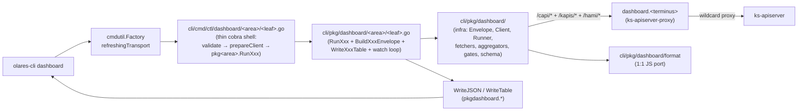

# dashboard (overview + applications, AI-agent first)

**CRITICAL — before doing ANYTHING in this subtree, MUST Read [`../olares-shared/SKILL.md`](../olares-shared/SKILL.md) for profile selection, login, factory-injected `*http.Client`, and HTTP 401/403 recovery rules. Every dashboard verb depends on that foundation.**

**This file is the source of truth for the dashboard subtree.** Any code generation, refactor or fix touching `cli/cmd/ctl/dashboard/**`, `cli/pkg/dashboard/**`, `cli/pkg/dashboard/format/**`, `cli/pkg/olares/id.go::DashboardURL`, or `cli/pkg/credential/{types,default_provider}.go::DashboardURL` MUST first Read this file end-to-end and respect the **Iteration red-lines** section. Do not "modernize", "simplify" or "consolidate" anything listed under [Frozen modules](#frozen-modules) without an explicit user-approved plan that supersedes this skill.

## Scope (frozen)

The dashboard CLI mirrors **only** the SPA routes that are still wired in [`packages/app/src/apps/dashboard/router/routes.ts`](dashboard/packages/app/src/apps/dashboard/router/routes.ts):

- `Overview2/IndexPage.vue` (overview tree) + the per-detail-page subtrees:
  `Overview2/CPU`, `Memory`, `Disk`, `Pods`, `Network`, `Fan`, `GPU`.
- `Applications2/IndexPage.vue` (applications tree).

Everything else in the SPA (legacy `Overview/`, audit, settings, …) is **out of scope**. Do not add commands for deprecated routes; reject any request that asks for them with a pointer to the route file.

## Architecture

The dashboard CLI is a **two-layer split with mirrored subpackage
trees on BOTH sides**:

- **cmd shell** under `cli/cmd/ctl/dashboard/` — one directory per
  command-tree parent, one `.go` file per leaf. Each leaf's RunE is a
  thin `validate flags → prepareClient → pkg<area>.RunXxx(...)` body.
  Per-area `common.go` is ≤ 70 lines and carries only `var common`,
  `prepareClient`, `unknownSubcommandRunE`.
- **pkg layer** under `cli/pkg/dashboard/`, split in two:
  - the **pkg ROOT** (`cli/pkg/dashboard/*.go`) owns infrastructure
    and shared fetchers — `Client`, `Runner`, `CommonFlags`,
    `Envelope`/`Item`/`Meta`, `Fetch*` helpers, `BuildRankingEnvelope`,
    capability gates, the `format` pkg, the schema bundle. **No
    command-specific envelope builders or table writers live here.**
  - the **pkg subpackages** (`cli/pkg/dashboard/applications/`,
    `cli/pkg/dashboard/overview/`,
    `cli/pkg/dashboard/overview/{disk,fan,gpu}/`) mirror the cmd
    parent dirs. Each carries one `<verb>.go` file per leaf, exposing
    a single `RunXxx(ctx, c, cf, ...)` entry plus its
    `BuildXxxEnvelope` / `WriteXxxTable` triplet. Tests sit
    alongside as `<verb>_test.go` (one shared `helpers_test.go` per
    area for httptest fixtures).

Every fetch / merge / aggregate / format call goes through pkg —
either the root infra or, for envelope assembly, the matching pkg
subpackage. The cmd shell never touches HTTP, never builds an
envelope, never writes a table, never runs `Runner` directly.



cmd area ↔ pkg subpackage mapping — every cmd leaf is a thin
`prepareClient` + `pkg<area>.RunXxx(...)` shell. The heavy logic
(envelope builders, table writers, fan-out, watch loops) lives in a
mirror subpackage under `cli/pkg/dashboard/<area>/`. The pkg root
(`cli/pkg/dashboard/`) only owns infrastructure and shared fetchers.

| cmd area | pkg subpackage entry points (`Run*`) | shared infra it pulls from `cli/pkg/dashboard/` |
|---|---|---|
| `cmd/ctl/dashboard/root.go` + `options.go` | n/a — pure cobra wiring + `bindPersistentFlags` | `flags.go` (`CommonFlags`), `runner.go`, `emit.go`, `output.go` |
| `cmd/ctl/dashboard/applications/root.go` | `pkg/dashboard/applications/list.go` → `RunList` | `ranking.go`, `workloads.go`, `apps.go`, `format/...` |
| `cmd/ctl/dashboard/overview/{physical,user,ranking,root}.go` | `pkg/dashboard/overview/{physical,user,ranking,default}.go` → `RunPhysical`/`RunUser`/`RunRanking`/`RunDefault` | `monitoring.go`, `workloads.go`, `ranking.go`, `users.go`, `numbers.go` |
| `cmd/ctl/dashboard/overview/{cpu,memory,pods,network}.go` | `pkg/dashboard/overview/{cpu,memory,pods,network}.go` → `RunCPU`/`RunMemory`/`RunPods`/`RunNetwork` (built on `nodes.go`'s `RunPerNodeMetric` scaffold) | `monitoring.go`, `system.go` (network → capi `/system/ifs`), `numbers.go` |
| `cmd/ctl/dashboard/overview/disk/{root,main,partitions}.go` | `pkg/dashboard/overview/disk/{default,main,partitions}.go` → `RunDefault`/`RunMain`/`RunPartitions` | `monitoring.go` (node\_disk\_*), `lsblk.go`, `numbers.go`, `format/...` |
| `cmd/ctl/dashboard/overview/fan/{root,live,curve}.go` | `pkg/dashboard/overview/fan/{default,live,curve}.go` → `RunDefault`/`RunLive`/`RunCurve` | `system.go` (`FetchSystemFan`), `gates.go` (`GateOlaresOne`), `gpu.go` (graphics list co-render), `fan_curve.go` |
| `cmd/ctl/dashboard/overview/gpu/{root,graphics,tasks,list,get,task,detail,task_detail}.go` | `pkg/dashboard/overview/gpu/{list,tasks,get,task,detail,task_detail}.go` → `RunList`/`RunTasks`/`RunGet`/`RunTask`/`RunDetail`/`RunTaskDetail`/`RunTaskByRef` (+ `specs.go` for the gauge/trend catalogue and concurrent fan-out) | `gpu.go`, `gpu_format.go`, `gpu_query.go`, `gates.go`, `client.go` |
| `cmd/ctl/dashboard/schema/root.go` | n/a — schema loader stays in pkg root | `schema.go` (loader + `go:embed` bundle) |

- HTTP base = `ResolvedProfile.DashboardURL = https://dashboard.<localPrefix><terminusName>` (derived in [`cli/pkg/olares/id.go`](cli/pkg/olares/id.go) `DashboardURL`).
- All requests go through factory's `refreshingTransport` — header injection + 401 retry happen for free; **dashboard code MUST NOT touch `X-Authorization`** or instantiate its own `http.Client`.
- Per-command leaf / aggregate decision is hard-coded; do not flip them.
- The shared `*pkgdashboard.CommonFlags` is bound once in cmd-root (`bindPersistentFlags(&common, cmd)`), then passed by pointer to every area factory (`overview.NewOverviewCommand(f, &common)` etc.). Each area subpackage stores it in a package-level `var common *pkgdashboard.CommonFlags` so leaf RunE bodies keep `common.Output / common.Validate() / common.Timezone` selectors.


## JSON envelope (frozen shapes)

Every dashboard command emits exactly one of two shapes; the choice is fixed per command and MUST NOT be changed.

### Shape A — leaf

Used by every command except parent commands with a sections envelope (see Shape B).

```json
{
  "kind":  "dashboard.<area>.<verb>",
  "meta":  { "fetched_at": "...", "iteration": 0, "recommended_poll_seconds": 60, "empty": false, "empty_reason": "", "error": "", "http_status": 200 },
  "items": [ { "raw": { /* upstream-shape, units in source unit */ }, "display": { /* table-friendly strings */ } } ]
}
```

- `raw` is the canonical machine-friendly shape: numbers as numbers, timestamps as Unix seconds, temperatures as raw Celsius (NOT converted by `--temp-unit`). Agents pin on `raw`.
- `display` is human-presentation only; values are formatted via the `format` pkg with current `--temp-unit` / `--timezone`. **Agents MUST NOT pin on `display`** — it can change with locale / format-pkg fixes.
- `meta.recommended_poll_seconds` — the page-level polling cadence the SPA uses; agents driving `--watch` SHOULD respect it.
- `meta.iteration` — present in every `--watch` payload, 1-based.
- `meta.empty` / `meta.empty_reason` — three-state empty data; see [Three-state empty data](#three-state-empty-data).
- `meta.error` — only set on a failed `--watch` iteration or per-section failure inside Shape B.

### Shape B — sections envelope

Used by **parent commands that aggregate multiple sub-views**:

| Parent command           | Sections                            | Section kinds |
|---|---|---|
| `dashboard overview`     | `physical` / `user` / `ranking`     | `dashboard.overview.physical` / `.user` / `.ranking` |
| `dashboard overview disk`| `main` / `partitions`               | `dashboard.overview.disk.main` / `.partitions` (the latter is itself a sections envelope, keyed by device) |
| `dashboard overview fan` | `live` / `curve`                    | `dashboard.overview.fan.live` / `.curve` |
| `dashboard overview gpu` | `graphics` / `tasks`                | `dashboard.overview.gpu.list` / `.tasks` (mirrors the SPA's GPU overview tabs preloaded together) |
| `dashboard schema`       | n/a — emits Shape A index           | `dashboard.schema.index` |

```json
{
  "kind": "dashboard.overview",
  "meta": { ... },
  "sections": {
    "physical": { "kind": "dashboard.overview.physical", "meta": {...}, "items": [...] },
    "user":     { "kind": "dashboard.overview.user",     "meta": {...}, "items": [...] },
    "ranking":  { "kind": "dashboard.overview.ranking",  "meta": {...}, "items": [...] }
  }
}
```

- Sections are fetched concurrently; a single failed section degrades to `meta.error="..."` on that section, the others still return.
- The section names (the Section column above) are part of the contract — do not rename or drop.

### Kind constants

Declared in [`cli/pkg/dashboard/schema.go`](cli/pkg/dashboard/schema.go). **`AllKinds()` MUST stay 1:1 with the actual command surface.** Adding a command means:

1. Add a `KindXxx` constant in `pkg/dashboard/schema.go`.
2. Append it to `AllKinds()` (same file).
3. Add `cli/pkg/dashboard/schemas/<kind-without-namespace>.json`.
4. Register in `LoadSchemaIndex()` (same file).
5. Bump golden tests if the new shape appears in fixtures.
6. Add a leaf file in the matching `cmd/ctl/dashboard/<area>/` subdirectory and AddCommand it from the area's `root.go`.

Do NOT rename existing Kind values — agents rely on string equality.

The authoritative listing of every command, its envelope shape, and
its default-action semantics is the cmd/pkg directory tree itself
(see [File layout](#file-layout-frozen--directory-tree-mirrors-command-tree-on-both-sides)) and `olares-cli dashboard --help`. Run `olares-cli dashboard schema -o
json` for the live `dashboard.<area>.<verb>` Kind index.

## Frozen modules

The following are **load-bearing**. Touching them requires a separate user-confirmed plan; otherwise reject the request with this list.

| Frozen module | Why it's frozen | Where |
|---|---|---|
| Two-layer split with mirrored `cmd/<area>` ↔ `pkg/dashboard/<area>` subpackages: cmd is a thin cobra shell that calls `pkg<area>.RunXxx(...)`; pkg owns every envelope builder, table writer, watch loop and fan-out. The pkg root holds only infrastructure + shared fetchers. | Architectural decision (P1–P7); each leaf's heavy logic is testable directly via `RunXxx` without dragging cobra in, and cmd-side line budgets stay flat as the surface grows | [`cli/cmd/ctl/dashboard/`](cli/cmd/ctl/dashboard/) + [`cli/pkg/dashboard/`](cli/pkg/dashboard/) |
| Directory tree mirrors command tree on BOTH sides | One file per leaf in cmd (`<verb>.go`) AND in the matching pkg subpackage (`<verb>.go` exposing one `RunXxx` entry); `root.go`+`common.go` per cmd parent, `default.go` per pkg parent — prevents drift between `dashboard --help`, the cmd `ls`, and the pkg `ls` | every cmd subdirectory under [`cli/cmd/ctl/dashboard/`](cli/cmd/ctl/dashboard/) and every pkg subpackage under [`cli/pkg/dashboard/<area>/`](cli/pkg/dashboard/) |
| Kind constants + `AllKinds()` | Public agent contract | [`pkg/dashboard/schema.go`](cli/pkg/dashboard/schema.go) |
| Envelope shapes A / B | Public agent contract | [`pkg/dashboard/output.go`](cli/pkg/dashboard/output.go) |
| `format` pkg signatures + JS-parity behaviour | Backed by `golden.json` oracle; even rounding quirks are intentional | [`pkg/dashboard/format/format.go`](cli/pkg/dashboard/format/format.go) |
| `FetchClusterMetrics` / `FetchNodeMetrics` / `FetchUserMetric` shared fetchers | Single upstream call powers multiple commands; must not fork | [`pkg/dashboard/monitoring.go`](cli/pkg/dashboard/monitoring.go) |
| `FetchWorkloadsMetrics` dual-fetch + merge + `BuildRankingEnvelope` | Single pkg function powers `overview ranking` + `applications` first-row parity; keep the dual-fetch shape | [`pkg/dashboard/workloads.go`](cli/pkg/dashboard/workloads.go), [`pkg/dashboard/ranking.go`](cli/pkg/dashboard/ranking.go) |
| `FetchSystemIFS` / `FetchSystemFan` / graphics+task helpers | Wire shape pinned in tests; capi vs hami URL prefixes are part of the contract | [`pkg/dashboard/system.go`](cli/pkg/dashboard/system.go), [`pkg/dashboard/gpu.go`](cli/pkg/dashboard/gpu.go) |
| `FanCurveTable` + `FanSpeedMaxCPU` + `FanSpeedMaxGPU` constants | 1:1 with SPA `Fan/config.ts.tableData`; CLI ships them as Go constants because the SPA does too | [`pkg/dashboard/fan_curve.go`](cli/pkg/dashboard/fan_curve.go) |
| Parent-command default = sections envelope (overview, overview disk, overview fan) | Plan decision; consumers branch on `kind == "dashboard.overview.*"` to know whether to expect `sections` or `items` | [`overview/root.go`](cli/cmd/ctl/dashboard/overview/root.go), [`overview/disk/root.go`](cli/cmd/ctl/dashboard/overview/disk/root.go), [`overview/fan/root.go`](cli/cmd/ctl/dashboard/overview/fan/root.go) |
| `Runner` + `--watch` semantics (interval / iterations / timeout / 3-consecutive-failure exit / NDJSON per-iteration / SIGINT graceful / `ErrTokenInvalidated` short-circuit) | Plan decision; agents script around it | [`pkg/dashboard/runner.go`](cli/pkg/dashboard/runner.go) |
| `--since` vs `--start --end` mutual-exclusion + sliding-window rules | Plan decision (`since_slides_abs_repeats`) | [`pkg/dashboard/flags.go`](cli/pkg/dashboard/flags.go) `Validate` / `ResolveWindow` |
| Three-state empty-data semantics | Distinguishes "feature not installed" from "no hardware" without throwing | `overview gpu {list,tasks}` / `overview fan live` (cmd) ↔ [`pkg/dashboard/gates.go`](cli/pkg/dashboard/gates.go) |
| `Client.EnsureUser` sync.Once cache + `RequireAdmin` / `ResolveTargetUser` guards | Auth correctness for `--user` / `overview user <name>` | [`pkg/dashboard/client.go`](cli/pkg/dashboard/client.go) |
| `ResolvedProfile.DashboardURL` derivation chain | URL is derived, not configured | [`cli/pkg/olares/id.go`](cli/pkg/olares/id.go), [`cli/pkg/credential/types.go`](cli/pkg/credential/types.go), [`cli/pkg/credential/default_provider.go`](cli/pkg/credential/default_provider.go) |
| Cobra `SilenceUsage = true` + `SilenceErrors = true` on every dashboard cmd | Clean machine-readable error text; pinned by `TestAllLeafCommandsSilenced` in cmd-root | every `cobra.Command` literal under `cmd/ctl/dashboard/` |
| Default output = `table` | Plan decision (`table_default`) | [`pkg/dashboard/output.go`](cli/pkg/dashboard/output.go) `ParseOutputFormat` |
| **Dependency direction (cmd side)** — `cli/cmd/ctl/dashboard/<area>` may import `cli/pkg/dashboard`, `cli/pkg/dashboard/<area>/...`, and its own cobra children only; **horizontal cmd↔cmd imports are FORBIDDEN**. The cmd shell is forbidden from owning envelope shapes / table writers / fan-out — those belong in the matching `pkg/dashboard/<area>` subpackage. | Architectural integrity; prevents the circular-import class of bugs that killed the 1.x layout, and keeps the cmd surface trivially line-budgeted | every `import` block under [`cli/cmd/ctl/dashboard/`](cli/cmd/ctl/dashboard/) |
| **Dependency direction (pkg side)** — `cli/pkg/dashboard/<area>/...` may import `cli/pkg/dashboard` (the root infra: `Client`, `Runner`, fetchers, `format`, `numbers`, `gpu_format`, `gpu_query`, `gates`, `schema`, `output`, `emit`, `lsblk`, `fan_curve`); the pkg root MUST NOT import any subpackage (no upward import). Sibling subpackages (e.g. `overview/disk` ↔ `overview/fan`) MUST NOT import each other — if two areas need the same heavy helper, hoist it to `cli/pkg/dashboard/` (the `BuildRankingEnvelope` precedent). | Keeps the pkg root independently testable + reusable, and keeps each `<area>` subpackage a self-contained mirror of its cmd sibling | every `import` block under [`cli/pkg/dashboard/`](cli/pkg/dashboard/) |

## Three-state empty data

Optional hardware (GPU / fan) and optional integrations have three legitimate "empty" states; the CLI distinguishes them in `meta.empty_reason` so agents can branch without parsing prose.

| Upstream response | `meta.empty` | `meta.empty_reason` | Example |
|---|---|---|---|
| HTTP 404 | `true` | `no_<feature>_integration` | HAMI vGPU not installed → `dashboard overview gpu list` |
| HTTP 200, empty body / empty metric | `true` | `no_<feature>_detected` | Server has no fans → `dashboard overview fan live` |
| HTTP 200, non-empty | `false` | `""` | Normal case |
| Any other 4xx/5xx | n/a (envelope `meta.error`) | n/a | Real failure → propagate via watch error path |

Forbidden: turning a 404 into an error, or merging the two reasons into a single "empty=true" — agents currently key on the reason.

## Capability gates (overview fan / overview gpu)

The fan / gpu subtrees mirror the SPA's gates — but with **two different
strengths** because the SPA itself treats them differently:

| Subtree | Gate strength | Source check |
|---|---|---|
| `overview fan *` (default / live / curve) | **Hard** — empty envelope before any fetch | [`Fan.ts:67`](dashboard/packages/app/src/apps/dashboard/stores/Fan.ts) (`isOlaresOneDevice`); fan data is meaningless on non-Olares One hardware |
| `overview gpu *` (list / tasks / get / task) | **Soft** — advisory `meta.note` + stderr hint, then proceed with the HAMI fetch | [`ClusterResource.vue:232+278`](dashboard/packages/app/src/apps/dashboard/pages/Overview2/ClusterResource.vue) hides the **sidebar entry** for non-admins / no-CUDA clusters; the GPU detail pages themselves do **not** hard-block |

### Hard gate (fan) — empty envelope shape

```json
{
  "kind": "dashboard.overview.fan.live",
  "meta": {
    "empty": true,
    "empty_reason": "not_olares_one",
    "note": "Fan / cooling integration is only available on Olares One devices",
    "device_name": "DIY-PC",
    "fetched_at": "..."
  },
  "items": []
}
```

### Soft gate (gpu) — advisory, not a block

The CLI ALWAYS calls HAMI for GPU verbs. The SPA-equivalent "would-have-been-hidden" reason is recorded as `meta.note` and (in table mode) as a one-liner on stderr. The actual `meta.empty` / `empty_reason` are determined by HAMI's response:

```jsonc
// non-admin caller, HAMI returned an empty list:
{
  "kind": "dashboard.overview.gpu.list",
  "meta": {
    "empty": true,
    "empty_reason": "no_gpu_detected",
    "note": "GPU sidebar entry is hidden for non-admin profiles in the SPA; HAMI was queried directly",
    ...
  },
  "items": []
}

// any caller, HAMI returned 5xx:
{
  "kind": "dashboard.overview.gpu.list",
  "meta": {
    "empty": true,
    "empty_reason": "vgpu_unavailable",
    "http_status": 500,
    "error": "unknown request error",
    "note": "HAMI vGPU controller responded with Internal Server Error; the integration is installed but unhealthy",
    ...
  },
  "items": []
}
```

`empty_reason` taxonomy:

| Reason | Where | Meaning |
|---|---|---|
| `not_olares_one` | fan default / live / curve (hard gate) | Active device's `device_name` is not `Olares One` |
| `no_fan_integration` | fan live (HTTP 404 fallback) | `/user-service/api/mdns/olares-one/cpu-gpu` returned 404 |
| `no_vgpu_integration` | gpu list / tasks / get / task (HTTP 404) | HAMI vGPU controller absent |
| `vgpu_unavailable` | gpu list / tasks / get / task (HTTP 5xx) | HAMI installed but unhealthy. `meta.error` carries the upstream `message`; `meta.http_status` carries the original status |
| `no_gpu_detected` | gpu list / tasks / get / task (HTTP 200, empty body) | HAMI healthy but device list / detail is empty |

Soft-gate advisories never appear as `empty_reason`; they live in `meta.note`:

| Note | When |
|---|---|
| `GPU sidebar entry is hidden for non-admin profiles in the SPA; HAMI was queried directly` | `meta.user.globalrole != platform-admin` (and not `admin`) |
| `no node carries gpu.bytetrade.io/cuda-supported=true; SPA hides the GPU card. HAMI was queried directly` | Admin caller, but the cluster's node list has no CUDA-supported label |

When BOTH a HAMI failure AND a soft advisory apply, `meta.note` is the concatenation `"<advisory> | <hami-explanation>"`.

### HAMI wire-shape contract (paid in blood)

HAMI's WebUI returns the payload **at the top level** for every endpoint we call — there is no `data` envelope around it. Adding one in the decoder yields a silent "0 GPUs" / "0 tasks" failure even on machines where the SPA shows devices.

| Endpoint | Real wire shape | Decoder target |
|---|---|---|
| `POST /hami/api/vgpu/v1/gpus` | `{"list":[ {graphics...} ]}` | `struct{ List []map[string]any }`, return `raw.List` |
| `POST /hami/api/vgpu/v1/containers` | `{"items":[ {task...} ]}` | `struct{ Items []map[string]any }`, return `raw.Items` |
| `GET /hami/api/vgpu/v1/gpu?uid=…` | `{ ...graphics fields... }` | `map[string]any`, return verbatim |
| `GET /hami/api/vgpu/v1/container?name=…&podUid=…` | `{ ...task fields... }` | `map[string]any`, return verbatim |

The fetchers in [`pkg/dashboard/gpu.go`](cli/pkg/dashboard/gpu.go) are pinned to this shape; `TestFetchGraphicsList_ParsesTopLevelList` / `TestFetchTaskList_ParsesTopLevelItems` / `TestFetchGraphicsDetail_ReturnsBodyAsIs` / `TestFetchTaskDetail_ReturnsBodyAsIs` enforce the contract (in `cli/pkg/dashboard/dashboard_test.go`).

GPU/task field names that round-trip from HAMI (used in `Raw` envelopes — agents can pull anything not surfaced in the table):

| `gpu list` raw fields | `gpu tasks` raw fields |
|---|---|
| `uuid`, `type`, `shareMode`, `nodeName`, `nodeUid`, `health` (bool), `coreUtilizedPercent` (already a percent — NOT a 0..1 ratio), `coreUsed`, `coreTotal`, `memoryUsed` / `memoryUtilized` / `memoryTotal` (all MiB), `memoryUtilizedPercent`, `vgpuUsed`, `vgpuTotal`, `power`, `powerLimit` (W), `temperature` (°C), `node`, `mode` | `name`, `status`, `podUid`, `nodeName`, `nodeUid`, `type`, `deviceShareModes[]`, `devicesCoreUtilizedPercent[]`, `devicesMemUtilized[]`, `allocatedDevices`, `allocatedCores`, `allocatedMem`, `createTime`, `startTime`, `endTime`, `namespace`, `deviceIds[]`, `resourcePool`, `flavor`, `priority`, `appName` |

Common renames the SPA does NOT do (we don't either — earlier revisions guessed at e.g. `modelName` / `hostname` / `usedMem` / `totalMem` / `coreUtilization` / `sharemode`; none of those field names appear on the wire):

- "model" → `type` (yes, the field is literally called `type`)
- "host_node" → `nodeName`
- "core_util" → `coreUtilizedPercent` (already a percent)
- "vram total / used" → `memoryTotal` / `memoryUsed` (both MiB; multiply by 1024² before passing to `format.GetDiskSize`)
- "mode" → `shareMode` (string `"0"`/`"1"`/`"2"`/`"3"`; SPA's `VRAMModeLabel` enum only knows 0/1/2 — the CLI surfaces unknown values as `mode=<raw>`)

### Monitor query endpoints (instant-vector / range-vector)

The wire-shape contract above ONLY covers the list/detail endpoints. The two **monitor query** endpoints behave the opposite way — they DO wrap the result in a single-level `data` envelope, matching the SPA's `InstantVectorResponse` / `RangeVectorResponse` types in [`packages/app/src/apps/dashboard/types/gpu.ts`](packages/app/src/apps/dashboard/types/gpu.ts).

| Endpoint | Wire shape | Decoder |
|---|---|---|
| `POST /hami/api/vgpu/v1/monitor/query/instant-vector` | `{"data":[ {metric, value, timestamp} ]}` | `struct{ Data []instantVectorSample }`, return `raw.Data` |
| `POST /hami/api/vgpu/v1/monitor/query/range-vector` | `{"data":[ {metric, values:[{value, timestamp}]} ]}` | `struct{ Data []rangeVectorSeries }`, return `raw.Data` |

Both fetchers (`fetchInstantVector` / `fetchRangeVector`) are pinned by `TestFetchInstantVector_ParsesDataEnvelope` / `TestFetchRangeVector_ParsesDataEnvelope`. Do NOT "harmonise" with the list endpoints — different microservices behind HAMI, different wire shapes, period.

Range body shape: `{"query":"<promql>","range":{"start":"YYYY-MM-DD HH:mm:ss","end":"…","step":"30m"}}`. `start`/`end` are SPA's `timeParse(date)` (local clock, no offset suffix); the `step` is computed by `gpuTrendStep(start, end)` — a 1:1 port of [`timeRangeFormate(diff_s, 16)`](packages/app/src/apps/controlPanelCommon/containers/Monitoring/utils.js) which preserves the SPA's preset table (10m→1m, 60m→10m, 480m→30m, 1440m→60m, etc.) and falls back to `floor(minutes/16)m` capped at `[1m..60m]`.

**Window timezone contract (paid in blood)** — the offset-less string is re-parsed by the HAMI WebUI backend with `time.ParseInLocation` against the backend pod's `TZ` (today: `Asia/Shanghai`, see [`infrastructure/gpu/.olares/config/gpu/hami/values.yaml`](infrastructure/gpu/.olares/config/gpu/hami/values.yaml) `webui.env.backend.TZ`; verified empirically that Unix-epoch payloads are rejected with `data: []`, only the human-readable form works). The SPA gets this right by accident: a browser running in CST emits CST wall-clock strings, which the backend re-stamps as CST → correct UTC. CLI does NOT have that coincidence — a UTC host (typical Linux server / container) was sending UTC wall clock that HAMI re-stamped as CST, shifting `[start,end]` 8h into the future where Prometheus has no samples → the user-visible symptom was "Gauges 正常 / Trends 全空，无 warnings".

**The fix splits the TZ in two**, on purpose:

| Purpose | TZ | Helper | Knob |
|---|---|---|---|
| Render `meta.window.start/end`, table-side trend timestamps, table headers | `cf.Timezone` (user's preference, default `time.Local`) | `GPUTrendTimestampISO(t, cf.Timezone.Time())` | `--timezone <IANA>` |
| Build the wire body sent to `/monitor/query/{instant,range}-vector` | `HAMIBackendTimezone()` (the backend pod's TZ, default `Asia/Shanghai`) | `GPUTrendTimestampWire(t)` | `OLARES_HAMI_BACKEND_TZ=<IANA>` env (hidden from `--help` — only operators of non-default HAMI deployments need it) |

Both helpers live in [`pkg/dashboard/gpu.go`](cli/pkg/dashboard/gpu.go); never reuse one for the other's job. The split lets a user in Los Angeles see PDT timestamps in their tables while the CLI still gets correct data from a Shanghai-deployed HAMI backend.

Pinned by:
- `TestGPUTrendTimestampISO_RespectsTimezone`, `TestGPUTrendTimestampISO_NilTimezoneFallsBackToLocal` (pkg root) — display helper.
- `TestGPUTrendTimestampWire_FormatsInHAMIBackendTZ`, `TestGPUTrendTimestampWire_RespectsEnvOverride`, `TestHAMIBackendTimezone_DefaultIsAsiaShanghai` (pkg root) — wire helper + env override + the "default matches chart values.yaml" drift alarm.
- `TestBuildDetailFullEnvelope_WireAndRenderTZsAreSeparate`, `TestBuildTaskDetailFullEnvelope_WireAndRenderTZsAreSeparate` (pkg area) — end-to-end with cf.Timezone ≠ HAMI backend TZ; assert `meta.window` and captured wire body are in DIFFERENT zones.
- `TestBuildDetailFullEnvelope_UTCHostStillGetsData` (pkg area) — the explicit "original bug" regression: cf.Timezone=UTC, HAMI backend TZ default → meta.window in UTC, wire in CST.

If you ever feel tempted to "simplify" by collapsing wire+render back into one TZ argument: don't. The two-table arrangement is the whole point.

### `dashboard overview gpu` — SPA-aligned command surface

The cobra surface mirrors the SPA's `Overview2/GPU` route exactly — two parent commands matching the two tabs, each accepting an optional positional argument that drills into the per-row "View details" page:

| Public command | Behavior | Kind | SPA equivalent |
|---|---|---|---|
| `gpu` (no subverb) | Sections envelope: graphics + tasks loaded concurrently | `dashboard.overview.gpu` (Shape B) | Both tabs preloaded on GPU overview page mount |
| `gpu graphics` | List every discovered vGPU | `dashboard.overview.gpu.list` | Graphics management tab |
| `gpu graphics <uuid>` | Per-GPU detail page (info + 6 gauges + 4 trends) | `dashboard.overview.gpu.detail.full` | GPUsDetails.vue (route /:uuid) |
| `gpu tasks` | List every running vGPU task | `dashboard.overview.gpu.tasks` | Task management tab |
| `gpu tasks <ref>` | Per-task detail page; `<ref>` = TASK column (`name`) **or** POD_UID column (`podUid`); auto-resolves the missing half + sharemode | `dashboard.overview.gpu.task.detail.full` | TasksDetails.vue (route /:name/:pod_uid) |

**Naming**: the `graphics` / `tasks` parents use the SPA's tab labels (`Graphics management` / `Task management`) verbatim; the optional positional arg dispatches to the matching detail-page builder. SKILL forbids "putting fan-out logic in cmd" — argument-count routing is NOT fan-out, it's the canonical cmd responsibility, so the dispatch lives in `cmd/.../graphics.go` + `cmd/.../tasks.go`.

**Auto-resolution for `gpu tasks <ref>`**: the SPA passes `podUid` + `deviceShareModes[0]` through the route param when the user clicks a TasksTable row. The CLI mirrors that by calling `pkgdashboard.FetchTaskList`, looking up the row by EITHER `podUid` (first pass — globally unique, wins on tie) OR `name` (second pass), and forwarding the resolved triple to `RunTaskDetail`. Both columns are surfaced in the bare `gpu` and `gpu tasks` listings, so copy-paste from either column "just works" — accepting only `name` was the original UX bug (users naturally copy the rightmost POD_UID column).

Ambiguity (two rows share a name) surfaces as a typed error listing the candidate pod-uids; users re-run with one of those pod-uids (still `gpu tasks <pod-uid>` — pod-uids ARE valid refs, no need to invoke the legacy two-arg form):

```
task name "trainer" matches 2 running pods (pod-A, pod-B); rerun with one of the
pod-uids: olares-cli dashboard overview gpu tasks <pod-uid>
```

Not-found in table mode prints `(no task matches "<ref>" — neither a name nor a pod-uid in HAMI's container list)` followed by a `hint: try one of: <name> (<pod-uid>), …` line listing up to 5 real candidates pulled from the same task list (so the user doesn't need to re-list to recover). JSON mode emits the standard `no_gpu_detected` empty envelope.

Pinned by `TestRunTaskByRef_ResolvesByPodUID` / `TestRunTaskByRef_NotFoundTableShowsHint` / `TestRunTaskByRef_AmbiguousErrorsWithCandidates`.

#### Legacy (hidden + deprecated) cobra surface

The pre-refactor `list` / `get` / `detail` / `task` / `task-detail` cobra commands remain functional for back-compat with existing agent scripts. They are marked `Hidden: true` (removed from `--help`) and `Deprecated: "use 'gpu graphics …' / 'gpu tasks …' instead"`; cobra prints a one-line deprecation hint when they run. The underlying `Run*` package functions still exist (some agents may call them via the Go API) and their tests are intact:

| Legacy cobra | Status | Replacement |
|---|---|---|
| `gpu list` | Hidden + deprecated | `gpu graphics` |
| `gpu get <uuid>` | Hidden + deprecated. Note: emits `dashboard.overview.gpu.detail` (HAMI raw, single-shot) — NOT the same envelope as `gpu graphics <uuid>` (which emits `.detail.full` with gauges + trends). Kept because the raw-passthrough verb has no SPA analogue and removing it would break callers that pin on the flat HAMI body. | `gpu graphics <uuid>` (different envelope; opt-in semantic upgrade) |
| `gpu detail <uuid>` | Hidden + deprecated | `gpu graphics <uuid>` (same envelope) |
| `gpu task <name> <pod-uid>` | Hidden + deprecated. Same caveat as `gpu get`: emits raw `dashboard.overview.gpu.task.detail`. | `gpu tasks <name>` (different envelope; opt-in semantic upgrade) |
| `gpu task-detail <name> <pod-uid>` | Hidden + deprecated. Still the only path that takes a manual `--sharemode` override; the new `gpu tasks <name>` always auto-detects sharemode from HAMI's task list. | `gpu tasks <name>` |

Schema introspection (`dashboard schema -o json`) lists both the new surface and the legacy entries (suffixed `(deprecated)`) so an agent can discover the migration mapping programmatically.

### `gpu graphics <uuid>` / `gpu tasks <name>` — full detail pages

Both parent-with-arg variants mirror the SPA's `Overview2/GPU/GPUsDetails.vue` and `Overview2/GPU/TasksDetails.vue` pages: basic info (HAMI `/v1/gpu` or `/v1/container`) + top gauges (instant-vector) + trend charts (range-vector), all assembled into a single sections envelope.

| Command | Kind | Default window | Sections | PromQL count |
|---|---|---|---|---|
| `overview gpu graphics <uuid>` (legacy: `overview gpu detail <uuid>`) | `dashboard.overview.gpu.detail.full` | 8h | `detail` / `gauges` / `trends` | 4 instant + 6 range |
| `overview gpu tasks <name>` (legacy: `overview gpu task-detail <name> <pod-uid> [--sharemode]`) | `dashboard.overview.gpu.task.detail.full` | 1h | `detail` / `gauges` / `trends` | 2 instant + 2 range |

Section item ordering is fixed and stable across releases — agents can index by position OR by `raw.key`:

GPU `detail.full` `gauges` keys (in order): `alloc_core` / `alloc_mem` / `util_core` / `util_mem` / `power` / `temperature`.
GPU `detail.full` `trends` keys (in order): `alloc_trend` (lines: VRAM+GPU_MEMORY) / `usage_trend` (VRAM+GPU_MEMORY) / `power_trend` / `temp_trend`.

Task `task-detail.full` `gauges` keys (in order): `compute_usage` / `vram_usage`.
Task `task-detail.full` `trends` keys (in order): `compute_trend` / `vram_trend` (each one line, label `usage`).

#### Display-vs-Raw formatting invariants (frozen)

The `detail` / `gauges` / `trends` sections each split formatted user-facing values from the wire shape. **`Item.Display` MUST mirror the SPA's chart/text rendering 1:1**, while `Item.Raw` keeps the un-rounded / un-formatted upstream values for agents that need arbitrary precision. Pinned by `format_test.go`. The contracts:

1. **Detail card field whitelist** — `gpuDetailDisplayCopy` emits ONLY the 6 fields SPA's `GPUsDetails.vue:112-137 columns` array displays: `health` / `uuid` / `nodeName` / `type` / `device_no` / `driver_version`. `gpuTaskDetailDisplayCopy` emits ONLY the 8 (6 unconditional + 2 conditional) fields from `TasksDetails.vue:134-174`: `status` / `deviceIds` / `nodeName` / `type` / [`allocatedCores`] / [`allocatedMem`] / `appName` / `createTime` (allocations are emitted only when present in the HAMI body — matches SPA's `displayAllocation = sharemode !== TimeSlicing` gate). HAMI fields that look detail-worthy but **are not in the SPA's `columns` array** (`memoryTotal/Used`, `power`, `powerLimit`, `temperature`, `coreTotal/Used`, `vgpuTotal/Used`, `mode`, `shareMode`, `nodeUid`, etc.) are **deliberately excluded from `Display`** because HAMI's flat `/v1/gpu` body returns placeholders (`memoryUsed: 0`, `power: 0`, `temperature: 0`) — the live values live in instant-vector queries (the `gauges` section) and re-surfacing them under "Detail" misleads users into thinking the GPU is reporting zero everything. `Raw` still carries the entire HAMI body so agents that prefer the wire shape are unaffected. Pinned by `TestGpuDetailDisplayCopy_SPAFieldWhitelist` / `TestGpuTaskDetailDisplayCopy_SPAFieldWhitelist`.

2. **Gauge values are `<number> <unit>` with lodash.round(2)** — `formatGaugeValue` mirrors `<MyGaugeChart unit=…>`. Examples: `23.89 Gi`, `7.87 W`, `46 ℃`. Unit-less ratio gauges (the SPA passes `unit: ' '`) emit just the number. `used_total` is `"0.29/23.89"` — both halves go through `roundedNumberString` (lodash.round(2) + trailing-zero strip). Pinned by `TestFormatGaugeValue` / `TestRoundedNumberString_StripsTrailingZeros`.

3. **Trend point timestamps are SPA-format `YYYY-MM-DD HH:mm:ss` in `cf.Timezone`** — NOT the wire-shape epoch milliseconds (HAMI returns `"1779636713000"`). `formatTrendTimestamp` parses three observed shapes (epoch-ms 13-digit, epoch-s 10-digit, float-s with sub-second decimals) and emits the SPA's `timeParse` shape; unparseable inputs fall through to the raw string so agents can debug HAMI quirks. The wire epoch-ms integer is preserved on `Raw.points[i].timestamp_ms` (`int64`) so chart libraries that re-derive from epoch can round-trip without re-parsing. Pinned by `TestFormatTrendTimestamp_AllShapes` / `TestFormatTrendTimestamp_RespectsTimezone`.

4. **Trend point values use lodash.round(value, 2)** — same call SPA's `pages/Overview2/GPU/config.ts:84` makes before handing the array to ECharts. The full-precision float lives on `Raw.points[i].value_raw`. Use `roundDP(v, dp)` (half-away-from-zero — matches lodash, NOT banker's). Pinned by `TestRoundDP_HalfAwayFromZero` / `TestRunTrend_RoundsValueTo2dp` (via the integration tests in `detail_test.go`).

The `formatTrendTimestamp` / `roundDP` / `roundedNumberString` / `formatGaugeValue` helpers are private to `pkg/dashboard/overview/gpu/specs.go` — they encode SPA-specific render conventions, NOT general-purpose formatters; resist promoting them to `pkgdashboard` until another area starts mirroring SPA chart axes.

Time window flags reuse the existing `--since` / `--start` / `--end`. With neither set the SPA defaults apply (8h for GPU detail, 1h for task detail). `meta.window` carries `{since, start, end, step}` so an agent can replay the exact same query without recomputing.

`--sharemode` on `task-detail` mirrors the SPA's `displayAllocation` toggle: when set to `"2"` (Time slicing) the CLI skips the allocation gauges, matching the SPA's hidden-rows behaviour. Other values (`"0"`, `"1"`) keep the full gauge set. Pinned by `TestBuildGPUTaskDetailFullEnvelope_TimeSlicingSkipsAllocation`.

Soft-failure semantics — a single instant/range query failing does NOT abort the envelope:

- the failed gauge / trend item carries `raw.error` (and `display.error` in the table);
- the parent envelope's `meta.warnings` collects `gauges "<key>": <err>` / `trends "<key>": <err>` lines;
- agents should branch on `len(meta.warnings) > 0` to detect partial data;
- pinned by `TestBuildGPUDetailFullEnvelope_PartialFailure`.

Hard-failure semantics still apply on the **detail** fetch itself: HAMI 404 → `empty_reason=no_vgpu_integration`, 5xx → `vgpu_unavailable` (`meta.error` + `meta.http_status`), 200 with empty body → `no_gpu_detected`. Watch mode polls every 30s by default (`Recommended = 30 * time.Second` — the monitor endpoints are slower than plain Prom queries).

`device_no` / `driver_version` are surfaced on the detail item — the CLI mirrors the SPA's trick of harvesting them from the `power_trend` range query's `metric` labels (HAMI doesn't ship them on `/v1/gpu`).

Behavior contract:

- **Exit code is `0`** for every gated / advisory / empty path — these are predictable states, not failures. Real failures still propagate via `meta.error` (or non-zero exit for top-level fatal errors).
- **Stderr** carries a single human-readable line in non-JSON modes; JSON / NDJSON modes stay silent on stderr (agents read stdout exclusively). Examples:
  - `fan is only available on Olares One devices (current: <device_name>)`
  - `(advisory) GPU sidebar entry is hidden for non-admin profiles in the SPA; current user (<u>) is <role>`
  - `(advisory) no node carries gpu.bytetrade.io/cuda-supported=true; SPA hides the GPU card. HAMI was queried directly`
  - `gpu data temporarily unavailable: HAMI returned HTTP 500 (unknown request error)`
- Capability calls (`/user-service/api/system/status`, `/kapis/.../nodes`, `/capi/app/detail`) are **cached per-Client** (`sync.Once` for system status; per-Client map for CUDA presence; `sync.Once` for user detail) — repeated calls inside an aggregated `dashboard overview` cost zero extra HTTP.
- Hard gate runs **inside `Runner.Iter`** for `--watch` so a stream against the wrong device terminates with consistent empty envelopes per tick. Soft advisories likewise re-evaluate per iteration.

Agent decision tree (recommended):

```
inspect meta.empty + meta.empty_reason + meta.note  →
  not_olares_one        → skip the fan subtree on this device
  no_*_integration      → upstream component absent (HAMI / capi system fan)
  vgpu_unavailable      → transient: retry; check meta.http_status / meta.error
  no_*_detected         → integration up but hardware empty
  (none) + meta.note    → data is present but the SPA would have hidden the entry; surface the note to the user
  (none) + (no note)    → items[] populated, proceed normally
```

Forbidden:

- Collapsing the empty reasons into a single "not supported" string.
- Skipping the soft advisory call to "save a request" — the cache makes that a non-issue.
- Treating a closed gate or HAMI 5xx as `meta.error`-only — `error` is reserved for the upstream message; the canonical signal is `empty_reason`.
- Treating `vgpu_unavailable` as a hard error / non-zero exit — agents must keep iterating in `--watch`.

## `--watch` semantics (frozen)

Default behaviour: **single execution**. `--watch` opts into HTTP-polling that mirrors the SPA's `setTimeout` cadence.

```mermaid
flowchart TD
    A[invoke leaf cmd] --> B{--watch set?}
    B -- no --> C[RunOnce → emit one envelope → exit 0/1]
    B -- yes --> D[Runner.Run]
    D --> E[RunOnce iteration N]
    E --> F{success?}
    F -- yes --> G[emit envelope NDJSON line<br/>meta.iteration=N]
    F -- transient err --> H[emit envelope NDJSON<br/>meta.error set, items:[]]
    F -- ErrTokenInvalidated / ErrNotLoggedIn --> X[exit non-zero immediately]
    G --> I{--watch-iterations cap reached?}
    H --> J{N consecutive errors >= 3?}
    J -- yes --> X
    I -- yes --> Y[exit 0]
    J -- no --> K[wait --watch-interval]
    I -- no --> K
    K --> L{SIGINT?}
    L -- yes --> Y
    L -- no --> E
```

Hard rules:

- One envelope per iteration; nothing else on stdout. Pretty `-o json` is for one-shot mode; `--watch -o json` is **always NDJSON**.
- Failed iteration ⇒ `items:[]` + `meta.error="<msg>"`; never raise to process exit unless it's an auth-class error or the 3-consecutive cap trips.
- `--since N` slides forward each iteration (window = [now-N, now]); `--start/--end` stays fixed across all iterations. Mutual exclusion is enforced in `CommonFlags.Validate`; do NOT remove the check.
- `--watch-iterations` without `--watch` is rejected. Same for `--watch-timeout` / `--watch-interval`.
- `Runner` exposes `Iter` (the per-iteration callback). It used to be called `Run` and was renamed to dodge a field/method-name clash with `Runner.Run()` — leave it.

## Multi-user / `--user` flag

- `Client.EnsureUser(ctx)` lazily fetches `/capi/app/detail` (once per process) and caches `globalrole`. Subsequent calls return the cached value.
- `RequireAdmin(ctx)` is the **only** admit gate for `--user <olaresId>`; admin-only verbs (cross-tenant queries) MUST call it before issuing any upstream request.
- `resolveTargetUser(ctx, c, requested)` is the helper for commands that accept a user via positional arg OR `--user` (today: `overview user [<username>]`). Empty / self → returns the active profile; explicit + admin → returns synthetic `UserDetail{Name: requested}`; explicit + non-admin → error mentioning "platform-admin".
- The CLI never spoofs identity via headers — `--user` only changes upstream filter args; auth header is still the active profile's token.

## Format pkg (frozen, JS-parity)

The `format` pkg is a **byte-for-byte port** of:

- [`@bytetrade/core/src/monitoring.ts`](dashboard/packages/core/src/monitoring.ts) → `UnitTypes`, `GetValueByUnit`, `GetSuitableUnit`, `GetSuitableValue`
- [`apps/packages/app/src/apps/dashboard/utils/`](dashboard/packages/app/src/apps/dashboard/utils/) → `WorthValue`, `FormatFrequency`, `ConvertTemperature`, `GetDiskSize`, `GetThroughput`, `FormatTime`, `GetMinuteValue`, `GetLastMonitoringData`, `GetResult`

Rules:

1. The reference is the JS source. `format/testdata/golden-gen.js` runs the JS oracle directly and writes `golden.json`; `TestFormat_GoldenOracle` asserts byte equality. Any divergence is a Go bug, not a JS bug.
2. Use [`github.com/shopspring/decimal`](https://github.com/shopspring/decimal) for arithmetic that the JS uses BigNumber for (e.g. `WorthValue`'s cascading thresholds, `FormatFrequency` rounding). Do **not** introduce a different decimal lib.
3. Quirks ARE the contract. Examples:
   - JS `toFixed(2)` of `1.005` returns `"1.00"` because of float repr — the Go port replicates that. Test cases must use unambiguous values like `1.234567 → 1.23`.
   - `WorthValue` uses cascading `if` thresholds, not generic ladder logic — keep the structure.
4. No display-side number formatting outside this pkg. Never `fmt.Sprintf("%.2f", x)` in `overview.go` / `applications.go` for a value that is shown to the user (the few `%.2f` left in `overview.go` are pinned to non-user-facing CPU core counts and are documented inline).
5. Temperature: JSON `raw` carries Celsius (the upstream value); `display` is rendered with `--temp-unit` (default Celsius). Never strip Celsius from `raw`.

## Shared helpers (the only legal call sites)

All shared infrastructure helpers live under
[`cli/pkg/dashboard/`](cli/pkg/dashboard/) (the pkg root) and are
imported as `pkgdashboard "github.com/beclab/Olares/cli/pkg/dashboard"`
by the pkg subpackages (`pkg/dashboard/<area>/...`) and — for the
plumbing types like `CommonFlags` / `Client` / `ErrAlreadyReported` —
also by the cmd shells. The cmd shells additionally import
`pkg<area> "github.com/beclab/Olares/cli/pkg/dashboard/<area>"` to
reach `RunXxx`.

### `pkg/dashboard/` (root) API surface — infrastructure + shared fetchers

| Domain file | Exposed surface | Used by |
|---|---|---|
| `flags.go` | `CommonFlags` struct (raw + parsed fields), `Validate`, `ResolveWindow`, `OutputFormat`, `ParseOutputFormat` | every cmd leaf RunE (validate), every pkg `RunXxx` (read fields), every fetcher; cobra binding lives in cmd-root `options.go` |
| `output.go` / `emit.go` / `envelope.go` | `Envelope` / `Item` / `Meta` / `TableColumn`, `WriteJSON` (NDJSON-aware), `WriteTable`, `HeadItems`, `DisplayString`, `EmitDefault`, `NewMeta` | every `BuildXxxEnvelope` / `WriteXxxTable` site under `pkg/dashboard/<area>/...` (hand-rolling `json.Marshal` / `fmt.Println` for envelope output is forbidden) |
| `client.go` / `users.go` | `Client.DoJSON / DoEmpty / DoRaw`, `EnsureUser` (sync.Once), `RequireAdmin`, `ResolveTargetUser`, `UserDetail`, `EnsureSystemStatus`, `IsOlaresOne`, `HTTPError`, `ClassifyTransportErr`, `IsHTTPError`, `ErrAlreadyReported` | every HTTP call (direct `httpClient.Do` forbidden); admin gating in `pkg/dashboard/overview/user.go` |
| `runner.go` | `Runner{Iter, RunOnce}`, `ParseStep` | every `--watch`-aware `RunXxx` (instantiated and driven from inside the pkg subpackage, never from cmd) |
| `monitoring.go` | `FetchClusterMetrics(ctx,c,cf,metrics,window,now,instant)`, `FetchNodeMetrics`, `FetchUserMetric`, `MonitoringQuery`, `MonitoringWindow`, `DefaultClusterWindow`, `DefaultDetailWindow` | `pkg/dashboard/overview/{physical,cpu,memory,pods,user}.go`, `pkg/dashboard/overview/disk/{main,partitions}.go` |
| `workloads.go` | `FetchWorkloadsMetrics(ctx,c,cf,req,window,now)`, `MergeWorkloadMetrics`, `WorkloadAggregate / WorkloadApp / WorkloadRequest`, `AggregateByDeployment`, `AggregateByNamespace`, `PodCountByDeployment`, `SortWorkloadAggregates` | only via `BuildRankingEnvelope` (do NOT call `FetchWorkloadsMetrics` directly from `<area>` subpackages) |
| `apps.go` | `FetchAppsList`, `RawAppListItem` (with empty-`entrances[]` filter mirroring SPA `appsWithNamespace`) | only via `BuildRankingEnvelope` |
| `ranking.go` | **`BuildRankingEnvelope(ctx,c,cf,target,sortBy,sortDir,now)`** — assembles a workload-grain ranking envelope | consumed by `pkg/dashboard/overview/ranking.go` and `pkg/dashboard/applications/list.go` so first-row parity holds (the ONE legitimate cross-area share, hoisted to the pkg root) |
| `system.go` | `FetchSystemIFS(ctx,c,testConnectivity)`, `FetchSystemFan`, `SystemIFSItem`, `SystemFanData`, `SystemStatus`, `EnsureSystemStatus` | `pkg/dashboard/overview/network.go` (capi /system/ifs), `pkg/dashboard/overview/fan/live.go` (capi mdns/olares-one/cpu-gpu) |
| `gates.go` | `GateOlaresOne` (hard gate, fan), `GPUAdvisory` (soft gate, gpu), `HasCUDANode`, `VgpuUnavailableFromError`, `ResetCUDANodeCache` | `pkg/dashboard/overview/fan/*` (hard gate runs inside `Runner.Iter`), every `pkg/dashboard/overview/gpu/*` leaf (advisory note + soft proceed) |
| `gpu.go` | `FetchGraphicsList`, `FetchTaskList`, `FetchGraphicsDetail`, `FetchTaskDetail`, `ExtractHAMIMessage`, `GraphicsListBody`, `TaskListBody` | every file under `pkg/dashboard/overview/gpu/` (list / tasks / get / task / detail / task_detail) |
| `gpu_format.go` | `PercentString`, `PercentDirect`, `GPUModeLabel`, `GPUHealthLabel`, `GPUVRAMHuman`, `GPUTrendStep`, `RenderTemperature` | every `pkg/dashboard/overview/gpu/*` table writer; `pkg/dashboard/overview/disk/main.go` (renderDiskTemperature wraps `RenderTemperature`) |
| `gpu_query.go` | `FetchInstantVector`, `FetchRangeVector`, `InstantVectorSample`, `RangeVectorSeries / Range / Point` | `pkg/dashboard/overview/gpu/specs.go` (gauge/trend runners), `pkg/dashboard/overview/gpu/detail.go`, `pkg/dashboard/overview/gpu/task_detail.go` |
| `lsblk.go` | `HasPknameLabels`, `CollectSubtreeByPkname`, `ResolveParent`, `BuildLsblkTreePrefix`, `FlattenLsblkHierarchy`, `LsblkRow / LsblkFlatRow` | `pkg/dashboard/overview/disk/main.go`, `pkg/dashboard/overview/disk/partitions.go` |
| `numbers.go` | `FormatFloat`, `SafeRatio`, `FormatRateAny`, `ParseRFCTimestamp`, `SampleFloat`, `LastSampleFromRow`, `FirstAnyInArray`, `ToFloat`, `RenderTemperature` | every `display`-side rendering site under `pkg/dashboard/<area>/...` that doesn't go through `format` directly (typically aliased lowercase in the area's `helpers.go`) |
| `fan_curve.go` | `FanCurveTable` (10 rows), `FanSpeedMaxCPU`, `FanSpeedMaxGPU` | `pkg/dashboard/overview/fan/curve.go` (do NOT fetch from BFF — UI constant; SPA also hardcodes) |
| `schema.go` | Kind* constants, `AllKinds()`, `LoadSchemaIndex`, `//go:embed schemas/*.json` | `cmd/ctl/dashboard/schema/root.go` (loader); every `pkg/dashboard/<area>/<verb>.go` references the matching `Kind*` constant when emitting envelopes |

### `pkg/dashboard/<area>/` subpackages — heavy command-specific logic

| Subpackage | Entry points | Main files |
|---|---|---|
| `pkg/dashboard/applications/` | `RunList(ctx,c,cf,sortBy,sortDir)` | `list.go` (+ `list_test.go`) |
| `pkg/dashboard/overview/` | `RunDefault` (sections envelope), `RunPhysical`, `RunUser(target)`, `RunRanking(sortDir)`, `RunCPU`, `RunMemory(mode)`, `RunPods`, `RunNetwork(testConn)` + the per-node scaffold `RunPerNodeMetric` (`PerNodeDisplayFn`) | `default.go`, `physical.go`, `user.go`, `ranking.go`, `cpu.go`, `memory.go`, `pods.go`, `network.go`, `nodes.go`, `helpers.go` (+ tests) |
| `pkg/dashboard/overview/disk/` | `RunDefault`, `RunMain`, `RunPartitions(device)` | `default.go`, `main.go`, `partitions.go`, `helpers.go` (+ tests) |
| `pkg/dashboard/overview/fan/` | `RunDefault`, `RunLive`, `RunCurve` | `default.go`, `live.go`, `curve.go`, `helpers.go` (+ tests) |
| `pkg/dashboard/overview/gpu/` | `RunDefault` (sections envelope: graphics + tasks), `RunList`, `RunTasks`, `RunGet(uuid)`, `RunTask(name,podUID,sharemode)`, `RunDetail(uuid)`, `RunTaskDetail(name,podUID,sharemode)`, `RunTaskByRef(ref)` (auto-resolves whether `ref` is a task name or a pod-uid) + the `specs.go` query catalogue (`gaugeSpec` / `trendSpec` / `runGauge` / `runTrend` / `fanoutGaugeAndTrend`) | `default.go`, `list.go`, `tasks.go`, `get.go`, `task.go`, `detail.go`, `task_detail.go`, `specs.go`, `helpers.go` (+ tests) |

Each subpackage's `helpers.go` may carry **package-private lowercase
aliases** (e.g. `formatFloat = pkgdashboard.FormatFloat`,
`gpuVRAMHuman = pkgdashboard.GPUVRAMHuman`) for primitives the area
calls many times. These are readability-only — they are NOT new
helpers, do NOT carry behaviour, and are shadowed by `helpers_test.go`
in the same area for the matching test bodies.

### cmd area `common.go` — slim, intentionally near-identical

Every cmd subpackage carries a small `common.go` whose contents are
intentionally near-identical between areas. This is **expected**, not
drift: each area declares its own factory + flag pointer so leaf code
inside that area can read `common.X` selector-style without importing
sibling areas. The current shape (≤ 70 lines per area, tighter for
sub-areas) is:

```go
// Package <area> hosts the cobra wiring for `olares-cli dashboard <area>`;
// business logic lives in cli/pkg/dashboard/<area>/.
package <area>

import (
    "context"
    "fmt"
    "strings"

    "github.com/spf13/cobra"

    "github.com/beclab/Olares/cli/pkg/cmdutil"
    pkgdashboard "github.com/beclab/Olares/cli/pkg/dashboard"
)

// common is wired by NewXxxCommand; cobra's persistent-flag inheritance
// mutates the pointed-at struct before any leaf RunE fires.
var common *pkgdashboard.CommonFlags

// prepareClient is the area-private *pkgdashboard.Client factory.
func prepareClient(ctx context.Context, f *cmdutil.Factory) (*pkgdashboard.Client, error) { /* ResolveProfile + HTTPClient + NewClient */ }

// unknownSubcommandRunE prints a typed typo hint + returns ErrAlreadyReported.
func unknownSubcommandRunE(c *cobra.Command, args []string) error { /* SuggestionsFor + ErrAlreadyReported */ }
```

That's the WHOLE file. **No trampoline aliases**, no `pkgdashboard.X`
re-exports, no envelope helpers. If a leaf needs a pkg helper, it
imports `pkgdashboard` (or the area's pkg subpackage) and calls it
directly. The earlier ~400-line `common.go` shape — full of lowercase
re-exports of every pkg name — has been retired; reintroducing it is a
forbidden regression (see [Iteration red-lines](#iteration-red-lines)).

**Do NOT** "consolidate" `common.go` files by importing one area's
from another — that violates the no-horizontal-import red-line. If two
areas need the same heavyweight helper, hoist it to
`cli/pkg/dashboard/` (as we did with `BuildRankingEnvelope`).

## Coding rules (project-specific, hold tight)

- **Package layout**: cmd shell mirrors the command tree (one dir per parent, one `<verb>.go` per leaf); pkg subpackages mirror the same tree (one `<verb>.go` per leaf, exposing one `RunXxx` entry); pkg root is by domain (one file per fetcher / aggregator / infrastructure family). Extract a NEW pkg-root domain file ONLY when its function set is independently testable and isn't a shim over an existing domain. Cmd subpackages NEVER import each other horizontally; pkg subpackages NEVER import each other horizontally and the pkg root NEVER imports a subpackage.
- **File organization (cmd)**: each parent has `root.go` (cobra assembly + AddCommand for children, RunE = `pkg<area>.RunDefault` or `RunList` per the parent-default rule) + `common.go` (≤ 70 lines: `var common`, area-local `prepareClient`, `unknownSubcommandRunE` — and nothing else). Each leaf is a single file named after the verb (e.g. `cpu.go`, `disk/main.go`, `gpu/list.go`); RunE = `validate flags → prepareClient → pkg<area>.RunXxx(...)`. Stub-style trampoline aliases are forbidden (see [Iteration red-lines](#iteration-red-lines)).
- **File organization (pkg)**: pkg-root files are domain-named (`monitoring.go`, `workloads.go`, `gpu.go`, `gpu_format.go`, `gpu_query.go`, `lsblk.go`, `gates.go`, `fan_curve.go`, `numbers.go`, …). Pkg subpackages (`<area>/`) carry `<verb>.go` files that own the RunXxx + Build*Envelope + Write*Table triplet for each leaf, plus an optional `helpers.go` (package-private lowercase aliases of pkg-root primitives, readability only).
- **Command constructors**: signature `NewXxxCommand(f *cmdutil.Factory, cf *pkgdashboard.CommonFlags) *cobra.Command`. The factory + flags pointer MUST be passed in explicitly; the cmd area subpackage stores `cf` in `var common *pkgdashboard.CommonFlags` for leaf RunE bodies; **no package-level / global factory variable**.
- **Cobra**: every leaf has `Use` / `Short` / (where helpful) `Example` filled. `SilenceUsage = true`, `SilenceErrors = true`. Stub-style commands (none today) print an envelope with `meta.error="not implemented"` AND a clear stderr line. The contract is pinned by `TestAllLeafCommandsSilenced` in cmd-root.
- **Errors**: HTTP non-2xx → `*pkgdashboard.HTTPError`; auth errors → reformatted at the pkg layer. Never wrap typed `*credential.ErrTokenInvalidated` / `*credential.ErrNotLoggedIn` — surface them directly so the standard "run profile login" CTA fires. Soft-printed errors (already shown to the user) return `pkgdashboard.ErrAlreadyReported` so the cmd-root wrapper does not double-print.
- **Reuse before extend**: new cluster metric → check `pkgdashboard.FetchClusterMetrics`; new per-node metric → check `FetchNodeMetrics`; new user-grain metric → check `FetchUserMetric`; new workload-grain view → check `BuildRankingEnvelope`; new per-node leaf → reuse `pkg/dashboard/overview/nodes.RunPerNodeMetric` with a `PerNodeDisplayFn`; new watchable command → use `pkgdashboard.Runner` from inside the pkg `RunXxx` body.
- **Tests stay tiered** (hard floors): `format` 100%, runner 100%, new pkg-root fetcher fields 100% (httptest wire-shape pin), per-leaf `RunXxx` happy-path + non-trivial branches (3-state empty, gating, soft-failure) 100%. The ratchet only goes up.
- **Help text**: when a flag's behaviour depends on `--watch` (`--since`, `--watch-interval`, `--watch-iterations`, `--watch-timeout`), say so verbatim in the flag help to keep `olares-cli ... --help` self-documenting.

## Iteration red-lines

Allowed (incremental work):

- Add a NEW leaf to an existing area:
  1. Create the pkg entry first: `cli/pkg/dashboard/<area>/<verb>.go` exposing `RunXxx(ctx, c, cf, ...)` plus a `BuildXxxEnvelope` builder and (if it has a non-trivial table) a `WriteXxxTable`. Add a `<verb>_test.go` next to it (one happy-path test minimum, plus error-class coverage matching nearby leaves; reuse the area's `helpers_test.go` httptest fixtures).
  2. Add the cmd shell: `cli/cmd/ctl/dashboard/<area>/<verb>.go` — a single cobra command literal whose `RunE` is `pkg<area>.RunXxx(...)` after `common.Validate()` + `prepareClient(...)`. No envelope / table code in cmd.
  3. Wire it in the area's `root.go` via `AddCommand`.
  4. Register the schema: new `KindXxx` in `pkg/dashboard/schema.go`, append to `AllKinds()`, drop the JSON file under `pkg/dashboard/schemas/`, register in `LoadSchemaIndex()`.
  5. If the leaf participates in the `--watch` loop, drive `pkgdashboard.Runner` from inside `RunXxx` (do NOT spawn it from cmd).
- Add a NEW area (new top-level parent command):
  1. Create the cmd shell: `cli/cmd/ctl/dashboard/<area>/{root.go, common.go}` — `var common *pkgdashboard.CommonFlags`, area-local `prepareClient`, `unknownSubcommandRunE`. `common.go` stays ≤ 70 lines; do NOT add trampoline aliases.
  2. Create the pkg subpackage: `cli/pkg/dashboard/<area>/{helpers.go, helpers_test.go, default.go}` (and per-leaf `<verb>.go` files as you go). `helpers.go` may carry package-private lowercase aliases for frequently called pkg-root primitives (readability only, no new symbols).
  3. The area's `default.go` exposes `RunDefault` — either the parent's sections envelope (Shape B) or a single-leaf default (Shape A, as `overview/gpu` does).
- Add a NEW `omitempty` field on `Meta` (forward-compatible).
- Add a NEW optional `CommonFlags` flag (in `pkg/dashboard/flags.go`; bind in cmd-root `options.go`; `Validate` must keep all current rules).
- Add a NEW per-leaf flag (today: `overview memory --mode`, `overview network --test-connectivity`, `overview gpu task --sharemode`, `overview ranking --sort`, `applications --sort`).
- Extend smoke / unit / golden tests; add httptest-based wire-shape pins to whichever tier owns the call site (pkg-root infra → `pkg/dashboard/dashboard_test.go`; per-leaf envelope → `pkg/dashboard/<area>/<verb>_test.go`; cobra wiring → `cmd/ctl/dashboard/dashboard_test.go`).
- Tighten doc strings, fix typos, fix `display` rendering as long as `golden.json` still passes.

Forbidden (regression / scope creep):

- **Putting any leaf file directly under `cli/cmd/ctl/dashboard/`** — every leaf belongs in its area subpackage. The cmd-root only holds `root.go` (assembler), `options.go` (cobra↔CommonFlags binding), and `dashboard_test.go` (root-tier tests).
- **Putting envelope / table / watch / fan-out logic in cmd** — cmd leaf RunE bodies are a few lines (validate flags, build client, call `pkg<area>.RunXxx`). Any function that builds an `Envelope`, writes a table, runs `Runner.Run`, or fans out concurrent HTTP belongs in `cli/pkg/dashboard/<area>/...`.
- **Horizontal imports between cmd subpackages** — `applications/` may NOT import `overview/`; `overview/disk/` may NOT import `overview/fan/`. Parent-area imports (`overview/root.go` importing `overview/disk` etc. for AddCommand wiring) are fine.
- **Upward imports inside `cli/pkg/dashboard/`** — the pkg root MUST NOT import any subpackage; sibling subpackages (`overview/disk`, `overview/fan`, `overview/gpu`) MUST NOT import each other. If two area subpackages need the same heavy helper, hoist it to `cli/pkg/dashboard/` (the `BuildRankingEnvelope` precedent — consumed by both `pkg/dashboard/overview/ranking.go` and `pkg/dashboard/applications/list.go`).
- **Re-introducing trampoline alias files in cmd `common.go`** — earlier revisions had ~400-line `common.go` files re-exporting every pkg name. The slim shape is the contract: `common.go` carries `var common`, `prepareClient`, `unknownSubcommandRunE`, and nothing else.
- **Reverting to a flat cmd package** — every fix-it-quick attempt to "just dump it next to overview.go" is a regression. The directory tree IS the command tree; keep them aligned on both sides of the split.
- Renaming, removing, or repurposing any `Kind*` constant.
- Changing envelope shapes A / B (additive `omitempty` is fine; structural change is not).
- Changing the parent-command default → sections envelope mapping. Specifically: `overview`, `overview disk`, `overview fan`, `overview gpu` default to Shape B; `overview cpu` / `overview memory` / `overview pods` etc. are leaves and keep their Shape A defaults. New parent commands MUST pick one of these two shapes and pin it in the `Use` description (and in the area's pkg `default.go`).
- Performing unit / number formatting outside `pkg/dashboard/format/` (including ad-hoc `fmt.Sprintf("%.2f", ...)` for user-visible values).
- Bypassing the factory-injected client (handwritten `http.Client`, manual `X-Authorization`).
- Editing `--watch` exit semantics (3-fail cap, `ErrTokenInvalidated` short-circuit, SIGINT exit-0, NDJSON-per-iteration). Adding new exit conditions requires a separate plan.
- Removing the `--since` ↔ `--start/--end` mutual-exclusion check in `pkg/dashboard/flags.go::CommonFlags.Validate`.
- Collapsing `meta.empty_reason` values or replacing them with prose.
- Touching `EnsureUser` cache lifetime / `RequireAdmin` guard placement / `ResolveTargetUser` admin check.
- Adding routes / verbs whose source page is NOT under `Overview2` or `Applications2`.
- Swapping `FetchSystemIFS` / `FetchSystemFan` to monitoring endpoints — these are deliberate `capi` paths and the SPA uses the same.
- Drift between `FanCurveTable` (Go const in `pkg/dashboard/fan_curve.go`) and SPA `Fan/config.ts.tableData`. If you have to change one, change BOTH and update the test pinning the row count.
- Bypassing `BuildRankingEnvelope` (or its underlying `FetchWorkloadsMetrics`) with bespoke per-namespace fetches; first-row parity between `overview ranking` and `applications` MUST hold.
- Re-doing the plan. Subsequent work is **incremental only** — increments must reference this skill, not re-derive design from the SPA.

If a task seems to require any forbidden item, STOP, surface this skill to the user, and ask for a documented exception. Do not silently refactor.

## Test infrastructure

Tests sit at four tiers, mirroring the two-layer split. The rule is:
**a test belongs next to the code that owns its non-trivial
behaviour**. Almost every dashboard test is now alongside the
`Run*` it exercises, in the matching `pkg/dashboard/<area>/`
subpackage; the pkg-root `dashboard_test.go` has narrowed to
infrastructure only.

| Tier | Where | What lives there | How to run |
|---|---|---|---|
| Pkg-root infrastructure tests | `cli/pkg/dashboard/dashboard_test.go` + `helpers_test.go` (in-package trampolines) | INFRA-only: `CommonFlags.Validate / ResolveWindow`, `Client.EnsureUser / EnsureSystemStatus / RequireAdmin / IsOlaresOne`, `Runner` (one-shot + watch + 3-fail + watch-required-flag), `Fetch*` wire-shape pins (httptest), `Merge*` / aggregator math, `lsblk` tree algorithms, `gates` (`HasCUDANode`, `GateOlaresOne`, `GPUAdvisory`, `VgpuUnavailableFromError`, `ExtractHAMIMessage`), GPU formatters & body builders (`Graphics/TaskListBody`), `Fetch{Instant,Range}Vector`, `GPUTrendStep`, `WriteJSON` / `HeadItems` / `ClassifyTransportErr`. **No envelope-shape or table-render tests for individual leaves** — those live in the area subpackages. | `go test ./cli/pkg/dashboard/` |
| Pkg-area envelope / RunXxx tests | `cli/pkg/dashboard/<area>/<verb>_test.go` + per-area `helpers_test.go` (shared httptest fixtures) | Per-leaf coverage of the `RunXxx` / `BuildXxxEnvelope` / `WriteXxxTable` triplet, including 3-state empty handling, capability gating, soft-failure semantics, and partial-failure fan-out (e.g. `TestBuildGPUDetailFullEnvelope_PartialFailure`, `TestBuildGPUTaskDetailFullEnvelope_TimeSlicingSkipsAllocation`, `TestBuildLiveEnvelope_NoGraphicsIntegrationStillSucceeds`, `TestBuildSectionsEnvelope_ErrorPropagation`). Lark-aligned density: at least one happy-path + the bug classes the file actually has. | `go test ./cli/pkg/dashboard/<area>/...` |
| Cmd-root behavioural tests | `cli/cmd/ctl/dashboard/dashboard_test.go` | Only what's tied to `NewDashboardCommand`'s cobra binding — `TestUnknownSubcommandRunE_PrintsSuggestionAndFailsOnTypo`, `TestUnknownSubcommandRunE_NoArgsPrintsHelp`, `TestLeafErrorsAreReported`, `TestLeafErrorsSentinelNotDoublePrinted`, `TestAllLeafCommandsSilenced` (regression net for "Cobra printed usage when HAMI returned 5xx"). The bar for this tier is high — keep the file short. | `go test ./cli/cmd/ctl/dashboard/` |
| Format JS oracle | `pkg/dashboard/format/format_test.go` + `testdata/golden-gen.js` | `TestFormat_GoldenOracle` against `golden.json` (skips if absent) | `cd cli/pkg/dashboard/format/testdata && node golden-gen.js`; `go test ./cli/pkg/dashboard/format/...` |
| Coverage | `go test -coverprofile` | `coverage-dashboard.html` | `go test -coverprofile=coverage-dashboard.out -covermode=atomic ./cli/cmd/ctl/dashboard/... ./cli/pkg/dashboard/... && go tool cover -html=coverage-dashboard.out -o coverage-dashboard.html` |

Test layout rules:

- **New pkg-root infra test** (a new fetcher / aggregator / gate / runner behaviour / format helper at the pkg root) → `cli/pkg/dashboard/dashboard_test.go` (or, if the file gets too long, a new `<domain>_test.go` next to it). Leverage `helpers_test.go`'s `var common *CommonFlags` and lowercase trampolines (`fetchClusterMetrics`, `gateOlaresOne`, `newTestClient`, …) so the body reads the same way the SPA-mirroring helpers do.
- **New leaf-level test** (covers `RunXxx` / `BuildXxxEnvelope` / `WriteXxxTable` for one cmd verb) → `cli/pkg/dashboard/<area>/<verb>_test.go`, sharing the area's `helpers_test.go` httptest fixtures (`newTestClient`, area-specific `*StubMux`, etc.). Do NOT put it on the cmd side.
- **New root-tier behavioural test** (cobra silencing, suggestion routing, leaf-error reporting) → cmd-root `dashboard_test.go`. Keep the file short; reject any test that could equally live in pkg.
- Cmd subpackages currently carry **no** `*_test.go` files — every leaf's behaviour is covered through `Run*` in pkg. Resist the urge to add cobra-bound tests on the cmd side; if you need them, justify it with a regression that genuinely depends on cobra binding (the existing pkg-area files already cover everything that `Run*` can be exercised with).

Real-machine end-to-end smoke / regression scripts live outside the
repo — agents should drive `olares-cli dashboard <command> -o json`
directly against a live profile and pipe through `jq -e` for assertion.
There is no committed bash harness; prefer ad-hoc `jq` queries against
the documented Kind enum + envelope shape.

## Common errors → fixes

| Error message | Cause | Fix |
|---|---|---|
| `server rejected the access token (HTTP 401/403)` | Token expired / wrong / missing | Defer to [`../olares-shared/SKILL.md`](../olares-shared/SKILL.md). Do not catch + retry inside dashboard code. |
| `--since cannot be combined with --start/--end (mutually exclusive)` | User passed both | Drop one; sliding window vs fixed window are different intents. |
| `--watch-iterations requires --watch` (similarly `--watch-timeout`, `--watch-interval`) | Watch knob without `--watch` | Add `--watch`, or drop the knob. |
| `--user "<id>" requires platform-admin; <self> does not have that role` | Non-admin tried to query another user | Log in as admin, or drop `--user`. |
| `meta.empty_reason = no_vgpu_integration` (200 envelope, items:[]) | HAMI vGPU absent (HTTP 404) | Not an error — install HAMI or skip the GPU view. |
| `meta.empty_reason = vgpu_unavailable` (200 envelope, items:[]) + `meta.http_status=5xx` + `meta.error="..."` + stderr `gpu data temporarily unavailable: HAMI returned HTTP 5xx ...` | HAMI installed but unhealthy (HTTP 5xx) | Transient — retry; investigate the HAMI controller. CLI exit code stays `0` so `--watch` keeps streaming. |
| `meta.empty_reason = no_gpu_detected` (200 envelope, items:[]) | HAMI healthy but the device list / detail is empty | Not an error. |
| `gpu graphics/tasks <ref>` — Gauges have values, **all Trends `points_count: 0`, no `meta.warnings`** | Wire/render TZ split regressed (see "Window timezone contract" above): the CLI is sending offset-less window strings in the CLI host's TZ instead of `HAMIBackendTimezone()`, so the HAMI backend re-stamps them with its own TZ and queries Prometheus 8h off → empty data. Verify via `jq '.meta.window.end'` and the captured wire body diverge by the offset. | Should be impossible on a current build (`GPUTrendTimestampWire` pins the wire side to `Asia/Shanghai` by default). If reproducing: check that `pkg/dashboard/overview/gpu/detail.go` and `task_detail.go` build `wireStart/wireEnd` via `GPUTrendTimestampWire(t)` and feed *those* into `fanoutGaugeAndTrend` (not `env.Meta.Window.Start/End`). If your HAMI deployment uses a non-default TZ, set `OLARES_HAMI_BACKEND_TZ=<chart-TZ>` (env, not a flag). |
| `meta.empty_reason = no_fan_integration` (200 envelope, items:[]) | `/user-service/api/mdns/olares-one/cpu-gpu` returned 404 (Olares One only) | Not an error on non-Olares-One deployments. |
| `meta.empty_reason = not_olares_one` (200 envelope, items:[]) + stderr `fan is only available on Olares One devices ...` | Active device's `device_name` is not `Olares One` — fan subtree is hard-gated off | Not an error. Skip fan on this hardware; verify with `curl /user-service/api/system/status`. |
| `meta.note="GPU sidebar entry is hidden for non-admin profiles ..."` + stderr `(advisory) GPU sidebar entry ...` | Non-admin profile invoked a gpu verb. **Soft advisory only** — data still fetched. | Not an error. If HAMI still returned data, surface the note alongside the items. Switch to a platform-admin profile if the agent needs the SPA-equivalent UX. |
| `meta.note="no node carries gpu.bytetrade.io/cuda-supported=true ..."` + stderr `(advisory) no node carries ...` | Cluster has no node labelled `gpu.bytetrade.io/cuda-supported=true`. **Soft advisory only.** | Not an error. Surface the note; HAMI may still report devices. |
| `kind=dashboard.<x>, meta.error="..."` inside an NDJSON line | Single failed `--watch` iteration | Fine — watch keeps running. Three in a row exits non-zero. |
| `unknown subcommand "application"` (typo) | User typed `application` instead of `applications` | Use the suggestion printed; shell completion also helps. |

## Typical workflows

One-shot snapshot for an agent:

```bash
olares-cli dashboard overview -o json | jq '.sections.user.items[0].raw.utilisation'
```

Stream CPU at the SPA's cadence, two iterations:

```bash
olares-cli dashboard overview cpu --watch --watch-iterations 2 -o json
```

Sliding 5-minute window, polled every 10s, until SIGINT:

```bash
olares-cli dashboard overview cpu --watch --since 5m --watch-interval 10s -o json
```

Fixed window (no sliding even if `--watch` set):

```bash
olares-cli dashboard overview cpu --start 2026-04-28T08:00:00Z --end 2026-04-28T08:30:00Z -o json
```

Disk sections (main table + per-disk partitions):

```bash
olares-cli dashboard overview disk -o json | jq '.sections.partitions.sections | keys'
olares-cli dashboard overview disk partitions sda -o json
```

Fan sections (live + curve):

```bash
olares-cli dashboard overview fan -o json | jq '.sections.curve.items | length'   # → 10
olares-cli dashboard overview fan live --watch --watch-iterations 5 -o json
```

GPU + tasks (3-state, SPA-aligned surface):

```bash
# Tabs (lists)
olares-cli dashboard overview gpu graphics -o json
olares-cli dashboard overview gpu tasks -o json

# Detail pages (auto-resolves what the SPA passes through the route)
olares-cli dashboard overview gpu graphics GPU-0123abcd -o json
olares-cli dashboard overview gpu tasks my-task -o json

# Legacy (hidden + deprecated; still functional for back-compat)
olares-cli dashboard overview gpu list -o json
olares-cli dashboard overview gpu get GPU-0123abcd -o json
olares-cli dashboard overview gpu task my-task abcdef-0123-...
olares-cli dashboard overview gpu detail GPU-0123abcd -o json
olares-cli dashboard overview gpu task-detail my-task abcdef-0123-... -o json
```

Cross-user query as admin:

```bash
olares-cli dashboard overview user bob -o json
```

Real-machine smoke (drive `-o json` and `jq -e` directly):

```bash
olares-cli profile use olares-id
olares-cli dashboard schema -o json | jq -e '.kind == "dashboard.schema.index"'
olares-cli dashboard overview -o json | jq -e '.sections.physical.kind == "dashboard.overview.physical"'
olares-cli dashboard overview gpu graphics -o json | jq -e '.kind == "dashboard.overview.gpu.list"'
```

## See also

- [`olares-shared`](../olares-shared/SKILL.md) — profile model, login, automatic token refresh, full auth-error recovery table. **Read this one first.**
- [`olares-files`](../olares-files/SKILL.md) — drive / sync / cache file browser, upload / download / share / chown.
- [`olares-market`](../olares-market/SKILL.md) — Olares app lifecycle (install / uninstall / upgrade / start / stop / cancel / clone).
- [`olares-settings`](../olares-settings/SKILL.md) — Olares Settings UI mirror (users, appearance, vpn, network, gpu, video, search, backup, restore, advanced, integration, apps).
- [`olares-cluster`](../olares-cluster/SKILL.md) — per-user Kubernetes view (pods / workloads / namespaces / jobs / cronjobs / nodes / middleware).
