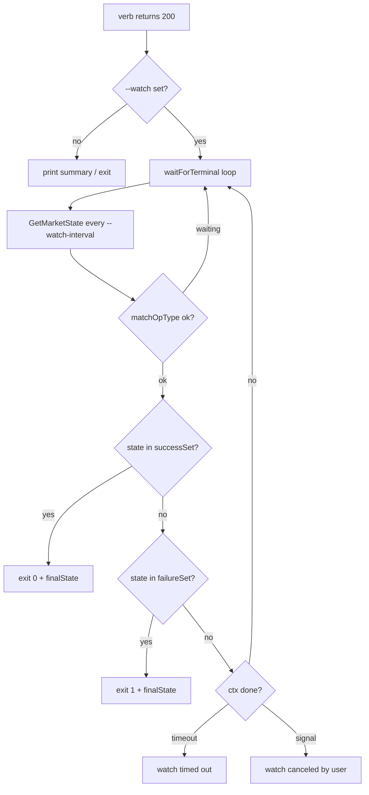

# market (App-store v2 + per-user market-backend)

**CRITICAL — before doing anything, MUST use the Read tool to read [`../olares-shared/SKILL.md`](../olares-shared/SKILL.md) for the profile selection, login, and HTTP 401/403 recovery rules that every command here depends on.**

## Core concepts

### Source resolution

The market backend serves multiple "sources" of charts. The CLI resolves which one to talk to from `-s / --source`, falling back to a default that depends on the verb:

| Source id    | What it is                                              | Used by (default)              |
|--------------|---------------------------------------------------------|--------------------------------|
| `market.olares` | Public catalog (read-only browse)                    | `list`, `get`, `categories`, `install`, `upgrade`, `clone`, `status` |
| `upload`     | Local source for charts pushed through the SPA's "Local Sources → Upload" UI **and** through `market upload` | `upload`, `delete` (hard-coded — see below) |
| `cli`        | Legacy local source for charts uploaded via earlier CLI revisions; still readable via `-s cli` on browse verbs but no longer a write target | read-only (`list`, `status`, ...) |
| `studio`     | Local source for charts produced by Devbox / Studio     | read-only (`list`, `status`, ...) |

Resolution is centralized in [`cli/cmd/ctl/market/common.go`](cli/cmd/ctl/market/common.go):

- `resolveCatalogSource(opts)` → `opts.Source` if set, else `defaultCatalogSource = "market.olares"`.
- `chartUploadSource = "upload"` constant — the **only** local source `market upload` and `market delete` ever write to. `-s` is intentionally NOT exposed on those two verbs: pinning the bucket avoids the historical foot-gun where a chart pushed to `cli` was invisible to the SPA's Local Sources tab despite using the same backend.

When `-s` is omitted, every command that DOES accept it prints `Using source: <id>` to stderr so the agent can confirm which backend it hit. `-a / --all-sources` (where supported) bypasses the single-source resolver and asks the backend across every source the user has access to.

### App lifecycle / state machine

The backend tracks two orthogonal axes per app: **`State`** (where the row currently is) and **`OpType`** (which mutation is in flight). The full enum lives in [`framework/app-service/api/app.bytetrade.io/v1alpha1/appmanager_states.go`](framework/app-service/api/app.bytetrade.io/v1alpha1/appmanager_states.go). The CLI groups them into four buckets in [`cli/cmd/ctl/market/watch.go`](cli/cmd/ctl/market/watch.go):

| Bucket               | Examples                                                        | Meaning                                  |
|----------------------|------------------------------------------------------------------|------------------------------------------|
| Progressing          | `pending`, `installing`, `upgrading`, `uninstalling`, `stopping`, `resuming`, `installingCanceling`, …Canceling | Backend is actively working; keep polling |
| Terminal success     | `running`, `stopped`, `uninstalled`                              | Mutation finished cleanly                |
| Terminal failure     | `installFailed`, `upgradeFailed`, `uninstallFailed`, `stopFailed`, `resumeFailed` | Mutation finished with a hard error      |
| Canceled / cancel-failed | `installingCanceled`, `upgradingCanceled`, `resumingCanceled`, `installingCancelFailed`, `upgradingCancelFailed`, `resumingCancelFailed` | A `cancel` request landed (or failed)    |

The CLI maps each verb to the subset of buckets it considers terminal — see the `--watch` section below.

### `OpType` vs `State` (race-safety)

The same `State` can mean different things depending on which mutation is in flight. Concrete example: an `upgrade` issued against an app already in `running` will return `state=running, opType=running` for one or two ticks before the backend flips to `state=upgrading, opType=upgrade`. A naive watcher would declare success at tick zero.

The fix lives in [`cli/cmd/ctl/market/watch.go`](cli/cmd/ctl/market/watch.go) (`waitForTerminal` + `watchTarget.matchOpType`): for mutating verbs the watcher refuses to accept any "success" classification until either:

1. the row's `OpType` matches the op the CLI just issued, **or**
2. the row disappears entirely (only legal for `uninstall` / `status`).

`cancel` and `status` deliberately set `matchOpType=false` because they are op-agnostic by design.

## Authentication transport

Every request goes through a factory-injected `*http.Client` whose `RoundTripper` (a `refreshingTransport` — see [`cli/pkg/cmdutil/factory.go`](cli/pkg/cmdutil/factory.go)) **injects `X-Authorization` and auto-rotates expired tokens transparently**. The `MarketClient` itself is purely an HTTP wrapper — it never sees the access_token.

- Base URL: `<rp.MarketURL>/app-store/api/v2` — built in [`cli/cmd/ctl/market/client.go`](cli/cmd/ctl/market/client.go) (`NewMarketClient` / `apiPrefix`).
- Auth header: `X-Authorization: <access_token>` (NOT `Authorization: Bearer …`). The transport handles header injection; the client code does not call `req.Header.Set("X-Authorization", …)` anywhere.
- `MarketURL` is derived from the Olares ID (`https://market.<localPrefix><terminusName>`) and surfaced through [`cli/pkg/credential/types.go`](cli/pkg/credential/types.go) (`ResolvedProfile.MarketURL`).
- Two clients in `MarketClient`: `httpClient` (30s timeout, JSON verbs) and `uploadClient` (no timeout, multipart chart pushes). Both share the SAME `refreshingTransport` instance via the Factory, so a refresh triggered on one is immediately visible on the other.
- 401/403 reaches `executeRequest` only when the transport already auto-refreshed and STILL got rejected (consistent server-side rejection); it's reformatted via `reformatMarketAuthErr`.
- When `/api/refresh` itself fails, `executeRequest` surfaces the typed `*credential.ErrTokenInvalidated` / `*credential.ErrNotLoggedIn` directly so the user sees the canonical "run profile login" CTA without `request failed: Get "https://...":` noise. **Recovery rules → [`../olares-shared/SKILL.md`](../olares-shared/SKILL.md) "Automatic token refresh".**

> All `market` verbs use replayable request bodies (JSON in `*bytes.Reader`, multipart in `*bytes.Buffer`), so they all benefit from the transport's reactive 401-retry path. There is no streaming-upload edge case in the market tree — chart pushes are fully buffered before the request goes out.

## Command cheatsheet

All verbs live under `olares-cli market <verb>`. Common flags:

- `-s / --source <id>` — pin to a single source (`market.olares` for the
  remote catalog; `cli` / `upload` / `studio` for local helm-chart
  sources). Auto-selected when omitted.
- `-a / --all-sources` — span every source the user has (where supported).
- `-o / --output {table,json}` — output format. Default `table`. `json`
  emits a parseable payload (and suppresses any informational stderr
  hints — see `-q` for the related "no output at all" toggle).
- `-q / --quiet` — suppress all stdout/stderr output; the exit code
  still propagates the operation result. Use in scripts that only need
  the success/failure signal (e.g. `olares-cli market list -q && ...`).
- `--no-headers` — omit table column headers (and the trailing
  "Total: N …" summary). **Exposed only on `list`, `categories`, and
  `get`** — the row-oriented browse verbs. Deliberately NOT on
  `status` (which always prints headers in table mode) or on any
  mutating verb (`install` / `upgrade` / `stop` / `resume` /
  `uninstall` / `cancel` / `clone` / `upload` / `delete`), where it
  would be a no-op footgun in scripts that pass it expecting it to
  apply. Useful for piping a stable table format into `awk` / `cut`
  / `column` etc. without needing JSON. Has no effect in JSON
  output. (No short flag.) Wiring lives in `addNoHeadersFlag` in
  [`cli/cmd/ctl/market/options.go`](cli/cmd/ctl/market/options.go)
  — separate from `addOutputFlags` (which only carries `-o` / `-q`),
  so adding a new browse verb means explicitly opting in.
- Mutating verbs additionally accept `-w / --watch` plus the timing
  knobs (see the [`--watch`](#watch-flag) section).

**`-o` and `-q` are on EVERY market verb** — read-only and mutating
alike — because every verb has something to print (a table, an
`OperationResult`, a chart-management payload) and benefits from a
quiet mode in scripts. Concretely:

- `olares-cli market install firefox -o json` → emits a single
  `OperationResult` JSON document (see
  [Lifecycle output shape](#lifecycle-output-shape) below) and
  suppresses the stderr `info` chatter (`Installing 'firefox' ...`).
- `olares-cli market install firefox -q` → no stdout, no stderr,
  exit code reflects backend acceptance (or, when combined with
  `--watch`, terminal success / failure).
- `olares-cli market uninstall firefox -o json -q` is contradictory
  but tolerated — `-q` wins and nothing is printed.

`-s` (source pin) and `-a` (span all sources) are narrower. Scope by
verb family:

| Flag             | Read-only browsing                                      | Lifecycle (mutating)                                          | Chart management   |
|------------------|---------------------------------------------------------|---------------------------------------------------------------|--------------------|
| `-s / --source`  | `list`, `categories`, `status`, `get`                   | `install`, `upgrade`, `clone`                                 | `upload`, `delete` |
| `-a / --all-sources` | `list`, `categories`, `status`                      | —                                                             | —                  |

`-s` is NOT on `uninstall` / `stop` / `resume` / `cancel`: these act
on whichever per-user state row matches the app name, regardless of
source. `-a` is read-only only — the inventory verbs use it to span
sources; mutating an app implicitly targets the source the user is
already running it from.

`--no-headers` is the narrowest — only `list`, `categories`, and
`get` (the row-oriented browse verbs).

Combine freely — e.g. `olares-cli market list --mine --no-headers
-o table` for a header-less table you can pipe into shell tools, or
`olares-cli market categories -q` to just check exit status, or
`olares-cli market install firefox --watch -o json | jq '.finalState'`
to read the watcher's verdict.

### Catalog (read-only)

```bash
olares-cli market list                          # auto-selected source (usually market.olares)
olares-cli market list -s market.olares         # narrow to a specific source by id
olares-cli market list -s cli                   # browse a local source (cli / upload / studio)
olares-cli market list -c AI                    # filter by category
olares-cli market list -a                       # query every source the user has
olares-cli market list -o json
olares-cli market list --no-headers             # table without column headers (scripting)
olares-cli market list -q                       # no output; exit code only
```

`-s / --source` works for both catalog browse and `--mine`: it pins the
listing to a single source id. Valid ids are `market.olares` (the
official remote catalog) and the three local-chart sources — `cli`,
`upload`, `studio` — used for locally-uploaded helm charts. Omit `-s`
to fall back to the auto-selected source (catalog browse) or to span
every source the user has (`--mine`). The id is matched verbatim and
unknown ids silently produce an empty result (the listing prints a
"no apps in source 'X'" hint on stderr rather than erroring out), so
when you're unsure what's available run `olares-cli market list -a` and
read the SOURCE column to enumerate the user's configured sources.

```bash
olares-cli market list --mine                   # what apps does this user have right now (all sources by default)
olares-cli market list -m -s cli                # narrow to a single source
olares-cli market list -m -c AI -o json         # category filter still works in mine mode
```

`list --mine` (alias `-m`) diverts the verb from `/market/data`
(catalog browse) to `/market/state` (per-user state rows) and is the
canonical "show me my apps" listing — the exact same set the Market UI's
"My Terminus" tab shows.

> **"My apps" ≠ "已安装应用 / completed installs only."** The Market UI
> shows in-flight install rows (`pending` / `downloading` / `installing`
> + their `*Canceling` / `*CancelFailed` variants), every post-install
> transitional state (`upgrading` / `resuming` / `stopping` /
> `applyingEnv` / `uninstalling`) and every post-install failure
> (`upgradeFailed` / `stopFailed` / `resumeFailed` / `applyEnvFailed` /
> `uninstallFailed`) on My Terminus as well, because they're all "the
> user's apps" — the user clicked something and expects to monitor /
> retry / cancel the row. `--mine` matches that mental model. Only the
> 6 SPA-hidden states (see below) drop out.

Differences vs catalog browse:

- **Source scope defaults to every source** — pass `-s` to narrow to one,
  `-a` (or omitting `-s`) keeps the full cross-source view. This matches
  the agent's mental model of "show me my apps" without forcing `-a`.
- **State filter mirrors the SPA's "My Terminus" filter exactly.** The
  denylist is the SPA's `uninstalledAppStates` set in
  [`apps/packages/app/src/constant/config.ts`](apps/packages/app/src/constant/config.ts)
  (around line 170), which `MarketRemotePage.vue` →
  `appStore.getSourceInstalledApp(sourceId)` calls through
  `uninstalledApp(status)` to decide what shows up under the Market's
  "My Terminus" tab. The 6 hidden states are: `pendingCanceled`,
  `downloadingCanceled`, `downloadFailed`, `installFailed`,
  `installingCanceled`, `uninstalled`. Everything else stays — including
  in-flight install rows (`pending`, `downloading`, `installing` plus
  their `*Canceling` / `*CancelFailed` variants), `initializing` /
  `initializingCanceling`, and every post-install transitional /
  failure state (`running`, `stopped`, `stopping`, `stopFailed`,
  `resuming`, `resumeFailed`, `upgrading`, `upgradeFailed`,
  `uninstalling`, `uninstallFailed`, `applyingEnv`, `applyEnvFailed`,
  `*Canceling` / `*Canceled` / `*CancelFailed` siblings).
  - This deliberately does NOT mirror the backend state machine in
    `framework/app-service/pkg/appstate/state_transition.go`: the SPA
    keeps `pending` / `downloading` / `installing` rows visible on My
    Terminus because the user just clicked install and wants to
    see / monitor / cancel the in-progress row, so the CLI must show
    them too for the two views to agree.
  - Use `market status` if you specifically want a runtime-state view.
  - If the SPA changes its `uninstalledAppStates` set, update the
    `notInstalledStates` map in `cli/cmd/ctl/market/types.go` and the
    `TestIsInstalledState` / `TestFetchInstalledAppsMirrorsSpaUninstalledFilter`
    tables in `cli/cmd/ctl/market/list_test.go` together so the two
    listings stay in sync.
- **Output adds a STATE column** and (for JSON) a `state` field.
- **Version is the version on the user's state row**, not the catalog
  latest. It comes from the `version` field at the `AppStateLatest`
  level of `/market/state` (the same field the SPA's `AppStatusLatest`
  interface reads) — the chart the user picked for this row, regardless
  of whether the install / upgrade has completed. If the user installed
  1.0.10 and the marketplace catalog has since moved to 1.2.3, this
  listing will surface 1.0.10 — that is the intended behavior; do not
  "correct" it to the catalog version. During an upgrade in flight,
  the row may show the target version while STATE is still `upgrading`,
  which is also intentional. Title and categories ARE best-effort
  enriched from `/market/data`; locally-uploaded charts that have since
  been deleted from their source still surface but may render with
  blank title / categories. Version is left blank only when the state
  row genuinely lacks it (older backends, in-flight rows that haven't
  been bound yet).
- **Clones look up the catalog by `rawAppName`, not their unique
  `name`.** A cloned multi-instance app gets its own per-instance
  identifier (e.g. `windowsefe992`) but the catalog only knows the
  source app (`windows`). The state row carries the source name as
  `rawAppName`; the parser uses it as the catalog lookup key whenever
  non-empty (and falls back to `name` for normal non-clone installs)
  so clones still pick up the source app's title and categories. Source
  of truth for the rule: `framework/app-service/pkg/utils/app/app.go`
  `GetRawAppName`.

```bash
olares-cli market categories                    # category counts in the auto-selected source
olares-cli market categories -s market.olares   # pin to a single source
olares-cli market categories -a -o json         # every source, JSON output
olares-cli market categories --no-headers       # table without the CATEGORY/APPS header row
olares-cli market categories -q                 # no output; exit code only
```

```bash
olares-cli market get firefox                   # detailed info, table view
olares-cli market get firefox -o json           # full upstream payload
```

`get` answers questions like "is this app cloneable?" — look at the `cloneable` field in JSON output (see [`cli/cmd/ctl/market/get.go`](cli/cmd/ctl/market/get.go)).

### Runtime (read-only)

```bash
olares-cli market status                        # all installed apps in the resolved source
olares-cli market status -s market.olares       # pin the listing to a specific source
olares-cli market status firefox                # one app, with the source-fallback hint
olares-cli market status firefox -a             # search across every source
olares-cli market status firefox --watch        # see the --watch section
olares-cli market status firefox -q             # no output; exit code only
```

`status <app>` UX rules — implemented in [`cli/cmd/ctl/market/status.go`](cli/cmd/ctl/market/status.go) (`runStatusSingle`):

- If the row is missing in the resolved source **and** in every other source the user has, the CLI prints `app 'X' is not installed (run 'olares-cli market install X' to install it)`.
- If the row exists but under a different source than the one the user passed, the CLI prints an info hint `App is installed under source 'Y' (not 'X')` and continues to render the row, so the agent does not need to retry blindly.
- `runStatusAll` (no app argument) explicitly rejects `--watch`. Use `status <app> --watch` instead.

> `market status` (no app) and `market list --mine` overlap but are
> not interchangeable: `status` is the runtime-state-focused view
> (`STATE / OPERATION / PROGRESS`, filters by source by default), while
> `list --mine` is the "my apps" inventory view
> (`NAME / TITLE / VERSION / STATE / SOURCE / CATEGORIES`, defaults to
> every source and hides exactly the same rows the Market SPA hides
> from its "My Terminus" tab — the 6 `uninstalledAppStates` listed in
> the State filter bullet above). Prefer `list --mine` when the
> user asks "what apps do I have" / "show me my apps" / "我的应用";
> prefer `status` when they want runtime / progress detail. Note that
> "my apps" deliberately INCLUDES in-flight installs and failed rows
> (not just `running` ones), since that is what the SPA shows.

### Lifecycle (mutating, support `--watch`)

```bash
olares-cli market install firefox --watch
olares-cli market install firefox --version 1.0.11 --env DEBUG=1 --watch
olares-cli market install firefox -o json                # one OperationResult JSON doc; status="accepted"
olares-cli market install firefox --watch -o json        # JSON with finalState/finalOpType populated
olares-cli market install firefox -q                     # silent; exit code only
olares-cli market install firefox --watch -q             # silent + block until terminal
olares-cli market install ollama-webui --watch --watch-timeout 30m       # bump deadline for image-pull-heavy installs
olares-cli market install firefox --watch --watch-interval 1s            # tight polling for fast feedback
olares-cli market install firefox --watch --watch-timeout 5m --watch-interval 1s   # tight CI bounds
```

```bash
olares-cli market upgrade firefox --version 1.0.12 --watch
olares-cli market upgrade firefox --version 1.0.12 -o json     # accepted payload only
olares-cli market upgrade firefox --version 1.0.12 --watch -o json | jq -r '.finalState'
olares-cli market upgrade firefox --version 1.0.12 --watch --watch-timeout 30m     # slow image pull
```

> **`upgrade` deliberately does NOT accept `--env`** — mirrors the Market SPA's `upgradeApp({app_name, source, version})` payload (see [`apps/.../components/appcard/InstallButton.vue`](apps/packages/app/src/components/appcard/InstallButton.vue) and [`useAppAction.ts`](apps/packages/app/src/components/appcard/useAppAction.ts)). Existing env values are preserved server-side from the prior install. To change env values, use `olares-cli market env --set KEY=value <app>` (out-of-band) — that's the same flow the SPA exposes via its env-editor dialog. The CLI's `UpgradeApp` wire payload uses a dedicated `UpgradeRequest` type that has no `envs` field, so passing envs accidentally is impossible.

#### `upgrade` pre-flight gates (parity with SPA `canUpgrade`)

Before issuing `PUT /apps/{name}/upgrade`, `runUpgrade` runs a four-gate
pre-flight that mirrors the SPA's `canUpgrade(statusLatest, appId,
sourceId)` predicate in [`apps/.../constant/config.ts`](apps/packages/app/src/constant/config.ts). All
four must pass or the CLI bails locally with a self-contained error
(formatted via `failOp` so `-o json` carries it in the `message` field
and `-q` still surfaces the exit code). The gates and their failure
modes:

| Gate | Source of truth | Pass condition | CLI error on failure |
|------|-----------------|----------------|----------------------|
| 1. **Row exists** | `GET /market/state` | `appName` is found via Name **or** RawName (clones included) | `cannot upgrade '<X>': app is not installed (no per-user state row); use 'olares-cli market install <X>' first` |
| 2. **State is upgradable** | `app_state_latest[].status.state` | state ∈ `{running, stopped, stopFailed, upgradeFailed, applyEnvFailed}` (verbatim mirror of SPA's `isUpgradableAppStates`) | `cannot upgrade '<X>' in state '<S>': upgrade is only allowed from running, stopped, stopFailed, upgradeFailed, applyEnvFailed; ...` |
| 3. **Strict semver newer** | `app_state_latest[].version` vs `--version` (or `resolveVersionInSource` latest) | `target > installed` after `Masterminds/semver/v3` strict-parse of both sides | `cannot upgrade '<X>': target version '<T>' is already installed — nothing to do` / `... is older than installed version '<I>'; downgrade via upgrade is rejected` |
| 4. **Not suspended** | `POST /apps` → `apps[0].app_simple_info.app_labels` | labels contain NEITHER `suspend` NOR `remove` (verbatim mirror of SPA's `suspendApp`) | `cannot upgrade '<X>': chart is marked 'suspend' or 'remove' in source '<S>' (the SPA hides the Upgrade button for the same reason); upstream has withdrawn this app` |

Gate behavior nuances worth knowing:

- **Soft-fail on probe error for gate 4**. If `/apps` errors or returns
  an empty `apps[]`, the preflight surfaces a one-line stderr warning
  (`warning: preflight could not read catalog metadata ...; skipping
  suspend-label check`) and **proceeds** with the upgrade. Same
  philosophy as `shouldAutoCascade` in [`uninstall.go`](cli/cmd/ctl/market/uninstall.go) — the
  backend has the final say, and we don't want a flaky catalog probe
  to block the user when gates 1–3 already passed. Gates 1–3 never
  soft-fail because their inputs come from the same `/market/state`
  response the row lookup already has in hand.
- **Source mismatch is a warning, not a failure**. If the installed
  row's source is `market.test` and the user passes `-s market.olares`,
  the preflight prints a stderr warning and continues — sometimes
  legitimate (chart moved between sources), and the backend can
  reject it cleanly if not.
- **Clones (RawName != Name)** use `RawName` for the gate-4 catalog
  lookup so a clone like `windowsefe992` reads its suspend label from
  the source app `windows`, matching how the SPA renders the upgrade
  button.
- **Mid-flight rows** (state row exists but `version` is empty —
  typical for `pending` / older backends) bail with `cannot upgrade
  '<X>': no version recorded on the state row (mid-flight install or
  older backend) — re-run 'olares-cli market status <X> --watch' until
  the row stabilizes, then retry`.

The whole predicate lives in [`cli/cmd/ctl/market/preflight.go`](cli/cmd/ctl/market/preflight.go) and is
pinned by [`preflight_test.go`](cli/cmd/ctl/market/preflight_test.go) (`TestIsUpgradableState`,
`TestIsAppSuspended`, `TestPreflightUpgrade`). If the SPA reshuffles
`isUpgradableAppStates` or `suspendApp`, update both the predicate
and its tests in lockstep so the CLI's bar tracks the dialog's bar.

```bash
olares-cli market uninstall firefox --watch
olares-cli market uninstall firefox --cascade --delete-data --watch   # see Security rules
olares-cli market uninstall ollamav2                                  # auto-cascade for single-user CS apps
olares-cli market uninstall ollamav2 --cascade=false                  # force no cascade on a CS app
olares-cli market uninstall firefox -o json                           # status="accepted"
olares-cli market uninstall firefox --watch -q                        # silent; exit code = 0 iff successfully uninstalled
olares-cli market uninstall firefox --watch --watch-interval 1s       # snappy uninstall completion signal
olares-cli market uninstall ollamav2 --cascade --watch --watch-timeout 30m   # cascade with large shared sub-charts
```

#### Auto-cascade for CS apps (`uninstall` / `stop`)

`uninstall` and `stop` both **auto-decide** their `--cascade` default to mirror the Market SPA's `csAppUninstall()` and `csAppStop()` dialogs (both in `apps/.../stores/market/csAppOperation.ts`, dispatched from `appService.ts`). When the user does **not** pass `--cascade`, the CLI:

1. Probes user count via `GET /api/users/v2` (`fetchUserTotals` in [`cli/cmd/ctl/market/users_helper.go`](cli/cmd/ctl/market/users_helper.go)).
2. If single-user, looks up the app's state row via `/market/state` using `lookupInstalledApp` ([`cli/cmd/ctl/market/preflight.go`](cli/cmd/ctl/market/preflight.go)) — the same helper `preflightUpgrade` uses, so both gates agree on what "the user's row" is. The row carries both the canonical `Name` (e.g. `windowsefe992`) AND a `RawName` (the source app, e.g. `windows`). **Match rule is strict on `Name`, NOT `RawName`**: when both the primary `windows` row and clones like `windowsefe992` (which carry `RawName=windows`) are installed, a query for `windows` MUST return the primary, never a clone. The SPA enforces the same contract — clicking "Upgrade" / "Uninstall" / "Stop" on a clone card sends the per-instance name, not the source name. The only fallback is the legacy / malformed case where a row has `Name=""` and `RawName=<appName>` — those still match by RawName because Name is empty (the only way the disambiguation rule could fire). See `TestLookupInstalledAppDisambiguatesPrimaryFromClones` for the pinned semantics.
3. Fetches catalog metadata via `/apps` using **`RawName` when present, falling back to `Name`** for the lookup key. **Clones (where `RawName != Name`) MUST go through `RawName` here** — the catalog (`/apps`) is indexed by source app, NOT by per-instance clone name, and the SPA's `csAppUninstall()` / `csAppStop()` read `AppFullInfo` the same way (keyed by source app under the hood). Using the clone name instead would return an empty `/apps` response, make `isCSV2` answer false, and silently flip `--cascade` off for single-user CS clones — diverging from the SPA. Same RawName-preferred-catalog-key trick is used by `preflightUpgrade` (`preflight.go`) and `fetchInstalledApps` (`list.go`); the three sites must stay in lockstep.
4. Runs `isCSV2(appInfo)` ([`cli/cmd/ctl/market/common.go`](cli/cmd/ctl/market/common.go)) on the result — TRUE only when `app_info.app_entry.apiVersion == "v2"` AND `subCharts` is non-empty (verbatim mirror of SPA's `isCSV2()` in `apps/.../constant/constants.ts`).
5. **`--cascade` defaults to `true` iff both conditions hold** (`single-user && isCSV2`). Otherwise default stays `false`. Shared decision helper `shouldAutoCascade` ([`cli/cmd/ctl/market/uninstall.go`](cli/cmd/ctl/market/uninstall.go)) is reused unchanged by `stop` ([`cli/cmd/ctl/market/stop.go`](cli/cmd/ctl/market/stop.go)). The auto-decision's stderr explainer surfaces the catalog key when it differs from the user's app name (e.g. `--cascade auto-enabled: single-user instance + v2 multi-chart app (via source app "windows" in source "market.olares") ...`), making the decision auditable when a clone is involved.

`--cascade` passed explicitly (`--cascade`, `--cascade=true`, `--cascade=false`) always wins — cobra's `cmd.Flags().Changed("cascade")` gates the auto-default so the override is non-ambiguous. Any probe error (HTTP failure, malformed catalog) **soft-fails to `--cascade=false`** (the historical default) — the verb always proceeds, the backend's own validation has the final say.

> **Why mirror SPA here instead of always defaulting `--cascade=false`?** The most common interactive uninstall / stop in Olares is a personal-cloud admin operating on a CS app like `ollamav2` (Ollama with shared GPU server sub-chart). The SPA dialog auto-checks "also tear down / stop the shared server" for the single-user-admin case and only surfaces the checkbox in multi-user setups so the admin can opt out. Without auto-cascade the CLI version of the same op leaves the shared sub-chart orphaned (uninstall) or running (stop), which breaks the next install or wastes the GPU. The auto-default puts `olares-cli market uninstall` / `stop` on parity with the dialog UX; explicit `--cascade=false` is the documented escape hatch.

> **Subtle SPA difference, same CLI surface.** `csAppUninstall` always shows a dialog (it has a "delete data" checkbox to confirm) and the cascade checkbox visibility is gated by `csApp && isAdmin && users > 1`; `csAppStop` skips the dialog entirely for non-CS / non-admin (returns `all=false`) AND for single-user CS (returns `all=true`), only popping for the CS-admin-multi-user case. The CLI collapses both flows to the same `single-user && isCSV2 ⇒ default true` rule because it is non-interactive — there is no dialog to pop in the multi-user branch, so the CLI keeps the conservative `false` default there and asks the user to opt in with `--cascade`.

> **"CS" here is the SPA's `isCSV2` — v2 multi-chart — NOT `clusterScoped`.** They are independent concepts: `clusterScoped` controls install permissions (admin-only); `isCSV2` controls cascade semantics. Updating only one when the SPA changes its predicate will silently desync the CLI from the dialog.

> **The `--cascade` JSON wire field is `all`, not `cascade`** — same field the SPA's DELETE / `/apps/{name}/stop` payloads use. See `UninstallRequest` in [`cli/cmd/ctl/market/types.go`](cli/cmd/ctl/market/types.go) and `StopApp` in [`cli/cmd/ctl/market/client.go`](cli/cmd/ctl/market/client.go).

```bash
olares-cli market clone firefox --title "Firefox (work)" --watch
olares-cli market clone firefox --title "FF" --entrance-title firefox=Work --watch
olares-cli market clone firefox --title "FF" --watch -o json   # JSON includes targetApp (the backend-assigned clone name)
olares-cli market clone firefox --title "FF" --watch -q        # silent; exit code only
olares-cli market clone firefox --title "FF" --watch --watch-timeout 30m   # large chart with slow first-time pull
```

`clone` quirks (cite [`cli/cmd/ctl/market/clone.go`](cli/cmd/ctl/market/clone.go)):

- `--title` is required and capped at 30 characters.
- The clone target name is decided by the backend; the CLI tracks it in `OperationResult.TargetApp` and falls back to the source app name only if the backend never reports one. **Read `targetApp` from the JSON output** — it's the only way to discover the unique per-instance identifier (e.g. `windowsefe992`) the backend just minted.
- Only multi-instance apps are cloneable — confirm with `market get <app>` (`cloneable: true`) before running.

```bash
olares-cli market stop firefox                          # fire-and-forget; returns once backend accepts (status="accepted")
olares-cli market resume firefox                        # fire-and-forget; returns once backend accepts
olares-cli market stop firefox --watch
olares-cli market stop firefox --cascade --watch        # force cascade (also stop dependents)
olares-cli market stop ollamav2 --watch                 # auto-cascade for single-user CS apps (see SPA-parity note below)
olares-cli market stop ollamav2 --cascade=false --watch # force NO cascade on a CS app
olares-cli market resume firefox --watch
olares-cli market stop firefox --watch -o json          # JSON; idempotent on already-stopped (see Idempotent shortcut)
olares-cli market stop firefox --watch -q               # silent
olares-cli market stop firefox --watch --watch-interval 1s --watch-timeout 2m   # snappy + tight cap
olares-cli market resume firefox --watch --watch-interval 1s --watch-timeout 2m
```

> **Bare invocation semantics** (`market stop firefox` / `market resume firefox` with **no other flags**): the CLI fires one `POST /apps/{app}/stop` (or `/resume`) and returns the moment the backend accepts the request — the row may still be in `stopping` / `resuming` when the CLI exits. The exit code reflects acceptance only (HTTP 2xx, request well-formed), **not** terminal landing. Use `--watch` if you need the CLI to block until the row reaches `stopped` / `running`, or re-attach after the fact with `olares-cli market status firefox --watch`.

`stop` shares the same auto-cascade rule as `uninstall` — see [Auto-cascade for CS apps](#auto-cascade-for-cs-apps-uninstall--stop) above. TL;DR: omit `--cascade` and the CLI checks `single-user && isCSV2`; if both hold, `--cascade` defaults to `true` and prints a one-line stderr explainer; otherwise stays `false`. The on-wire field is `all` (matches the SPA's stop payload), passed through `MarketClient.StopApp` ([`cli/cmd/ctl/market/client.go`](cli/cmd/ctl/market/client.go)).

```bash
olares-cli market cancel firefox --watch                 # cancel the in-flight op
olares-cli market cancel firefox --watch -o json         # JSON; finalState is one of the *Canceled states
olares-cli market cancel firefox --watch -q              # silent
olares-cli market cancel firefox --watch --watch-interval 1s --watch-timeout 2m   # cancel is usually fast
```

`cancel` always sets `matchOpType=false` (it is itself op-agnostic) — see [`cli/cmd/ctl/market/cancel.go`](cli/cmd/ctl/market/cancel.go).

### Local sources (chart push)

`upload` and `delete` **always** target the SPA's "Local Sources → Upload" bucket (`chartUploadSource = "upload"` constant in [`cli/cmd/ctl/market/common.go`](cli/cmd/ctl/market/common.go)). Neither verb exposes `-s / --source` — passing `-s` to either is a flag-parse error from cobra. Rationale: the SPA's Local Sources tab manages a single `upload` bucket; offering the CLI's old `cli` / `studio` write targets meant a CLI-pushed chart could be invisible to the SPA, which broke every "upload then install via SPA" flow. Pinning the source eliminates that desync.

```bash
olares-cli market upload ./myapp-1.0.0.tgz                # writes to source 'upload' (the only valid target)
olares-cli market upload ./charts/                        # all .tgz / .tar.gz under dir
olares-cli market upload ./myapp-1.0.0.tgz -o json        # JSON: per-file status=success/failed, includes filename + message
olares-cli market upload ./charts/ -q                     # silent; exit code aggregates per-file results
```

```bash
olares-cli market delete myapp                            # latest version in source 'upload'
olares-cli market delete myapp --version 1.0.0
olares-cli market delete myapp -o json                    # OperationResult-shaped: status=success on accepted delete
olares-cli market delete myapp -q                         # silent
```

`upload` does not run a chart — `install <app> -s upload` does (note the
new install source: previously `cli`, now `upload` to match the bucket
the CLI writes to). Unlike the lifecycle verbs, `upload` returns
`status="success"` immediately on accepted upload (there is no async
chart-store reconciliation to wait for) and `delete` does the same on
accepted delete. Neither supports `--watch`.

> **Migration note for existing scripts.** Anything passing `-s cli` /
> `-s studio` to `market upload` or `market delete` will now fail with
> `unknown flag: -s`. Drop the flag — the target is implicit. Charts
> that were previously uploaded to `cli` via older CLI revisions can
> still be **read** with `market list -s cli` but must be re-uploaded
> through the new path (which lands them in `upload`) for the SPA's
> Local Sources tab to see them.

<a id="lifecycle-output-shape"></a>
### Lifecycle output shape (`-o json` / `-q`)

Every mutating verb (`install`, `upgrade`, `uninstall`, `clone`, `stop`,
`resume`, `cancel`, `upload`, `delete`) emits exactly **one** JSON
document under `-o json` and **nothing** under `-q` (exit code carries
the signal). The struct is `OperationResult` in
[`cli/cmd/ctl/market/types.go`](cli/cmd/ctl/market/types.go):

```json
{
  "app": "firefox",
  "operation": "install",
  "status": "accepted",
  "message": "install requested for version 1.0.11",
  "source": "market.olares",
  "version": "1.0.11",
  "user": "guotest458@olares.com"
}
```

The `status` field transitions through:

| Mode                         | `status` value                          | `finalState` / `finalOpType` | Exit code |
|------------------------------|------------------------------------------|------------------------------|-----------|
| Without `--watch` (accepted) | `"accepted"`                             | omitted                      | 0         |
| `--watch` reaches success    | `"success"`                              | populated                    | 0         |
| `--watch` reaches failure    | `"failed"`                               | populated (terminal state)   | non-zero  |
| `--watch` times out          | `"failed"` (with timeout message)        | last-seen state              | non-zero  |
| Request rejected pre-flight  | `"failed"` (HTTP error or validation)    | omitted                      | non-zero  |
| `upload` / `delete`          | `"success"` (no async lifecycle to wait) | n/a                          | 0         |

`finalState` / `finalOpType` carry the `omitempty` JSON tag so non-watch
invocations stay byte-identical to the pre-watch CLI release —
existing scripts that parse `OperationResult` continue to work
unchanged.

Useful one-liners:

```bash
# Read the final landing state (only present under --watch):
olares-cli market install firefox --watch -o json | jq -r '.finalState'

# Discover a clone's backend-assigned name:
olares-cli market clone firefox --title "FF" --watch -o json | jq -r '.targetApp'

# Quiet mode purely for CI gating:
if olares-cli market install firefox --watch -q; then
    echo "install ok"
fi
```

`-q` ALSO swallows the stderr `info` lines that lifecycle verbs print
between transitions (`Installing 'firefox' ...`, `[firefox] state=running
op=install ...`); `-o json` swallows only `info` and reroutes the final
result to stdout as JSON.

<a id="watch-flag"></a>
## `--watch` (block until terminal state)

The synchronous CLI experience: lifecycle verbs return immediately when the backend accepts the request, but the actual mutation is asynchronous. `--watch` polls the same backend the SPA polls and only returns once the row reaches a terminal state (or the watcher gives up). Implementation lives in [`cli/cmd/ctl/market/watch.go`](cli/cmd/ctl/market/watch.go) (`waitForTerminal`, `runWithWatch`, `newWatchTarget`).

### Flags

Defined in [`cli/cmd/ctl/market/options.go`](cli/cmd/ctl/market/options.go) (`addWatchFlags`):

- **`-w / --watch`** — opt-in. Default **off**. When off, the verb prints
  `OperationResult{status:"accepted"}` and returns immediately; the
  backend lifecycle still runs asynchronously and the user must follow
  up with `status --watch` (see [recovery](#status--watch-op-agnostic-recovery))
  to confirm landing.
- **`--watch-timeout`** *(duration; default `15m`)* — total deadline
  for the watch loop. If the row hasn't reached a terminal state by
  this point, the watcher exits with `<op> '<app>' watch timed out
  (last state: <S>, op: <O>)` and the process returns non-zero. The
  mutation **is not canceled** on timeout (re-attach with `status
  --watch`). Accepts Go-style durations: `90s`, `5m`, `30m`, `1h`,
  `2h30m`. **No effect without `--watch`.** Pick by op cost: install
  / upgrade of image-pull-heavy charts on slow links → `30m`–`1h`;
  stop / resume / cancel → `2m`–`5m` is plenty; uninstall → default
  `15m` is usually fine.
- **`--watch-interval`** *(duration; default `2s`)* — polling cadence
  for `GET /market/state`. The watcher fetches one snapshot per
  interval, classifies it (see [Per-op terminal sets](#per-op-terminal-sets))
  and either decides terminal or sleeps another `--watch-interval`.
  Lower values (`500ms`, `1s`) give snappier CI feedback at the cost
  of more backend load; raise to `5s`–`10s` on slow / metered networks
  or when running many parallel watchers. **No effect without
  `--watch`.** Note `--watch-interval` is **wall-clock**, not "tries
  to reach terminal that many times" — the watcher quits the moment
  the deadline computed from `--watch-timeout` passes regardless of
  how many polls fit.

#### Tuning quick reference

| Scenario                                                  | `--watch-interval` | `--watch-timeout` | Why                                                                                |
|-----------------------------------------------------------|--------------------|-------------------|------------------------------------------------------------------------------------|
| Default (interactive shell)                               | `2s`               | `15m`             | Built-in defaults; covers most installs on a normal home cluster.                  |
| Tight CI / e2e feedback                                   | `1s`               | `5m`              | Faster pickup of terminal state; cap shorter so failed tests don't hang a job.     |
| Image-pull-heavy install (Stable Diffusion, Ollama, ...)  | `2s`–`5s`          | `30m`–`1h`        | Pulls can dominate; default 15m may timeout right before `running`.                |
| Slow / metered network                                    | `5s`–`10s`         | `30m`             | Cuts polling chatter, keeps deadline comfortable.                                  |
| Stop / resume / cancel                                    | `1s`               | `2m`              | Terminal state arrives in seconds; tight bounds catch real failures fast.          |
| Uninstall (cascade-heavy, sub-charts to tear down)        | `2s`               | `15m`             | Cascade work can serialize; default is OK, raise timeout if shared chart is large. |

### Per-op terminal sets

| Op           | Success                                      | Failure                                                  | `matchOpType` | `absentMeansSuccess` | `acceptInitialAbsent` | `idempotentSuccess` |
|--------------|----------------------------------------------|----------------------------------------------------------|---------------|----------------------|-----------------------|---------------------|
| `install`    | `running`                                    | `*Failed` ∪ `*Canceled`                                  | true          | false                | false                 | false               |
| `clone`      | `running`                                    | `*Failed` ∪ `*Canceled`                                  | true          | false                | false                 | false               |
| `upgrade`    | `running`                                    | `upgradeFailed` ∪ `*Canceled`                            | true          | false                | false                 | false               |
| `uninstall`  | `uninstalled` (or row absent)                | `uninstallFailed`                                        | true          | true                 | **true**              | false               |
| `stop`       | `stopped`                                    | `stopFailed`                                             | true          | false                | false                 | **true**            |
| `resume`     | `running`                                    | `resumeFailed` / `resumingCanceled` / `resumingCancelFailed` | true       | false                | false                 | **true**            |
| `cancel`     | `*Canceled` ∪ `*Failed` ∪ `running` / `stopped` / `uninstalled` (or row absent) | `*CancelFailed`                       | **false**     | **true**             | false                 | false               |
| `status`     | `running` / `stopped` / `uninstalled` / `*Canceled` | `*Failed` / `*CancelFailed`                       | **false**     | true                 | false                 | n/a (op-agnostic)   |

The `*` columns expand to the matching state-set constants (`operationFailedStates`, `cancelFailedStates`, `canceledStates`) defined in [`cli/cmd/ctl/market/watch.go`](cli/cmd/ctl/market/watch.go).

### Tick-zero absent shortcut (`uninstall`)

`uninstall` is the only verb where the row being **absent from the very first poll** counts as terminal success. Other `absentMeansSuccess` verbs (currently just `status --watch`) require having seen the row at least once before treating its disappearance as success.

The driving scenario: multi-user CS app (e.g. `ollamav2` — v2 multi-chart with shared sub-charts).

1. `olares-cli market uninstall ollamav2 --watch` (no `--cascade`, multi-user default) clears the per-user row; the watch sees `uninstalling → row gone` and exits cleanly via the `seen-then-absent` path.
2. `olares-cli market uninstall ollamav2 --cascade --watch` re-runs to tear down the shared sub-charts. The backend accepts the DELETE, but the user's per-user row was already cleared in step 1 and does **not** re-appear in `/market/state` for the cascade-only pass. Without the tick-zero shortcut, the `seen` gate is never satisfied and the watcher would hang until `--watch-timeout` (~15m) and then exit with a timeout error.

`uninstall` therefore sets `acceptInitialAbsent = true` in `newWatchTarget`. Inside `waitForTerminal` the absent branch accepts either:

- `absentMeansSuccess ∧ seen` — canonical "we saw the row, then the backend pruned it" (covers both step-1 above and `status --watch` while an uninstall is in flight); **or**
- `absentMeansSuccess ∧ acceptInitialAbsent` (uninstall only) — tick-zero absence, covering step-2 above plus `uninstall` on an already-uninstalled app.

`status --watch` deliberately does **not** opt in: its production entry point (`runStatusSingle` in [`cli/cmd/ctl/market/status.go`](cli/cmd/ctl/market/status.go)) fetches the initial row before invoking `waitForTerminal`, so "first-poll absent" there would only ever mean "row just disappeared between the prefetch and our first poll" — already handled by the `seen` path. The classifier still independently refuses the tick-zero shortcut for `watchStatus` to keep that invariant intact even if a future caller wires status in differently (regression-guarded by `TestWaitForTerminalStatusDoesNotShortCircuitOnInitialAbsent`).

`install` / `upgrade` / `clone` / `cancel` likewise stay off the shortcut: tick-zero absence for those verbs means "not yet provisioned", not "done". A misclassification there would falsely report success on a row the backend hasn't even started yet.

Coverage: `TestWaitForTerminalUninstallAbsentFromStart` (the cascade-re-run hang case) and `TestWaitForTerminalUninstallAbsent` (seen-then-absent) in [`cli/cmd/ctl/market/watch_test.go`](cli/cmd/ctl/market/watch_test.go).

### Idempotent no-op shortcut (`stop` / `resume`)

Some ops are no-ops when the row is already at the target state:

- `market stop firefox --watch` when `firefox` is already `stopped`.
- `market resume firefox --watch` when `firefox` is already `running`.

The backend treats these requests as no-ops and **does not** bump the row's `OpType` to `stop` / `resume` — it simply leaves the row at `{state=stopped|running, opType=""}`. Under the default strict OpType gate the watcher would never see `OpType` flip to its target verb and would hang until `--watch-timeout` fires (~15m default), then exit with a timeout error. This was a real reported regression on `market stop firefox --watch`.

`stop` and `resume` therefore set `idempotentSuccess = true` in `newWatchTarget`. Inside `waitForTerminal` the classifier accepts:

- `state ∈ successSet ∧ matchesOpType(row)` — the normal lifecycle path (`stop → stopping → stopped, op=stop`); **or**
- `state ∈ successSet ∧ row.OpType == ""` (only when `idempotentSuccess`) — the no-op short-circuit (`stop` against already-`stopped`, `op=""`).

The shortcut **only** applies to the success set, never to the failure set: a stale `stopFailed` row with `OpType=""` from some prior lifecycle is intentionally classified as still-progressing rather than as a fresh failure of the request we just issued.

Crucially, `install` and `upgrade` deliberately do **not** opt into this shortcut. `{state=running, opType=""}` for those ops is ambiguous — it could mean "we're done" or "stale row from a previous install of a different version, new install op not yet picked up by the backend" — and the strict OpType gate is the only way to keep tick-zero classification race-safe. Coverage: `TestClassifierStopAlreadyStopped`, `TestClassifierResumeAlreadyRunning`, `TestClassifierInstallNoIdempotentShortcut`, plus end-to-end `TestWaitForTerminalStopOnAlreadyStopped` / `TestWaitForTerminalResumeOnAlreadyRunning` in [`cli/cmd/ctl/market/watch_test.go`](cli/cmd/ctl/market/watch_test.go).

### Broad terminal set for `cancel`

`cancel` deliberately has the **widest** success set of any verb — wider even than `status`. Once the cancel request has been accepted by the backend, the watcher is really asking "did the row stop moving?", not "did the row reach a specific terminal state". Classifying narrowly here would hang the watch on perfectly-settled rows.

The driving scenarios (all reproduced as regression tests):

- `market cancel firefox --watch` issued during `downloading`, but the download had already terminally failed before the cancel arrived. The row settles at `downloadFailed` and never visits any `*Canceled` state.
- `market cancel firefox --watch` issued during `installing`, partial-install rollback brings the chart to a stable `stopped` state.
- `market cancel firefox --watch` raced and lost: the underlying install completed before the DELETE landed. Row is at `running`. From the user's POV the cancel didn't prevent the install, but the row is **settled** and the watch should not hang — `OperationResult.State` will surface `running` so the caller can decide whether to redo (uninstall + reinstall) or accept.
- CS app cancel-during-install where backend rollback prunes the per-user row entirely. The watcher needs `absentMeansSuccess` (with the standard `seen` guard) to terminate cleanly.

The full success set for `watchCancel`:

- `canceledStates` — `*Canceled` (original semantics; what the SPA renders as "Canceled")
- `operationFailedStates` — `*Failed` (underlying op died terminally before / during cancel; cancel "won by default")
- `{running, stopped, uninstalled}` — stable resting states (cancel raced and lost OR rollback brought the row to a stable terminus)
- **plus** `absentMeansSuccess = true` (with `acceptInitialAbsent = false`, the safe `seen`-first variant)

Failure stays narrow on purpose: **only** `cancelFailedStates` (`*CancelFailed`) is classified as cancel-failure. That's the one and only signal that the cancel request itself was rejected by the backend — exit non-zero, surface to the caller, retry path is "wait for the in-flight op to finish, then act on the result".

This is intentionally different from `status --watch`, which treats `*Failed` as failure (because `status` is asking "is the app OK?"). For `cancel` the question is "did the cancel request land?", and a terminally-failed underlying op IS a kind of cancel-success — the row will never reach `running` and that's exactly what the user asked for.

Coverage: `TestClassifierCancelIgnoresOpType`, `TestClassifierCancelBroadTerminalSet`, plus end-to-end `TestWaitForTerminalCancelLifecycle`, `TestWaitForTerminalCancelLandsOnDownloadFailed`, `TestWaitForTerminalCancelLandsOnStopped`, `TestWaitForTerminalCancelStillFailsOnCancelFailed` in [`cli/cmd/ctl/market/watch_test.go`](cli/cmd/ctl/market/watch_test.go).

### `status --watch` (op-agnostic recovery)

The reason `status` got its own `--watch` even though it is read-only: a user runs `install firefox` *without* `--watch`, then five minutes later wants to know whether it landed. The recovery is:

```bash
olares-cli market status firefox --watch
```

The watcher uses `case watchStatus` in `newWatchTarget` (see [`cli/cmd/ctl/market/watch.go`](cli/cmd/ctl/market/watch.go)): any **stable** terminal state is success (the user did not declare an op, so any quiescent state is fine), and a row that has disappeared between ticks is also treated as success. `matchOpType` is forced to `false` so the CLI does not get stuck waiting for a specific OpType that is not its own.

`status --watch` requires an app name — see the errors table.

### OpType gating in practice

Concretely, `upgrade`'s watcher will not classify `state=running, opType=running` (or any leftover OpType from the previous mutation) as success. It waits until the backend reports `opType=upgrade` at least once, and only then accepts a `state=running` tick as terminal success. The same logic protects `install` after a previous `upgrade`, etc.

### Output semantics

| Mode                | What the user sees                                                                 |
|---------------------|-------------------------------------------------------------------------------------|
| TTY (`-o table`)    | Per-transition `info` lines on stderr (`installing`, `running`, …) and final OK/Fail line. |
| `-o json`           | Exactly **one** final `OperationResult` JSON document with the new `finalState` / `finalOpType` fields populated (`omitempty` keeps non-watch JSON output unchanged). |
| `-q / --quiet`      | No transition lines, no final summary; exit code still reflects success/failure.    |

### Ctrl-C and timeout

- The watch context is wrapped in `signal.NotifyContext` for `SIGINT` / `SIGTERM`. Pressing Ctrl-C exits cleanly with `<op> '<app>' watch canceled by user`. **The underlying mutation is NOT canceled** — re-attach with `status --watch` if needed.
- Timeout exits with `<op> '<app>' watch timed out (last state: <S>, op: <O>)`. The mutation again may still be running on the cluster; `status --watch` is the canonical recovery.
- After three consecutive transport errors the watcher gives up with `<op> '<app>' watch aborted after N consecutive errors`.

### Watch flow (mermaid)



## Common errors → fixes

| Error message                                                                             | Cause                                                              | Fix                                                                    |
|-------------------------------------------------------------------------------------------|---------------------------------------------------------------------|------------------------------------------------------------------------|
| `server rejected the access token (HTTP 401/403)`                                         | Profile token is expired / wrong / missing                          | Defer to [`../olares-shared/SKILL.md`](../olares-shared/SKILL.md) (login + profile rules) |
| `app 'X' is not installed (run 'olares-cli market install X' to install it)`              | Row missing in every source the user has                            | It really is not installed — install it, or check spelling             |
| `App is installed under source 'Y' (not 'X')` (info, not error)                           | The user passed `-s X` but the row lives in source `Y`              | Re-run with `-s Y` for a clean filter, or `-a` to query every source   |
| `--watch requires an app name (...)`                                                      | `status --watch` (or any lifecycle verb) was invoked without an app | Pass an app name, or drop `--watch` for the listing                    |
| `<op> '<app>' watch timed out (last state: <S>, op: <O>)`                                 | `--watch-timeout` elapsed before terminal state                     | Bump `--watch-timeout`, or drill into the stuck state via `market status <app>` |
| `<op> '<app>' watch canceled by user`                                                     | User pressed Ctrl-C                                                 | The mutation is likely still running on the cluster — re-attach with `market status <app> --watch` |
| `<op> '<app>' watch aborted after N consecutive errors`                                   | Network / proxy flake during polling                                | Check connectivity, then re-attach with `status --watch`               |
| `--title is required for cloning` / `--title cannot exceed 30 characters`                 | `clone` was invoked without a valid title                           | Pass `--title "<= 30 chars>"`                                          |
| `app '<app>' from source '<src>' does not support clone`                                  | App is single-instance only                                         | Verify with `market get <app>`; only `cloneable: true` apps clone      |
| `invalid version '<v>'`                                                                   | `--version` value is not semver (`MAJOR.MINOR.PATCH[-pre][+meta]`)  | Use a valid semver string                                              |
| `unknown flag: -s` (on `upload` / `delete`)                                               | Legacy script still passes `-s` to `upload` / `delete`              | Drop the flag — both verbs now hard-code source to `upload` (see Local sources). For a non-`upload` source, re-upload via the SPA.    |

## Typical workflows

Install with watch (the happy path):

```bash
olares-cli market install firefox --watch --watch-timeout 30m
echo "exit=$?"   # 0 only after firefox reports state=running with opType=install
```

Forgot `--watch` on install — recover via `status --watch`:

```bash
olares-cli market install firefox                        # backgrounded; CLI returns immediately
olares-cli market status firefox --watch                 # waits for any stable terminal state
```

Upgrade in place, scripted:

```bash
olares-cli market upgrade firefox --version 1.0.12 --watch -o json | jq '.finalState'
# expect "running"; finalOpType = "upgrade"
```

Clone with entrance titles:

```bash
olares-cli market clone firefox \
  --title "Firefox (work)" \
  --entrance-title firefox=Work \
  --watch
```

Stop, then resume:

```bash
olares-cli market stop firefox --watch
olares-cli market resume firefox --watch
```

Cancel a stuck install and confirm the cancellation:

```bash
olares-cli market cancel firefox --watch                 # waits for *Canceled
olares-cli market status firefox --watch                 # confirms installingCanceled / uninstalled
```

Push a local chart, then install it from `cli` source:

```bash
olares-cli market upload ./myapp-1.0.0.tgz               # writes to source 'upload' (-s is no longer accepted)
olares-cli market install myapp -s upload --watch
```

Inventory check — "what apps does this user have?":

```bash
olares-cli market list --mine                            # all sources by default
olares-cli market list --mine -s cli -o json | jq '.[].name'
```

Tight CI bounds — fail fast in pipelines:

```bash
# Snappy polling + tight cap so a flaky install doesn't burn a CI job slot.
# `--watch-timeout` is the deadline; `--watch-interval` is the cadence.
olares-cli market install firefox --watch \
  --watch-interval 1s \
  --watch-timeout 5m \
  -o json | jq -e '.status == "success"'
```

Slow / metered network — back off the poll cadence, extend the deadline:

```bash
# Cut polling chatter, give image pulls room to finish.
olares-cli market install ollama-webui --watch \
  --watch-interval 10s \
  --watch-timeout 1h
```

> **`--watch-interval` and `--watch-timeout` are NO-OPs without `--watch`.**
> The watch loop is only spun up when `--watch` is passed; otherwise the
> verb returns immediately on backend acceptance and the polling knobs are
> silently ignored (cobra binds them either way). Don't rely on
> `--watch-timeout` as a fail-safe for a fire-and-forget invocation — pair
> it with `--watch` or it's just decoration.

## Security rules

- Confirm intent before `uninstall --delete-data` — this is **irreversible** on the user's volumes.
- Confirm intent before `uninstall --cascade` / `stop --cascade` — they fan out to every dependent chart and can take down adjacent apps.
- Never echo `<access_token>` into the terminal or into a script. The CLI already injects it via `X-Authorization`; if the agent thinks it needs to print the token, it is doing the wrong thing — read [`../olares-shared/SKILL.md`](../olares-shared/SKILL.md) instead.
- Treat `cancel` as a **request**, not a guarantee. The backend may have already finished the mutation by the time the cancel lands. Always re-confirm the actual landed state with `market status <app> --watch` before reporting "canceled" to the user.
- `--watch` on Ctrl-C / timeout exits the CLI but does **not** stop the cluster-side mutation. Communicate this clearly when surfacing a watch error.
