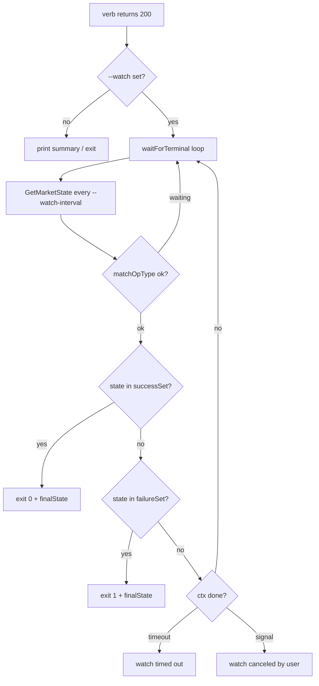

# market (App-store v2 + per-user market-backend)

**CRITICAL — before doing anything, MUST use the Read tool to read [`../olares-shared/SKILL.md`](../olares-shared/SKILL.md) for the profile selection, login, and HTTP 401/403 recovery rules that every command here depends on.**

## Core concepts

### Source resolution

The market backend serves multiple "sources" of charts. The CLI resolves which one to talk to from `-s / --source`, falling back to a default that depends on the verb:

| Source id    | What it is                                              | Used by (default)              |
|--------------|---------------------------------------------------------|--------------------------------|
| `market.olares` | Public catalog (read-only browse)                    | `list`, `get`, `categories`, `install`, `upgrade`, `clone`, `status` |
| `cli`        | Local source for charts uploaded via this CLI           | `upload`, `delete` (default)   |
| `upload`     | Local source for charts pushed through the SPA's "upload" UI | `upload`, `delete`        |
| `studio`     | Local source for charts produced by Devbox / Studio     | `upload`, `delete`             |

Resolution is centralized in [`cli/cmd/ctl/market/common.go`](cli/cmd/ctl/market/common.go):

- `resolveCatalogSource(opts)` → `opts.Source` if set, else `defaultCatalogSource = "market.olares"`.
- `resolveLocalSource(opts)` → `opts.Source` if set, else `defaultLocalSource = "cli"`.
- `validateLocalSource(s)` rejects anything outside `localSources = {"upload", "studio", "cli"}`.

When `-s` is omitted, every command prints `Using source: <id>` to stderr so the agent can confirm which backend it hit. `-a / --all-sources` (where supported) bypasses the single-source resolver and asks the backend across every source the user has access to.

### App lifecycle / state machine

The backend tracks two orthogonal axes per app: **`State`** (where the row currently is) and **`OpType`** (which mutation is in flight). The full enum lives in [`framework/app-service/api/app.bytetrade.io/v1alpha1/appmanager_states.go`](framework/app-service/api/app.bytetrade.io/v1alpha1/appmanager_states.go). The CLI groups them into four buckets in [`cli/cmd/ctl/market/watch.go`](cli/cmd/ctl/market/watch.go):

| Bucket               | Examples                                                        | Meaning                                  |
|----------------------|------------------------------------------------------------------|------------------------------------------|
| Progressing          | `pending`, `installing`, `upgrading`, `uninstalling`, `stopping`, `resuming`, `installingCanceling`, …Canceling | Backend is actively working; keep polling |
| Terminal success     | `running`, `stopped`, `uninstalled`                              | Mutation finished cleanly                |
| Terminal failure     | `installFailed`, `upgradeFailed`, `uninstallFailed`, `stopFailed`, `resumeFailed` | Mutation finished with a hard error      |
| Canceled / cancel-failed | `installingCanceled`, `upgradingCanceled`, `resumingCanceled`, `installingCancelFailed`, `upgradingCancelFailed`, `resumingCancelFailed` | A `cancel` request landed (or failed)    |

The CLI maps each verb to the subset of buckets it considers terminal — see the `--watch` section below.

### `OpType` vs `State` (race-safety)

The same `State` can mean different things depending on which mutation is in flight. Concrete example: an `upgrade` issued against an app already in `running` will return `state=running, opType=running` for one or two ticks before the backend flips to `state=upgrading, opType=upgrade`. A naive watcher would declare success at tick zero.

The fix lives in [`cli/cmd/ctl/market/watch.go`](cli/cmd/ctl/market/watch.go) (`waitForTerminal` + `watchTarget.matchOpType`): for mutating verbs the watcher refuses to accept any "success" classification until either:

1. the row's `OpType` matches the op the CLI just issued, **or**
2. the row disappears entirely (only legal for `uninstall` / `status`).

`cancel` and `status` deliberately set `matchOpType=false` because they are op-agnostic by design.

## Authentication transport

Every request goes through a factory-injected `*http.Client` whose `RoundTripper` (a `refreshingTransport` — see [`cli/pkg/cmdutil/factory.go`](cli/pkg/cmdutil/factory.go)) **injects `X-Authorization` and auto-rotates expired tokens transparently**. The `MarketClient` itself is purely an HTTP wrapper — it never sees the access_token.

- Base URL: `<rp.MarketURL>/app-store/api/v2` — built in [`cli/cmd/ctl/market/client.go`](cli/cmd/ctl/market/client.go) (`NewMarketClient` / `apiPrefix`).
- Auth header: `X-Authorization: <access_token>` (NOT `Authorization: Bearer …`). The transport handles header injection; the client code does not call `req.Header.Set("X-Authorization", …)` anywhere.
- `MarketURL` is derived from the Olares ID (`https://market.<localPrefix><terminusName>`) and surfaced through [`cli/pkg/credential/types.go`](cli/pkg/credential/types.go) (`ResolvedProfile.MarketURL`).
- Two clients in `MarketClient`: `httpClient` (30s timeout, JSON verbs) and `uploadClient` (no timeout, multipart chart pushes). Both share the SAME `refreshingTransport` instance via the Factory, so a refresh triggered on one is immediately visible on the other.
- 401/403 reaches `executeRequest` only when the transport already auto-refreshed and STILL got rejected (consistent server-side rejection); it's reformatted via `reformatMarketAuthErr`.
- When `/api/refresh` itself fails, `executeRequest` surfaces the typed `*credential.ErrTokenInvalidated` / `*credential.ErrNotLoggedIn` directly so the user sees the canonical "run profile login" CTA without `request failed: Get "https://...":` noise. **Recovery rules → [`../olares-shared/SKILL.md`](../olares-shared/SKILL.md) "Automatic token refresh".**

> All `market` verbs use replayable request bodies (JSON in `*bytes.Reader`, multipart in `*bytes.Buffer`), so they all benefit from the transport's reactive 401-retry path. There is no streaming-upload edge case in the market tree — chart pushes are fully buffered before the request goes out.

## Command cheatsheet

All verbs live under `olares-cli market <verb>`. Common flags: `-s / --source` (single source), `-a / --all-sources` (where supported), `-o / --output {table,json}` (default `table`), `-q / --quiet` (suppress info on stderr; exit code still propagates). Mutating verbs additionally accept `-w / --watch` plus the timing knobs (see the [`--watch`](#watch-flag) section).

### Catalog (read-only)

```bash
olares-cli market list                          # default source: market.olares
olares-cli market list -c AI                    # filter by category
olares-cli market list -a                       # query every source the user has
olares-cli market list -o json
```

```bash
olares-cli market categories                    # category counts
olares-cli market categories -a -o json
```

```bash
olares-cli market get firefox                   # detailed info, table view
olares-cli market get firefox -o json           # full upstream payload
```

`get` answers questions like "is this app cloneable?" — look at the `cloneable` field in JSON output (see [`cli/cmd/ctl/market/get.go`](cli/cmd/ctl/market/get.go)).

### Runtime (read-only)

```bash
olares-cli market status                        # all installed apps in the resolved source
olares-cli market status firefox                # one app, with the source-fallback hint
olares-cli market status firefox -a             # search across every source
olares-cli market status firefox --watch        # see the --watch section
```

`status <app>` UX rules — implemented in [`cli/cmd/ctl/market/status.go`](cli/cmd/ctl/market/status.go) (`runStatusSingle`):

- If the row is missing in the resolved source **and** in every other source the user has, the CLI prints `app 'X' is not installed (run 'olares-cli market install X' to install it)`.
- If the row exists but under a different source than the one the user passed, the CLI prints an info hint `App is installed under source 'Y' (not 'X')` and continues to render the row, so the agent does not need to retry blindly.
- `runStatusAll` (no app argument) explicitly rejects `--watch`. Use `status <app> --watch` instead.

### Lifecycle (mutating, support `--watch`)

```bash
olares-cli market install firefox --watch
olares-cli market install firefox --version 1.0.11 --env DEBUG=1 --watch
```

```bash
olares-cli market upgrade firefox --version 1.0.12 --watch
```

```bash
olares-cli market uninstall firefox --watch
olares-cli market uninstall firefox --cascade --delete-data --watch   # see Security rules
```

```bash
olares-cli market clone firefox --title "Firefox (work)" --watch
olares-cli market clone firefox --title "FF" --entrance-title firefox=Work --watch
```

`clone` quirks (cite [`cli/cmd/ctl/market/clone.go`](cli/cmd/ctl/market/clone.go)):

- `--title` is required and capped at 30 characters.
- The clone target name is decided by the backend; the CLI tracks it in `OperationResult.TargetApp` and falls back to the source app name only if the backend never reports one.
- Only multi-instance apps are cloneable — confirm with `market get <app>` (`cloneable: true`) before running.

```bash
olares-cli market stop firefox --watch
olares-cli market stop firefox --cascade --watch        # also stop dependents
olares-cli market resume firefox --watch
```

```bash
olares-cli market cancel firefox --watch                 # cancel the in-flight op
```

`cancel` always sets `matchOpType=false` (it is itself op-agnostic) — see [`cli/cmd/ctl/market/cancel.go`](cli/cmd/ctl/market/cancel.go).

### Local sources (chart push)

`upload` and `delete` only accept `-s upload | studio | cli` — `validateLocalSource` rejects anything else.

```bash
olares-cli market upload ./myapp-1.0.0.tgz                # default: -s cli
olares-cli market upload ./charts/                        # all .tgz / .tar.gz under dir
olares-cli market upload ./myapp-1.0.0.tgz -s studio
```

```bash
olares-cli market delete myapp                            # latest version in the source
olares-cli market delete myapp --version 1.0.0
```

`upload` does not run a chart — `install -s cli <app>` does.

<a id="watch-flag"></a>
## `--watch` (block until terminal state)

The synchronous CLI experience: lifecycle verbs return immediately when the backend accepts the request, but the actual mutation is asynchronous. `--watch` polls the same backend the SPA polls and only returns once the row reaches a terminal state (or the watcher gives up). Implementation lives in [`cli/cmd/ctl/market/watch.go`](cli/cmd/ctl/market/watch.go) (`waitForTerminal`, `runWithWatch`, `newWatchTarget`).

### Flags

Defined in [`cli/cmd/ctl/market/options.go`](cli/cmd/ctl/market/options.go) (`addWatchFlags`):

- `-w / --watch` — opt-in. Default off.
- `--watch-timeout` (default `15m`) — total deadline; surfaced as a typed timeout error including last-seen state.
- `--watch-interval` (default `2s`) — polling interval. Lower values just hammer the backend; raise to `5s`–`10s` on slow networks.

### Per-op terminal sets

| Op           | Success                                      | Failure                                                  | `matchOpType` | `absentMeansSuccess` |
|--------------|----------------------------------------------|----------------------------------------------------------|---------------|----------------------|
| `install`    | `running`                                    | `*Failed` ∪ `*Canceled`                                  | true          | false                |
| `clone`      | `running`                                    | `*Failed` ∪ `*Canceled`                                  | true          | false                |
| `upgrade`    | `running`                                    | `upgradeFailed` ∪ `*Canceled`                            | true          | false                |
| `uninstall`  | `uninstalled` (or row absent)                | `uninstallFailed`                                        | true          | true                 |
| `stop`       | `stopped`                                    | `stopFailed`                                             | true          | false                |
| `resume`     | `running`                                    | `resumeFailed` / `resumingCanceled` / `resumingCancelFailed` | true       | false                |
| `cancel`     | `*Canceled`                                  | `*CancelFailed`                                          | **false**     | false                |
| `status`     | `running` / `stopped` / `uninstalled` / `*Canceled` | `*Failed` / `*CancelFailed`                       | **false**     | true                 |

The `*` columns expand to the matching state-set constants (`operationFailedStates`, `cancelFailedStates`, `canceledStates`) defined in [`cli/cmd/ctl/market/watch.go`](cli/cmd/ctl/market/watch.go).

### `status --watch` (op-agnostic recovery)

The reason `status` got its own `--watch` even though it is read-only: a user runs `install firefox` *without* `--watch`, then five minutes later wants to know whether it landed. The recovery is:

```bash
olares-cli market status firefox --watch
```

The watcher uses `case watchStatus` in `newWatchTarget` (see [`cli/cmd/ctl/market/watch.go`](cli/cmd/ctl/market/watch.go)): any **stable** terminal state is success (the user did not declare an op, so any quiescent state is fine), and a row that has disappeared between ticks is also treated as success. `matchOpType` is forced to `false` so the CLI does not get stuck waiting for a specific OpType that is not its own.

`status --watch` requires an app name — see the errors table.

### OpType gating in practice

Concretely, `upgrade`'s watcher will not classify `state=running, opType=running` (or any leftover OpType from the previous mutation) as success. It waits until the backend reports `opType=upgrade` at least once, and only then accepts a `state=running` tick as terminal success. The same logic protects `install` after a previous `upgrade`, etc.

### Output semantics

| Mode                | What the user sees                                                                 |
|---------------------|-------------------------------------------------------------------------------------|
| TTY (`-o table`)    | Per-transition `info` lines on stderr (`installing`, `running`, …) and final OK/Fail line. |
| `-o json`           | Exactly **one** final `OperationResult` JSON document with the new `finalState` / `finalOpType` fields populated (`omitempty` keeps non-watch JSON output unchanged). |
| `-q / --quiet`      | No transition lines, no final summary; exit code still reflects success/failure.    |

### Ctrl-C and timeout

- The watch context is wrapped in `signal.NotifyContext` for `SIGINT` / `SIGTERM`. Pressing Ctrl-C exits cleanly with `<op> '<app>' watch canceled by user`. **The underlying mutation is NOT canceled** — re-attach with `status --watch` if needed.
- Timeout exits with `<op> '<app>' watch timed out (last state: <S>, op: <O>)`. The mutation again may still be running on the cluster; `status --watch` is the canonical recovery.
- After three consecutive transport errors the watcher gives up with `<op> '<app>' watch aborted after N consecutive errors`.

### Watch flow (mermaid)



## Common errors → fixes

| Error message                                                                             | Cause                                                              | Fix                                                                    |
|-------------------------------------------------------------------------------------------|---------------------------------------------------------------------|------------------------------------------------------------------------|
| `server rejected the access token (HTTP 401/403)`                                         | Profile token is expired / wrong / missing                          | Defer to [`../olares-shared/SKILL.md`](../olares-shared/SKILL.md) (login + profile rules) |
| `app 'X' is not installed (run 'olares-cli market install X' to install it)`              | Row missing in every source the user has                            | It really is not installed — install it, or check spelling             |
| `App is installed under source 'Y' (not 'X')` (info, not error)                           | The user passed `-s X` but the row lives in source `Y`              | Re-run with `-s Y` for a clean filter, or `-a` to query every source   |
| `--watch requires an app name (...)`                                                      | `status --watch` (or any lifecycle verb) was invoked without an app | Pass an app name, or drop `--watch` for the listing                    |
| `<op> '<app>' watch timed out (last state: <S>, op: <O>)`                                 | `--watch-timeout` elapsed before terminal state                     | Bump `--watch-timeout`, or drill into the stuck state via `market status <app>` |
| `<op> '<app>' watch canceled by user`                                                     | User pressed Ctrl-C                                                 | The mutation is likely still running on the cluster — re-attach with `market status <app> --watch` |
| `<op> '<app>' watch aborted after N consecutive errors`                                   | Network / proxy flake during polling                                | Check connectivity, then re-attach with `status --watch`               |
| `--title is required for cloning` / `--title cannot exceed 30 characters`                 | `clone` was invoked without a valid title                           | Pass `--title "<= 30 chars>"`                                          |
| `app '<app>' from source '<src>' does not support clone`                                  | App is single-instance only                                         | Verify with `market get <app>`; only `cloneable: true` apps clone      |
| `invalid version '<v>'`                                                                   | `--version` value is not semver (`MAJOR.MINOR.PATCH[-pre][+meta]`)  | Use a valid semver string                                              |
| `invalid local source '<s>': must be one of upload, studio, cli`                          | `upload` / `delete` got a catalog source                            | Use `-s upload`, `-s studio`, or `-s cli`                              |

## Typical workflows

Install with watch (the happy path):

```bash
olares-cli market install firefox --watch --watch-timeout 30m
echo "exit=$?"   # 0 only after firefox reports state=running with opType=install
```

Forgot `--watch` on install — recover via `status --watch`:

```bash
olares-cli market install firefox                        # backgrounded; CLI returns immediately
olares-cli market status firefox --watch                 # waits for any stable terminal state
```

Upgrade in place, scripted:

```bash
olares-cli market upgrade firefox --version 1.0.12 --watch -o json | jq '.finalState'
# expect "running"; finalOpType = "upgrade"
```

Clone with entrance titles:

```bash
olares-cli market clone firefox \
  --title "Firefox (work)" \
  --entrance-title firefox=Work \
  --watch
```

Stop, then resume:

```bash
olares-cli market stop firefox --watch
olares-cli market resume firefox --watch
```

Cancel a stuck install and confirm the cancellation:

```bash
olares-cli market cancel firefox --watch                 # waits for *Canceled
olares-cli market status firefox --watch                 # confirms installingCanceled / uninstalled
```

Push a local chart, then install it from `cli` source:

```bash
olares-cli market upload ./myapp-1.0.0.tgz               # defaults to -s cli
olares-cli market install myapp -s cli --watch
```

## Security rules

- Confirm intent before `uninstall --delete-data` — this is **irreversible** on the user's volumes.
- Confirm intent before `uninstall --cascade` / `stop --cascade` — they fan out to every dependent chart and can take down adjacent apps.
- Never echo `<access_token>` into the terminal or into a script. The CLI already injects it via `X-Authorization`; if the agent thinks it needs to print the token, it is doing the wrong thing — read [`../olares-shared/SKILL.md`](../olares-shared/SKILL.md) instead.
- Treat `cancel` as a **request**, not a guarantee. The backend may have already finished the mutation by the time the cancel lands. Always re-confirm the actual landed state with `market status <app> --watch` before reporting "canceled" to the user.
- `--watch` on Ctrl-C / timeout exits the CLI but does **not** stop the cluster-side mutation. Communicate this clearly when surfacing a watch error.
