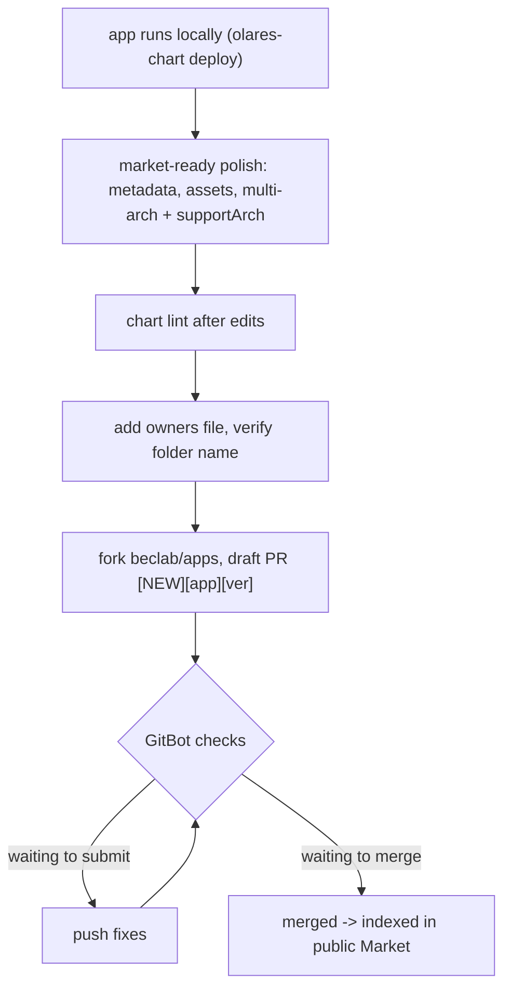

# Publish an Olares app to the public Market

> **This skill is the public-distribution step, not the authoring step.** Turning a repo / compose / Helm chart into an Olares app, refining it, and proving it installs and reaches `running` on your own Olares all live in [`../olares-chart/SKILL.md`](../olares-chart/SKILL.md). Come here **after** the app already runs locally and you want it in the public Olares Market.

> **Source of truth for chart fields is `olares-cli chart lint` + the manifest reference** in [`../olares-chart/references/olares-chart-manifest.md`](../olares-chart/references/olares-chart-manifest.md). This skill carries only what distribution adds on top of a working local chart: market-ready depth, the `beclab/apps` PR contract, and paid-app extras.

## When to use

- Publish / list / submit / distribute / 上架 an app to the **public** Olares Market
- Open or fix a PR to [`beclab/apps`](https://github.com/beclab/apps)
- Sell an app (pay-to-download / paid listing)
- Keywords: publish to Market, submit to beclab/apps, app store listing, `featuredImage` / `promoteImage`, `spec.supportArch`, multi-arch, GitBot, `owners` file, `price.yaml`, paid app

> **Prerequisite — the app must already run on your Olares.** Public submission without a working local install wastes GitBot cycles and reviewer time. Do the deploy loop in [`../olares-chart/references/olares-chart-deploy.md`](../olares-chart/references/olares-chart-deploy.md) first.

> Anything outside this scope -> see the **Skill suite map** in [`../olares-shared/SKILL.md`](../olares-shared/SKILL.md).

## Mental model

Publishing is a **one-way diff against `beclab/apps`**, not a CLI lifecycle. There is no `olares-cli publish` verb: the only command you run is `olares-cli chart lint` (flags owned by [`../olares-chart/SKILL.md`](../olares-chart/SKILL.md)); everything else is git/GitHub plus a metadata/image/PR checklist that `lint` does **not** enforce. So the work is: take a chart that already installs and runs locally, layer on market-ready metadata + multi-arch images, then open a PR that GitBot will gate and a human will merge. You own the chart edits and PR authoring; you never run on-chain or wallet writes for the developer.

## What publishing adds on top of a working local chart

A chart that installs and runs locally is **functionally** done (storage / middleware / entrances / a pullable image are all settled in `olares-chart`). Public distribution adds three layers, none of which `chart lint` enforces:

| Layer | What it adds | Reference |
|---|---|---|
| **Market-ready metadata & assets** | full `metadata.*` + `spec.{developer,website,sourceCode,submitter,fullDescription}`, custom icon, dual-version `categories`, listing images, `spec.locale` | [olares-publish-targets.md](references/olares-publish-targets.md) |
| **Multi-arch images** | build `--platform linux/amd64,linux/arm64` and declare matching `spec.supportArch` (local deploy only needs this node's arch) | [olares-publish-targets.md](references/olares-publish-targets.md) |
| **The `beclab/apps` PR** | `owners` file, strict PR title, GitBot rules, lifecycle (`NEW`/`UPDATE`/`SUSPEND`/`REMOVE`) | [olares-publish-submit.md](references/olares-publish-submit.md) |

> **Paid (pay-to-download)** is a public-Market app plus `price.yaml` + a `VERIFIABLE_CREDENTIAL` license check — see [olares-publish-paid-apps.md](references/olares-publish-paid-apps.md).

## The flow

1. **Polish to market-ready** — work the requirements matrix + checklist in [olares-publish-targets.md](references/olares-publish-targets.md).
2. **Re-lint** — `olares-cli chart lint ./<app>` after every metadata/image edit.
3. **Submit the PR** — fork, add the OAC + `owners` file, open a `[NEW][<app>][<ver>]` PR to `beclab/apps:main`, then track GitBot labels — [olares-publish-submit.md](references/olares-publish-submit.md).
4. **Paid?** — add `price.yaml` + license enforcement on top — [olares-publish-paid-apps.md](references/olares-publish-paid-apps.md).

## Agent boundaries

- **Do NOT** fork, push, or open PRs on the developer's behalf without explicit consent — these write to their GitHub account.
- **The fork here is legitimate and required.** Submitting to the public Market is the standard open-source contribution flow: fork [`beclab/apps`](https://github.com/beclab/apps), push a branch, open a PR. This is the *public app catalog*, a different repo from the beclab dev repos the workspace "no-fork, push to `origin`" rule covers — that rule does not apply to `beclab/apps` submissions.
- **Do NOT** run `did-cli rsa set` (an on-chain, gas-costing write), touch the wallet mnemonic, or handle `rsa-private.pem` for paid apps — guide the user to run those themselves.
- **Do** verify the chart against the market-ready checklist, author `price.yaml`, wire the manifest, and interpret GitBot labels.
- Login / token / auth-error recovery: [`../olares-shared/SKILL.md`](../olares-shared/SKILL.md). Upload / install verbs (for the local-validation prerequisite): [`../olares-market/SKILL.md`](../olares-market/SKILL.md).
