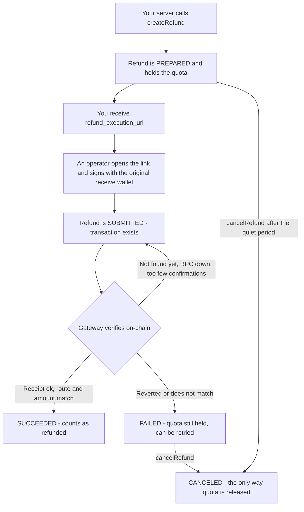

# Refunds

A refund sends money **back along the route the payment came in on**: out of the wallet that received it, into the address that paid. Chain, token, sender, and recipient were frozen the moment the payment was verified on-chain — nothing about them can be edited afterwards.

Authentication and the response envelope are covered in the [API overview](./index).

## How a refund works



## Before you start

| Requirement | Why |
|---|---|
| The payment is `PAYMENT_STATUS_SUCCEEDED` | Nothing was received yet on anything else — otherwise `1901`. |
| The payment carries a frozen route | The route is frozen the moment that payment is verified on-chain. A payment without one cannot be refunded: `nonRefundableReason` is `route_unavailable` and creation fails with `1905`. |
| The receive wallet is available to sign | The refund can only leave from `route.fromWallet`. No substitute wallet works, and Olares Payment never signs on your behalf. |
| That wallet is funded for the amount **and** the gas | The refund amount and the on-chain gas fee are both borne by the merchant — make sure the wallet is funded before you start. |

Check `refundSummary.refundable` on [getPayment](./payments#getpayment) before offering a refund in your own UI; when it is `false`, `nonRefundableReason` tells you why.

---

## createRefund

`POST https://www.olares.com/payment/api/createRefund`

```ts
createRefund(
  params: CreateRefundRequest,
  opts?: { idempotencyKey?: string },
): Promise<RefundHandoff>
```

Opens a refund on one of your succeeded payments and returns the execution link. The refund starts in `PREPARED` and holds its amount against the payment's refundable balance from that moment on.

### CreateRefundRequest

| Field | Type | Required | Description |
|---|---|---|---|
| `paymentId` | `string` | Yes | A succeeded payment belonging to your account. |
| `amount` | `string` | No | **Token minor units**, as a positive integer string — not cents. Omit for the entire remaining refundable balance. |
| `reason` | `string` | No | Merchant-internal note. Audit only: it is never shown to the buyer. |
| `returnUrl` | `string` | No | Absolute http(s) URL the execution page returns to when the refund reaches a terminal state. |

### RefundHandoff

| Field | Description |
|---|---|
| `refund` | The [Refund object](#the-refund-object), freshly created in `PREPARED`. |
| `route` | The frozen [RefundRoute](#refundroute) — where the money leaves from and lands. |
| `executionUrl` | The execution link for this one refund. Hand it to the operator. |
| `executionExpiresAt` | When the link stops working (RFC 3339). Default lifetime is one hour. |

<Tabs>
<template #TypeScript>

```ts
const handoff = await client.createRefund(
  {
    paymentId: 'pi_1a07b0148515b9a95bc',
    amount: '600000',                 // 0.6 USDC at 6 decimals; omit for the full balance
    reason: 'customer downgraded the plan',
    returnUrl: 'https://your-shop.example/orders/ord_001',
  },
  { idempotencyKey: 'refund:ord_001:1' },
);

// Send this to the person holding the receive wallet — never log or store it.
console.log(handoff.executionUrl, handoff.executionExpiresAt);
```

</template>
<template #Go>

```go
handoff, err := merchant.CreateRefund(ctx, &paymentv1.CreateRefundReq{
    PaymentId: "pi_1a07b0148515b9a95bc",
    Amount:    proto.String("600000"),
    Reason:    proto.String("customer downgraded the plan"),
}, paymentsdk.WithIdempotencyKey("refund:ord_001:1"))
// handoff.RefundExecutionUrl, handoff.ExecutionExpiresAt
```

</template>
</Tabs>

### Idempotency

`createRefund` takes the same `Idempotency-Key` as `createPayment`: replaying a key with the same body returns the original refund (with a freshly rotated link), and reusing it with a different body fails with `400`. Derive the key from your business identity — a retried timeout must not open a second refund.

### Errors

`1901` payment not refundable · `1902` amount exceeds the refundable balance · `1905` this payment cannot be refunded · `1906` another refund is already open. See [the table below](#errors).

---

## getRefund

`POST https://www.olares.com/payment/api/getRefund`

```ts
getRefund(refundId: string): Promise<Refund>
```

The full merchant view of one refund — every status, plus the fields the buyer-facing views withhold (`reason`, `preparedStale`, `stuck`). This is the method to poll if you are not using webhooks.

```ts
const refund = await client.getRefund('re_7f2c9a1b34');
if (refund.status === 'REFUND_STATUS_SUCCEEDED') {
  // refund.txHash is the on-chain evidence
}
```

---

## cancelRefund

`POST https://www.olares.com/payment/api/cancelRefund`

```ts
cancelRefund(refundId: string): Promise<Refund>
```

Cancels a refund that has not settled — `PREPARED` or `FAILED` only — and is **the only way the held amount returns to the refundable balance**. Cancelling a `SUBMITTED` or terminal refund fails with `1903`.

A freshly created refund is protected by a short quiet period (roughly 50 blocks by default): a transfer broadcast moments ago can still be sitting in the mempool where no chain query can see it, and cancelling it would be a lie. During that window the call returns `1907` — retry in a few minutes.

---

## reissueRefundLink

`POST https://www.olares.com/payment/api/reissueRefundLink`

```ts
reissueRefundLink(refundId: string): Promise<RefundHandoff>
```

Issues a fresh execution link for a refund that is still open. The one-time secret is rotated, so **the previous link stops working immediately** (it starts returning `1904`). Use it when the link expired, or when you have any doubt about where the old one ended up.

The whole handoff comes back, not just the URL — read `executionExpiresAt` from it rather than assuming the default lifetime.

---

## The Refund object

Returned by `getRefund` / `cancelRefund`, and nested inside `RefundHandoff` and `refundSummary.refunds` (TS names; the wire uses `snake_case`):

| Field | Description |
|---|---|
| `refundId` | Refund ID, `re_…` (wire: `id`) |
| `paymentId` | The payment being refunded (wire: `intent_id`) |
| `status` | `REFUND_STATUS_*`, see [Lifecycle](#lifecycle-and-quota) |
| `amount` | Token minor units on the payment's original chain and token |
| `txHash` | The refund transfer, once one has been submitted; `null` before that |
| `failReason` | Why on-chain verification rejected the transaction; cleared on a successful retry |
| `reason` | Your internal note. Merchant audience only — `null` in buyer-facing views |
| `preparedStale` | Read-only hint: this draft has been holding quota for a long time |
| `stuck` | Read-only hint: submitted, but still without on-chain evidence |
| `createdAt` / `submittedAt` / `succeededAt` / `failedAt` / `canceledAt` | RFC 3339 timestamps |

### RefundRoute

The frozen money route. Every refund on the same payment shares it, so it is carried once per payment rather than per refund.

| Field | Description |
|---|---|
| `chain` / `networkId` | Chain slug (e.g. `optimism`) and EVM chain ID |
| `tokenSymbol` / `tokenDecimals` | The received token; `tokenDecimals` is what turns minor units into a human amount |
| `contractAddress` | ERC-20 contract of that token |
| `fromWallet` | Your original receive wallet — the only wallet that can execute this refund |
| `toPayer` | The address that paid — the only possible recipient |
| `payerRouteVerified` | The frozen route is self-consistent (payer equals the transaction sender) |

---

## Lifecycle and quota

| Status | Meaning | Holds quota? |
|---|---|---|
| `REFUND_STATUS_PREPARED` | Draft created, waiting for a wallet signature | Yes |
| `REFUND_STATUS_SUBMITTED` | A transaction exists, waiting for on-chain evidence | Yes |
| `REFUND_STATUS_SUCCEEDED` | Verified on-chain; counts toward the refunded total | Settled |
| `REFUND_STATUS_FAILED` | Reverted or did not match the frozen route; can be retried from the same link | **Yes — still held** |
| `REFUND_STATUS_CANCELED` | Terminal; the only exit that releases the amount | Released |

Two independent guards protect the balance:

```
remainingRefundable = receivedAmount − Σ(succeeded refunds)
```

1. **The balance itself** — asking for more than `remainingRefundable` fails with `1902`.
2. **One open refund at a time** — while a refund is `PREPARED`, `SUBMITTED`, or `FAILED`, a second one on the same payment fails with `1906`.

That is why an unsettled refund does not make `remainingRefundable` smaller: the amount is not subtracted until it actually settles, and the open-slot rule is what prevents double-spending it in the meantime.

---

## Reading refunds on a payment

[getPayment](./payments#getpayment) carries a `refundSummary` on succeeded payments — the order's refund ledger:

| Field | Description |
|---|---|
| `receivedAmount` | What actually arrived on-chain (minor units) |
| `refundedAmount` | Sum of succeeded refunds |
| `remainingRefundable` | `receivedAmount − refundedAmount` |
| `refundable` | Whether a new refund can be created right now |
| `nonRefundableReason` | Why not, when `refundable` is `false` |
| `route` | The frozen [RefundRoute](#refundroute); `null` on non-refundable payments |
| `refunds` | Refund entries — **succeeded only**, with `reason` / `preparedStale` / `stuck` withheld |

`refundSummary` is a **buyer-safe audience**: the same object is served to the buyer's checkout session, so it deliberately omits drafts, failures, and your internal notes. Use `getRefund` for the complete merchant view. On `listPayments`, items always carry `refundSummary: null`.

`nonRefundableReason` is a closed set:

| Value | Meaning |
|---|---|
| `payment_not_succeeded` | The payment never succeeded |
| `channel_unsupported` | The channel it was paid through cannot refund |
| `route_unavailable` | The payment carries no frozen route |
| `route_inconsistent` | The frozen route failed its self-consistency check |
| `nothing_left` | Everything has already been refunded |
| `refund_already_open` | An unsettled refund is holding the balance |

---

## The execution link

`refund_execution_url` looks like `https://www.olares.com/payment/refunds/re_…#…`. The fragment carries a one-time secret; the gateway stores only its hash.

| Property | What it means for you |
|---|---|
| **It appears exactly once** | Pass it to the operator and forget it. **Never log it, never persist it, never put it in an email thread or a ticket.** |
| **It is short-lived** | Default one hour — trust `executionExpiresAt`, not the default. After that the page returns `1904`; call `reissueRefundLink`. |
| **Reissuing invalidates the old one** | Rotation is the revocation mechanism. |
| **It cannot move money by itself** | Amount, token, chain, sender, and recipient are frozen server-side. The transfer happens only if `route.fromWallet` signs it. |
| **It grants nothing else** | One link executes exactly one refund. No dashboard access, no other payments. |

On that page the operator connects the receive wallet and signs a fixed transfer. The gateway then verifies the receipt against the frozen route and amount, and the refund converges to `SUCCEEDED` or `FAILED` on its own — your server learns the outcome from the [refund webhooks](../webhooks#refund-events) or by polling `getRefund`.

::: tip Closing the page is safe
If the wallet broadcast the transfer but the page was closed before it reported back, the gateway still picks the transaction up on its own. The operator must **not** send a second transfer — that would move funds twice.
:::

---

## Errors

Refund codes occupy `1900–1949`. (SDK-local transport failures start at `1951` — see [Errors](./index#errors).)

| Code | Constant | Meaning | What to do |
|---|---|---|---|
| 1901 | `REFUND_PRECONDITION_FAILED` | The payment is not refundable yet | Refund only succeeded payments |
| 1902 | `REFUND_AMOUNT_EXCEEDED` | Amount exceeds the refundable balance | Re-read `remainingRefundable`; do not retry blindly |
| 1903 | `REFUND_STATE_CONFLICT` | The refund is not in a state that allows this action | Re-read the refund with `getRefund` |
| 1904 | `REFUND_EXECUTION_INVALID` | Execution credential invalid or expired | `reissueRefundLink` and hand over the new link |
| 1905 | `REFUND_ROUTE_UNSUPPORTED` | This payment cannot be refunded at all | Check `nonRefundableReason`; settle off-platform |
| 1906 | `REFUND_ALREADY_OPEN` | Another refund is already open on this payment | Finish or cancel it first |
| 1907 | `REFUND_CANCEL_UNAVAILABLE` | Cancellation is not available yet (quiet period) | Retry in a few minutes |

Payments from contract wallets (Safe, smart accounts) cannot be refunded back to their source, which is why the checkout refuses them in the first place; if a payment still falls in this case, creation fails with `1905`.

Next: [Webhooks → Refund events](../webhooks#refund-events) for `refund.succeeded` / `refund.failed`.
