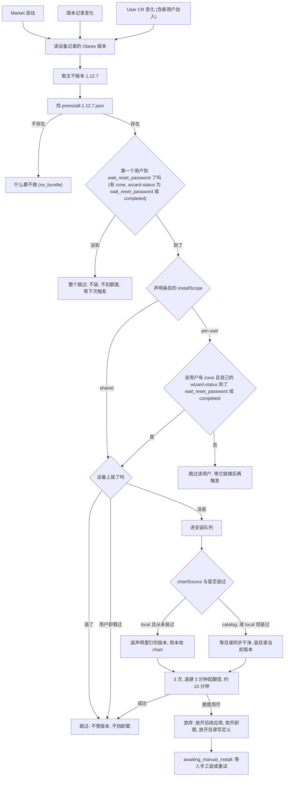

# 预装（Preinstall）设计

预装解决一件事：**让某些应用在用户什么都不做的情况下就出现在设备上**，无论设备是
刚用 ISO 装完机、还是从旧版本升级上来，也无论它能不能连上官方应用市场。

这份文档写的是设计本身：原则、职责边界、数据结构、流程和建议的测试用例。安装阶段
在整条安装流水线里的位置见[安装流程详解](./installation-process.md)；Market 侧
逐条的行为契约与气隙验收清单在 `market` 仓库的 `docs/preinstall.md`。

## 一、设计原则

1. **声明式，不是脚本式。** OS 只说"这台设备应该有哪些应用"，不说"现在去装它"。
   决定何时装、装哪个版本、失败怎么办的是 Market，因为只有它知道设备上此刻已经
   有什么。
2. **首装和升级是同一条路。** ISO 与升级发布的是同一种文件、同一个 schema，导入
   之后走同一段代码。两者的差别压缩成一个字段（`chartSource`），而不是两套流程。
3. **一个主干版本一份声明，写完不再改写。** `1.12.7`、`1.12.7-rc.1`、
   `1.12.7-20260731` 是同一个发布的不同构建，共用 `preinstall-1.12.7.json`。设备
   在这些构建之间移动不该重新预装一遍；升级到新发布是在旁边多写一份，不是覆盖
   旧的那份。
4. **已经装了就不动它。** 声明买到的是"这个应用消失了会被重装"，不是"它的版本由
   声明说了算"。用户手工升级过的应用不会被降回声明里的版本。
5. **第一个版本之后，版本权威归官方目录。** 声明只对"从来没装过"这一次有发言权；
   之后的升级、修复、重装都按目录当前提供的版本走。
6. **不阻塞。** 预装不阻塞 Market 启动，不阻塞激活，不阻塞用户改密码。装不上就是
   装不上，设备照常可用。
7. **有终局。** 每个应用的重试是有限的。额度用尽时设备停手并放开它占住的东西，
   而不是无限重试、也不是把设备锁在"装不上又删不掉"的状态里。
8. **卸载就是退出预装。** 用户能卸载预装应用，卸载之后不会被悄悄装回来。
9. **气隙优先。** 任何"等远端"的门都不能挡住一个只有本地 chart 的首装——气隙设备
   永远等不到那道门。

## 二、职责边界

| 角色 | 负责 | 不负责 |
| --- | --- | --- |
| `olares-cli`（安装/升级） | 把镜像导入 containerd；把 chart、artifact manifest 和一份声明文件放到 Market 能读到的地方 | 决定何时安装、安装哪个版本、失败重试 |
| Market | 读声明、比对设备现状、排队、派发安装任务、重试与终局、记录退出预装 | 修改声明；下载模型权重 |
| app-service | 真正把 chart 装进集群 | 预装语义 |
| 官方应用市场（catalog） | 提供除首装之外的所有版本 | 气隙设备的首装 |

一条红线：**声明文件是 OS 写、Market 读的单向数据**。Market 不回写它，olares-cli
不读 Market 的数据库。两侧对不上时以文件为准，因为文件是可以重放的。

## 三、流程

### 3.1 olares-cli：ISO 首装

1. 预检、下载、准备三个阶段照常。
2. `PreloadImagesModule` 把 `installation.manifest` 里的镜像全部导入并 pin 在
   containerd 的 `k8s.io` 命名空间——这是气隙设备能装上应用的前提。
3. `MaterializeModule` 读介质上的 `<installerDir>/preinstall/market/bundle.json`，
   校验它，把安装期的硬件与环境选择折进去，再把 CLI 内嵌的 catalog 条目并进来，
   生成 `preinstall-<主干版本>.json` 并发布：
   - chart 与 artifact manifest 先写进 staging，再逐个原子改名到目标位置；
   - 声明文件**最后**发布，它就是这次发布的提交点；
   - 目标目录已经有同名声明时整步跳过，不覆盖。
4. `InstallOsSystemModule` 建好 Common 存储、部署 framework（含 Market）。
5. `HFCacheMaterializeModule` 把模型权重从介质流式写进
   `/olares/rootfs/Common/huggingface/...`。约 20 GB 的 payload 只在介质和 Common
   里，不进 Market 的挂载目录。
6. 介质上没有 `preinstall/market` 目录时，第 3 步是 no-op，安装照常完成。

macOS / minikube 安装整条预装流水线都跳过。

### 3.2 olares-cli：升级

1. `PrepareForUpgrade` 里发布一份 catalog 声明：把 CLI 内嵌的
   `catalog-apps.json` 写成目标版本的 `preinstall-<主干版本>.json`。没有 chart、
   没有 payload，只有应用名和安装顺序——升级机器上的 chart 由官方目录提供。
2. 这一步对**每一条**升级路径都执行，不是某个版本的一次性动作。
3. 升级流水线在最后才把新版本写进 Terminus CR 的 `spec.version`。这个次序是有意的：
   Market 在升级过程中已经是新版镜像，但它读到的仍是旧版本对应的声明，等版本真的
   写完才会去读新那份。
4. 同一个主干已经有声明时不覆盖（例如 `1.12.7-rc.1` → `1.12.7`）。

**同一个主干版本，ISO 装出来的声明和升级写出来的声明内容不同**，这是设计如此：
ISO 那份带 chart 与 payload（`chartSource: local`），升级那份只有应用名
（`chartSource: catalog`）。两者对 Market 的语义相同——"这台设备应该有这些应用"。

### 3.3 Market：一次调和

三个触发源汇到同一个入口：进程启动、设备记录的 Olares 版本变化、User CR 变化
（含新用户加入）。之后是同一段逻辑：



图里三个决策点是这套设计的全部要点：

- **`ownerGate`**：第一个用户还没到 `wait_reset_password`，整个预装跳过，且不扣
  额度。装完机器放几天不激活是正常用法。
- **`userGate`**：每个账号用同一把门，owner 和普通用户判断方式相同。以前 owner 读
  `wizard-status`、其它账号读 `status.state=Created`，是同一个问题两把门，而后
  那把开得更早——账号在自己的 wizard 产出任何东西之前就已经是 `Created`，于是第一个
  per-user 应用被派给了一个还看不见它的人。
- **`checkInstalled`**：已装即跳过。这是"daily / rc → 正式版不重新预装"的实现方式，
  也是"用户手工升级不被回退"的实现方式。

per-user 应用的版本另有一条：**优先用官方目录当前提供的版本**，目录里没有可用定义
时才退回介质快照。注意它不是降级逻辑——目录版本装失败不会改用介质版本重试，版本的
选择只看目录有没有，不看上一次装成功没有。

### 3.4 失败终局

每个预装应用一份额度：**3 次，退避从 3 分钟起翻倍（上限 30 分钟）**，装成功即归零。
3 分钟起是为了让三次尝试铺开到大约十分钟——升级刚结束时官方目录往往还没同步到新应用。

- **等待外部条件与失败共用这一份额度。** 目录没同步干净、定义没渲染好、per-user
  快照没冻住都算一次尝试；判定为"重试也没用"的失败（定义渲染失败、目录版本与声明
  不一致）同样扣额度——这类失败每一拍都会重来，不扣额度就永远到不了上限。
- **两件事不算尝试**：等排在前面的应用（那是安装顺序，由前面那个应用自己的额度兜住），
  以及一次渲染锁竞争（锁有租约，不会挂死，而声明导入期间这种竞争是常态）。
- **额度用尽时设备停手，并在同一时刻放开三件事**：排在它后面的应用不再等它、卸载
  保护解除、官方目录重新可以写它的定义。状态面报 `awaiting_manual_install`。
- **人可以卸载它、手工安装、或让运维重试一次。** 重试补一份额度，装的是设备目录里
  此刻的那个版本。放开的三件事在应用真的装上之前不收回，否则设备会退回到"装不上、
  删不掉、还只有这一个版本可选"的状态，而这正是终局要消除的。

### 3.5 卸载即退出预装

声明里的应用可以像普通应用一样卸载。卸载时 Market **先**记下退出预装（shared 记在
设备上，per-user 按账号记在自己的实例上），**再**调 app-service。次序是有意的：
先删后记会留出一个窗口，应用已经没了而没有任何东西说明它是被有意删掉的，下一轮调和
就会把它装回来。记不下来就让卸载失败——卸载报成功、应用又被悄悄装回来，是唯一一种
没人能应对的结果。

per-user 的退出决定绑在账号的 User CR uid 上而不是名字上，所以删掉一个账号再用同名
建一个，新账号拿到的是一次干净的安装。

## 四、数据结构

### 4.1 `preinstall-<主干版本>.json`（OS 写，Market 读）

位置：`<olares-root>/userdata/Cache/market-preinstall/`，Market 以 `PREINSTALL_DIR`
只读挂载到 `/opt/app/preinstall`。

```jsonc
{
  "schemaVersion": "2",                    // 只接受 "2"，用来挡住被当成声明读的旧 bundle.json
  "osVersion": "1.12.7-rc.1",              // 主干必须与文件名一致
  "generatedAt": "2026-07-25T00:00:00Z",   // 只是出处，没有任何逻辑读它
  "apps": [
    {
      "appId": "47ca2f42",                 // 两种条目都要有
      "appName": "shared-model",
      "installScope": "shared",            // 或 "per-user"
      "installOrder": 10,
      "chartSource": "local",              // 或 "catalog"

      // 以下只属于 local 条目；catalog 条目带上任何一个都会被拒绝而不是忽略
      "version": "1.0.0",
      "chart": "chart/shared-model-1.0.0.tgz",
      "chartSha256": "…64 位十六进制…",
      "selectedGpuType": "nvidia",
      "envs": { "HF_HUB_OFFLINE": "1" },
      "artifacts": [
        {
          "kind": "hf-cache",
          "source": "artifacts/fixture--tiny-model",
          "repo": "fixture/tiny-model",
          "revision": "…40 位十六进制 commit…",
          "manifest": "manifests/fixture--tiny-model.json",
          "manifestSha256": "…64 位十六进制…",
          "totalSize": 5
        }
      ],
      "appEntry": { }
    },
    {
      "appId": "f3395cd5",
      "appName": "router",
      "installScope": "shared",
      "installOrder": 20,
      "chartSource": "catalog"
    }
  ]
}
```

字段语义：

| 字段 | 说明 |
| --- | --- |
| `installScope` | `shared` 是设备一份，`per-user` 是每个 eligible 账号一份。 |
| `installOrder` | 依赖屏障而不是展示排序：同序号的应用各自推进，更高序号要等所有更低序号 `installed`。 |
| `chartSource` | `local` = chart 随介质来、首装钉住 `version` 且不等目录；`catalog` = 只给应用名，版本由目录决定、必须等目录同步干净。 |
| `version` / `chart` / `chartSha256` | 只有 `local` 条目有。Market 记 `catalog` 条目的版本为 `catalog-latest`。 |
| `envs` | 已经是"默认值 + 被允许的运行期覆盖"之后的最终结果，敏感键名被拒。 |
| `artifacts` | 至多一条，当前只有 `hf-cache`。声明里只放 manifest，权重 payload 留在介质上。 |

拒绝未知字段、重复键和尾随内容：声明由一个程序写、一个程序读，里面出现意外的东西
说明两个程序对不上。上限：8 MiB、256 个条目、单 chart 256 MiB。

### 4.2 `bundle.json`（介质输入，Market 从不读）

位置：`<installerDir>/preinstall/market/bundle.json`，由镜像构建产出，
`schemaVersion` 是 `"1"`，与声明各自独立演进。

```jsonc
{
  "schemaVersion": "1",
  "sourceId": "market.olares",
  "catalogHash": "…",
  "generatedAt": "2026-07-25T00:00:00Z",
  "apps": [
    {
      "appId": "47ca2f42",
      "appName": "shared-model",
      "version": "1.0.0",
      "installScope": "shared",
      "chart": "chart/shared-model-1.0.0.tgz",
      "chartSha256": "…",
      "installOrder": 10,
      "allowedEnvs": ["HF_HUB_OFFLINE", "MODEL_SOURCE"],  // 覆盖白名单
      "defaultEnvs": { "HF_HUB_OFFLINE": "1" },
      "allowedGpuTypes": ["nvidia", "amd"],
      "artifacts": [ /* 同上 */ ],
      "appEntry": { }
    }
  ]
}
```

bundle 与声明的差别正是"可选项"与"已选项"的差别：`allowedEnvs`、`defaultEnvs`、
`allowedGpuTypes` 是**能选什么**，声明里的 `envs`、`selectedGpuType` 是**选了什么**。
安装期的选择在生成声明时就地校验，选了 bundle 从没提供的东西直接失败——那是这个程序
自己的错误，而它会坏掉的正是眼前这台设备。原先另写一个 `install-profile.json` 放在
声明旁边，Market 对"没被选中的选项"没有任何用处，于是那个文件被折进了声明。

### 4.3 `catalog-apps.json`（CLI 内嵌）

编译进 olares-cli，升级时写成该版本声明的全部内容，首装时并进 bundle 生成的条目
（介质已经带 chart 的应用以介质为准——气隙设备只有它装得上）。

```json
{
  "apps": [
    { "appId": "f3395cd5", "appName": "router", "installScope": "shared", "installOrder": 20 }
  ]
}
```

### 4.4 目录布局

```text
# 安装介质
<installerDir>/preinstall/market/
  bundle.json
  chart/shared-model-1.0.0.tgz
  manifests/owner--repo.json
  artifacts/model/owner--repo/…        # 约 20 GB，不发布

# Market 挂载（PREINSTALL_DIR，只读）
<olares-root>/userdata/Cache/market-preinstall/
  preinstall-1.12.7.json
  preinstall-1.13.0.json               # 升级过就会有多份
  chart/shared-model-1.0.0.tgz
  manifests/owner--repo.json
```

目录本身保持可写（每次升级要在里面多加一份声明），但每个已发布的**文件**都是
`0444`，Market 那侧是 `readOnly: true` 挂载。挂载里的 manifest 必须与介质上的那份
逐字节一致。

### 4.5 Market 侧状态

| 维度 | 取值 |
| --- | --- |
| `overall_status` | `no_bundle` / `bootstrap_ready` / `preinstall_in_progress` / `preinstall_degraded` / `preinstall_complete` |
| 单应用 `phase` | `discovered` / `validated` / `catalog_ready` / `install_pending` / `installing` / `installed` / `degraded` |
| `desired_state` | `waiting_activation` / `default` / `installed` / `opted_out` |
| `waiting_reason` | `waiting_for_dependencies` / `awaiting_manual_install` |

## 五、建议的测试用例

按"每条设计原则至少一条测试"组织。括号里是当前实现的测试名，可作为落点参考。

### 5.1 声明的读取与主干版本

| 用例 | 期望 |
| --- | --- |
| 声明文件名与设备版本主干一致 | 读到（`TestLoadDeclarationReadsTheFileNamedForTheTrunk`） |
| 文件内 `osVersion` 主干与文件名不一致 | 拒绝（`TestLoadDeclarationRefusesAFileThatNamesAnotherVersion`） |
| 文件不存在 vs 文件损坏 | 前者 `no_bundle` 且照常启动，后者 `preinstall_degraded`（`TestLoadDeclarationDistinguishesAbsenceFromDamage`） |
| `1.12.7-rc.1` 与 `1.12.7` | 取到同一个主干、读同一份文件（`TestTrunkVersionKeepsOnlyTheReleaseItself`） |
| `schemaVersion: "1"` 的旧 bundle 被当声明读 | 拒绝（`TestDecodeDeclarationRefusesTheRetiredSchema`） |
| 设备记录的版本变化 | 重新读一次，且启动时的第一次读不算变化（`TestAChangedVersionIsAnnouncedOnceAndTheFirstOneIsNot`） |
| 读不到 Terminus 记录 | 退回本次部署自带的版本（`TestAnUnreadableRecordFallsBackToTheDeployedVersion`） |
| 升级到一个不发布声明的版本 | 上一份声明的条目被 delist 且不重装（`TestImporterWithNoDeclarationForThisVersionDelistsEverything`） |

### 5.2 已装即跳过、版本权威

| 用例 | 期望 |
| --- | --- |
| 声明里的应用设备上已装 | 不升级、不降级、不重装（`TestUpsertPreinstallApplicationStubProtectsVersions`） |
| 用户手工升级过 | 保持用户的版本（`TestReconcileSharedPreservesManualUpgradeWhenRuntimeObservationDisappears`） |
| 已装过的应用消失 | 按目录当前版本重装（`TestReconcileSharedRepairsPreviouslyInstalledAppAtTheCatalogVersion`） |
| 重启后再导入同一份声明 | 幂等（`TestEnsureReconcileIsIdempotentAcrossMarketRestart`） |

### 5.3 两种 `chartSource`

| 用例 | 期望 |
| --- | --- |
| `local` 条目首装、设备离线 | 不等目录，直接用本地 chart 装钉住的版本（`TestFirstInstallOfALocalChartDoesNotWaitForTheCatalog`） |
| `catalog` 条目 | 等目录同步干净且定义渲染成功（`TestCatalogAppWaitsForCleanSyncAndCurrentRender`） |
| `local` 条目装过之后再修复 | 同样等目录（`TestReinstallOfAnInstalledAppWaitsForACurrentCatalog`） |
| `catalog` 条目带了 `version` / `chart` / `envs` | 拒绝而不是忽略（`TestUpsertPreinstallManagedAppRefusesACatalogEntryCarryingADigest`） |
| 只有 `catalog` 条目的声明、没有 chart 目录 | 正常导入（`TestImporterRequiresAChartRootOnlyForLocalEntries`） |

### 5.4 账号就绪与 per-user 铺开

| 用例 | 期望 |
| --- | --- |
| 第一个账号还没到 `wait_reset_password` | 整个预装跳过、不扣额度（`TestReconcileWaitsForActivation`） |
| 账号到了 `wait_reset_password`（还没改密码） | 开始安装，改密码与安装并行（`TestReconcileWaitsBeforeResetPasswordAndStartsAtResetPassword`） |
| 非 owner 账号 `state=Created` 但 wizard 没到 | 不 eligible（`TestEligiblePreinstallUsersRejectsNonOwnersWhoseWizardHasNotGotThere`） |
| owner 与普通账号 | 同一把门（`TestEligiblePreinstallUsersJudgesEveryAccountByItsOwnWizard`） |
| 后加入的账号、目录有可用定义 | 装目录版本，不动 owner 已装的那份 |
| 后加入的账号、目录定义未渲染成功 | 退回介质快照，不无限等 |
| 一个账号安装失败 | 只有它 degrade，其它账号照装 |
| per-user 计数 | `total = pending + installing + installed + degraded + opted_out`；`settled = installed + opted_out` |

### 5.5 失败终局

| 用例 | 期望 |
| --- | --- |
| 连续失败 | 第 3 次之后停手（`TestEveryAppStopsAtTheAttemptCeiling`） |
| 三次尝试的时间跨度 | 约十分钟（`TestTheAttemptBudgetSpansAboutTenMinutes`） |
| 一直等目录 | 扣同一份额度并最终放弃（`TestWaitingForACatalogSpendsTheAttemptsAndGivesUp`） |
| 等待在额度内解除 | 只花掉已经花的那几次，仍能装上（`TestADefinitionThatRendersWithinTheBudgetStillInstalls`、`TestAWaitThatClearsLeavesOnlyTheAttemptsItSpent`） |
| "重试也没用"的失败 | 同样扣额度（`TestAPermanentFailureSpendsTheBudgetAndGivesUp`） |
| 被安装顺序挡住 | 不扣额度（`TestReconcileNeverDispatchesBlockedHigherOrderAppAfterDegradedRetryWindowElapses`） |
| 渲染锁竞争 | 不扣额度（`TestReconcileSharedTreatsTransientInstallAsRetryable`、`TestReconcilePerUserTreatsClaimBusyAsRetryable`） |
| 装成功 | 额度归零（`TestASuccessfulInstallClearsTheAttemptCount`） |
| 放弃之后 | 后续应用不再等它、卸载解除、目录可写定义（`TestGivingUpReleasesTheAppsOrderedBehindIt`、`TestGetPreinstallLifecyclePolicyReleasesAnAppTheDeviceGaveUpOn`、`TestSyncBatchAppsMergesTheCatalogOnceTheBundleGaveUp`） |
| 放弃后手工重试 | 补一份额度、装目录当前版本、且不收回放开的三件事（`TestARetryAfterGivingUpInstallsWhateverTheDefinitionNowHolds`、`TestAManualRetryDoesNotReclaimTheReleasedClaims`） |
| 换一份声明（版本或 chart 变了） | 重新给一份额度（`TestUpsertPreinstallManagedAppKeepsGaveUpUnlessTheArtifactChanges`） |

### 5.6 卸载即退出预装

| 用例 | 期望 |
| --- | --- |
| 卸载 shared 声明应用 | 成功，且退出记录写在 app-service 调用之前（`TestAppUninstallRecordsTheSharedOptOutBeforeAppService`） |
| 退出记录写不下去 | 卸载失败（`TestAppUninstallRefusesASharedRemovalItCannotRemember`） |
| 退出之后再调和 | 不重装（`TestOptOutSurvivesEnsureAndBundleImport`） |
| 删账号再用同名新建 | 新账号是干净安装（per-user 决定绑 uid） |
| local-delete | 仍然拒绝（`TestManagedLocalDeleteReturnsConflictWithoutSideEffects`） |

### 5.7 olares-cli 侧

| 用例 | 期望 |
| --- | --- |
| 目标主干已有声明 | 整步跳过，原文件逐字节不变（`TestMaterializeLeavesThisTrunksDeclarationAloneOnceItExists`） |
| 升级到不同主干 | 旁边多一份，旧那份不动 |
| 每条升级路径 | 都发布声明（`TestEveryUpgradePublishesThePreinstallDeclaration`） |
| 介质没有 `preinstall/market` | no-op，安装照常完成 |
| bundle 里有符号链接、超限 chart、非白名单 env | 发布前失败，不留半成品 |
| 发布产物 | 与 golden 逐字节一致，文件权限 `0444` |
| 模型 payload | 不出现在 Market 挂载里 |

跨仓的口径由两侧共享的 `contract-constants.json` 夹具钉住：schema 版本、文件名规则
与各项上限任何一侧改了，另一侧的测试会红。
