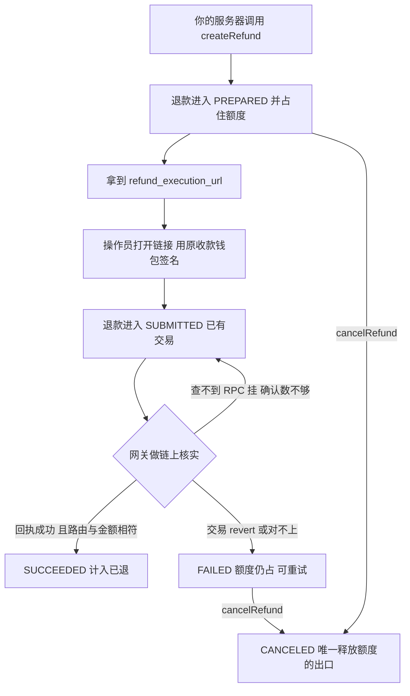

# 退款

退款**沿着付款来时的那条路原路退回**:从当初收到钱的那个钱包发出,退回当初付款的那个地址。链、币种、付款方、收款方在这笔付款于链上核实通过的那一刻就被冻结,事后任何人都改不了。

认证方式与响应 envelope 见 [API 总览](./index)。

## 退款是怎么跑完的



## 开始之前

| 前提 | 原因 |
|---|---|
| 支付单处于 `PAYMENT_STATUS_SUCCEEDED` | 其他状态根本没收到钱——否则返回 `1901`。 |
| 该支付单有冻结路由 | 路由在这笔付款通过链上核实的那一刻冻结。没有这条记录的支付单退不了:`nonRefundableReason` 为 `route_unavailable`,建单直接 `1905`。 |
| 收款钱包可用于签名 | 退款只能从 `route.fromWallet` 发出。换任何一个钱包都不行,Olares Payment 也永远不会代你签名。 |
| 该钱包余额足够覆盖退款金额**与** gas | 退款金额与链上 gas 费均由商户承担,发起退款前请确认该钱包余额充足。 |

在自家界面上给出退款入口之前,先看 [getPayment](./payments#getpayment) 返回的 `refundSummary.refundable`;为 `false` 时,`nonRefundableReason` 会告诉你原因。

---

## createRefund

`POST https://www.olares.com/payment/api/createRefund`

```ts
createRefund(
  params: CreateRefundRequest,
  opts?: { idempotencyKey?: string },
): Promise<RefundHandoff>
```

在你的某笔已成功支付单上开一笔退款,并返回执行链接。退款从 `PREPARED` 开始,**自创建那一刻起就占住**该支付单的可退余额。

### CreateRefundRequest

| 字段 | 类型 | 必填 | 说明 |
|---|---|---|---|
| `paymentId` | `string` | 是 | 属于你账户的已成功支付单。 |
| `amount` | `string` | 否 | **token 最小单位**的正整数字符串——不是分。缺省 = 退掉全部剩余可退余额。 |
| `reason` | `string` | 否 | 商户内部备注。仅供审计:买家永远看不到。 |
| `returnUrl` | `string` | 否 | 绝对 http(s) URL;退款进入终态后执行页回跳到这里。 |

### RefundHandoff

| 字段 | 说明 |
|---|---|
| `refund` | 刚创建的[退款对象](#退款对象),状态 `PREPARED`。 |
| `route` | 冻结的 [RefundRoute](#refundroute)——钱从哪出、退到哪。 |
| `executionUrl` | 这一笔退款专属的执行链接。交给操作员。 |
| `executionExpiresAt` | 链接失效时间(RFC 3339)。默认时效一小时。 |

<Tabs>
<template #TypeScript>

```ts
const handoff = await client.createRefund(
  {
    paymentId: 'pi_1a07b0148515b9a95bc',
    amount: '600000',                 // 6 位小数下 = 0.6 USDC;缺省则退全部剩余
    reason: 'customer downgraded the plan',
    returnUrl: 'https://your-shop.example/orders/ord_001',
  },
  { idempotencyKey: 'refund:ord_001:1' },
);

// 交给持有收款钱包的人——切勿记日志、切勿入库。
console.log(handoff.executionUrl, handoff.executionExpiresAt);
```

</template>
<template #Go>

```go
handoff, err := merchant.CreateRefund(ctx, &paymentv1.CreateRefundReq{
    PaymentId: "pi_1a07b0148515b9a95bc",
    Amount:    proto.String("600000"),
    Reason:    proto.String("customer downgraded the plan"),
}, paymentsdk.WithIdempotencyKey("refund:ord_001:1"))
// handoff.RefundExecutionUrl、handoff.ExecutionExpiresAt
```

</template>
</Tabs>

### 幂等

`createRefund` 接受与 `createPayment` 相同的 `Idempotency-Key`:同键同请求体重放会返回原来那笔退款(并重新轮换一条链接),同键不同请求体返回 `400`。请按业务身份派生幂等键——一次超时重试绝不能开出第二笔退款。

### 错误

`1901` 支付单尚不可退 · `1902` 超出可退余额 · `1905` 该支付单不可退款 · `1906` 已有未结清退款。详见[错误码](#错误码)。

---

## getRefund

`POST https://www.olares.com/payment/api/getRefund`

```ts
getRefund(refundId: string): Promise<Refund>
```

单笔退款的商户全量视图——包含全部状态,以及买家侧视图会裁掉的字段(`reason`、`preparedStale`、`stuck`)。不用 webhook 时,轮询就用它。

```ts
const refund = await client.getRefund('re_7f2c9a1b34');
if (refund.status === 'REFUND_STATUS_SUCCEEDED') {
  // refund.txHash 就是链上证据
}
```

---

## cancelRefund

`POST https://www.olares.com/payment/api/cancelRefund`

```ts
cancelRefund(refundId: string): Promise<Refund>
```

取消一笔尚未结清的退款——**只对 `PREPARED` 与 `FAILED` 开放**——这也是**唯一**能把占住的金额还回可退余额的方式。对 `SUBMITTED` 或终态退款调用会返回 `1903`。

---

## reissueRefundLink

`POST https://www.olares.com/payment/api/reissueRefundLink`

```ts
reissueRefundLink(refundId: string): Promise<RefundHandoff>
```

为仍然开着的退款重新签发一条执行链接。一次性 secret 会被轮换,因此**上一条链接立即失效**(之后一律返回 `1904`)。链接过期时用它;对旧链接流向有任何疑虑时也用它。

返回的是整个 handoff 而不只是 URL——请读其中的 `executionExpiresAt`,不要假定默认时效。

---

## 退款对象

由 `getRefund` / `cancelRefund` 返回,也嵌在 `RefundHandoff` 与 `refundSummary.refunds` 里(TS 命名;wire 层为 `snake_case`):

| 字段 | 说明 |
|---|---|
| `refundId` | 退款 ID,`re_…`(wire:`id`) |
| `paymentId` | 被退的支付单(wire:`intent_id`) |
| `status` | `REFUND_STATUS_*`,见[生命周期](#生命周期与额度) |
| `amount` | 原链原 token 的最小单位金额 |
| `txHash` | 退款转账哈希,提交之前为 `null` |
| `failReason` | 链上核实拒绝该交易的原因;重试成功后会被清空 |
| `reason` | 你的内部备注。仅商户受众可见——买家侧视图里恒为 `null` |
| `preparedStale` | 只读提示:这张草稿占住额度已久 |
| `stuck` | 只读提示:已提交,但迟迟没有链上证据 |
| `createdAt` / `submittedAt` / `succeededAt` / `failedAt` / `canceledAt` | RFC 3339 时间戳 |

### RefundRoute

冻结的资金路径。同一支付单下的所有退款共享同一条,所以它按支付单携带一次,而不在每笔退款上重复。

| 字段 | 说明 |
|---|---|
| `chain` / `networkId` | 链 slug(如 `optimism`)与 EVM chainId |
| `tokenSymbol` / `tokenDecimals` | 收到的 token;`tokenDecimals` 是把最小单位换算成人类金额的依据 |
| `contractAddress` | 该 token 的 ERC-20 合约地址 |
| `fromWallet` | 你的原收款钱包——唯一能执行这笔退款的钱包 |
| `toPayer` | 当初付款的地址——唯一可能的收款方 |
| `payerRouteVerified` | 冻结路由自洽(payer 与交易发起方一致) |

---

## 生命周期与额度

| 状态 | 含义 | 是否占用额度 |
|---|---|---|
| `REFUND_STATUS_PREPARED` | 草稿已建,等钱包签名 | 占 |
| `REFUND_STATUS_SUBMITTED` | 已有交易,等链上证据 | 占 |
| `REFUND_STATUS_SUCCEEDED` | 链上核实通过,计入已退总额 | 结算 |
| `REFUND_STATUS_FAILED` | 交易 revert 或与冻结路由不符;可用同一链接重试 | **仍占** |
| `REFUND_STATUS_CANCELED` | 终态;唯一释放金额的出口 | 释放 |

余额由两道互相独立的闸门守着:

```
remainingRefundable = receivedAmount − Σ(已成功的退款)
```

1. **余额本身**——申请额超过 `remainingRefundable` 返回 `1902`。
2. **一单一未决**——只要还有一笔退款处于 `PREPARED`、`SUBMITTED` 或 `FAILED`,同一支付单上的第二笔返回 `1906`。

这也解释了为什么未结清的退款不会让 `remainingRefundable` 变小:金额在真正结算前不计入减项,而「一单一未决」规则负责在这期间防止它被重复花掉。

---

## 在支付单上读退款

已成功的支付单上,[getPayment](./payments#getpayment) 会带一个 `refundSummary`,也就是这笔订单的退款账本:

| 字段 | 说明 |
|---|---|
| `receivedAmount` | 链上实际收到的金额(最小单位) |
| `refundedAmount` | 已成功退款之和 |
| `remainingRefundable` | `receivedAmount − refundedAmount` |
| `refundable` | 现在能否新建退款 |
| `nonRefundableReason` | `refundable` 为 `false` 时的原因 |
| `route` | 冻结的 [RefundRoute](#refundroute);不可退的支付单为 `null` |
| `refunds` | 退款条目——**只含已成功的**,且裁掉 `reason` / `preparedStale` / `stuck` |

`refundSummary` 面向的是**买家安全受众**:同一个对象也会下发给买家的收银台会话,因此它刻意不含草稿、失败记录与你的内部备注。要看完整的商户视图请用 `getRefund`。在 `listPayments` 里,条目的 `refundSummary` 恒为 `null`。

`nonRefundableReason` 是一个闭集:

| 取值 | 含义 |
|---|---|
| `payment_not_succeeded` | 该支付单从未成功 |
| `channel_unsupported` | 付款所用渠道不支持退款 |
| `route_unavailable` | 该支付单没有冻结路由 |
| `route_inconsistent` | 冻结路由未通过自洽校验 |
| `nothing_left` | 已经全部退完 |
| `refund_already_open` | 有一笔未结清的退款正占着余额 |

---

## 执行链接

`refund_execution_url` 形如 `https://www.olares.com/payment/refunds/re_…#…`。fragment 里带的是一次性 secret,网关只存它的哈希。

| 性质 | 对你意味着什么 |
|---|---|
| **只出现这一次** | 交给操作员然后就忘掉它。**切勿记日志、切勿入库、切勿塞进邮件或工单。** |
| **短时效** | 默认一小时——以 `executionExpiresAt` 为准,别信默认值。过期后页面返回 `1904`,改用 `reissueRefundLink`。 |
| **重签即让旧链接失效** | 轮换就是这里的吊销机制。 |
| **链接本身动不了钱** | 金额、币种、链、出款方、收款方都在服务端冻结;只有 `route.fromWallet` 签名,转账才会发生。 |
| **它不授予别的权限** | 一条链接只对应一笔退款,不给后台访问权,也碰不到别的支付单。 |

在那个页面上,操作员连接收款钱包并签一笔固定转账。随后网关会拿回执与冻结路由、金额逐项比对,退款自行收敛到 `SUCCEEDED` 或 `FAILED`——你的服务器通过[退款 webhook](../webhooks#退款事件) 或轮询 `getRefund` 得知结果。

::: tip 关掉页面是安全的
如果钱包已经广播了转账、但页面在回报之前被关掉,网关仍会自行认领这笔交易。操作员**绝不能**再发一笔——那会把钱付两次。
:::

---

## 错误码

退款错误码占据 `1900–1949` 段。(SDK 本地传输错误从 `1951` 起,见[错误码](./index#错误码)。)

| 错误码 | 常量 | 含义 | 怎么处理 |
|---|---|---|---|
| 1901 | `REFUND_PRECONDITION_FAILED` | 该支付单尚不可退 | 只对已成功的支付单发起退款 |
| 1902 | `REFUND_AMOUNT_EXCEEDED` | 超出可退余额 | 重新读 `remainingRefundable`,不要盲目重试 |
| 1903 | `REFUND_STATE_CONFLICT` | 当前状态不允许该操作 | 用 `getRefund` 重新读状态 |
| 1904 | `REFUND_EXECUTION_INVALID` | 执行凭据失效或已过期 | `reissueRefundLink` 后把新链接交出去 |
| 1905 | `REFUND_ROUTE_UNSUPPORTED` | 这笔支付根本无法退款 | 看 `nonRefundableReason`;改走平台外处理 |
| 1906 | `REFUND_ALREADY_OPEN` | 该支付单已有未结清退款 | 先把它做完或取消 |

合约钱包(Safe、智能账户)付的款无法原路退回,收银台因此一开始就拒绝它们付款;若某笔支付单仍属于这种情况,建退款会返回 `1905`。

下一步:[Webhook → 退款事件](../webhooks#退款事件),了解 `refund.succeeded` / `refund.failed`。
